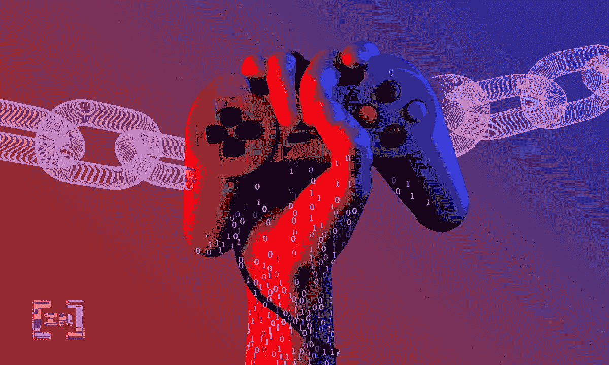
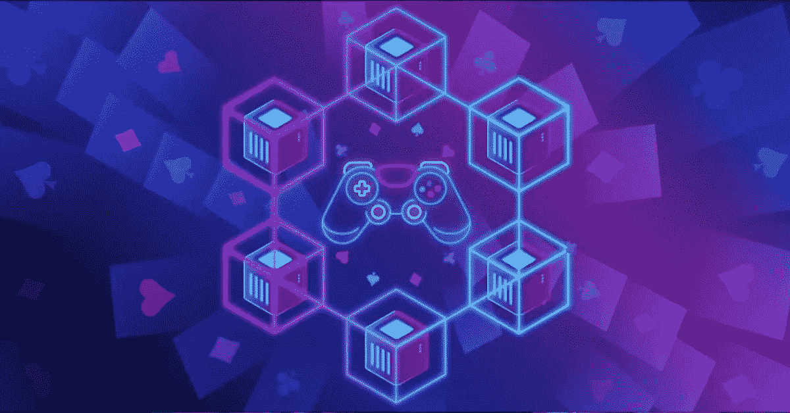

# Web3 游戏如何增强最终用户社区的能力？

> 原文：<https://medium.com/geekculture/how-is-web3-gaming-empowering-the-end-user-community-dd2854d6d3ab?source=collection_archive---------13----------------------->

当区块链提出权力下放的概念时，它花了很长时间才得到应有的重视。经过这么多年，人们认识到区块链是一项未来技术，将在每个可能的行业显示其主导地位。区块链的统治地位侵入了游戏行业，并带来了一系列新的游戏平台。区块链上不可替代的代币取代了游戏中的物品，在 [**NFT 交易平台**](https://www.jump.trade/) 进行交易。这为市场带来了大量的**即玩即赚的 NFT 游戏**，为最终用户或游戏玩家参与游戏平台的开发和更新打开了大门。自从引入区块链以来，游戏行业发生了什么变化？关于这款新的 web3 游戏，你应该知道些什么？这里有一个博客告诉你一切，否则就太晚了。

# 介绍 web3

区块链技术是一种没有集中控制的技术。它的出现带来了去中心化和匿名化。尽管这一切都始于金融和加密货币，但它现在正在改变所有地方，包括游戏平台。今天，整合了 NFTs 和区块链的游戏平台为游戏产业开启了一个全新的经济模式。

Web3 是一个补偿用户在区块链或 web3 平台上花费时间的概念。通过这种方式，游戏赚钱游戏出现了。这不仅给了游戏玩家赚钱的机会，也打开了直接参与游戏管理的大门。

# 游戏中的区块链

最初，区块链以不可替代的代币进入游戏平台。他们赋予游戏中物品可交易的所有权，这些物品通常是存储在游戏服务器上的数字数据。使用 NFTs，这些数字数据及其所有权将存储在区块链上。玩家可以在 NFT 交易平台上买卖这些物品。由于区块链支持透明，任何人都可以查看存储在区块链上的项目的详细信息。

Cryptokitties 是最受欢迎的，也是这一系列游戏平台中的首批产品之一。随着 Web3 的推出，玩赚 NFT 游戏像风暴一样进入了这个行业。

在这些 P2E 游戏中，玩家可以一边玩游戏一边赚钱。也就是说，他们花在玩 NFT 游戏上的时间得到了补偿或报酬。玩家每得分一分，完成一项任务，或者赢得一场游戏，就可以获得加密货币或一种稳定的货币。这样，这些平台同时是娱乐和金融的地方。

# 博弈中的去中心化

权力下放和区块链齐头并进。当区块链可以和区块链一起改变世界经济时，为什么它不能改变博彩业呢？那是游戏开发者决定带来游戏平台去中心化的时候。

将去中心化引入游戏的概念给了最终用户，即游戏玩家参与游戏管理和开发的机会。凭借区块链上的代币，游戏玩家可以参与游戏的投票和决策过程。

# Web 3 游戏-未来！

在分散式 Web 3 游戏中，存在两个令牌，一个实用令牌和一个管理令牌。通过玩游戏，游戏玩家可以独家获得这两种令牌，或者他们甚至可以从加密货币交换平台获得它们。

玩家可以使用公用代币在 NFT 游戏市场购买 NFT，升级 NFT，甚至在加密交易中兑换成法定货币。实用令牌通常是无限供应的。另一方面，治理令牌供应有限，拥有治理令牌的玩家可以参与任何关于游戏开发和更新的决策。对于治理令牌持有者来说，持有特定的卷并且应该已经参与游戏以便参与投票也是重要的。

这样，玩家可以决定游戏将会发生什么。这种将最终用户包括在游戏平台中以做出决定的做法打开了平台，带来了信任和透明度。这也开启了一种新的经济模式，使奥运会全球化。加密货币的加入减少了边界，扩大了游戏在全球的版图。

# 租赁系统

有了 NFTs，游戏中的物品就变成了数字资产。任何可以拥有的资产也可以出租。这个概念可以帮助玩家赚取被动收入。出现了 NFT 标准，引入了租金和抵押贷款。在这里，玩家可以租借**的 NFT 物品，并与它们一起玩，以获得更好的游戏体验，并在租赁协议到期时归还。这将为玩家创造一个全新的机会来获得不同的体验。**

# **底线**

**在过去的几年里，使用 NFTs 和 NFT 交易平台的 Web3 游戏得到了很多关注。曾经是娱乐游戏玩家的人现在是职业游戏玩家，他们通过玩 NFT 游戏获得全职收入。有了元宇宙，围绕 NFTs 和区块链出现的新技术将为游戏产业带来一个全新的未来。**