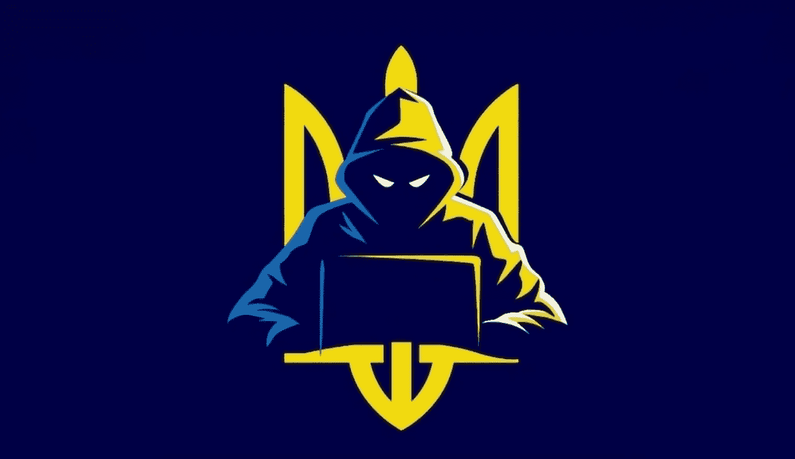

# IT 平民如何帮助乌克兰赢得与俄罗斯的战争

> 原文：<https://medium.com/geekculture/how-it-civilians-help-ukraine-win-the-war-with-russia-11ce030fcd3e?source=collection_archive---------15----------------------->

## 尽管有俄罗斯的宣传，我们是如何努力让人们睁开眼睛的

我来自乌克兰。2 月 24 日，俄罗斯入侵了我们的领土。目前，我们与俄罗斯有一场战争，没有其他词如何称呼它。和我们国家的许多其他开发者一样，我一辈子都是软件工程师，没有军籍…