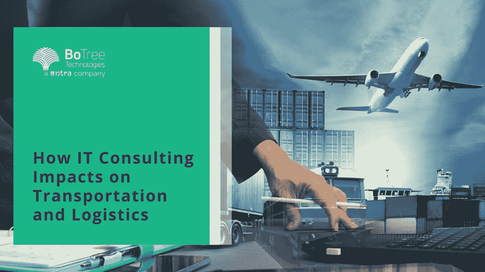

# IT 咨询如何影响运输和物流

> 原文：<https://medium.com/geekculture/how-it-consulting-impacts-on-transportation-and-logistics-7e2b1bfa8fb8?source=collection_archive---------16----------------------->

近年来，世界变得越来越相互联系，技术已经成为促使全球成为各地企业和品牌大熔炉的不可或缺的一部分。因此，[#地理](https://www.linkedin.com/feed/hashtag/geographical)限制不再是任何组织或企业扩展其业务的重要因素，这导致了一种竞争，其中客户受益最大，仅仅是因为他们有纯粹的选择。

在确保这一点的过程中，物流发挥了巨大的作用， [IT 咨询服务公司](https://www.botreetechnologies.com/it-consulting-services)一直将此视为扩展其业务范围的绝佳机会。

根据统计数据，全球物流产业据 Statista 统计总计超过[9 万亿美元。对于](https://www.statista.com/markets/419/topic/491/logistics/#overview)[#商业企业](https://www.linkedin.com/feed/hashtag/commercialenterprises)，这意味着 [IT 咨询公司](https://www.botreetechnologies.com/blog/it-consulting-firms-to-help-digital-transformation/)开发使物流和运输更容易的产品的巨大机会。

# 交通应用开发服务的发展

基于应用的技术彻底改变了商业和生活方式。当我们谈论它成为物流和运输的一部分时，[# transportappdevelopment](https://www.linkedin.com/feed/hashtag/transportappdevelopment)服务占据了整个讨论的很大一部分。

今天，自动化不仅仅是一个时髦的词，而是一个活生生的现实，过程自动化比以往任何时候都更有助于全球供应链。对数据和信息的访问变得更加灵活和即时，整体效率也空前提高。

# 数据和人工智能支持的物流应用

由软件开发公司开发的应用程序在当前的环境下已经变得更加用户友好和直观，使得用户首先使用它们变得非常简单。[#人工智能](https://www.linkedin.com/feed/hashtag/artificialintelligence)使得利用大量的聚合数据获得可操作的见解成为可能。正如我们所知，数据是技术发展的催化剂，如果开发正确，人工智能物流应用程序将对物流生态系统产生非常积极的影响。

> 更多阅读:[全球 7 大科技咨询公司](https://www.botreetechnologies.com/blog/top-technology-consulting-companies/)

# 技术对供应链和物流的影响

[#供应链](https://www.linkedin.com/feed/hashtag/supplychain)本身是一个独立的网络，但确保供应链的效率以使其不发生故障是一项需要技术来完成的任务。我们今天所见证的全球供应链已经通过[技术咨询公司](https://www.tntra.io/technology-consulting)提供的技术解决方案得到了加强。

以下是技术对运输、物流和供应链产生巨大影响的几个领域:

*   有利的成本
*   像 BoTree Technologies 这样的企业软件开发公司运用更好的 IT 能力，大大降低了物流和运输行业的成本。通过技术实现的自动化使企业能够提高生产率，这给了它一个全新的层面。
*   而且技术也给运营带来了很多的准确性和效率，给成本一个对大家有利的推动。有了数字化的路线和更好的时间安排，成本会大大降低。
*   更好的客户服务
*   技术使客户能够更好地了解和掌握他们的货件，并提供实时跟踪等功能，只需轻触按钮即可获得更多信息。这种可用性增加了透明度，从而提高了他们在流程中的满意度。
*   除此之外，企业利用数字平台解决客户查询也变得更加容易，这有助于他们提高客户忠诚度和保留管理实践。

# 运输和物流应用程序开发的优势

如果你想雇佣一家 IT 咨询服务公司来开发专门的物流应用程序解决方案，这里有一些好处等着你:

*   节省时间
*   自动化就是要减少人工流程的数量，而这一点可以通过熟练开发的[#物流](https://www.linkedin.com/feed/hashtag/logistics)和[#运输应用](https://www.linkedin.com/feed/hashtag/transportapplication)轻松实现。这类应用程序大大节省了时间和工作时间。因此，有效的时间管理和提高整体效率成为关键。
*   更好的货运管理
*   最大的 [IT 能力之一](https://www.botreetechnologies.com/blog/tech-capabilities-needed-for-digital-transformation/)一直是正确的执行使事情变得多么简单，物流领域也不例外。合适的物流应用程序开发解决方案可以改善货运管理，使收集报价和实施报价变得更加容易。企业可以通过对所有东西进行适当的比较来选择最好的价格。
*   加强控制
*   通过实施正确的 [#transport](https://www.linkedin.com/feed/hashtag/transport) 和 [#logisticsappsolution](https://www.linkedin.com/feed/hashtag/logisticsappsolution) ，您将发现自己拥有了第一优势，并增强了对物流业务运营的控制。这有助于您更好地控制物流运作的多个方面，而不仅仅是运输。
*   更高的利润
*   随着时间的推移，任何商业企业的经营都是为了实现利润最大化。借助强大的人工智能物流应用，操作的简化程度不会给人工猜测或因错误而浪费的时间留下任何空间。通过削减额外成本，盈利能力得到了提高。

> 检验我们的成功案例:[货运代理提单处理系统案例](https://www.botreetechnologies.com/case-studies/freight-forwarding)

# 结论

在每个 IT 咨询公司都在寻求多元化投资组合的时候，提供交通应用开发服务可能是他们增长的一个巨大途径，因为整个物流和运输领域非常广阔。这是我们在上面讨论过的事情，不仅仅是应用程序，还有技术在本质上是如何使我们今天生活的世界变得更加方便和舒适的。

如果你在进行应用程序开发之前正在寻找一些最好的 IT 策略，或者希望立即开发一个应用程序，BoTree Technologies 是领先的[物流应用程序开发公司](https://www.botreetechnologies.com/logistics-app-development),它只是一个很好的例子。有了一家可以根据您的期望定制一切的公司，您无需担心物流应用开发的[成本](https://www.botreetechnologies.com/blog/logistics-app-development-cost-features-and-development/)。

*原载于*[*https://www.linkedin.com*](https://www.linkedin.com/pulse/how-consulting-impacts-transportation-logistics-botreetechnologies)*。*