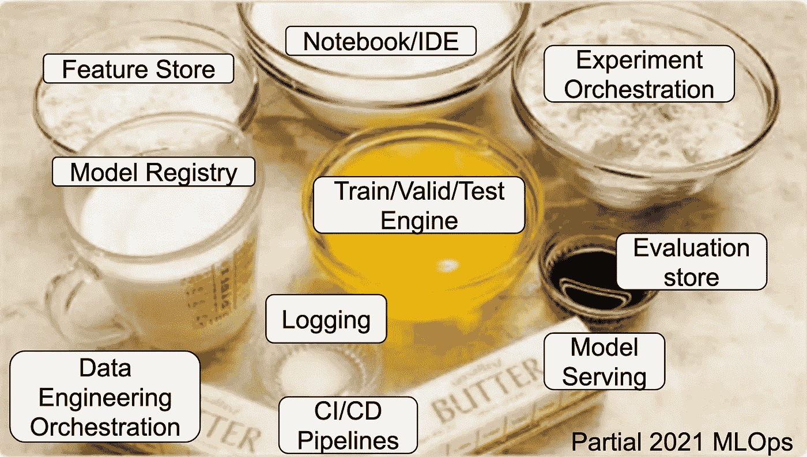

# 2021 年学 MLOps 是什么感觉

> 原文：<https://medium.com/geekculture/how-it-feels-to-learn-mlops-in-2021-7577a491a5a7?source=collection_archive---------8----------------------->

Adapted from [1]

免责声明:*在本文的创作过程中，没有任何 MLOps 工具受到损害。这篇帖子的灵感来自 CircleCI* *的一篇经典文章* [*【这是未来】和一篇关于*](https://circleci.com/blog/its-the-future/) [*Javascript 框架*](https://hackernoon.com/how-it-feels-to-learn-javascript-in-2016-d3a717dd577f) *的俏皮帖子。这只是一篇周日观点片，和任何 MLOps 平台一样，要带着* [*半信半疑*](https://en.wikipedia.org/wiki/Grain_of_salt) *。*

嘿，我得到了这个贷款违约预测模型，我的老板说你可以帮我部署它？我没有…