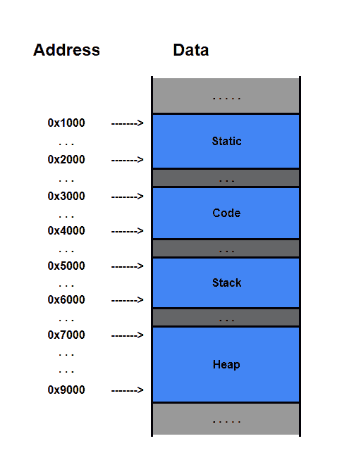
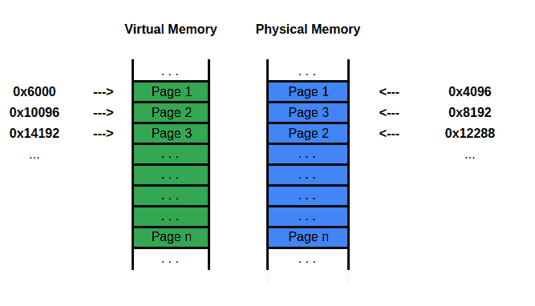
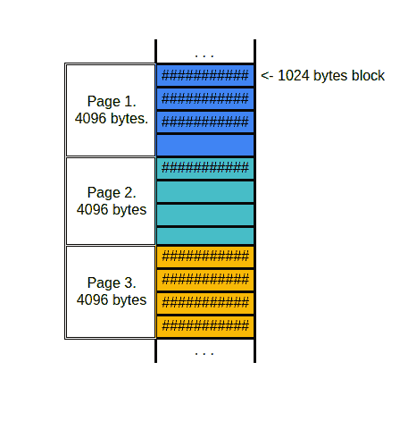
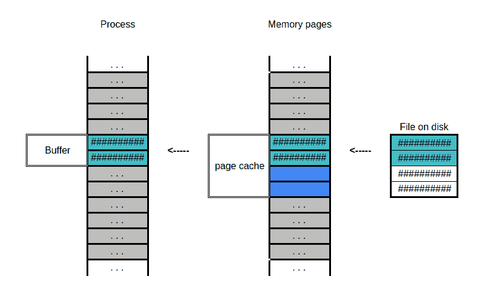
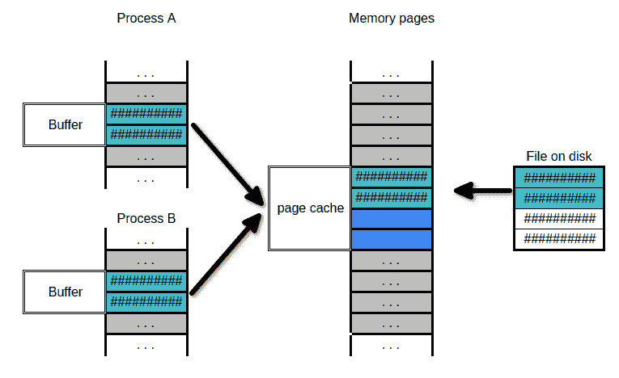
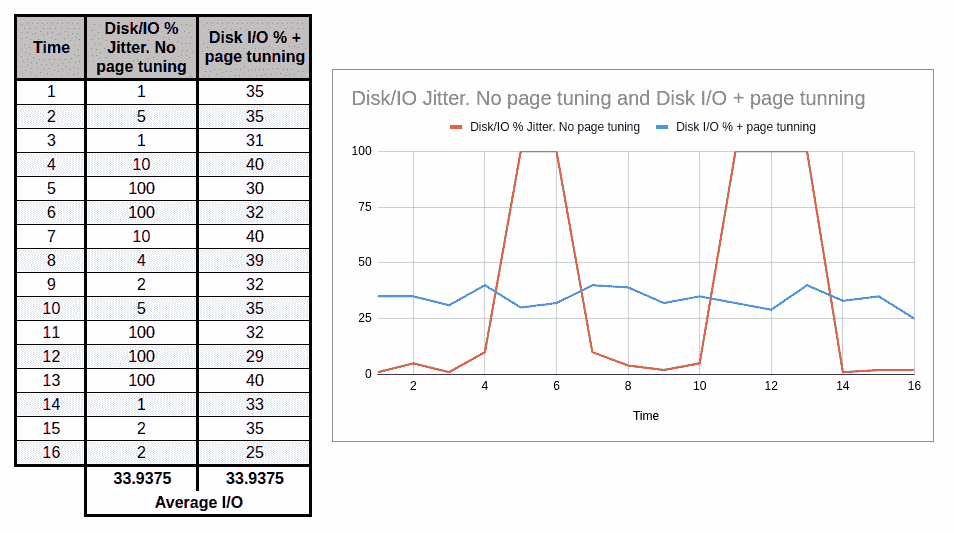

# [工作原理]内存和性能。第二部分。

> 原文：<https://medium.com/geekculture/how-it-works-memory-and-performance-part-2-66da2edcbaf?source=collection_archive---------35----------------------->

Photo by [Umberto](https://unsplash.com/@umby?utm_source=medium&utm_medium=referral) on [Unsplash](https://unsplash.com?utm_source=medium&utm_medium=referral)

这一部分将主要关注 OS(操作系统)层的内存管理。用什么语言写程序并不重要，从操作系统的角度来看，这是一个过程。让我们看看在编程语言抽象和硬件之间有什么。一旦我们有了很好的理解，我们将探索如何利用这些知识。但在此之前，快速回顾一下。

在上一篇文章中，我们介绍了内存基础知识(如果你还没读过，请阅读第 1 部分)。我们学习了内存的主要类型以及从性能角度来看最重要的特征。此外，我还向您介绍了线性内存模型，并简要介绍了内存段、调用堆栈和堆栈框架。我们还探讨了访问时间和碎片问题，以及内存管理器和垃圾收集器如何试图解决这个问题。

当你的程序的所有部分都被加载到内存中…

坚持住！我有个问题！你告诉我，当我的程序会运行到“高碎片状态”时，内存管理器会使用……会使用……啊对了，**压缩**！它会神奇地复制大量内存并修复一切。但是我不明白，如果内存块被移动了，这意味着内存地址也改变了，对吗？

嗯……这要看情况。我把一些事情简化了。你看，你的程序住在̶M̶a̶t̶r̶i̶x̶的一个**虚拟内存空间**。正如我们所讨论的，每个流程都有一个布局，大致如下:

On the left — Memory address. On the right — actual data divided into few logical segments.

你可能有 10 个进程，每个进程都认为他的静态段从 0x1000 开始。所有进程可以并行运行，不会出现任何问题。不仅如此，每个进程都不能访问任何其他进程的内存。

好吧，你在帮倒忙。更是让人摸不着头脑。内存地址不是真的？你跟我说的 CPU 内存地址查找怎么样？

放松，两个内存地址都存在，物理和虚拟的。CPU 使用物理地址，进程使用虚拟地址，就是这样。当一个进程想要访问某个东西时，它会提供一个虚拟地址，操作系统会拦截这个请求并把它转换成一个物理地址(在硬件帮助下)。操作系统将创建并维护虚拟内存到物理内存的映射。

好了，现在事情有点清楚了，但是我仍然有问题…如果我们想将一个虚拟地址映射到一个物理地址，我们将需要大量的内存。一个内存地址对应一个字节的数据，对吗？现在，我们需要在某个地方存储两个内存地址之间的关系，虚拟的物理的，它仍然与一个字节的数据相关。如果地址占用 32 位(4 字节)，那么 2 个地址将占用 32+32 = 64 位(4+4=8 字节)，并且所有这些都只是指向一个字节的数据！对于一个字节的实际数据，我们有 8 个字节的映射信息。休斯顿，我们有麻烦了！

你完全正确！这一点效率都没有。这就是为什么我们把我们的记忆分成块。这些块被称为**内存页面**。我们可以对更大的块这样做，而不是跟踪每个字节的虚拟到物理映射。

假设我们有一个 4kB (4096 字节)的页面和一个 32 位(4 字节)的内存地址。如果我们从每个 4096 字节的块中为两个地址花费 8 个字节，这是大约 0.19%的内存浪费在映射上。不算太寒酸！顺便说一下，这种映射被称为**页表。**而这对虚拟到物理的地址被称为**页表项。操作系统负责这一切，并将为每个进程创建一个页表。注意这里:**

Visualization of Virtual and Physical memory. Page 1 from virtual memory space is associated with Page 1 from physical memory space, and so on…

虚拟内存中的每个页面都与物理内存(RAM)中的一个页面相关联。物理内存中页面的顺序和位置可能与虚拟内存不同。虚拟页面和物理页面都有固定的大小。从过程的角度来看，记忆总是连续的。这也意味着您的进程不能保留一个字节的内存，它至少可以保留一页内存，这通常会导致内存浪费，因为内存消耗通常不是页面大小的倍数。

A snapshot of 3 different memory pages.

在上图中，你可以看到在第 1 页，程序只使用了 3072 (3 x 1024 字节块)，最后一块内存没有被使用，也不能被其他程序保留。第 3 页的使用率达到了 100%,所以我们根本没有浪费内存。这里最糟糕的情况是第 2 页，只有 1/4 的页面被程序有效地使用。

好的，我知道了。如果我们有更大的内存页面，我们可能会浪费更多的内存，但同时我们不能有一个单一字节大小的页面，因为页面表会很大。那我们为什么需要这些“虚拟”呢？

主要的好处是开发人员不必管理共享内存空间。例如，我们不需要在不中断其他正在运行的进程的情况下决定在内存中的什么地方为变量分配空间。编写一个简单的“hello world”将是一个严峻的挑战，需要您了解各种各样的内存管理知识。除此之外，我们还受益于更高的安全性(内存隔离)和其他一些东西，比如交换和缓存，我们稍后会谈到。

在讨论虚拟内存的下一个好处之前，我们先来谈谈性能。现在我们知道，每次内存访问都会涉及到一个额外的操作—虚拟到物理的映射查找。每次在**页表**中查找条目的成本都很高。为了解决这个问题，现代计算机必须保持非常快的缓存解决方案。我说的非常快，当然不是指 RAM 本身，因为从 CPU 的角度来看，RAM 太慢了。这种解决方案被称为 **TLB** (翻译后备缓冲器)，为了获得最佳性能，它通常位于 CPU 中的 **MMU** (内存管理单元)内。TLB 非常快，可以在一个时钟周期或更短的时间内返回正确的地址。TLB 的问题是它有一个有限的大小，因此它不能容纳许多页表条目，如果条目在 TLB 找不到，它将不得不“手动”搜索，这是昂贵的(可能花费 x10-x100 以上)。

回到我们的页面大小，更大的页面意味着页面表中更少的条目；更少的参赛作品意味着从 TLB 获得更多的利润。更小的内存页面意味着我们将不得不存储更多的虚拟-物理映射，这意味着我们的页面表中将有更多的条目。许多条目可能会填满 TLB 容量，导致更昂贵的“手动”搜索的可能性更高。

但是，虚拟内存不仅简化软件开发，它还可以帮助您提高性能。

哇！这很好，因为到目前为止，我只看到了以性能为代价的便利。接下来呢？

接下来是**页面缓存。**

让我们想象一下，我们有一个应用程序，它周期性地需要从你的磁盘中读取一些信息。我们已经知道什么是访问时间，以及它如何影响性能，因此，如果有一种智能的方式将它缓存到 RAM 中，而不是每次都从硬盘/固态硬盘访问它，岂不是很酷？当然，什么也别说——是的！您的操作系统总是跟踪内存需求，如果您有大量未使用的内存，它可以为您缓存文件。这不是很酷吗？你甚至不用费心去写这个。

当您的程序访问某个文件时，页面缓存算法会将该文件加载到页面缓存(ram)中，然后将数据从页面缓存返回到您的程序。下一次尝试读取数据时，将从 RAM 返回数据，而不是从磁盘访问数据，从而以更高的 RAM 使用率为代价来提高性能。

当你写文件时，同样的情况也会发生。如果一个程序频繁地写入小块数据(例如:日志)，它将首先进入页面缓存。如果我们要写入的文件在缓存中，在更改后它将被标记为“脏”，这意味着缓存的文件和磁盘上的实际文件现在是不同的，它需要刷新到磁盘。页面缓存在刷新到磁盘之前可以批处理少量更改，一旦刷新，缓存将被标记为“干净”(意味着磁盘版本和缓存版本相同)。

如果我只读文件的第一部分呢？将整个文件加载到 RAM 中不仅会降低性能，还会导致在大文件的情况下使用过多的内存。

等等，你的操作系统很智能，也可以缓存大块的文件。在下图中，进程只请求了文件的第一部分。如果该进程稍后需要再次读取该块，将从页面缓存中提供服务，而不是访问磁盘，这将显著提高性能。

A chunk of file on disk is loaded into RAM into a specific page cache then served to a process directly from RAM.

更重要的是，通过虚拟到物理内存映射+文件到内存映射，我们可以欺骗我们的程序直接读取页面缓存，从而消除 RAM 到 RAM 的复制。

哇！这太酷了！

是的，它是！你知道更酷的是什么吗？

什么？

进程可以共享同一个文件。如果您的程序请求读取一个已经映射到缓存中的文件，它将直接从缓存中读取，这也意味着显著提高了性能。

2 different processes are reading the same file using the same page cache.

或者，如果你的程序没有足够的内存，它可以开始把东西写到磁盘([交换文件](https://wiki.archlinux.org/title/Swap))而不是内存，但这显然会对性能产生负面影响。

嘿，如果我不能控制这些，知道这些东西怎么能对我的程序有帮助呢？

说得好。这些技巧在 99%的情况下都会对你有利。但是如果你正在设计繁重的 I/O 程序，这可能会变成一件极其烦人的事情。还有**不**，**你有这个控制权**！

对于 DB 系统，保持太多的缓存脏是一个问题，因为我们记得 RAM 是不稳定的，在断电的情况下，来自缓存的更改将永远丢失。还有其他原因，在这里您可以找到针对 Oracle 数据库的调优建议([调优页面缓存](https://access.redhat.com/documentation/en-us/red_hat_enterprise_linux/5/html/tuning_and_optimizing_red_hat_enterprise_linux_for_oracle_9i_and_10g_databases/sect-oracle_9i_and_10g_tuning_guide-memory_usage_and_page_cache-tuning_the_page_cache))。

有时，页面缓存和写批处理会导致磁盘 I/O 抖动。基本上，操作系统会将大部分写操作保存在 RAM 中，然后一次性刷新。如果累积的写操作量高于磁盘 I/O 容量，它将阻塞所有其他磁盘 I/O，从而导致系统整体性能下降。这可以通过一些简单的操作系统调整轻松解决。知道这些就容易了:)。

这里有一个过于简化的图表来帮助你更好地理解它。平均负载是相同的，但是调优可以帮助您获得更平滑的 I/O 负载曲线。

红线表示磁盘 I/O 完全饱和(100%)的时间段，此时系统将无法处理任何额外的内容，通常会遭遇延迟峰值。平滑的蓝线将表现得更好，甚至解锁您的应用程序来处理潜在的更多负载。

Simplified visualization of suboptimal page cache configuration (red line) and tuned page cache configuration (blue line).

如果你不相信这种理论情况，你可以找到现实生活中的例子。有一些优秀的文章，例如一个运行 Kafka 的服务器正在与 I/O 抖动和零星延迟作斗争:[针对 Kafka 的 Linux 页面缓存调优](https://developpaper.com/application-of-linux-page-cache-tuning-in-kafka/)。如果这还不够，快速看一下面临同样问题的[Aerospike Linux 内核调试指南](https://discuss.aerospike.com/t/how-to-tune-the-linux-kernel-for-memory-performance/4195)。这应该有助于你以后认识和理解这类问题。即使你是一名 java 开发人员，也有[库](https://github.com/smacke/jaydio)可以帮助你绕过操作系统缓存，为你的特定情况获得最大性能。

就是这样！感谢你阅读这篇文章，希望你会觉得有用。如果您对未来的文章有任何建议，请随时发表评论。