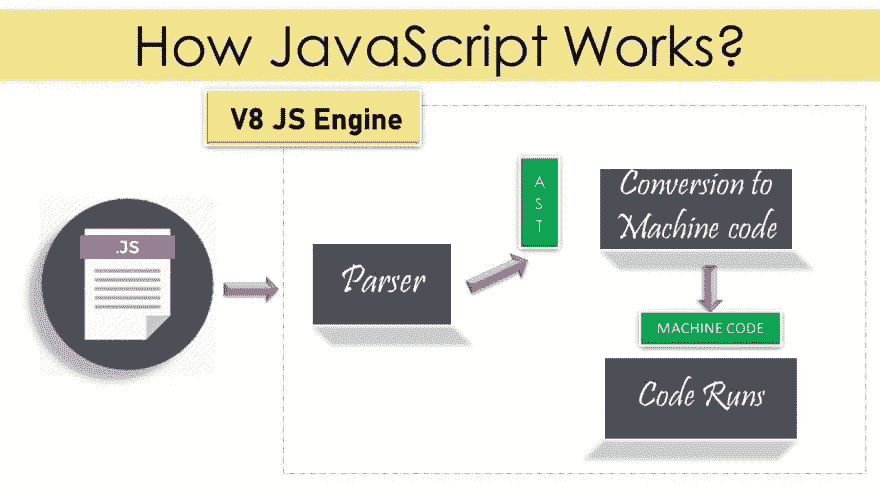
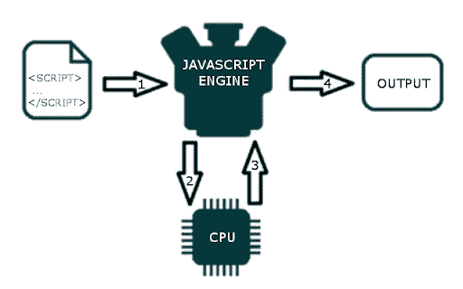
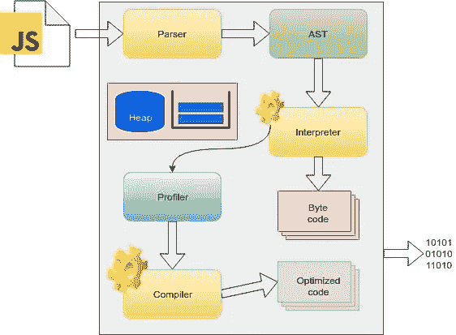
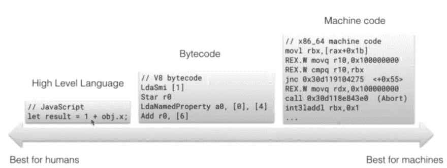
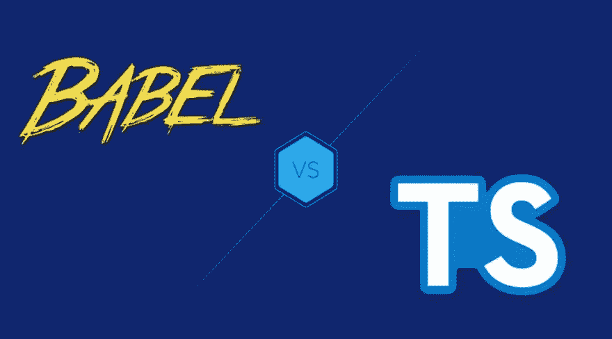
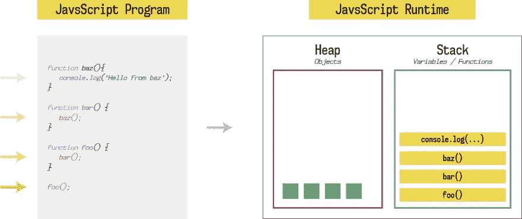
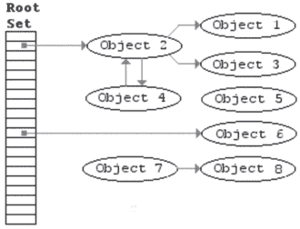
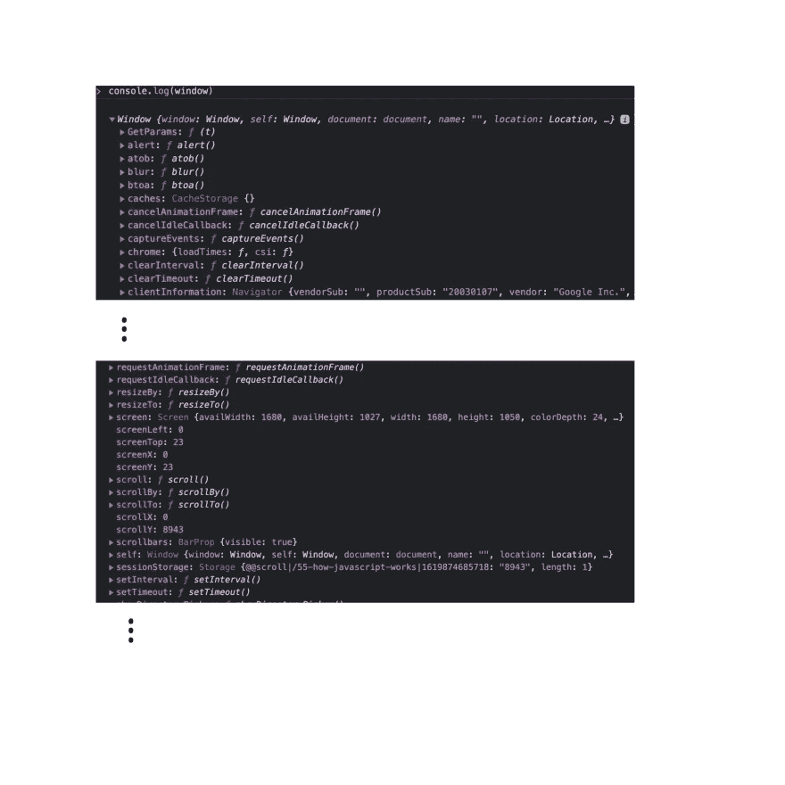

# JavaScript 如何工作🤷🏻‍♀️

> 原文：<https://medium.com/geekculture/how-javascript-works-%EF%B8%8F-1b4a5429f7?source=collection_archive---------8----------------------->


how javascript works

理解基本面是无价的。所以让我们来讨论 Javascript 如何工作的基本原理🤔

# JavaScript 是如何工作的？🤷🏻‍♀



理解 JavaScript 的工作原理会使阅读和编写代码变得更容易，更容易，并且让您专注于应用程序的逻辑，而不是与语言的语法斗争。

我们在文本编辑器中编写代码，不知何故，这些代码神奇地变成 0 和 1，告诉计算机做一些事情。😇

Javascript 是一种单线程解释语言。

如果我把 JS 文件给 CPU，并要求在浏览器中执行它，它不会理解这种语言，因为上一台计算机只理解 0 和 1。我们如何使用 JS 文件进行通信，以便计算机在浏览器中执行代码。

Javascript 引擎来了。

# Javascript 引擎🎰



有了 Javascript 引擎，我们就可以把 Javascript 文件交给引擎。引擎将理解 Javascript 文件，并告诉计算机如何处理代码。

在某种意义上，你创造了一个翻译器，这样你就可以和不懂你语言的人交流。

有 8 个引擎，它们被称为 ECMAScript。快速引擎是用 C++写的 v8。

❓谁创造了第一个 JS 引擎❓

布兰登·艾希。☺️在计算机之前只懂 HTML 和 CSS🤯

# 发动机内部发生了什么？



当我们给出一个 Javascript 文件时，首先它进行词法分析(解析器),将代码分解成标记以识别它们的含义。

这些标记将在称为 AST(抽象语法树)树中形成。

检查它是如何工作的。转到[链接](https://astexplorer.net/)

一旦树形成，它就去**解释器**。

# 解释器和编译器

在编程语言中，有两种方法可以翻译成机器语言，即计算机可以理解的语言。

解释器，我们在运行中逐行翻译和读取文件。

编译器，它可以提前翻译我们写的代码，然后编译成我们的机器可以理解的语言。



在上图中，我们有一个 Javascript 的高级语言，解释器一行一行地读取高级语言代码，然后吐出字节码。

编译器将获取高级语言代码并吐出机器码。所以，它可以把它交给 CPU，CPU 实际上可以运行代码。

因此，解释器允许我们立即运行代码，编译器和分析器允许我们在运行时优化代码。

# 巴别塔+打字稿ḇṯ



[Babel](https://babeljs.io/) 是一个 Javascript 编译器，它获取你的现代 Javascript 代码并返回浏览器兼容的 JS(旧的 JS 代码)。

[Typescript](https://www.typescriptlang.org/) 是 Javascript 的超集，向下编译成 Javascript。

这两者都做了编译器做的事情:把一种语言转换成另一种语言！

**解释器和编译器的优缺点:**

1.  编译器启动和运行的时间稍长，但代码最终会运行得更快。
2.  解释器启动和运行起来非常快，但是不做任何优化。

**❓有什么我们可以两全其美的吗？❓**

没错，谷歌自带 V8 引擎，它结合了解释器和编译器，被称为 **JIT** (Just In Time)编译器，让引擎更快。

使用分析器，因为代码通过我们的解释器运行，解释器告诉我们的浏览器如果同一行代码运行了几次该做什么。我们实际上将一些代码传递给编译器/JIT 编译器，编译器获取代码并编译或修改它。

## Javascript 是一种解释语言吗，❓

是的，当 Javascript 第一次出现时，你有 Javascript 引擎，如蜘蛛猴，它将 Javascript 解释为字节码，告诉浏览器做什么。但是现在我们也使用编译器来优化代码。

# 📚内存堆和调用堆栈



内存堆是存储所有信息和写入信息的地方。这样我们就有地方分配内存，使用内存和释放内存。

调用堆栈需要跟踪我们在代码中的位置。

**堆栈溢出**

递归是创建堆栈溢出或许多函数相互嵌套以保持堆栈不断增长的最常见方式之一..🤯

错误如下所示:

未捕获的范围错误:超出了最大调用堆栈大小

# ⃥垃圾收集站

Javascript 是垃圾收集语言。

这意味着当我们创建任何对象时，在执行之后，如果我们不再需要这个对象，它会为我们清理它。

Javascript 会自动释放我们不再使用的内存。

# Javascript❓的垃圾收集是如何运作的

它使用标记和扫描算法。



# 📝内存泄漏

内存泄漏是应用程序在过去使用过，但不再需要，但没有返回给我们的那部分内存。

在 snippet 下面运行，我们将运行一个无限循环，一遍又一遍地推 i-1，直到我们填满我们的内存，没有任何东西留给我们使用，这将使我们的浏览器崩溃。

**举例:**

```
let array = [];
for(let i = 5; i > 1; i++) {
    array.push(i-1);
}
```

**这是几个发生过的内存泄漏:**

1.  不要有太多的全局变量
2.  事件监听器

当你不需要的时候，永远不要删除下面的 addEventListener。所以继续添加事件监听器

```
var el = document.getElementById('button') el.addEventListener('click', onclick)
```

3.setInterval
它会连续运行，所以我们需要在不需要的时候使用 clearInterval。

# 🧵单线


Javascript 是单线程语言，因为它只有一个调用栈。调用栈允许我们一次运行一个代码，因为 Javascript 是同步的，所以一次只能发生一件事。

不仅仅是 JS 引擎运行代码，Javascript 运行时也会处理运行任务。

# 🏃🏻‍♂️ Javascript 运行时

Web 浏览器在后台工作，而同步 Javascript 代码正在运行，它使用 Web API 进行通信。Javascript 引擎知道，有些数据需要在后台处理。

Web API 是浏览器自带的。这些 web API 可以做很多事情，比如发送 http 请求、监听 DOM 事件、使用回调延迟执行、数据库存储。

**示例:**

如果你打开控制台日志窗口，你就会明白浏览器提供了什么属性。

```
console.log(window)
```



浏览器使用 C++语言来执行上述所有操作。

这些 web API 被称为异步。

因此，如果像`setTimeout`这样的回调或 web API 调用到达`call stack`，那么它将不知道如何处理它，所以它将回调发送到 web API，web API 将处理它。一旦 web API 完成了回调，它就发送到回调队列，事件循环将从现在开始处理它。事件循环将与调用堆栈和回调队列通信，如果调用堆栈为空，则将回调队列任务添加到调用堆栈。

**示例:**

```
console.log("1");
setTimeout(() ⇒ {
    console.log("2")
}, 1000)
console.log("3")// OUTPUT: 
// 1
// 3
// 2
```

让我们看看上面的例子是如何运行的:

我们将第一个控制台添加到调用堆栈，登录到控制台，然后从调用堆栈中删除该代码。

现在，添加了`setTimeout`来调用 stack，它立刻认为`setTimeout`是 web API，所以`call stack`不知道如何处理它，所以`call stack`会将`setTimeout`发送到 web API。

然后，我们转到下一行，检查其控制台日志，然后登录到控制台，然后从调用堆栈中删除该代码。

现在，在 web API 后面，它将启动计时器 1 秒，一旦 1 秒结束，它将推送回调，即`console.log("2")`。然后`console.log("2")`会被推到回调队列，然后持续运行的事件循环会检查调用栈是否为空？

事件循环仅在调用堆栈为空且整个 JS 文件已读取时运行。因此，在调用堆栈为空之前，事件循环不会将回调队列中的任何内容放入调用堆栈。

一旦清除，事件循环将采取`console.log("2")`并打印。

# 参考🧐

*   [放大镜](http://latentflip.com/loupe)
*   [Javascript 运行时](https://replit.com/@aneagoie/Javascript-Runtime)

🌟[推特](https://twitter.com/suprabhasupi) |👩🏻‍💻 [suprabha.me](https://www.suprabha.me/) |🌟 [Instagram](https://www.instagram.com/suprabhasupi/)