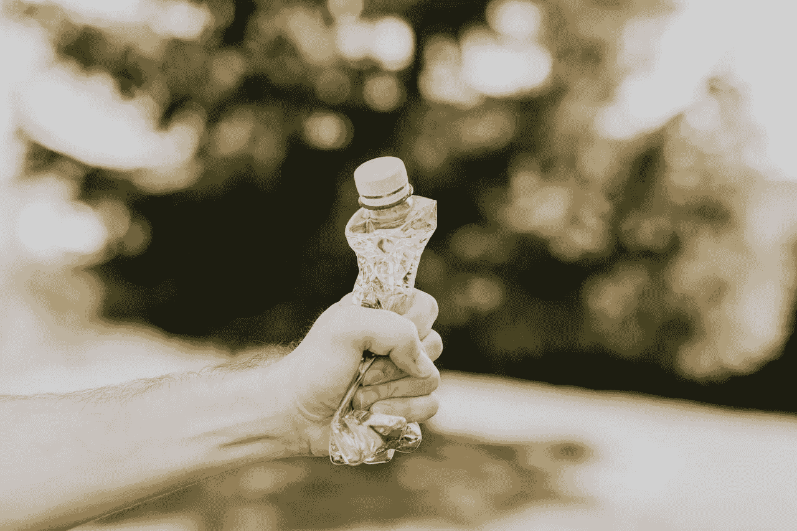

# JPEG 压缩的工作原理

> 原文：<https://medium.com/geekculture/how-jpeg-compression-works-a751cd877c8c?source=collection_archive---------1----------------------->

## 解释 JPEG 压缩背后的神奇步骤

Photo by [Karolina Grabowska](https://www.pexels.com/@karolina-grabowska?utm_content=attributionCopyText&utm_medium=referral&utm_source=pexels) from [Pexels](https://www.pexels.com/photo/crop-man-crushing-plastic-bottle-4498091/?utm_content=attributionCopyText&utm_medium=referral&utm_source=pexels)

JPEG 是最常用的数字图像格式。从互联网到专业相机，它无处不在。创建 JPEG 时，幕后发生了很多事情。在这篇文章中，我们将探讨这一点。

本文是讨论图像处理概念的系列文章的一部分。请查看…