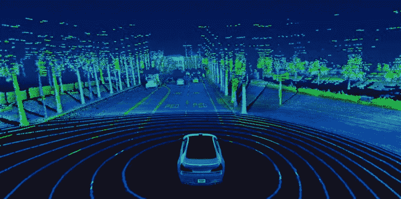

# 激光雷达如何适应自动驾驶的未来

> 原文：<https://medium.com/geekculture/how-lidar-fits-into-the-future-of-autonomous-driving-29fc296052bc?source=collection_archive---------24----------------------->

## 跟踪技术可能在 AV 开发中发挥巨大作用

Image from [Velodyne Lidar](https://www.youtube.com/watch?v=tZ8WbSNsNaU)

自动驾驶的未来[不简单](https://www.morningbrew.com/emerging-tech/s/your-guide-to-autonomous-vehicles?utm_source=morning_brew)。自动驾驶车辆的复杂性正是为什么要花这么长时间才能安全地将它们带到这个世界上。

越来越多的无人驾驶汽车正在接受测试，它们有很多用途…