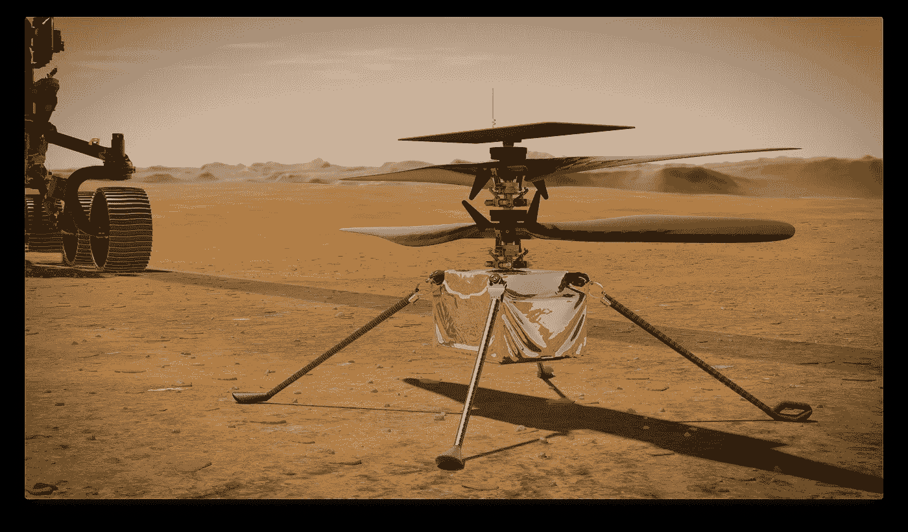

# Linux 如何帮助我们登陆火星

> 原文：<https://medium.com/geekculture/how-linux-helped-us-land-on-mars-a2ceb54cf6e?source=collection_archive---------35----------------------->

The Ingenuity helicopter is powered by Linux

詹姆斯·欧玛利发现,

【2021 年 4 月 19 日，第一次在另一个世界进行动力飞行。当一架 1.8 公斤重的无人机在不到一分钟的时间内成功从火星尘土飞扬的表面升起 3 米时，这不仅仅是人类探索宇宙的又一小步:它也是开源软件的一次巨大飞跃。为此…