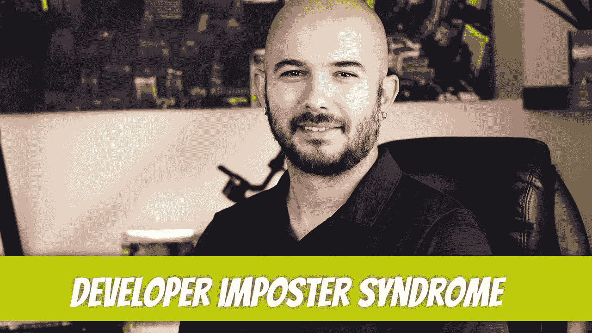

# 开发商冒名顶替综合症持续多久？

> 原文：<https://medium.com/geekculture/how-long-does-the-developer-imposter-syndrome-last-28cd6867b7b9?source=collection_archive---------3----------------------->

冒名顶替综合症。这个术语在软件开发中很常见，甚至没有必要去定义，但是我们还是要为那些可能没有接触过这个术语的读者们解释一下。冒名顶替综合症归结为*感觉像一个骗子*。你一直在怀疑自己的能力，你认为自己配不上刚刚得到的职位。如果这听起来像你，不要…