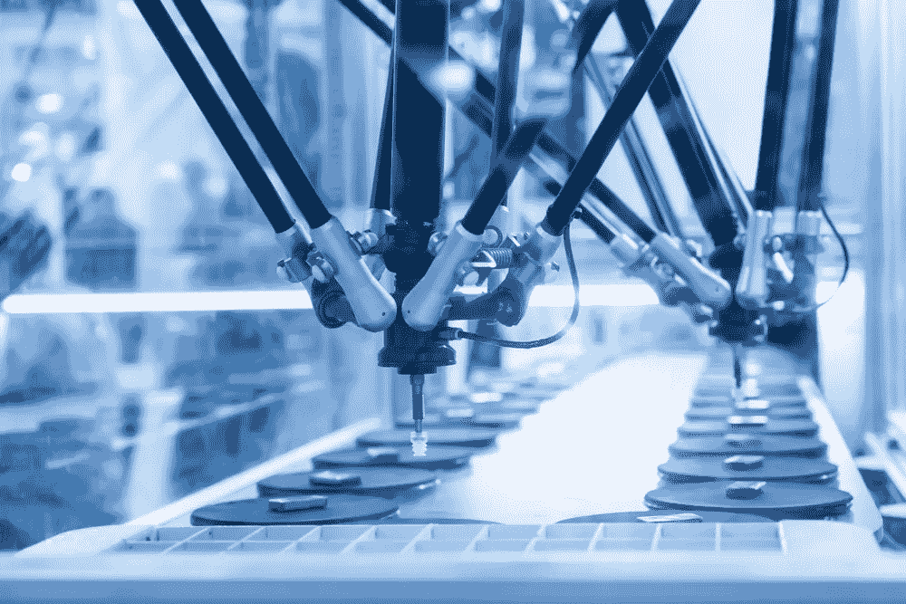
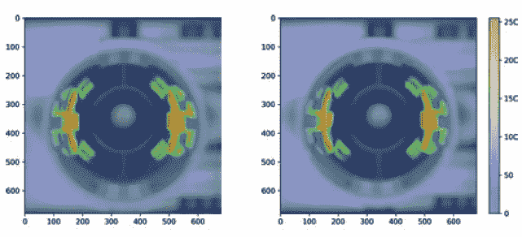

# 机器学习和机器视觉如何让医疗设备制造流程受益

> 原文：<https://medium.com/geekculture/how-machine-learning-and-machine-vision-can-benefit-the-medical-device-manufacturing-process-9095b4718a08?source=collection_archive---------22----------------------->

机器学习(ML)技术已经成为医疗设备性能和管理的关键工具，包括生产[临床评估报告](https://www.capestart.com/solutions/nlp-aided-clinical-valuation-reports-cer-for-medical-devices/) (CERs)制造商必须定期提交以保持合规。

[设备制造商也使用 ML 功能](https://www.mddionline.com/artificial-intelligence/transforming-modern-medical-devices-machine-learning-ai-inference)来添加强大的功能和引入新的服务模式，以获取经常性收入流并加强与客户的关系。

微型机器学习(tinyML)的引入使制造商能够将 ML 驱动的医疗设备做得更小更紧凑，从而进一步推进了这一点。ML 和大数据工具还用于跟踪医疗设备的性能，并揭示设备故障的趋势。

但是，机器学习还有另一种方式——特别是机器视觉技术——可以提高医疗设备的有效性:在制造过程本身。

## 机器视觉如何改善医疗设备制造

机器视觉[通常用于制造过程中的检验](https://www.medtechintelligence.com/column/how-can-ai-make-medical-device-manufacturing-better/)和质量保证(QA)任务——鉴于大多数设备制造商的严格合规要求，这是一个特别重要的角色。

不过，首先要注意机器视觉和计算机视觉之间的差异。机器视觉系统总是包括一个摄像头来查看图像，并且经常与计算机视觉算法一起使用来对这些图像进行推断。它们通常用于制造环境中检测产品缺陷。

另一方面，计算机视觉可以在没有其他系统帮助的情况下从图像中提取数据，并从各种来源(包括视频和 3D)读取图像。

但是，医疗设备的机器视觉不仅仅是满足合规标准。事实上，机器视觉检测算法的速度、一致性和准确性的提高——不像人类员工，永远不会累，也不需要休假——有可能为公司节省数百万美元。

许多机器视觉系统非常精确，例如，它们可以检测到人类头发宽度的缺陷。事实证明，他们还擅长确定这些缺陷是功能性的还是装饰性的，部件是否对称，以及检查所需的印记或标记。

因为每个制造商(和设备)都是不同的，ML 和机器视觉工具根据需求和瓶颈的存在应用于生产过程的不同任务和部分。

## 机器视觉在医疗设备检测中的挑战和前景

传统上，使用摄像机和机器视觉系统进行质量保证的主要挑战是它们识别准确合格/不合格标准的能力。汽车和笔式注射器制造商 SHL Medical 的 Frederick Gertz 和 Gilbert Fluetsch 认为，部分原因在于过去这类系统中使用的硬件。

这些硬件限制从相机的分辨率到拍摄图像时的照明质量不等(尽管 LED 照明的出现，为不同的应用提供了不同的颜色，部分缓解了后一个问题)。

“复杂的算法，”他们在制药行业出版物*ondrugdelivey*中写道，“通常需要数百或数千行代码，用于成分检测、关键尺寸测量或任何其他应用。该代码通常依赖于相机的像素计数，而像素计数又依赖于相机的分辨率和上述光源。

“编码过程之后会有数百小时的测试，即使这样，传统的检测系统也无法提供 100%可信的解决方案。”

与用于医疗设备 QA 的所谓“传统”计算机视觉系统相关的可扩展性问题还包括定义图像的重要区域，通常通过主题专家(SME)的详细报告来定义。然后，机器视觉工程师使用这种 SME 反馈来设计扫描图像和确定质量时要遵循的算法规则，这通常是一个非常耗时的过程。

Gertz，Fluetsch 和他们在 SHL Medical 的同事表示，他们开发了一种更好的方法，通过 TensorFlow 神经框架将机器视觉和深度学习结合起来。

SHL 建立了一个九层的卷积神经网络，其中三层用于卷积，三层用于汇集，创建了一个近 2.4 亿个可训练参数的网络。“使用不起眼的计算资源，包括一台现成的笔记本电脑，对大约 240 幅图像的数据集进行训练大约需要 30 分钟，”作者写道。

在这一点上，作者说他们的新系统在训练和测试数据集上都达到了 100%的准确率。

## 测量机器视觉检测的准确性

那么，如何有效地衡量用于医疗设备检测的机器视觉系统的精度——尤其是当缺陷非常微小的时候？

机器视觉工程师开发的一项技术是在组件上覆盖一个热图，表明算法已经确定哪些区域是重要的。下面是两个相似但独立的组件的热图示例。

顺便说一句:右边的组件有缺陷，你能发现它吗？

*显示机器扫描最重要区域的两个组件的热图。右边的图像包含一个缺陷。* *形象礼貌*[*ondrugdevice*](https://www.ondrugdelivery.com/applications-of-deep-learning-in-medical-device-manufacturing/)*。*

提示:它在右边图像的左手边。

## CapeStart 为医疗设备的机器学习提供动力

CapeStart 的机器学习工程师每天都与医疗设备制造商合作，从开发自然语言处理辅助的 CERs 到为公司提供预先构建的 ML 模型和 ML 训练数据集。

[立即联系我们](https://www.capestart.com/about-us/capestart-is-your-end-to-end-data-annotation-machine-learning-and-software-development-partner/)了解我们如何帮助您在人工智能和业务优化之旅的每一步进行创新。