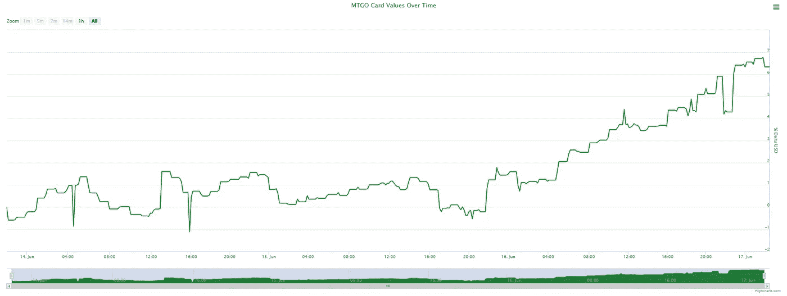
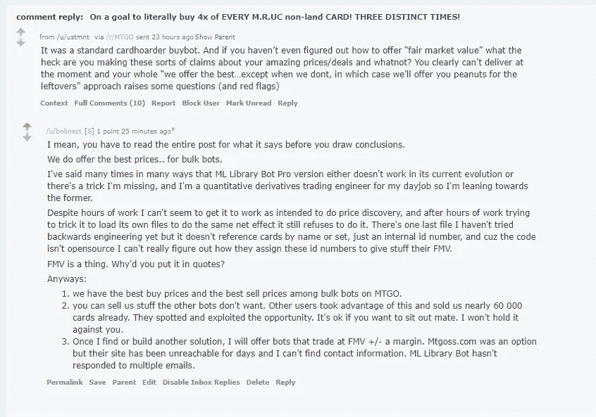
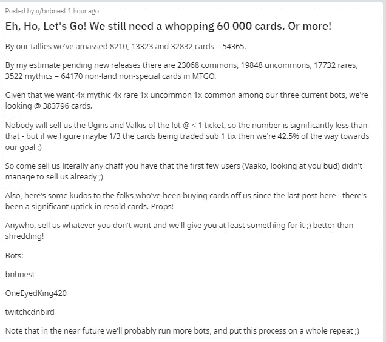
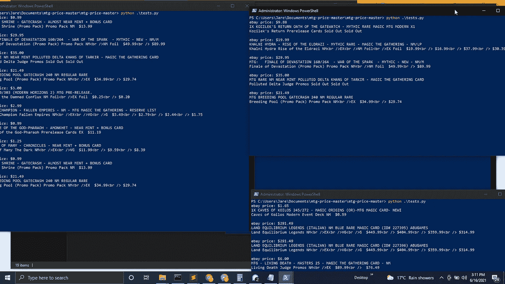

# 万智牌成瘾如何将我从多年的毒品中拯救出来

> 原文：<https://medium.com/geekculture/how-magic-the-gathering-addiction-saved-me-from-years-of-drugs-e47170edcbca?source=collection_archive---------36----------------------->

编辑:想分一杯羹吗？

# 魔术:聚集网上商业 NFTs

# [https://dunn.gg](https://dunn.gg)

大约两周前，我的新室友向我介绍了魔术:聚会，向我展示了他在魔术:聚会竞技场上玩的一些比赛。他也给我看了一些他的实体卡。

当我打败竞技场教程的时候，我被吸引住了。

从那以后我再也没有吸过一点毒品。

几乎立刻，我就在那个游戏上花了成百上千的美元。我积累了一张信用卡账单，这张账单已经(大部分)付清了——但其中没有一美元用于购买毒品。

有意思的是:多年来，成瘾治疗师和咨询师之类的人一直告诉我用其他东西来代替我的日常生活和多巴胺来源。多年来，我当着他们的面嘲笑他们，因为他们可能从来没有吸过毒，也没有意识到没有什么可以与之相比。

伙计们，你们需要的只是一个全新的嗜好。

然后，几乎是错误地，我发现外面有一个更酷的东西(尽管它可能看起来不那么漂亮……)

在 90 年代(说真的),“海岸巫师”(如果你是 meta meta 就去看看吧，因为他们的股票在 3 个月内上涨了 60%)发布了他们流行的交易卡游戏的在线版本。

在这个游戏中(早在 crypto 开始标记一切之前，早在 Crypto Kitties 之前),用户拥有他们卡的数字权利——他们可以交易、出售、展望或以其他方式从他们的 Crypto 卡中获利。

My MTGO portfolio value plotted over time in the last 48 hours, expressed as a % of USD value

在这里花的钱要多得多——在这里我可以积极地交易卡片。

现在，比特币越来越主流，我越来越不感兴趣。我也签了一些保密协议和非竞争协议之类的东西，需要在网上比现在更加保密。

魔法是新的比特币。

听我说:利润率更高，风险更小，用户群有一个特殊的差异化因素——比特币从市场共识中获取价值，玩魔术其实很有趣。

因此，我几乎立刻注意到大约有 2000 个自动交易机器人，它们可以交易任何魔法物品，在 BBO 甚至批量买卖你的卡。

你可以为这些机器人之一获得一个免费的许可证——我还不知道如何在 FMV 上交易，但我已经知道如何批量交易。

Me decisively explaining self while trolling a reddit troll, right back at cha.

我的利润是 200%。或者，更重要的是，如果有人卖给我一些东西，我可以在机器人上卖，这将给我带来 FMV。

这里有一个更大的笑话:现实世界的卡片远比网上的卡片更有价值——更大的市场，更好的储值空间。这是我写的一个机器人，用来比较 ebay 和 FMV 的列表，以找到一些值得挑选的宝石(除去错误的标志——这里需要一些人工干预):

Source: my PowerShell scripts

所以我不知道该怎么跟你们说。

魔术是一种比大多数上瘾都好得多的上瘾，而且我可以保留和增加我的投资。另一方面，对于毒品，你前一秒钟有钱，下一秒钟有毒品，第三秒钟就什么都没有了。最糟糕的是——也许是一两笔债务，然后你就陷入了一个恶性的自我挫败的小螺旋。

魔法是新的比特币。

魔术是我可以重新开始写给我所有的在线圈子的东西，这些圈子曾经关注我的加密机器人的进展，因为它肯定不会与我的对冲基金竞争。哈！

现在，如果你注意到了我的话，并且你已经阅读了下面的内容——祝贺你！

一些提示:

1.  如果你下载 mtg 竞技场，不要花任何钱，直到你兑换所有你能在你最喜欢的搜索引擎上找到的“MTG 竞技场优惠券”的代码你可能会得到 100-200 张卡片，以及一些你可以兑换成任何你喜欢的卡片的通配符。
2.  如果你不想浪费你的钱，而是可能积累财富，确保注册 cardboarder——MTG 在线的领先交易公司——使用这个推荐链接，你将获得一些免费积分(价值大约一美元——但是嘿，如果你打算这样做，还不如获得免费美元:)[https://www.cardhoarder.com/r/60c1b8425c9af](https://www.cardhoarder.com/r/60c1b8425c9af)
3.  查找 cardhoarder 的免费机器人。如果你按稀有度排序，并在允许的每个月抽取 64 张最稀有的卡片，你将每月再制作价值 6-7 美元的卡片，这是免费的。
4.  然后，查找我们的机器人:)大多数批量机器人会以 1 美元的价格卖给你 1000 个，我们会卖给你 1100 个——以此类推，对于所有稀有产品，我们会提供 10%的优惠。我们还以 10%的优惠价格购买你不想要的卡片。

我们的机器人:

twitchcdnbird

OneEyedKing420

bnbnest