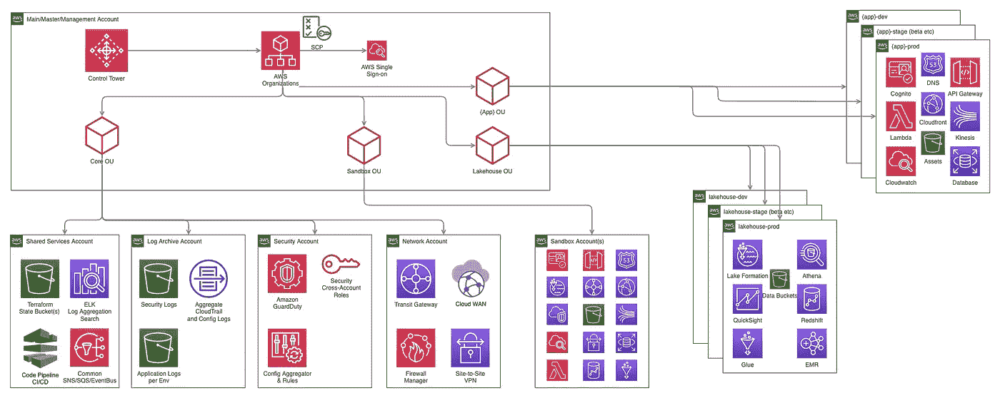
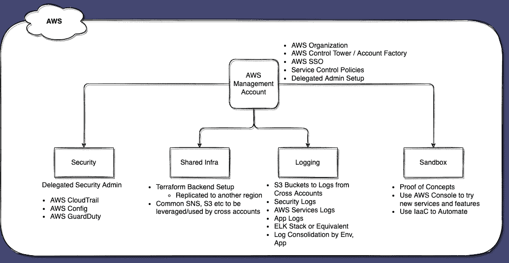
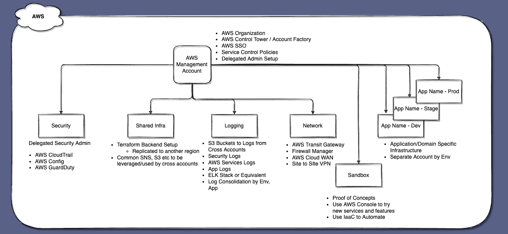
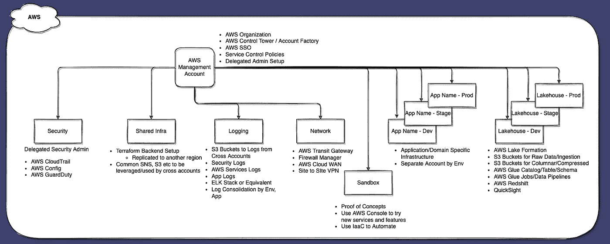

# 我需要多少个 AWS 账户？—第二部分

> 原文：<https://medium.com/geekculture/how-many-aws-accounts-do-i-need-part-2-a45de4d89efc?source=collection_archive---------9----------------------->

我在[的上一篇文章](/p/d54261a0ab04)中，我谈到了你应该选择多少个 AWS 客户。在这篇文章中，我将写更多的细节，并展示 [AWS 组织](https://docs.aws.amazon.com/organizations/latest/userguide/orgs_introduction.html)的可能发展，随着您的架构和基础设施随着增长、可用性、数据驻留和灾难恢复方面的新业务需求而发展，您将添加更多客户。

TL；DR —下图总结了这一点

AWS Organization, Accounts and Services

# 基线设置

首先，创建 AWS 管理帐户，并使用 [AWS 控制塔](https://docs.aws.amazon.com/controltower/latest/userguide/)为安全、日志和公共基础设施设置新帐户。AWS 控制塔也提供了一个很好的起点，它设置了 [AWS SSO](https://docs.aws.amazon.com/singlesignon/latest/userguide/what-is.html) 、服务控制策略、护栏以限制某些更改，并按照最佳实践设置安全性和登录帐户。然后，添加沙盒帐户，该帐户可用于开发任何概念证明，并尝试新的 AWS 服务和功能。

AWS Organizations — Baseline Setup

# 应用程序帐户

一旦您有了沙盒帐户的基线设置，当您改进了您的设计和问题的初始实现时，就应该将它部署到不同的环境中，部署到它自己单独的应用程序帐户集。如果您有许多应用程序环境要部署，您可以将几个环境合并到一个帐户中。但是，最好根据使用案例将它们分为“开发”、“测试/生产前”(任何非开发和生产的客户)和“生产”。

Application/Services/Domain Accounts — per (group of) Environment

在这里，一组应用程序帐户，每个环境(或一组环境)一个帐户，将为每个应用程序或服务，或需要协调工作的一组应用程序/服务/域创建。请谨慎，不要将公司的组织界限作为决定将哪个客户部署哪个工作负载(应用程序或服务)的唯一因素。最佳方法是考虑您的整体系统架构，以决定组件(工作负载)及其内聚性，从而决定您需要的应用程序/域/服务帐户的数量。

网络帐户将通过使用诸如 AWS Transit Gateway(集中连接多个 VPC)、AWS Cloud WAN、站点到站点 VPN 等服务将多个应用程序(和其他帐户)连接在一起，以将 AWS Cloud 与公司网络连接起来，并设置集中防火墙规则。

随着您的业务、需求和架构的发展壮大，您将需要更多的客户。

# 莱克豪斯

> ..不仅仅是将数据湖与数据仓库集成，而是将数据湖、数据仓库和专门构建的存储进行集成，从而实现统一治理和轻松的数据移动

借助最新的功能以及存储和对象存储(AWS S3)中存储的数据的无服务器处理(AWS Glue Jobs、Athena、Redshift Serverless)和共享元数据(Glue Table、Schema)的紧密集成，有可能以这样一种方式设置数据、格式化和访问，即可以与数据湖和数据仓库无缝集成，从而形成 Lakehouse。

Lakehouse Accounts — per Environment

对于任何公司来说，数据都非常重要，能够了解使用情况，提供个性化的功能，推荐，并从整体上为产品和业务做出数据驱动的决策。在中央账户中引入用于接收、处理、组织和管理数据的独立账户将是一个好主意。应用程序本身将在自己的帐户中有较小版本的 Lakehouse，但重要的是要在中央帐户中公开和访问。

# 国际市场

向国际市场的扩张将要求您将工作负载扩展到云提供商的多个区域。就 AWS 而言，它在六大洲都有区域(在撰写本文时，除了南极洲——由于人口原因，从商业角度来看这没有意义),在某些情况下，每个国家都有多个区域，距离和人口都相当大。

随着您进入国际市场并开始提供您的软件/服务/应用程序，您将不得不遵守[数据驻留](https://aws.amazon.com/blogs/security/addressing-data-residency-with-aws/)要求，并且由于客户端/用户和服务器/服务之间的延迟随着距离的增加而增加，这迫使您在多个地区部署、存储和处理基础架构(应用程序/服务和数据)。您可以利用同一组客户，选择不同的区域，同时部署您的应用程序/服务软件和基础架构持续部署管道，扩展管道以在多个区域部署变更。

# 灾难恢复

根据您如何利用多区域部署，在大多数情况下，您会将用户分配到其所在国家边界内的区域(在该国境内，离他们的位置更近)，您需要做好准备，以应对灾难袭击单个区域，以及如果您正在使用的区域出现故障或经历长时间中断时可能会丢失数据。您对恢复时间目标和恢复点目标的业务要求将在设计、实施和执行到不同区域的故障切换中发挥重要作用。至少，您应该定期将数据备份到不同的区域(在可能和需要的情况下，请记住数据驻留合规性)。最好使用访问权限非常有限的不同帐户(自动化流程和最少用户集)，这样即使在特定帐户被攻击/超越的情况下，您的备份数据(和帐户)也是安全的，从而允许您使用独立帐户中的数据来执行故障转移。

一如既往，请让我知道我是否遗漏了一些值得补充的内容，这些内容对您的设置非常有用(对于隔离、规模、组织/管理、灵活性和成本)。