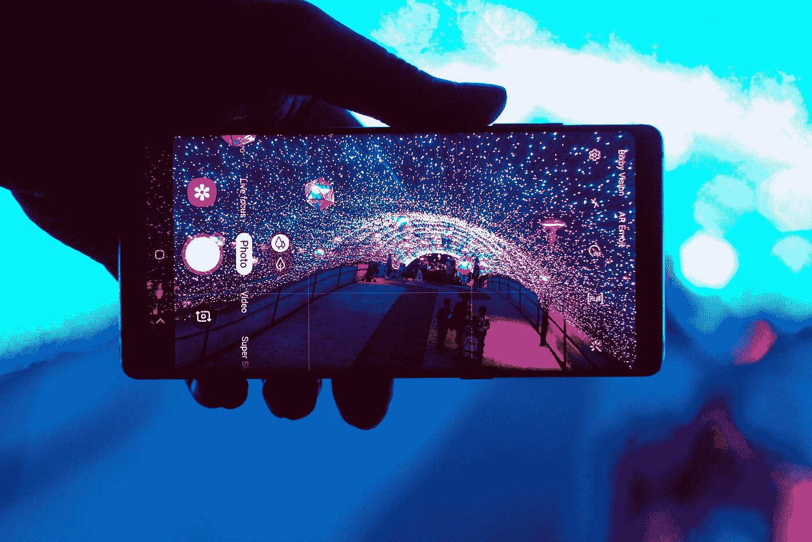

# 麻省理工学院新的低成本技术如何为你的手机提供无线网络

> 原文：<https://medium.com/geekculture/how-mit-new-low-cost-tech-could-power-your-phone-with-wi-fi-9eb7f01423b3?source=collection_archive---------19----------------------->

## 麻省理工学院的研究人员开发了一种设备，可以通过将 Wi-Fi 信号转换成电能来为电子设备供电

Photo by [Andrew Haimerl (andrewnef)](https://unsplash.com/@andrew_haimerl?utm_source=medium&utm_medium=referral) on [Unsplash](https://unsplash.com?utm_source=medium&utm_medium=referral)

我们生活在一个技术突破的新时代。世界各地的研究人员正在提出革命性的概念，这些概念有能力改善我们的日常生活…