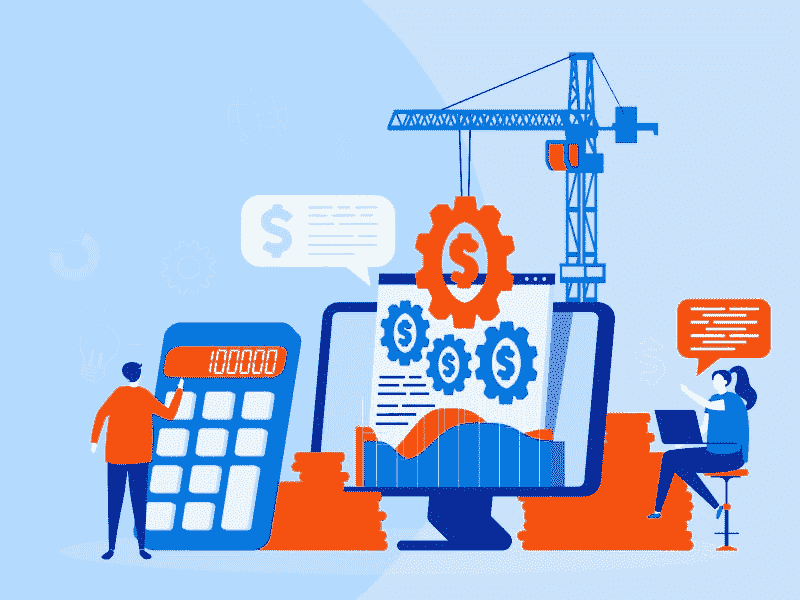
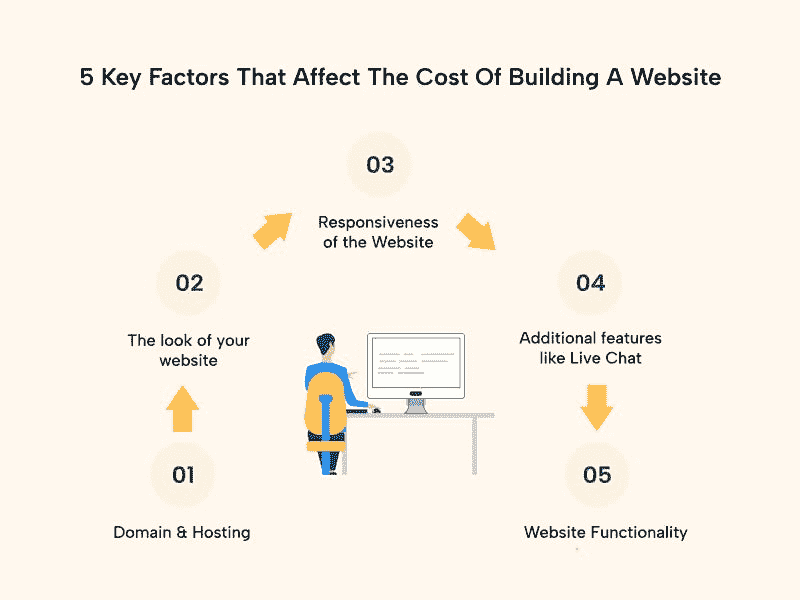
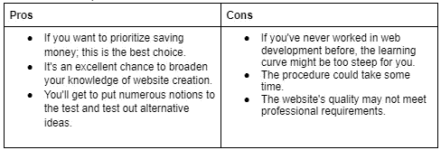
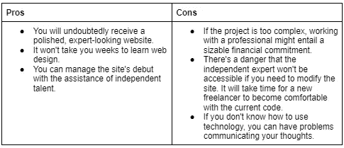
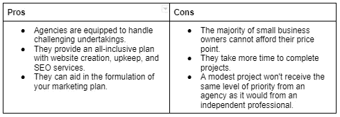
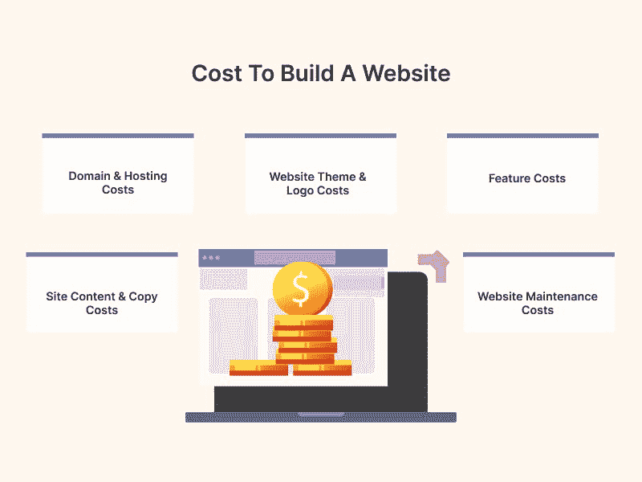

# 建一个网站需要多少成本

> 原文：<https://medium.com/geekculture/how-much-cost-does-it-take-to-build-a-website-6ffe33d792df?source=collection_archive---------14----------------------->

在 2022 年，没有网站经营企业是一个已经灭绝的想法。人们向在线社区推广他们的网站，以增加流量和销售额。

商业网站是至关重要的，所以你应该小心你为创建一个网站所付出的代价。网站设计价格列表是不断变化的，尤其是在印度，那里有许多廉价的设计师，他们可能会用糟糕的设计损害你的业务。

做生意的人需要清晰地建立他们的网站。从长远来看，降低网站建设成本会让你付出很大代价。因此，你需要专家的帮助。

*必读:*[*Web App 开发完整时间线指南| 2022–23*](https://www.valuecoders.com/blog/technology-and-apps/a-complete-timeline-guide-for-web-app-development/)

我们来讨论一下建一个网站要花**多少钱。**

# 影响网站建设成本的 5 个关键因素

下面是影响**建站成本**的五个必备因素。

1.  **域名&托管**

你的网站的名字就是它的域名，它的主机是保存所有文件的地方。因为你的域名是访问者首先看到的，所以它应该简单明了，容易记忆，并且与你的品牌相一致。你的主机也决定了你的网站的性能和速度。

因此，在选择托管平台时，考虑服务器位置是否离您的受众更近是至关重要的。

**2。您网站的外观**

规划网站外观时，有两个关键因素需要考虑。

*   你的网站设计
*   您网站的徽标

简单地说，你的网站的设计和布局构成了它的主题。主题允许我们快速而容易地改变我们网站的外观、感觉和风格。在网上，有大量的主题可供选择，有免费的，也有付费的。你应该为你的网站投资一个优质的主题来获得理想的主题。

您现在可能正在考虑是否需要高级主题。一些解释如下:

*   独特的网站设计
*   流畅的用户体验
*   兼容所有浏览器
*   移动响应布局
*   定期更新以维护安全性
*   兼容插件、应用、扩展等

你现在明白为什么你的网站使用高级主题比免费主题更理想了。

网站标志是网站外观的第二个重要组成部分。它在你的品牌形象中扮演着重要的角色。

看看像苹果、耐克、亚马逊等知名公司的 logos。；你会注意到每一个都与众不同，传达了公司的精髓。

同样，在为你的网站设计一个标志的时候，传达你的品牌并让你从你的竞争对手中脱颖而出是至关重要的。

**3。网站的响应度**

您是否意识到移动设备占网站流量的 50%以上？这意味着不仅在桌面显示器上，而且在移动设备、平板电脑等上。，你的网站需要看起来漂亮，有更干净的用户体验。

一个反应灵敏的网站在所有平台上都表现良好。当今世界的人们使用各种设备进行浏览。这些设备也有各种尺寸和形状。因此，你公司的网站必须响应迅速。

你需要一个具有编程专业知识的程序员来修改网站的代码、CSS 样式和设计，使其在所有显示器上都能响应。

**4。实时聊天等附加功能**

你的网站应该有实时聊天选项吗？下面是答案。

实时聊天功能对于销售商品和服务的企业来说是一个宝库。因为需要做大量的工作，许多潜在的客户对通过电话或电子邮件联系犹豫不决。

然而，如果你的网站提供实时聊天，访问者可以与你联系，询问他们的问题，并完成他们的交易。这一特点也有助于你理解你的消费者所面临的问题，以及如何解决这些问题来推进你的公司。

**5。网站功能**

网站的成本很大程度上受功能的影响。简单地说，随着更多的功能添加到您的网站，成本会增加。网站功能的范围从那些经营你的业务所必须的到那些旨在增强用户体验的可选的。

*也看:* [*十大 Web 应用发展趋势看*](https://www.valuecoders.com/blog/technology-and-apps/top-web-application-development-trends/)

**这里有几个例子:**

**电子商务运营:**此类别包括维护电子商务网站所需的所有运营。这些公司的网站必须有几个设计元素，使用户能够浏览和购物。客户门户、支付处理、各种交付选项和订单履行都是在线业务设计的基本组成部分。尽管价格各不相同，但一个完全定制的传统电子商务网站的开发成本很容易就超过 2000 美元。

**会员门户:**顾名思义，这是一个只有登录用户才能访问的网站版块。安装这些门户网站是增加内容合法性、为网站用户提供简化体验以及发展忠实客户基础的绝佳方法。会员门户功能的费用从每年 89 美元到 399 美元不等，取决于您购买的功能和许可类型。

**订阅服务:**这些功能是在您的网站上设置订阅模式或“订阅服务”所必需的它们可以是根据每个客户的需求提供产品的策划服务，也可以是提供重复产品交付的定期补货服务。通过 Bold Subscriptions 等应用程序，可以与订阅服务完全集成，每月起价 49.99 美元。

# 网站内容和电子商务功能设置

你网站的内容是决定你公司成功的重要因素之一。让材料以文字、图片、视频、动画、图形或其他任何形式出现。你的网站内容告知你的目标市场关于你的公司及其商品和服务。

此外，一份有说服力的文案可以说服读者成为消费者。你网站的内容和文案是至关重要的，因为它们赋予你的品牌个性，提高信任度和可信度。

此外，你网站上的内容有助于搜索引擎优化，这有助于你的网站在谷歌搜索结果中排名靠前。这可能会增加互联网流量，为你的公司带来更多的销售。

**电子商务特色设置**

如果你在网站上销售商品或服务，你必须提供几个要素，以保证你的客户享受简单的购买过程。并且设置这些功能的大部分是昂贵的。

UPI 集成是电子商务中最重要的元素之一。您必须在您的网站上安装一个支付网关，以接受客户的付款。

**网站维护**

一旦你完成了网站的开发，创建网站还会继续。如果你想让你的网站完美的运行，你必须注意网站的维护。雇佣专业人士是最明智的做法。

你可能会问他们现在到底在做什么。

以下是一些使网站维护对你的公司至关重要的因素:

*   为了确保您的网站正常运行
*   链接、标语、元描述等。，都必须为搜索引擎优化优化
*   安装最新的 WordPress & security 更新，更新插件，主题等。，将使您的网站保持最新
*   经常备份您的网站并解决任何问题

**建立网站的方法及其对成本的影响**

创建一个网站的成本最终取决于你想如何完成任务:自己动手省钱，还是 [**雇佣网络应用开发者**](https://www.valuecoders.com/hire-developers/hire-web-app-developers) 多付钱。利弊如下:

**自己动手(DIY)**

创建网站最经济的方法是自己动手。如果你自己做设计，你的费用只包括建立和托管网站的总费用。SSL 证书、高级主题、您的域名、托管费和拖放式网站构建器(如 Squarespace、Weebly 或 Wix)就是几个例子。更传统的内容管理系统(CMS ),如 WordPress，也是一种选择。

记住，一旦你接手这个项目，你将负责网站的每一部分。让你的网站模板对移动设备友好，采取安全措施，确保你的 WordPress 主题与第三方插件兼容，以及安装所需的附加组件只是其中的一部分。

成本:你需要一个域名(每年至少 12 美元)，一个共享主机计划(每年至少 60 美元)，一个高级主题(60 美元)，高级插件(每年 60 美元)，以及一个小公司宣传册风格的网站的网站建设者(12 至 15 美元)。当你自己创建一个网站时，你可以预计花费超过 200 美元。

让我们来看看它的利弊:

**自由职业者**

如果你想确保你的网站符合适当的标准，雇佣一个自由职业者是最好的选择。专业的网页设计师可以帮助你将你的想法付诸行动，推荐可以改善你的公司的东西，并指导你毫无问题地推出你的网站。

你将能够很快雇佣到一个合格的网络开发人员，因为你的企业与有经验的工人联系在一起。这些专家将与您密切合作，以确保您的在线业务取得成功，并可以帮助您以各种价位创建定制网站。‍

**成本:**价格取决于几个变量，包括独立专业人员的小时费用、网站的功能、定制程序和页面数量。

一个有经验的自由职业者可能每小时收费 20 到 80 美元。给你一个想法，一个小企业网站的成本可能从 1500 美元到 5000 美元不等。

**使用代理**

经常承担复杂项目的企业可能会从与知名网站设计公司的合作中获益匪浅。这些公司可以处理复杂的网站设计，还可以提供网站开发范围之外的广泛服务。

因为雇佣一个网页设计公司要花费数万美元，大公司构成了他们的大部分客户。

成本:根据代理公司的规模和工作难度，雇佣代理公司的价格可能会高达 10 万美元。

# 建立一个网站的成本

当从头开始创建一个网站时，你必须确保每个组件功能完美无缺。

现在让我们来确保你的网站完美运行的成本。

1.  **域名&托管费用**

在印度，一个域名的费用在 87 印度卢比到 784 印度卢比之间，而一个主机包每月的费用在 199 印度卢比到 1699 印度卢比之间。

它的可用性、扩展会影响域名的价格。在，。net 和. org)、域名注册商以及其他因素。

提供的托管类型(共享、云、专用等。)、存储空间、每月网站访客频率等因素影响托管成本。

此外，请记住，某些主机服务给你一个免费的域名，一个 SSL 证书，和一个商业电子邮件。这样做可以降低成本。先从看 [**顶级网站开发公司**](https://www.valuecoders.com/top-website-development-company) 开始。

**2。网站主题& Logo 费用**

一个优质的 logo 可能需要 2000 到 6000 美元，一个网站主题可能需要 4000 到 8000 美元。

聪明的做法是雇佣一个专家来设计你的商标，因为这需要一种富有想象力的讲故事的天赋。

**3。特征成本**

现在是考虑在您的网站上添加实时聊天选项的最佳时机。在印度为你的网站创建一个实时聊天需要花费 2000 到 4000 美元。

**4。网站内容&复制费用**

在印度雇佣一个专业的内容/文案来为你的网站策划内容，每页需要花费 2000 到 4000 美元。

**5。网站维护费用**

在印度，每月网站维护费用从 5000 英镑开始。

*也可阅读:* [*为你的项目选择合适的 Web 开发技术*](https://www.valuecoders.com/blog/technology-and-apps/how-to-choose-right-web-development-technology-for-your-project/)

# 最后的话

你的网站是你业务的重要组成部分。你的网站的布局，图形，加载时间，内容和其他方面必须完美无缺，以提供积极的用户体验。

此外，从头开始构建网站时，几乎不可能消除错误。但令人遗憾的是，犯这些错误会让你损失金钱，延迟你的恢复能力，并导致你失去网站访问者。出于这个原因，我们强烈建议雇佣一家**网站应用开发公司**来创建你的网站。

如果你雇佣专业人员，你的网站和业务将会发展，因为你不会被迫犯任何错误。

所以，如果你正在搜索 [**网络应用开发服务**](https://www.valuecoders.com/web-application-development) 来创建你的网站，你再也不用担心了。你可以联系很多开发公司，他们会协助你创建你梦想中的网站。