# 进入数据科学领域你知道多少？

> 原文：<https://medium.com/geekculture/how-much-do-you-know-to-enter-data-science-field-1df95baec9da?source=collection_archive---------16----------------------->

Photo by [Adli Wahid](https://unsplash.com/@adliwahid?utm_source=medium&utm_medium=referral) on [Unsplash](https://unsplash.com?utm_source=medium&utm_medium=referral)

# 介绍

自几年前以来，数据科学的宣传一直在增加。许多人试图进入这个领域，不管他们是谁，男人还是女人。然而，由于该领域是通常男性主导劳动力的技术领域之一，如果你是女性，你有机会或类似的机会进入数据科学领域吗？

此外，由于该领域有各种角色，例如数据科学家、数据分析师、数据工程师、机器学习(ML)工程师等。，你不觉得成为其中一员需要什么技能吗？或者，即使你掌握了这四项技能所需的大部分技能，你会挣得更多吗？

因此，为了满足我们的好奇心，在这篇文章中，我们有兴趣回答以下问题:

*   与男性相比，女性的数据领域前景如何？
*   成为数据科学家、数据工程师、数据分析师或 ML 工程师需要哪些技能？
*   成为全栈数据专家，你赚得更多吗？

# 内容

在上面的章节之后，你会发现下面列出的其余章节。

*   准备数据
*   问题 1
*   问题 2
*   问题 3
*   结论

# 准备数据

要回答问题，我们可以使用 Kaggle 发布的最新调查结果，即[*“2020 ka ggle 机器学习&数据科学调查”*](https://www.kaggle.com/c/kaggle-survey-2020/overview) 。该数据旨在进行一项全行业调查，展示数据科学和机器学习状态的真正全面的视图。你可以在这里找到数据集[，或者在这里](http://localhost:8888/notebooks/Udacity%20-%20Data%20Scientist%20Nanodegree/Project%201/datasets/kaggle_survey_2020_responses.csv)从它的网站[下载。](https://www.kaggle.com/c/kaggle-survey-2020/data)

此外，为了了解更多的数据，建议阅读补充数据，因为它包含两个 PDF 文件，解释了向受访者提出的问题和调查中使用的方法。从方法文件中，我们可以推断，所有的空数据并不意味着不完整或损坏的数据，相反，这意味着回答者确实不能回答给定的问题。

如果我们使用电子表格查看数据集，我们会发现它的结构如下图所示。

# 问题 1:“与男性相比，女性的数据领域前景如何？”

要回答这个问题，下面是我认为我们需要关注的方面:

*   年龄
*   教育
*   作用
*   经验
*   薪水

我们会看到女性和男性在以上几个方面的对比。

## 年龄

我们还将计算每个女性和男性的比例。这一比率表明了每个女性和男性数据中的比例。

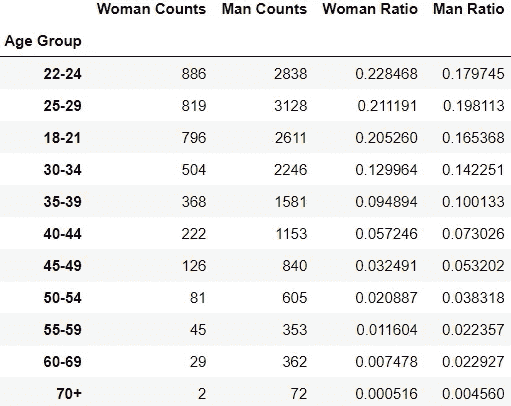

为了使这一发现更加清晰，如果我们将这一结果绘制成一个比较女性和男性数据的金字塔图会更好。

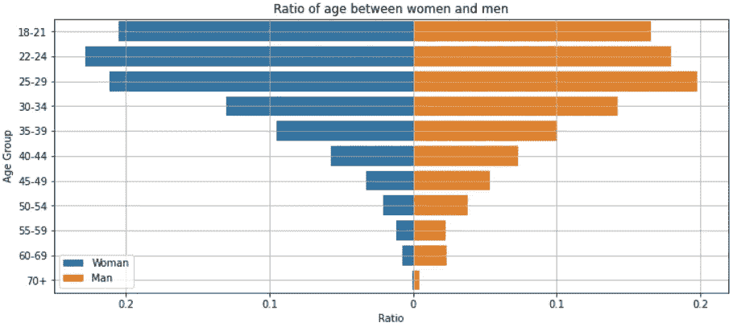

从上面的计数图表中，我们可以看到，在只关注计数的情况下，男性在所有年龄段都占主导地位。这种现象在任何信息技术领域都很普遍，包括数据科学。然而，如果我们从不同的角度来看这些数据，我们计算每个年龄组的比率，我们会发现一些有趣的事情，如第二个图表所示。

这些比率显示了特定性别中特定年龄组在总数据中所占的比例。我们可以看到，尽管女性数据的数量少于男性，但她们的比例表明了不同的情况。大多数比例较高的是年龄在 18-21 岁、22-24 岁和 25-29 岁之间的女性。甚至这三个比例超过了男性。从这一发现中，我们可以推断出女性逐渐对 IT 领域更感兴趣，比如数据科学，尤其是年轻女性。

## 教育

我们发现，通过观察年龄，年轻女性逐渐对数据科学领域感兴趣。但是，这是否也会发生在教育方面呢？我们将像之前对年龄数据所做的一样。

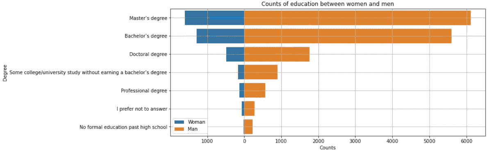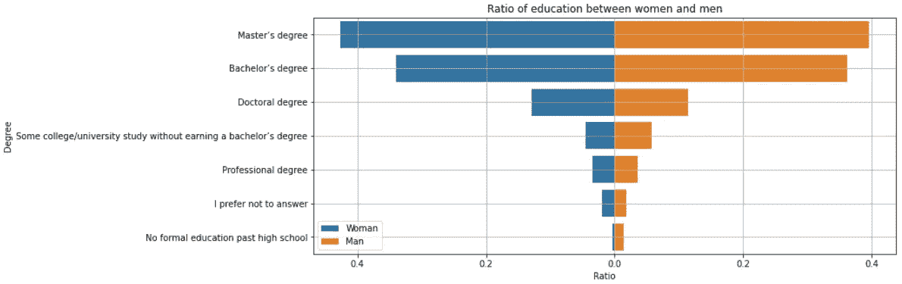

同样，如果我们只关注数量，很明显男性在比较中胜出。但是，这些比率告诉我们不同的事情。最后学历为硕士学位的男女人数都高于其他学位。

为了让这个更有趣，让我们来看看拥有硕士学位作为最后学历的女性是否来自一个年轻人。

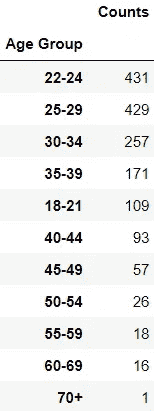

太好了。如上表所示，最后学历为硕士学位的女性人数最多。这是另一个证据，证明越来越多的年轻女性对跳水运动更感兴趣。

## 作用

让我们对角色方面的数据做同样的事情。

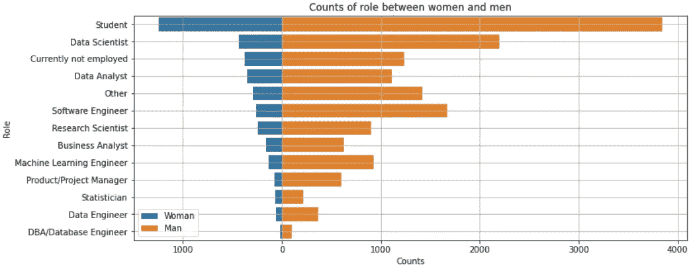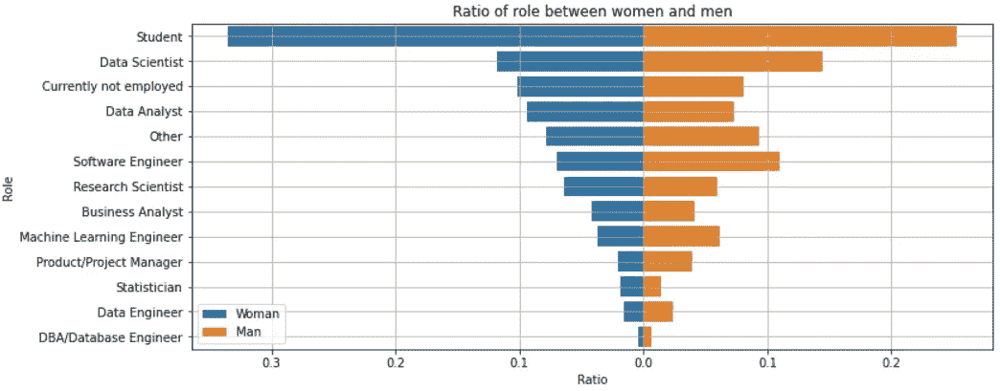

像往常一样，我们在计数图中发现了同样的情况。但是，对于比率图，我们的发现确实加强了我们的假设，即年轻女性逐渐对数据科学领域感兴趣。上面的比率图表明**有大量有抱负的数据科学家**，他们目前仍是学生，通常是年轻女性。为了证明学生通常是年轻人，让我们更多地探索女学生的数据。

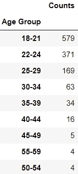

非常好。这是我们所期望的。如上表所示，女学生以年轻女性为主。这是另一个证据，证明越来越多的年轻女性对跳水运动更感兴趣。

## 经验

让我们在体验方面对数据做同样的处理。在这里，我们有两种体验:编码体验和机器学习(ML)体验。

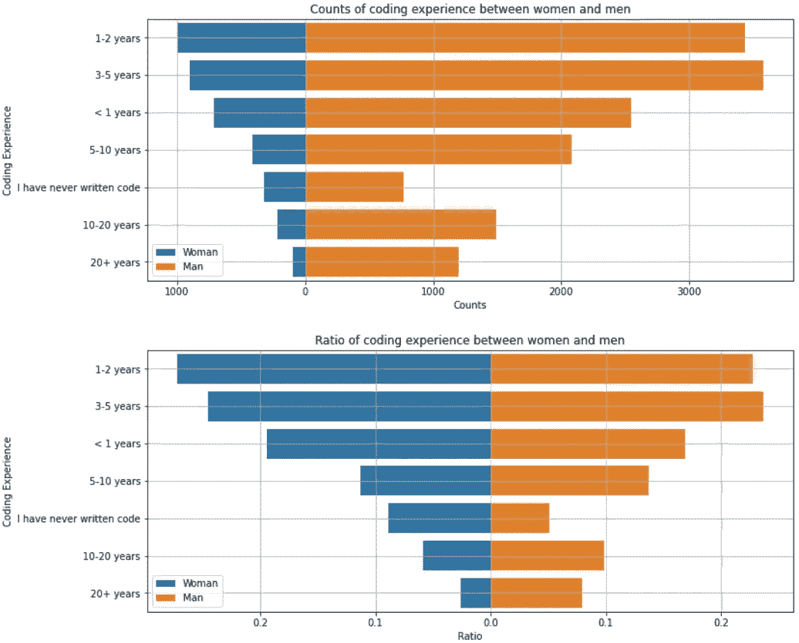

Coding experience

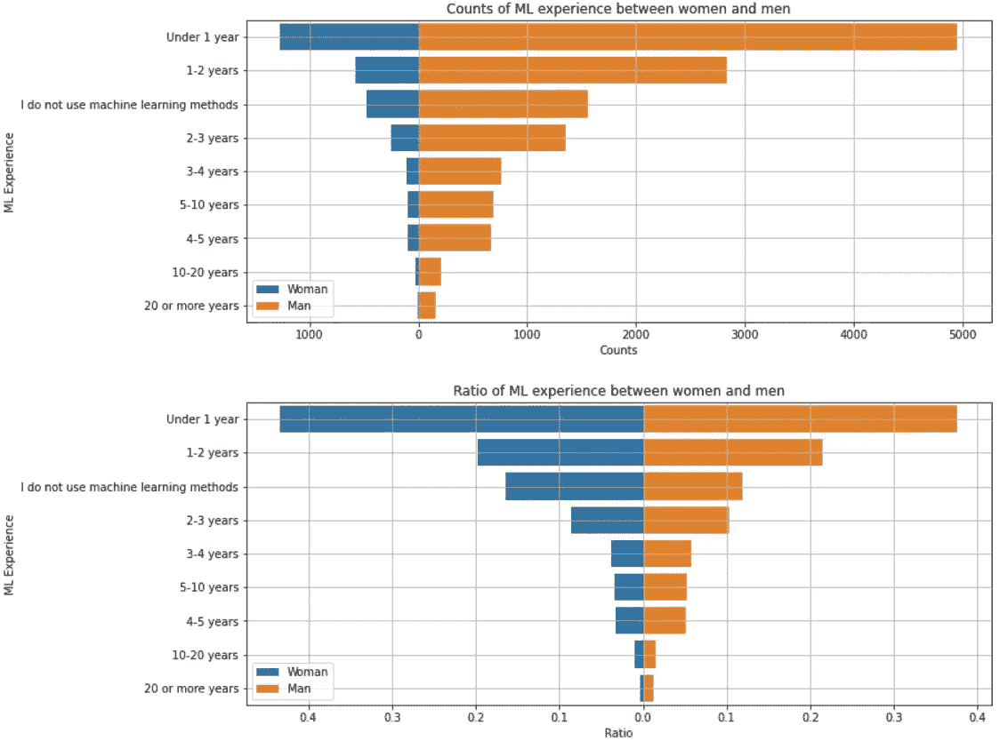

ML experience

像往常一样，对于编码和 ML 经验数据，男性在每个经验范围的数据中占主导地位。然而，我们发现有抱负的女性数据科学家或几乎没有编码和 ML 经验的女性主导着数据。经验最少的应该是年轻人。但是，为了证明这个假设，让我们检查一下这个比例的年龄。

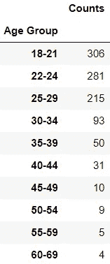

Age group for women with minimum coding experience

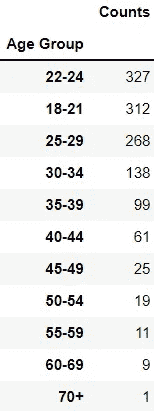

Age group for women with minimum ML experience

非常好。这是我们所期望的。如上表所示，在编码和机器学习方面经验最少的女性主要是年轻女性。这是另一个证据，证明越来越多的年轻女性对跳水运动更感兴趣。

## 薪水

薪资方面的数据我们也这么做吧。这方面是我们一直在等待的。

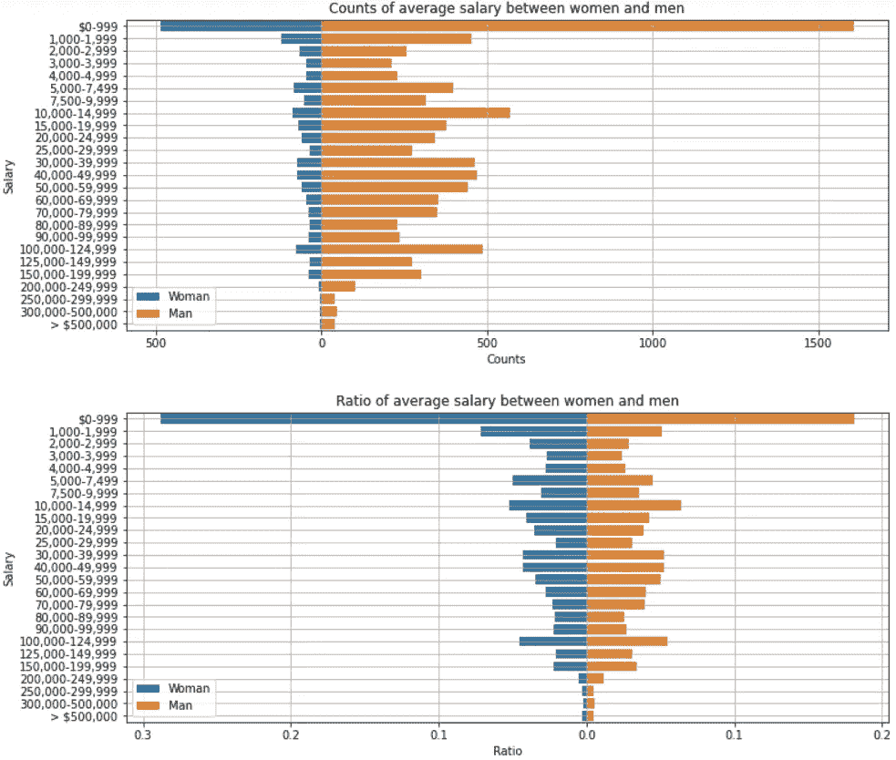

从上面两张图表中，我们可以再次看到，男性在数量上总是占优势。但是，如果关注比率图，在女性数据中，最低工资范围的比例很大。这个比例应该是给那些经验最少的妇女的，因为通常经验少的雇员比经验多的雇员挣得少。然而，为了证明这一假设，让我们探讨一下性别为女性且工资范围在 0 到 999 美元之间的比例。

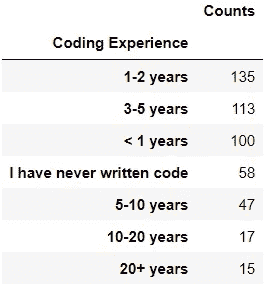

Coding experience group for women with salaries between 0 and 999 USD

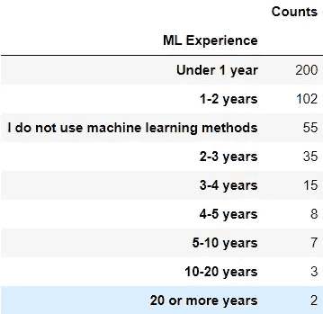

ML experience group for women with salaries between 0 and 999 USD

太好了！我们的假设被证明了。这一比例主要由在编码和机器学习方面经验最少的女性占据。他们的经验从不足 1 年到不足 3 年不等。

# 问题 2:“成为数据科学家、数据工程师、数据分析师或 ML 工程师需要哪些技能？”

要回答这个问题，下面是我认为我们需要的感兴趣的栏目:

*   Q5 角色
*   Q7 编程语言(许多专栏)
*   推荐的 Q8 编程语言
*   Q12 专业硬件(多列)
*   Q14 数据 viz 库(多列)
*   Q16 ML 框架(多列)
*   Q17 ML 算法(多列)
*   Q18 CV 方法(多柱)
*   Q19 NLP 方法(多列)
*   Q23 重要活动(多列)
*   Q26 A/B 云计算平台(多专栏)
*   Q27 A/B 云计算产品(多列)
*   Q28 A/B ML 产品(多列)
*   Q29 A/B 大数据产品(多列)
*   Q30 最常用的大数据产品
*   Q31 A/B BI 工具(多列)
*   Q32 最常用的 BI 工具
*   Q33 A/B 自动分类(多列)
*   Q34 A/B AutoML(多列)
*   Q35 A/B ML 实验(多柱)
*   Q36 部署(多列)

这里，我们应该将所有技能列组合成几个技能组。在仔细查看这些技能栏后，我发现它们可以分为以下几组:

*   主要活动:Q23
*   ML 部署:第 36 季度
*   数据库和大数据:Q29 和 Q30
*   数据可视化:Q14、Q31 和 Q32
*   人工智能:Q18，Q19
*   ML 建模:Q16、Q17、Q33、Q34
*   编程:Q7 和 Q8
*   云:Q26，Q27，Q28

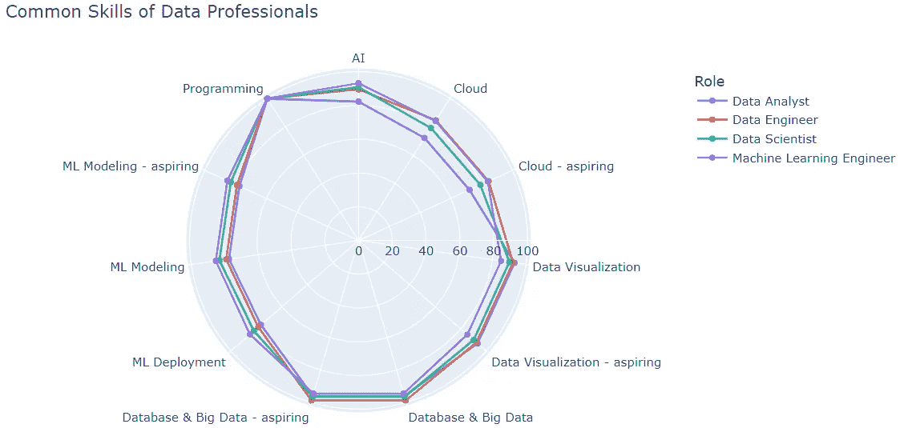

从上面的雷达图中，我们可以看到每个角色都有不同的技能强度。比如 ML 工程师是 ML 部署、AI、ML 建模最熟练的一个；数据工程师擅长云技术，而数据分析师最擅长数据可视化。

我认为最独特的是数据科学家的角色。它不具备任何普通技能中最强的技能。相反，它在每个方面都拥有几乎相同的权力。或许，这可以支持数据科学家的角色是一项多学科工作的理论。

此外，另一个有趣的发现是，可以看到所有角色对于编程技能的份额是相同的。这可以推断出**无论你对数据科学领域的什么角色感兴趣，编程技能都是必须的**。

我们已经完成了数据科学角色的常见技能。现在，让我们看看“主要活动”组会发现什么。

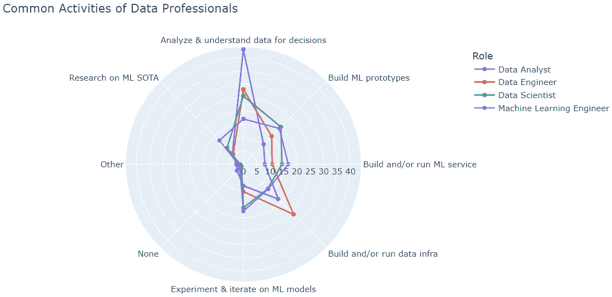

与之前的通用技能图不同，上面的通用活动图显示了更多不同的结果。我们可以看到，每一个角色确实有不同的活动。我们也可以发现，他们每个人都有不同的侧重点。

例如，正如我们所料，数据分析师是一个将大部分时间花在分析和理解数据以影响产品或业务决策的人。甚至这种活动与其他角色的差距也很大。另一方面，数据工程师将大部分时间花在构建和/或运行数据基础设施上，他/她的业务使用这些基础设施来存储、分析和操作数据。这是我们对数据工程师的期望。

ML Engineer，顾名思义，更侧重于 ML part 活动，比如研究机器学习的最新发展水平，以及构建和/或运行 ML 服务。对于数据科学家，我们可以看到这个角色与大多数 ML 工程活动交叉。数据科学家活动与 ML 工程师活动的区别在于分析和理解数据的活动。数据科学家唯一的顶级活动只是构建原型，以探索将机器学习应用到新领域。

# 问题 3:“成为全栈数据专家，你赚得更多吗？”

就像在 web 开发中既能掌握又能执行前端和后端的全栈开发人员一样，我们也可以把在数据领域做上下游任务的数据专业人员称为全栈数据科学家/专业人员。就像一把瑞士军刀可以在一把刀上提供多种工具一样，我们希望一个完整的数据科学家是一个“一个人的军队”,可以做数据领域的所有事情。

所以，通过掌握很多东西，我认为，一个全栈数据科学家应该比其他普通角色赚更多的钱。但是，是这样吗？我们来证明一下。

要回答这个问题，下面是我认为我们需要的感兴趣的栏目:

*   Q5 角色
*   Q7 编程语言(许多专栏)
*   推荐的 Q8 编程语言
*   Q10 托管笔记本(多列)
*   Q12 专业硬件(多列)
*   Q14 数据 viz 库(多列)
*   Q16 ML 框架(多列)
*   Q17 ML 算法(多列)
*   Q18 CV 方法(多柱)
*   Q19 NLP 方法(多列)
*   Q23 重要活动(多列)
*   Q24 薪资
*   Q26 A/B 云计算平台(多专栏)
*   Q27 A/B 云计算产品(多列)
*   Q28 A/B ML 产品(多列)
*   Q29 A/B 大数据产品(多列)
*   Q30 最常用的大数据产品
*   Q31 A/B BI 工具(多列)
*   Q32 最常用的 BI 工具
*   Q33 A/B 自动分类(多列)
*   Q34 A/B AutoML(多列)
*   Q35 A/B ML 实验(多柱)
*   Q36 部署(多列)

我们希望数据中没有多余的列(但没有删除值),并且对于感兴趣的每一列，每一行中都没有空值。

在对数据进行预处理之后，我们来看看哪个角色最有技巧。

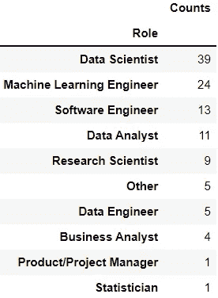

因此，前 4 个角色是数据科学家、ML 工程师、软件工程师和数据分析师。让我们来探讨一下这四个角色的薪水。

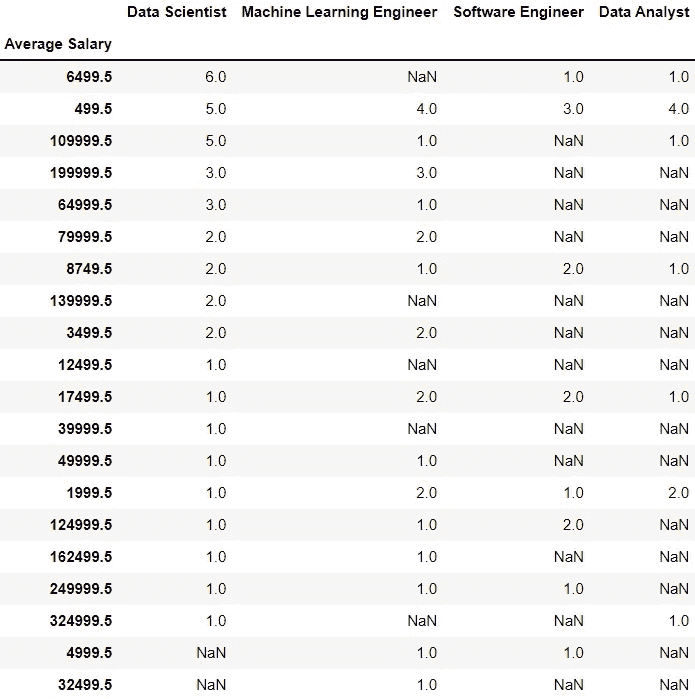

从上表可以看出，得出掌握大多数数据技能可以让你挣更多工资的结论是有风险的。只有极少数人幸运地赚到更多的钱。为了更清楚，让我们看看每个角色的最终含义。

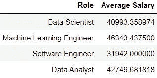

Average salary for most skilled roles

太好了。我们可以看到每个角色的最终平均值。除了软件工程师，如果他们掌握了数据科学领域的大部分技能，所有职位的平均年薪都超过 4 万美元。对于软件工程师来说，我认为这个角色在这里挣得最少是不言而喻的。这个角色是一名软件工程师，因此获得更多收入所需的技能是软件工程技能，而不是数据科学技能。

为了了解上述平均值是否比普通数据专家更值钱，有必要将这些结果与普通数据专家的结果进行比较。

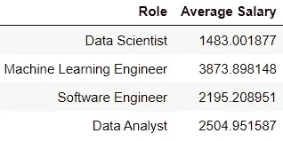

Average salary for common skilled roles

没想到！普通角色的最终平均分比那些掌握最熟练的角色要低得多。从这一发现中，我们可以得出结论，如果你决定掌握数据科学领域的大多数技能，这是有价值和有用的，因为你将有更多的机会比那些拥有一般知识的人赚更多的钱。

# **结论**

我们做了许多有趣的事情。我们对数据科学领域感兴趣，并试图探索该领域的从业者，了解他们是谁、他们做什么、他们能做什么、他们挣多少等等。Kaggle Survey 2020 是我们用于此次探索的数据集。如果你想找到对比或趋势，你也可以探索其他 Kaggle 调查，即 [2019](https://www.kaggle.com/c/kaggle-survey-2019?rvi=1) 、 [2018](https://www.kaggle.com/kaggle/kaggle-survey-2018?rvi=1) 和 [2017](https://www.kaggle.com/kaggle/kaggle-survey-2017?rvi=1) 调查。

我们关注三个问题:

*   数据科学领域的女性
*   所需技能
*   全栈数据科学家

我们已经尽力探索数据来回答问题。许多有用的函数、数据框和图被用来提供最好的数据理解。最后，我们得出了这些结论。

那么，对于第一个问题"*与男性相比，女性的数据领域有多大前景？*“我们所发现的如下:

*   尽管如此，像其他 IT 领域一样，数据科学领域也受到女性爱好者的困扰。如果你在任何一个 IT 领域发现了男人，那就不明显了。但是，这并不适用于女性。
*   然而，有轻微的微风。另一方面，年轻女性显然比年长女性对数据科学领域更感兴趣。
*   当我们从年龄、教育程度、工作角色、经验和工资方面研究数据时，这一发现得到了证实。

下一个问题"*成为数据科学家、数据工程师、数据分析师或 ML 工程师需要哪些技能？*”，我们的发现如下:

*   我们将数据分为两部分:通用技能和活动。
*   我们利用两个雷达图来绘制角色的共同技能和共同活动。
*   从第一张图表中，我们发现每个角色都有不同的技能优势。
*   然而，与其他角色不同，数据科学家表现出独特的结果。它不具备任何普通技能中最强的技能。相反，它在每个方面都拥有几乎相同的权力。
*   这种数据科学家现象可能是数据科学家角色是一项多学科工作这一理论的证据。
*   此外，所有的角色都有相同的编程技能。这可以推断出，无论你对数据科学领域的什么角色感兴趣，编程技能都是必须的。
*   从第二张图表可以看出，每个角色都有不同的活动。还有，他们每个人都有不同的侧重点。
*   除了分析和理解数据的活动之外，ML 工程师和数据科学家的角色在大多数活动中都相互交叉。

最后一个问题，“*成为一名全栈数据专家，你赚得更多吗？*”，以下是我们的结论:

*   我们过滤了数据集，只包含没有空技能的回答者。这意味着最熟练的回答者。
*   我们发现，技能最多的前 4 个角色依次是数据科学家、机器学习工程师、软件工程师和数据分析师。
*   除了软件工程师，如果他们掌握了数据科学领域的大部分技能，所有职位的平均年薪都超过 4 万美元。
*   当那些掌握最多技能的顶级职位的平均工资结果与普通数据专业人员的数据相比时，出乎意料的是，普通数据专业人员的工资比那些掌握最多技能的职位的工资低得多。
*   可以得出结论，如果你决定掌握数据科学领域的大多数技能，这是有价值和有用的，因为你将有更多的机会比那些拥有一般知识的人赚更多的钱。

# 感谢

应该向 [Kaggle](https://www.kaggle.com/c/kaggle-survey-2020/overview) 确认提供数据集。本文是[数据科学家 Nanodegree 在 Udacity](https://www.udacity.com/course/data-scientist-nanodegree--nd025) 上的项目之一。如果你想获得我在这篇文章中如何处理结果的代码，你可以在 GitHub [这里](https://github.com/utomoreza/Udacity_Data-Scientist-Nanodegree/blob/main/Project_1)访问我的报告。请随意探索。

感谢阅读！