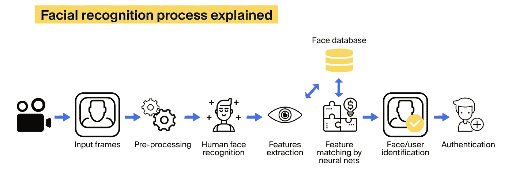
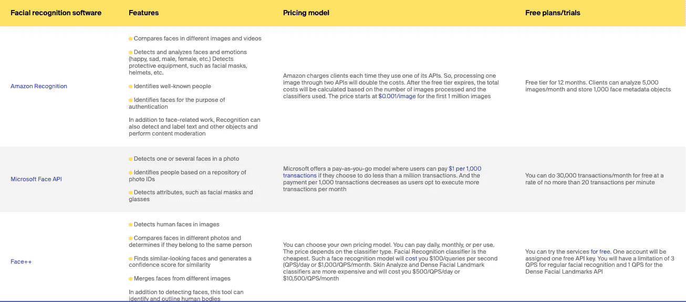
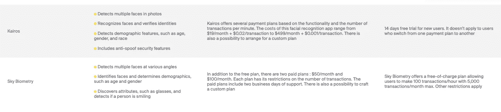

# 一个面部识别系统要花多少钱

> 原文：<https://medium.com/geekculture/how-much-does-a-facial-recognition-system-cost-b785d83f73d?source=collection_archive---------15----------------------->

在面部识别系统的帮助下，联邦特工可以抓获一名涉嫌虐待的男子。该工具在别人在健身房的照片背景中检测到了他，在镜子中。因此，特工们得以进入健身房，询问该男子的情况，并最终将其抓获。

这个现实生活中的故事，以及许多其他故事，鼓励企业从[人工智能服务](https://itrexgroup.com/services/artificial-intelligence/)中受益，并部署面部识别系统。

据估计，全球面部识别市场规模在 2020 年[为 38 亿美元](https://www.marketsandmarkets.com/Market-Reports/facial-recognition-market-995.html)，预计在 2025 年将达到 85 亿美元，CAGR 增长率为 17.2%。然而，面部识别软件的成本很难估算。公司往往会忽略一些隐性支出，结果会超出预算。

这篇文章分析了影响总价的因素，并给出了减少开支的建议。那么，一个面部识别系统要花多少钱？

# 什么是面部识别系统，它是如何工作的？

面部识别系统[被认为是生物识别形式中最可靠的](https://www.ncbi.nlm.nih.gov/pmc/articles/PMC7013584/)，比如指纹和虹膜识别。但是这项技术有它的挑战。面部识别过程通常发生在具有可变照明条件和动态背景的不受控制的环境中。影响识别质量的其他因素包括面部表情、个人年龄和种族。面部识别系统由五个主要部分组成:

*   **硬件:**包括负责捕获图像的服务器和设备
*   **连接技术:**允许硬件设备将图像传输到云或本地的其他设备，以供进一步分析
*   **面部识别软件:**一种生物识别工具，从图像中提取人脸，并将其与现有的人脸数据库进行匹配，以进行身份识别
*   **面孔数据库:**身份的集合，比如员工数据库或社交媒体图像中心
*   **客户端网络/移动应用:**用户可以查看结果的界面

面部识别系统是如何工作的:

检测到一张脸后，面部识别软件会读取面部几何图形，其中包含大约 80 种不同的元素。关键特征包括两眼之间的距离、眼窝深度、颧骨形状和下颌线长度。当分析完成后，该工具将生成一个面部签名作为数学公式，并将它与库中的其他面部进行比较。

根据[国家标准与技术研究院(NIST)](https://pages.nist.gov/frvt/reports/1N/frvt_1N_report.pdf) 最近的一份报告，面部识别算法的平均错误率为 0.08%，高于 2014 年的 4.1%。

面部识别系统在不同行业有许多令人兴奋的[应用](https://itrexgroup.com/blog/facial-recognition-benefits-applications-challenges/)。这项技术的一个简单例子是谷歌照片中的照片标签，这家科技巨头将一张照片中的人脸与预先存在的上传照片数据库进行比较，以识别用户。

# 哪些因素会影响面部识别系统的价格？

# 五金器具

公司需要仔细考虑他们的硬件选择，以避免对他们的设备无法处理的软件解决方案抱太大希望。但与此同时，公司不应该为他们不会使用的计算资源支付过高的价格。为了拥有一个工作的面部识别系统，你需要采购摄像头、开关、数公里长的电缆和用于数据存储和处理的服务器(除非你打算使用云)。所有这些实用程序都会增加你的面部识别系统的价格。

**相机选项**

摄像机类型及其位置取决于所需的覆盖范围、图像质量和视角。例如，如果设备需要捕捉一米开外的人，建议使用 3-8 毫米镜头的相机。检查要安装摄像机的位置。在光线不足的情况下，选择具有内置功能的设备，这些功能可以补偿光线不足，并仍然可以产生面部识别软件可以处理的图像。此外，一些面部识别算法[需要 3D 摄像头](https://hcis-journal.springeropen.com/articles/10.1186/s13673-018-0157-2)。你可以考虑购买预装计算机视觉软件的相机，它可以完成预处理和人脸检测等任务。这种安排将减轻您的自定义面部识别软件的负担，从而提高其速度。这种相机每台售价 100 美元。这里有一个这样的小工具可以做什么的例子:

**硬件配置**

没有适合每一个面部识别任务的标准硬件配置。因此，组织需要仔细考虑他们的需求。如果选择的格式不够强大，将会导致延迟和质量下降。让我们假设手头的任务是识别一个在摄像机前摆姿势的人。为了实现这一点，我们需要两个神经网络模型——人脸检测器和人脸识别器。我们每秒可以处理大约六帧。根据这些要求，人们可以使用低成本的图形处理单元(GPU)，甚至中央处理单元(CPU)就足够了。然而，如果我们通过跟踪人们的轨迹和行动甚至增加摄像头的数量来使这项任务变得复杂，我们将不得不采购更强大和更昂贵的 GPU。

# 面部识别软件

市场上有不同类型的现成面部识别软件。这些工具的功能和定价模式各不相同。这里有几个例子可以帮助你估算现成的面部识别软件的价格:

您可以看到，不同的供应商提供不同的定价安排，允许客户根据每月计划的交易数量、图像处理速度和使用的分类器来选择合适的模型。

需要注意的是，上面提到的人脸识别软件成本只包括订阅费，这只是总费用的一部分。面部识别解决方案供应商允许客户公司使用他们的 API，但您仍然需要将它们集成到您的系统中。您可以求助于定制软件供应商来促进集成并构建客户端应用程序，这使您能够获得面部识别软件的全部好处。例如，集成一个只做人脸检测和识别的工具将花费你至少 3000 美元，这个数字将随着面部识别解决方案的范围而增加。

您可能还需要额外的功能，例如增强的安全性或敏感应用程序的本地存储，您不能冒险将数据传输到供应商的云系统。[计算机视觉开发公司](https://itrexgroup.com/services/computer-vision/)可以帮助您构建额外的功能层，以补充现成的面部识别解决方案。例如，作为一个大型项目的一部分，我们开发了一个反电子欺骗的微服务，作为客户端应用程序和面部识别软件 API 之间的中间件。这种微服务的成本约为 10，000 美元到 15，000 美元，包括开发、培训和部署费用。

所以，你最终的面部识别软件费用将会累积上述所有费用。仅仅关注软件供应商的许可价格可能会产生误导。

如果您想快速推出产品并避免在基础设施上花钱，现成的解决方案是一个很好的选择。如果您想要一个具有特殊要求的解决方案，请考虑医院的面部识别系统，有些人戴口罩，有些人不戴。那么最好投入资源来构建和训练一个定制的面部识别工具。

# 连接要求

如果一家公司在遥远的地方运营，不同的通信对象相距甚远，您需要建立一个可靠的通信通道。这种高质量的电缆甚至比服务器和相机还要贵，将占面部识别系统总成本的很大一部分。

降低连接带宽要求的一个技巧是将负责视频预处理的服务器安装在摄像机附近。在这种情况下，服务器将分析流，提取感兴趣的图像，并将其进一步传输到主服务器，而不是传输整个视频。如果对响应性和稳定性没有严格的要求，这种配置甚至可以在多个摄像头的情况下以每秒 1-2 Mbit 的速度运行。

# 你的面部识别解决方案的复杂性

从逻辑上讲，你想包含的功能越多，价格就越高。一些现成的解决方案，如 Face++根据使用的分类器来设定价格，越复杂的分类器越贵。

这同样适用于定制的面部识别解决方案。该系统可以包括分类器，例如人脸检测、人脸验证、人脸分组、相似人脸搜索等。你积累的模型越多，花费就越多。但是分类器的数量只是影响复杂性的几个属性之一。其他参数包括解决方案的可扩展性、正在处理的图像数量、安全性要求、可用性和容错能力。

一个简单的解决方案，仅仅计算一张图片中的人脸数量，需要几天的时间来构建和训练。开发这种类型的面部识别应用程序的成本约为 1000 美元，而更复杂的面部识别工具可能需要数万甚至数十万美元。

这是一个相当复杂的面部识别系统的例子。一家总部位于美国的企业风险管理公司与 ITRex 合作开发了一个全面的[生物识别网络安全解决方案](https://itrexgroup.com/case-studies/biometric-based-solution-delivers-next-level-enterprise-cybersecurity/)，根据人们独特的面部特征来识别他们。我们的团队选择了 Microsoft Face API 来交付一个具有多种功能的解决方案。由此产生的系统为所有用户组设计了基于生物特征参数的网络凭证，包含反电子欺骗措施，提供了安全的数据传输通道，并拥有可由第三方软件使用的专有网络安全协议。它还在高负载云环境中运行，包括支持轻松扩展和变更实施的微服务。

这种面部识别解决方案的相关成本很可能超过 50 万美元。

# 从长远来看，如何将面部识别系统成本降至最低？

系统复杂性直接影响面部识别软件的成本。您可以花费几千美元部署一个功能有限的工具，而高度复杂和安全的解决方案将花费您高达 100 万美元甚至更多。经营地点也会影响总价。如果你需要调查拥有数百台摄像机的大型仓库，硬件成本将成为你支出的一大部分。但是，即使是复杂的解决方案，您也可以提前计划，以确保分配的预算得到明智的使用。不要错误地选择了一个更便宜的工具，结果花在安全罚款上的钱比你在软件本身上节省的钱还多。这些罚款可能相当高。不久前，美国著名的面部识别公司 Clearview AI 因在收集英国公民的公开照片并将其用于训练数据集时未获得同意而被英国[处以 1700 万英镑的罚款](https://www.theguardian.com/technology/2021/nov/29/us-facial-recognition-firm-faces-17m-uk-fine-for-serious-breaches-clearview-ai)。

这里有几个小贴士可以帮助你做出划算的决定:

*   如果您有标准要求，并且希望在几天内就能启动并运行，而不需要在基础架构上花费太多，请选择现成的解决方案。但是，如果您有独特而复杂的要求，那么最好投资定制面部识别解决方案。
*   投资于您系统的安全性。如果你最喜欢的现成解决方案没有提供任何可靠的选项，你可以[雇佣一个定制软件开发供应商](https://itrexgroup.com/)来构建一个反欺骗中间件和额外的安全特性。此外，请确保您熟悉所在国家的数据保护法。
*   如果你决定自己提供一个训练数据集，或者和你的供应商一起合成，那么就做[消除偏见](https://itrexgroup.com/blog/ai-bias-definition-types-examples-debiasing-strategies/)。许多开源数据集倾向于白人男性群体。所以，确保你使用的数据忠实地代表你的目标人群。不要购买能力和存储容量都不足以满足当前需求的硬件。为估计误差和可能的业务扩展留有余地。此外，随着面部识别软件的更新，它可能会变得更加苛刻。
*   满足您当前需求的能力。为估计误差和可能的业务扩展留有余地。此外，随着面部识别软件的更新，它可能会变得更加苛刻。

综上所述，面部识别软件所需的钱数取决于多重因素。如果你能把它们都考虑进去，你会对你的预算能得到什么有一个更现实的感觉。不要把自己局限在市场上能买到的东西上。如果您有相当具体的需求，请向定制软件开发人员寻求定制的解决方案。

> *考虑部署面部识别系统？* [*取得联系！*](https://itrexgroup.com/contact-us/) *！ITRex 计算机视觉专家将帮助您集成选定供应商的 API，构建客户端软件，如果需要，甚至可以开发定制的面部识别应用程序。*

*原载于 2022 年 2 月 24 日 https://itrexgroup.com***。**