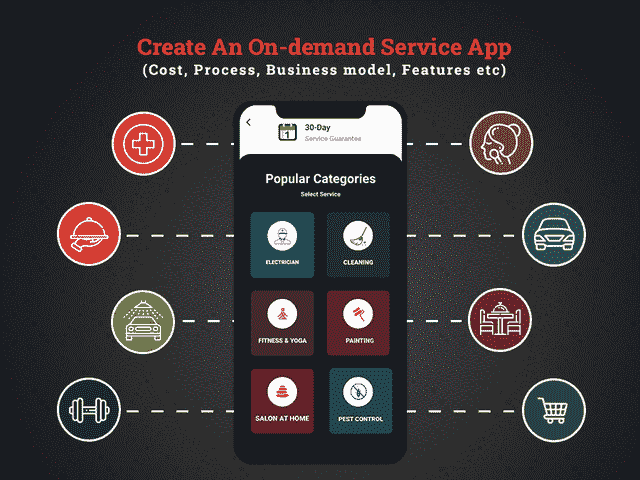
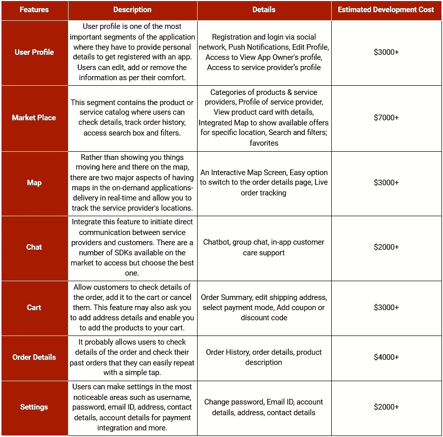
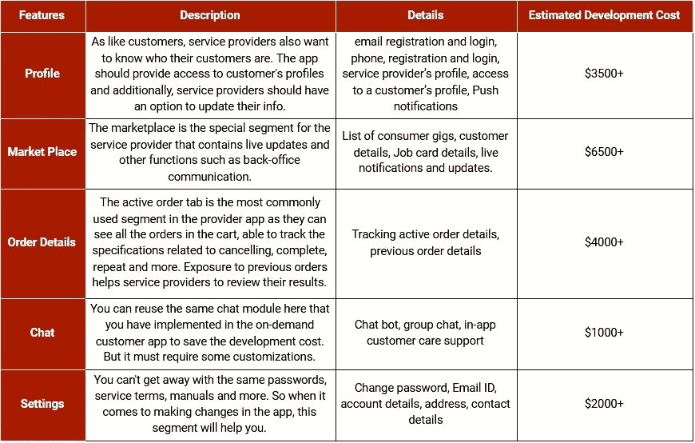

# 开发一个按需服务应用需要多少成本？

> 原文：<https://medium.com/geekculture/how-much-does-it-cost-to-develop-an-on-demand-service-application-81c56469261d?source=collection_archive---------13----------------------->

## 寻找按需应用程序开发服务？这是让你的商业投资在一个月内翻倍的唯一经验法则！但是怎么做呢？看看这个博客，几分钟内就能得到你所有的答案。

Image Source: [Dribble](https://dribbble.com/mamtas2010) by [Mamta Singh](https://dribbble.com/mamtas2010)

> **我们能否称之为按需服务应用开发解决方案——2022 年数十亿美元的未来商业理念？**

*是的，为什么不呢！*

通过提供根据现代客户需求定制的服务，按需经济迅速取代了传统商业模式，毫无疑问，按需服务应用为企业提供了一个充满希望的未来。按需服务应用所占领的市场正在逐步扩大，预计在不久的将来会异常增长。

根据这些报告，美国成年人口总数的 42%，即 8650 万美国人，至少使用过一个按需创业公司的服务。像优步和 Airbnb 这样的初创公司是这个行业的巨头，在塑造美国按需经济方面发挥了重要作用。

> 但是等等，是不是说接入点播市场更容易了？
> 
> 在这个不断升级的市场中获得入场券的简单方法是为您的企业配备按需服务应用程序开发解决方案！

但是，为您的企业开发一个按需服务应用程序需要多少成本呢？在互联网上进行随机搜索时，一家软件开发公司可以声称你开发一个仪表板管理应用程序需要 10，000 美元以上，但真正的估计远不止这些。

因此，为了帮助您了解按需经济是如何发展的，以及您如何利用这些机会、现实生活中的例子等来使您的企业受益，我们起草了这篇博客，其中包含了帮助您朝着正确方向前进的所有重要信息。

## 以下是开发按需服务应用的重点:

*   *捕捉昨天、今天和明天的市场趋势*
*   *初创企业如何通过按需服务应用促进业务增长？*
*   *成功的按需业务 App 的结构*
*   *创业公司按需服务 App 开发成本明细*
*   *点播 App 入门:你想成为什么？*
*   *拓展非需求业务的技巧*

> 让我们深入了解每一点的细节:

## **1。捕捉昨天、今天和明天的市场趋势**

从投资者的科学角度到按需服务应用的经济阶段，我们收集了一些市场数据，可以帮助你理解按需经济的概念，以及它如何成为一个大泡沫，并将在不久的将来破裂。

在摆弄了各种研究和调查报告之后，我们找出了一些事实，并以一种非常寻求的方式呈现出来:

> **按需经济的事实和统计**

*   根据 Burson-Marsteller 的按需经济调查，4500 万美国人提供了按需服务。
*   市场报告称 [64%投资了按需服务的人](https://www.burson-marsteller.com/press-release/forty-five-million-americans-say-they-have-worked-in-the-on-demand-economy-while-86-5-million-have-used-it-according-to-new-survey/)希望他们的财务状况在未来几年有所改善。
*   根据 [Intuit 的调查报告](https://www.linkedin.com/pulse/how-on-demand-economy-reshaping-40-hour-work-week-alex-chriss)，70%的按需工作者对他们的工作感到满意。
*   在按需经济中，81%的员工计划在下一年继续与同一家供应商合作。
*   在这种经济环境下，46%的人说他们更喜欢在按需经济环境下工作，因为它很灵活。
*   根据这些报告，2014 年以按需服务起家、资金为 740 亿美元的创业公司，在 2017 年已经达到 102.93 亿美元。
*   根据普华永道的报告，到 2025 年，按需移动应用和网站的市场价值预计将达到 3350 亿美元。

> **用户在点播服务上的花费**

*   美国消费者在按需经济中花费了 576 亿美元。
*   报告称，60%的美国用户愿意支付额外费用，以便同时将材料送到他们的住处。

> **简而言之:**整个场景描绘了一个强有力的迹象，即希望投资按需移动应用开发服务的企业，如果得到精心开发的按需服务应用的支持，将很容易赚钱。

## **2。初创企业如何通过按需服务应用推动业务增长？**

如果你能理解这些统计数据，那么你一定在寻找方法让你的创业受益。

让我们简单地了解一下，按需服务到底是什么，它是如何工作的，以及它如何使您的业务增长翻十倍…

*   **了解按需服务 App 的概念**

简而言之，按需应用的设计要考虑用户的舒适度。它允许用户订购任何产品或服务并送货上门。无论是食物，驾驶，清洁服务，汽车加油，清洗，酒吧管理，沙龙管理，音乐流媒体或任何你可能想到的。其实任何一家手机 app 开发公司都可以给你讲解，帮你做 app 开发解决方案。

推出按需应用的基本概念是分析用户群、他们的需求，并通过按需移动应用弥合差距。

*   **为什么按需服务应用成为市场的新亮点？**

优步时代向初创公司发起了移动优先体验的浪潮，令人惊讶的是，2017 年增长了 58%。

*它越来越受欢迎背后的一些推动原因是:*

— **快速访问产品和服务:**用户几乎可以从任何地方订购任何服务或产品，只需在屏幕上轻按几下。他们需要的只是一个良好的互联网连接。

— **更好地控制服务:**按需应用程序集成了交互式地图功能，允许客户跟踪产品和服务的交付情况。地图的可用性，提供了更好的控制，同时也让事情变得更加舒适。

— **应用内支付网关:**使用按需支付网关，用户可以通过额外的安全层访问多种支付选项，因此他们可以放心地进行即时支付。

*   **按需服务 App 如何帮助创业公司实现业务增长？**

—尽管按需应用随处可见，智能手机用户 90%的移动时间都花在了应用上，但将你的想法变成现实，迅速成为这个蓬勃发展的行业的一部分是有意义的。

—通过使用现有的应用克隆，按需应用可以快速启动，并允许您瞄准更大的市场份额。

—您可以成为业务的主导者，并通过按需应用程序更好地控制服务、产品和管理。

—作为独立承包商，您可以定义自己的工作时间，并且可以轻松地从事兼职或全职工作。

—客户对服务的评级和反馈，使您能够在用户中建立信任。

希望有了这个基线，你已经理解了它们如何帮助你成长，以及为什么现在开始使用按需应用程序是有益的。但是，除非你不知道为你的企业开发一个成功的随需应变应用程序的结构，否则仅仅拥有这些内容的丰富知识并不能使你成为这个行业的主要领导者。

## **3。成功的按需业务应用的结构**

在您着手应用程序开发解决方案之前，定义您希望创建的按需应用程序结构以及您的目标受众是有意义的…

*让我们以一款送餐应用为例。您的目标受众将是上班族、单身汉或老年人，他们可能会寻找特定的食物，但无法自己做饭。*

而如果你选择聘请软件开发人员，开发像 Instacart 这样的按需送餐应用程序会变得容易得多。但是，如果你正在开发任何其他按需服务或交付应用程序呢？在构建按需应用程序时，你需要记住这款应用的几个特征。

> **开发成功的按需交付应用的重要特征**

*   你的产品或服务必须价廉物美，才能击败你所在领域的行业领导者。
*   请确保您选择开发面向 Android 和 iOS 的按需应用程序，并在您的应用程序中注入尖端技术，以保持未来的领先地位。领先的跨平台框架如 Flutter 或 React Native 可以被认为是谷歌和脸书的产品，所以他们未来还有很长的路要走。
*   确保您的服务需要灵活，并且与用户的需求相关。最终用户应该很容易适应。
*   您的应用程序开发有一个独特的功能列表和基本功能，以便用户发现它有用，容易和舒适的访问。
*   评级、评论和反馈是按需应用的重要组成部分。让用户更容易对你的品牌建立信任。

有许多现实生活中的创业公司通过简单地遵循这条经验法则就获得了巨大的成功。从双方来看，这是一个双赢的解决方案，允许初创公司进入更广阔的市场，并让交付服务更快地扩大用户群。

现在，您知道它是什么，它如何帮助您发展业务，以及按需业务应用的成功秘诀。现在，你一定在想开发一个按需服务应用程序需要多少钱。

## **4。创业公司按需服务应用开发成本明细**

在您直接深入按需应用程序的成本细分之前，您需要知道成本估计主要取决于应用程序的三个面板——客户、服务提供商和管理员。或者你可以称之为你的按需服务 app 的三大支柱。

所以，在你考虑雇佣移动应用开发者之前，让我们仔细看看按需服务应用的这三个主要组成部分。这里，我们将重点介绍客户面板、管理面板或应用程序所有者的一系列功能。

> **面向客户的应用程序开发成本约为 19，000 美元以上！**

以下是对这种面向客户的应用程序开发成本有所贡献的特性和主要元素:

> **开发应用程序服务面板的成本为 15，000 美元以上！**

你们中的许多人都想知道，这整个游戏围绕着客户的按需应用程序。然而现实是，没有服务提供商面板，任何按需服务应用都无法工作。

> **开发按需服务应用程序管理面板的成本约为 15000 美元以上！**

尽管有一个单独的客户和服务提供商面板，但您需要一个超级管理员来监控应用程序的所有层次结构，并确保它顺利工作。你只需要雇佣一个跨平台的应用程序开发公司，帮助你建立一个超级灵活的管理面板来跟踪一切。通过管理客户、服务提供商、交付、支付整合等，该应用程序的管理面板在您的应用程序上添加了额外的监控层。

开发随需应变应用程序的管理界面的估计成本大约为 20，000 美元以上！

## **5。按需应用入门:你想成为什么？**

现在，您已经知道了开发一个随需应变应用程序的基本结构、需要集成哪些功能以及开发成本。但是，如果您不确定您的企业需要什么类型的应用程序，那么所有这些对您来说意味着什么。

以下是你可以考虑在 2022 年开发的几个按需服务 app 开发思路:

> **汽车行业按需 App 开发思路**

正在寻找新商机以将交通运输业务提升到新高度的人们可以看看这些出色的应用程序开发创意:

*   按需供油应用程序
*   汽车清洁保养 App
*   汽车维修应用程序
*   上门修车 App
*   按需洗车 App
*   按需订车或租车应用
*   按需叫车应用
*   按需出租车预订服务应用

> **2022 年按需餐饮 App 开发思路**

*   按需送餐应用
*   按需餐厅和酒吧管理应用
*   面向餐厅的按需订餐应用
*   按需送餐和预订应用程序
*   定制食品交付应用程序
*   按需酒吧管理应用
*   减肥食品配送应用

> **2022 年医疗行业 App 思路**

*   按需送药应用
*   按需大麻交付应用
*   提前预约医生应用程序
*   在线医生咨询 App
*   应用内健康和健身追踪应用

> **美容美发行业的按需应用创意**

*   沙龙管理应用程序
*   沙龙预订和客户管理应用程序
*   一款面向理发师的应用
*   美容师的应用程序
*   沙龙库存管理的按需应用程序

虽然有各种各样的其他应用程序想法可以很容易地转化为业务增长解决方案，但请确保您外包了最好的软件开发公司，该公司拥有技能和资源，可以准确无误地完成这项工作。

## **6。发展非需求业务的技巧**

您一定想知道，按需应用程序逐渐增长背后的成功秘诀到底是什么。为什么他们的顾客对他们的品牌如此忠诚？公司如何通过提供特定的服务来满足客户的需求，让他们感到满意和舒适。

> **这里有一些见解可以帮助他们为他们的应用程序留住更长时间的客户:**

*   **提供卓越的客户支持**

随着市场上数以百万计的应用程序和数以千计的选项的出现，客户首先寻求的是对他们的查询和投诉的超级快速和友好的响应。确保你的应用程序拥有基于人工智能的聊天机器人，为客户提供 24*7 的无缝支持。

*   **为您的客户提供特别优惠**

如果客户在你的应用上获得任何特殊优惠、折扣、礼品或优惠券，他们会更愿意再次使用你的应用。这些特别优惠可以通过忠诚度计划来实现，这些计划会在下次使用你的应用程序购物时进一步召唤他们。

*   **确保无缝用户体验**

为了吸引用户的注意力，并让他们更长时间地使用你的应用程序，通常，初创公司更喜欢雇佣跨平台的应用程序开发人员来定制具有出色 UI 的应用程序。

*   **添加导航提示**

不同类型的用户会使用货物交付应用程序，因此为轻松的购物体验提供导航是有意义的。

# **结论**

开发按需服务应用程序已成为组织的新趋势，但您需要采取平衡的方法才能在竞争激烈的市场中取得成功。考虑到这个行业的所有增长数字，你的按需交付应用程序的成功是有保证的。

如果总结按需服务应用程序开发的总成本，那么它可能在 40，000 美元到 50，000 美元以上，甚至可能超过这一数字，具体取决于您选择集成到其中的特性和功能。然而，初创公司也可以从 MVP 开始，随着用户群的增长，逐渐扩大业务规模。

至于最终的成本估算，你可以雇佣一家移动应用开发公司，因为他们有一个专家团队来分析你的商业想法，并相应地为你提供估算。此外，如果你发布了博客中提到的任何应用程序想法，那么你可以放弃对评估的查询。我希望这篇文章让您清楚地了解了哪些因素导致了随需应变应用程序的总体开发成本。