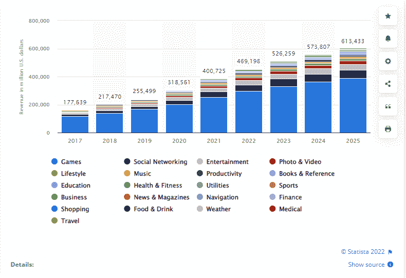
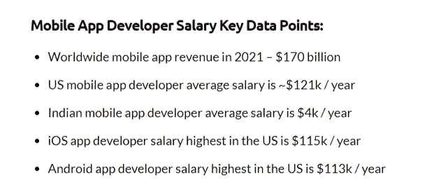
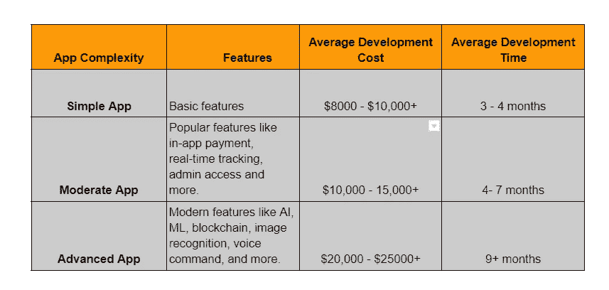

# 2022 年雇佣一个 App 开发者需要多少钱

> 原文：<https://medium.com/geekculture/how-much-does-it-cost-to-hire-an-app-developer-in-2022-eaaccecdbd9c?source=collection_archive---------15----------------------->

2022 年雇一个 app 开发者要多少钱？如果你打算创建一个移动应用，这最终会是你想到的第一个问题。但是，回答这个问题很像买新车。你在购买新车时评估多个因素的方式，同样，有各种各样的事情影响着应用程序开发人员的每小时成本。

最终，底线是了解移动应用程序开发需要多少总体预算，以及你愿意为雇用应用程序开发人员支付多少费用。

随着数字化趋势的不断增强，许多企业正在为其业务的数字化铺平道路，但仍然对计算 2022 年雇佣一名应用程序开发人员的成本感到困惑。大多数时候，这是因为他们不清楚自己想要在移动应用中包含什么。他们是否想从头开始构建一个应用程序，或者他们想在应用程序中包含什么集成，他们必须做出决定。

也就是说，有一个熟练的应用程序开发人员将你的商业想法变成现实是很重要的。但如果你想知道在 2022 年雇佣一名移动应用开发者需要多少钱，那你来对地方了。

这个博客将为你提供 2022 年雇佣一个应用开发者的完整细节。在你继续下一步之前，这里是博客的主要亮点:

*   *为什么你的企业需要雇佣一名移动应用程序开发人员
    -雇佣应用程序开发人员与雇佣内部应用程序开发团队*
*   *雇佣一个 App 开发者需要多少钱？
    -2022 年影响雇佣应用开发者成本的因素*
*   *雇佣移动应用开发者的基本参数
    -雇佣移动应用开发者前要问的 10 个重要问题*
*   *结论:雇用一名预算不足的应用程序开发人员*

为了更好地理解，让我们深入挖掘每一点。

# **为什么您的企业需要雇用一名移动应用程序开发人员？**

在这个技术驱动的时代，平均而言，每个智能手机用户 90%的移动时间都花在了移动应用上。因此，推出一款 app 成为商家迫切而重要的需求。此外，Statista 强烈预测，到 2025 年，移动应用程序开发行业将产生 6130 亿美元的收入，这显然为企业带来了潜在的机会。

[Image source](https://www.statista.com/forecasts/1262892/mobile-app-revenue-worldwide-by-segment)

为了成为这个蓬勃发展的行业的一部分，全球各地的企业都在将其转变为数字解决方案。然而，开发一个应用程序总是一项具有挑战性的工作。

这就是他们需要雇用移动应用程序开发人员的地方。但你们中的许多人都陷入了两难境地，不知道是雇佣一个应用开发团队还是雇佣一个内部团队。

想知道什么是正确的方法？两种选择都有各自的限制和好处。你要做的就是了解自己的需求，做出明智的决定。

## **雇佣应用开发人员与雇佣内部应用开发团队**

当你打算创建一个移动应用程序时，你需要首先决定你是需要外包一个移动应用程序开发团队还是想要雇佣一个内部团队。因为主要的选择取决于雇佣一个程序员来开发一个应用程序的成本问题，所以让我们来理解每种雇佣模式会对你产生怎样的影响。

近年来，移动应用程序开发服务占据了中心舞台。企业见证了其风险投资的稳步增长。但随着人工智能、人工智能或物联网等应用开发行业的新兴技术的出现，有必要与一个帮助你更快发展的团队一起开始你的项目。

由于应用程序开发是一个需要深入实践和严格遵守期限的过程，因此，雇佣一个聪明的、从多个项目的经验中学习的应用程序开发人员是有意义的。现在来比较一下在成本方面会对你产生怎样的影响。

假设你决定在内部开发一个应用程序。在这种情况下，你肯定会省下一大笔最初雇佣应用程序开发人员的费用。但是，如果由于缺乏经验，您未能在截止日期前完成任务并继续修复 bug，该怎么办呢？

有了一个内部开发团队，如果你决定雇佣一个最好的应用程序开发公司，你实际上可以得到它的价格。

外包应用程序开发团队的最大好处是，他们具有成本效益，确保更快的上市时间，并且胜过你的专业竞争对手，因为他们有一个努力满足期限的熟练工程师团队作为支持。

除此之外，他们处理来自不同地区的多个项目，所以他们知道什么是技术趋势，什么最适合你的项目。

如果你问雇人开发一个应用程序要花多少钱，那么我们只能提供一个估计。因为每个应用程序开发流程都涉及不同的变量，这些变量最终会影响雇用应用程序开发人员的成本，幸运的是，你们中的许多人更喜欢尝试应用程序开发预算生成工具来确定雇用 iOS 应用程序开发人员的平均成本。

在你相信这些估计之前，你应该知道移动应用开发成本到底是由什么组成的。哪些参数会影响雇佣应用程序开发人员的成本？项目需求的每一个变化都会对雇佣专家的成本产生巨大的影响。

# **雇佣一名应用开发者需要多少钱？**

在不知道规格的情况下估算任命一个开发人员的成本就像是向专家提出一个无效的问题。如果你很好奇聘请专家的价格，那么你应该了解影响聘请程序员成本的参数。

## **2022 年影响雇佣应用开发者成本的因素**

进入影响应用程序开发人员每小时工资的因素将是非常复杂的，因为有许多事情需要你去评估。为了理解这些因素如何影响开发人员的每小时成本，我们需要深入挖掘。

> **A .确定开发人员的资历(资质和技能水平)**

当开发一个应用程序时，资格和技能是最重要的。他们拥有的技能和资格越多，每小时的成本就越高。如果你试图雇佣一个开发团队来完成应用程序开发的多个阶段，那么这会显著影响开发人员的每小时成本。所以当你招聘专家时，他们的技能和资格会影响每小时的成本。

> **B .开发商的经验和专业知识**

任何应用程序开发公司都可以为你提供招聘不同资历的专业人士的机会。但是他们在领先技术方面的流利程度，如 Flutter、React、Xamarin 等，会对您的项目质量产生巨大的影响。

因此，当谈到了解雇用一名 React 本地开发人员的成本时，资历水平是影响专家价格的另一个关键因素。

无论你的项目需求有多复杂，应用的成功总是在于专家如何将想法转化为现实。让我们来看看什么资历水平适合你的应用程序开发需求。

*   **初级开发人员**

作为行业新手，初级人员能够处理简单而轻松的开发任务。他们有编程语言的基础知识，可能有一些流行框架的经验。

他们还了解如何使用常用的 API，因此根据项目需求创建新的 API 对他们来说有点挑战性。应用程序开发人员每小时的成本很大程度上受你在哪里雇佣他们的影响。

通常，初级或见习开发人员的每小时成本从 10 美元到 25 美元以上开始。

*   **中级 IT 专业人员**

需要开发简单 app 的企业可以选择聘请有 3 到 5 年经验的中级开发人员。由于这些专家已经参与了许多项目，中级 IT 专业人员拥有使用多个数据库管理系统的技能。

但是他们对基本 API 有深入的了解，并且能够同时管理多个任务。根据知识的不同，中级开发人员的每小时成本从 12 美元到 50 美元不等。

*   **经验丰富的高级开发人员**

如果你是一个期待构建一个集成了高级功能的成熟应用程序的人，你会更喜欢雇佣经验丰富的开发人员。这些专业人士经验丰富，能够在任何类型的项目中做出有效的技术决策，同时确保您完全满意。

那么，雇佣一个有 5 年以上经验的 Android 应用程序开发人员到底要花多少钱？凭借多年的经验，他们可以解决复杂的问题，对编码有深刻的理解，并且能够运行复杂的测试。但是为了确定成本，你需要继续阅读更多的因素。但还是粗略估算一下，可以考虑从 35 美元到 75 美元+雇佣有经验的开发者。

> **C .应用开发者的地理定位**

应用程序开发人员的每小时成本主要取决于他们在哪里雇佣应用程序开发人员。应用程序开发人员的时薪很大程度上受该国生活水平的影响。

每个国家的居住地是一个需要考虑的重要因素，因为它包括税收和最低生活水平。为了方便您参考，我们总结了不同国家应用程序开发人员的平均工资。

[Image Source](https://www.businessofapps.com/app-developers/research/ios-android-developer-salary/)

如果你留意这些数据，你会发现美国被认为以最昂贵的时薪雇佣应用程序开发人员，而印度拥有最具竞争力的开发人员市场。但是在你以昂贵的价格雇佣一个专门的应用程序开发团队之前，请记住，昂贵的应用程序开发成本不会给你任何优秀质量的保证。

然而，以最低价格雇佣专家并不意味着获得廉价的高质量解决方案。你需要做的就是了解你的需求，然后雇佣最适合他们的应用开发者。

> **D .项目复杂程度**

雇佣程序员的成本也取决于项目的复杂程度、想法、设计、集成、特性和功能。应用程序开发技术、方法和阶段共同决定了开发一个应用程序需要多长时间，雇佣应用程序开发人员需要多少成本。

开发一个应用花费的时间越长，你任命一个应用开发者的预算就越高。总而言之，你需要理解你的项目的需求和它的复杂性。让我们看看不同类型的应用程序，以及它们的成本和构建时间。

> **E. Technologies**

任何应用程序开发人员的时薪可能会有很大的差异，这取决于您为应用程序开发选择的技术。在雇佣一个应用开发者之前，决定你是要构建一个原生应用还是跨平台应用？这两种操作平台都要求应用程序开发人员具备特定于平台的知识。

**下面是解释:**

*   **原生应用:**原生应用是为 iOS 或 Android 平台构建的，或者如果你试图同时面向两个平台，你可以选择创建两个原生应用。由于 Kotlin、Java、Swift 和 Objective C 是用于创建原生应用程序的特定语言，因此您需要雇用一名精通该语言的应用程序开发人员。

通常，雇佣一名 Android 应用程序开发人员的每小时成本在 15 美元到 25 美元之间浮动，而 Android 应用程序开发人员的每小时成本可能在 12 美元到 20 美元之间。

*   **跨平台移动应用:**基本上，这些应用是在单一代码基础上开发的，可以在多种设备上运行。通常，React Native、Flutter 或 Xamarin 是最常用的跨平台编程语言。

因此，如果你试图雇用 Flutter 开发人员，那么平均每小时的成本可能在 20 美元到 35 美元以上，而雇用 React 本地开发人员每小时的成本可能在 25 美元到 30 美元以上。

简而言之，这些是可以帮助你决定应用程序开发者的小时成本的几个主要参数。但是，如果我们总结所有因素，并尝试解释应用程序开发人员的平均每小时成本，那么它将在 20 美元到 75 美元之间，取决于他们的技能、经验、位置和应用程序的复杂性。

下一个主要问题是在哪里雇佣最好的应用程序开发人员？没有明确的术语来解释什么是最好的和最坏的。然而，有一些重要的参数可以帮助您缩小行业最佳应用程序开发人员的名单。

# **雇佣移动应用开发者的基本参数**

一旦你进入了应用程序开发人员的市场，你会很快对从哪里开始以及如何为你的项目选择合适的专家感到困惑。为了更简单，我们总结了在合作之前你应该问应用开发公司的 10 个最重要的问题。让我们开始游戏:

> **雇用专家前向移动应用开发公司提出的 10 个重要问题**

1.  *公司的投资组合有多多元化？*
2.  *他们对最新技术有什么专长和知识？*
3.  *在承接任何项目前，是否与客户签订 NDA 或安全协议？*
4.  他们的工程师有多少处理项目的技能和经验？
5.  *他们是否在全球范围内提供服务？*
6.  他们喜欢在哪个时区工作？
7.  他们的手机应用程序收费多少？
8.  *做一个 app 需要多长时间？*
9.  *app 测试方法有哪些？*
10.  他们能帮助你在市场上推出你的应用吗？

简而言之，这是几个最重要的问题，能让你以有竞争力的价格雇佣到最好的专家。你需要做的就是确定你的应用程序开发需求，并在雇佣应用程序开发人员时仔细评估这些因素。

## **结论:如何在预算之下雇佣一个手机 app 开发者？**

寻找并雇佣最好的应用开发者来开发你的商业应用是最有压力的任务之一。希望这篇博客指南能给你所有关于雇佣应用开发者的重要见解。

但是当你要知道雇佣一个应用开发者需要多少钱以及应用开发的预算时，你必须考虑开发团队的位置和应用的复杂程度。

这两点都会对整个 app 开发成本产生重大影响。虽然博客已经给了你一个按小时雇佣专家的估计，但是，如果你有任何具体的疑问或寻找专家，那么你可以在下面给我们一个问题。