# 做一个健身 App 要多少钱？

> 原文：<https://medium.com/geekculture/how-much-does-it-cost-to-make-a-fitness-app-468f238208a9?source=collection_archive---------13----------------------->

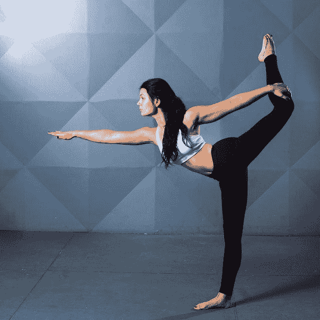

**文章摘要**

*   一个普通的健身应用程序至少要花费你 1 万到 15 万美元。这个估计没有考虑到复杂的自定义动画和补充技术的解决方案，如人工智能和计算机视觉。
*   健身应用程序的开发成本取决于应用程序的类型、功能、设计复杂性、与其他组件的集成、部署平台、开发团队的组成及其位置，以及您计划向客户提供的技术支持。
*   为了降低健身应用程序的开发成本，不要跳过发现阶段，遵循增量开发方法，尽可能自动化测试，并尽快将您的解决方案投入市场，以开始收集客户反馈并采取行动。

根据 GoodFirms 的说法，家庭健身制度是 2022 年的主要健身趋势。该组织进行了一项调查，发现 56%的受访者在家健身，40%的健身俱乐部采用混合健身模式。

随着越来越多的体育行业领导者转向[健身应用开发公司](https://itrexgroup.com/services/fitness-app-development/)带着他们的产品参与竞争，健身应用市场规模正在快速增长。2021 年[全球健身市场的价值约为 55 亿美元](https://www.researchandmarkets.com/reports/5012945/fitness-app-market-research-report-by-function?utm_source=BW&utm_medium=PressRelease&utm_code=rrkx27&utm_campaign=1439846+-+%2413%2b+Billion+Fitness+App+Market+by+Function+%26+Type+-+Global+Forecast+to+2025+with+Cumulative+Impact+of+COVID-19&utm_exec=chdo54prd)，预计到 2027 年将飙升至 254.5 亿美元，CAGR 增长率为 29.46%。

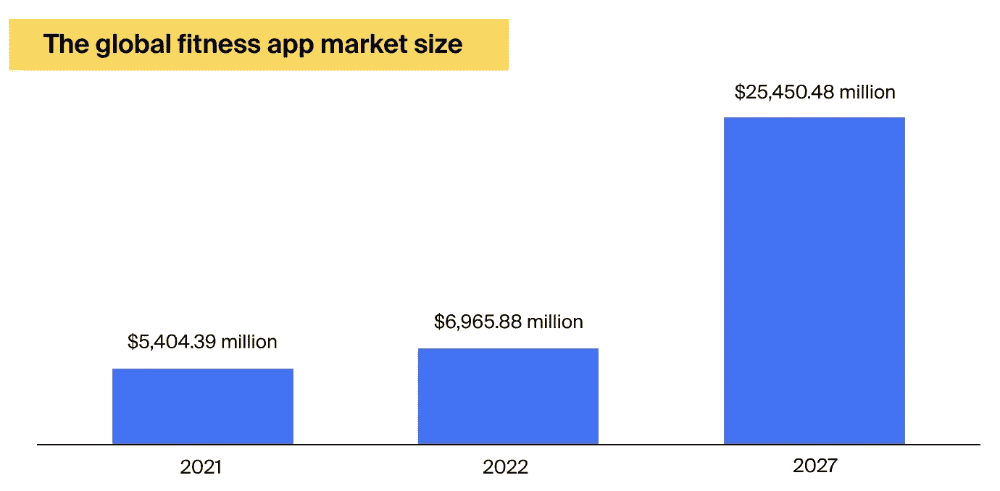

我们可以将这种快速增长归因于两个因素:

*   **新冠肺炎。自从疫情之后，人们开始重视自己的健康。他们更热衷于锻炼和建立免疫力。**
*   易磨损物品的增多。如今，市场上有各种各样的可穿戴设备。它们易于使用，并提供相当准确的生命体征和其他参数读数。

现在你大概确信有需求。但是这种健身方案的利润有多少呢？如果应用程序以方便的方式排列了所有必要的功能，并且看起来很有吸引力，这将是非常有利可图的。看看一些更受欢迎的健身应用程序的表现。

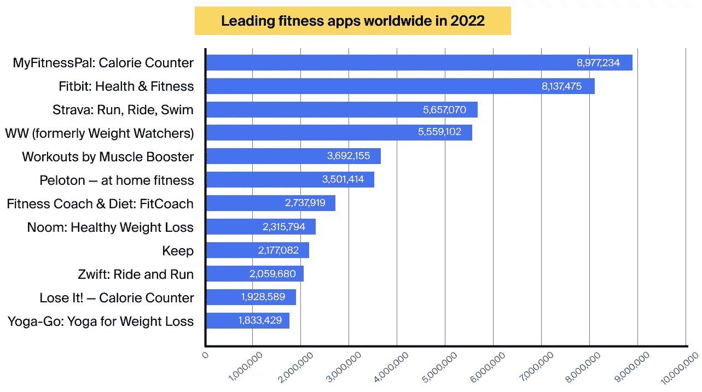

如果你有兴趣加入上述健身技术领导者，你将需要一个移动应用程序。本文将帮助你估算制作一款健身 app 的成本。

# 创建一个健身 app 需要多少钱？这取决于以下因素

影响健身应用开发成本的主要因素有七个:

1.  应用类型
2.  特征
3.  与外部组件集成
4.  设计复杂性
5.  平台和技术堆栈
6.  开发团队组成
7.  技术支持和更新

# 应用类型

## 锻炼应用程序

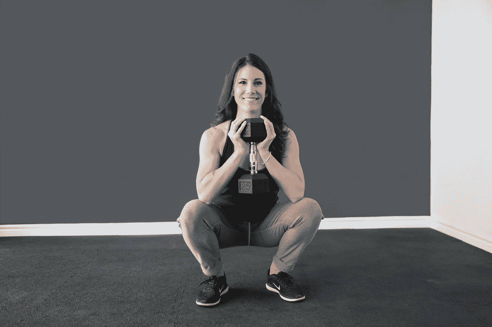

这种类型的健身应用程序使用户能够选择自己的锻炼程序。通常，应用程序上显示的锻炼方案不是定制的，但它们提供了每次锻炼的有用信息，如激活了哪个肌肉群以及燃烧了多少卡路里。这有助于用户做出明智的决定，并选择合适的锻炼纳入他们的日常生活。

一些锻炼应用程序就像健身教练一样，根据用户参数和期望的结果提供个性化的锻炼。一个这样的例子是在 25 个国家有 100 万次下载的 MyCoach 应用程序。

**这样的健身应用售价 6 万到 9 万美元。**

## 营养和饮食应用

均衡的饮食是保持健康的重要组成部分。营养软件使用户能够跟踪他们一天中消耗的食物，计算卡路里，并记录微量元素。一个例子是我的平板卡路里计数器。这种应用还可以基于用户的参数和目标(例如，减肥、锻炼肌肉等)来建议膳食计划。).

他们可以适应这个人目前的偏好——纯素食、素食、酮食、间歇禁食等。

另一种饮食应用侧重于社交网络，使用户能够与专业营养师联系，分享他们的食谱和成功故事。爱沙尼亚 Perpetio 开发的 Mealshare 应用程序就是一个例子。

**健身减肥应用售价 20，000-80，000 美元**

## 活动跟踪应用

这些健身解决方案跟踪您的身体活动，如每天的步数或跑步和骑自行车的距离和速度。一个例子是由 Runtastic 运行的阿迪达斯。活动监测应用通常连接到可穿戴设备，这些设备可以测量心率、血压和其他健康参数。

**开发这样的健身应用所需的成本:4 万美元——12.5 万美元。**

## 冥想和瑜伽应用

这套应用程序包含瑜伽锻炼，如何正确进入不同姿势的教程，并提供指导冥想练习等。一个例子是广泛使用的每日瑜伽应用程序，它包含 50 多个锻炼计划，允许用户连接到瑜伽社区，分享他们的经验，并获得灵感。

对于冥想和正念，用户可以尝试 Headspace，这有助于你在入睡前放松和清醒头脑。这个应用程序有超过 7000 万次下载。

**开发这种健身应用的成本:1 万美元到 7 万美元**

## 配套应用

有些应用程序是专门为一家健身设备供应商开发的。它们与设备连接并增强其功能。例如，Perpetio 开发了一款连接特定品牌跑步机的健身应用。该解决方案不仅可以跟踪用户在跑步机上的活动，还可以让他们进行交流，分享他们的表现指标，并参与不同的挑战。

**这类应用程序的成本从 4 万美元到 15 万美元不等。**

# 功能集

你的健身应用的价格很大程度上取决于它的功能。你想整合的功能越多，你需要投入的时间和金钱就越多，但你的应用也会变得越有价值。一些基本功能需要几个小时才能实现，如在社交媒体上分享，而其他功能可能需要几天时间，如用户注册。如果一个特性需要专门的技能来实现，那么它对价格的影响会更大。

以下是几乎所有健身软件解决方案都必须具备的核心功能列表:

*   **注册并登录。**你可能想让用户选择使用谷歌或其他账户注册。除了常规的用户信息，如姓名和年龄，您还需要包括特定于健身的字段，如体重和身高。此外，要求提供电子邮件和电话号码，以给出几个验证选项。如果用户使用密码保护他们的帐户，请让密码恢复选项随时可用。注册和登录功能将花费你**大约 4000 美元。**
*   **通知和提醒。这可以包括何时开始锻炼或何时切换到另一种锻炼的通知。如果你的应用程序连接到智能手表，你可以将通知重定向到那里。用户会发现，当他们感觉到手腕振动时，开始一组新的重复比看着手机屏幕更方便。设置通知和提醒将花费你**大约****1200 美元。****
*   **设置。**该功能允许用户自定义应用的外观和功能。因此，该应用程序需要有默认设置，以及给用户一个机会来调整它们，以添加个人风格。为你的健身应用建立设置功能将花费你大约 350 美元。
*   **锻炼目录**包含可实时播放或点播的锻炼视频。对于这项功能，您将支付大约 2000 美元。

如果你研究你的直接竞争对手，你会发现其他有用的功能，你可以纳入你的解决方案。你也可以发现一些你的竞争对手的应用程序所缺少的功能，并实施它来获得竞争优势。

您可以考虑以下高级功能来获得灵感:

*   与可穿戴设备集成。你可以将应用程序连接到智能手表或其他可以读取和传输用户数据的传感器。这项功能将花费您 3000 到 6000 美元。
*   融入创新技术，如[人工智能](https://itrexgroup.com/services/artificial-intelligence/)和[增强现实](https://itrexgroup.com/services/augmented-reality-development/)。这会显著增加你的健身 app 开发成本。例如，如果您想要添加一个针对用户行为进行培训的推荐系统，仅这一项就将花费您大约 20，000 美元，并且需要花费许多小时来标记训练数据集和训练模型。
*   将应用游戏化。游戏化意味着你的应用可以分配分数，衡量进步水平，分配奖励等。，任何让锻炼感觉像游戏或比赛的东西。将您的解决方案游戏化可能会花费您高达 12，000 美元。
*   整合社交媒体。如果你的客户是狂热的社交媒体用户，他们会喜欢这一功能，因为这将使他们能够与他们的网络分享他们的成就、个人记录、激励名言和锻炼的其他相关方面。你可以在社交媒体整合上花费 500-6000 美元，这取决于整合途径和渠道的数量。
*   日历，让用户安排他们的锻炼，甚至可以与朋友分享他们的锻炼日历，这样其他人也可以加入进来。这将花费你大约 3000 美元。
*   在线聊天和视频流功能，让用户一起锻炼。对于这个选项，你可以预计支付 15，000 美元。
*   教育材料，如来自专业教练的建议，相关文章的博客等。根据内容类型的不同，内容集成的费用从 1000 美元到 3000 美元不等。
*   地图和地理定位，这是活动跟踪应用程序的一个重要功能。它可以在地图上呈现用户的路线，甚至呈现天气预报和空气质量细节。这项功能的价格约为 5000 美元。
*   支付选项。也许整合现有的安全可靠的支付网关，如贝宝。给出几个选项将是有益的，这样用户就不会因为不能使用你的支付方式而抛弃你的应用。对于付款方式，预计支付 2000 美元到 3000 美元。

# 与外部组件集成

在构建产品时，您可能会选择集成第三方库，并与支付网关和 web 服务进行交互。例如，如果您想要收集客户反馈，有一个现有的代码可以完成这个任务。这将降低你的健身应用程序的开发成本，并缩短上市时间。

但是这种做法可能会暴露安全漏洞，并且你会因此而产生订阅费用。

您可能还需要将您的产品与外部设备集成，如可穿戴传感器或摄像头，以及现有平台，如社交媒体。对于其中一个集成，您可以支付 1，000 美元到 10，000 美元，具体取决于设备/协议是标准的还是定制的。

# 设计复杂性

您的解决方案的用户界面的复杂性和独特性直接影响到构建这款健身应用程序的成本。如果你只是想对现有的模板做一些小的调整，那么你的设计师可以在大约 30 个小时内完成工作。

但是如果你想建立一些有创意的、直观的、用户友好的东西，让你的品牌在竞争中脱颖而出，那么用户界面设计将是开发过程中的一大部分，可能会耗费超过 300 个小时。

您的设计复杂性随着以下因素而增加:

*   复杂动画
*   交互性
*   必须使用平板电脑、智能手表等。
*   添加语音助手
*   融入增强现实

下表显示了参数变化如何增加设计费用。

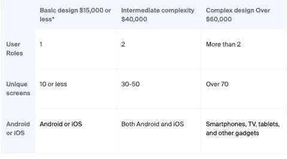

*价格是近似值

注意，你既需要吸引人的设计，也需要合理的速度。加载时间太长的动画会被鄙视多于欣赏。

# 平台和技术堆栈

如果你正在创建一个移动健身应用程序，有两个流行的平台——Android 和 iOS。如果你选择使用本机代码来构建两个独立的应用程序，这将增加你的平均健身应用程序成本，因为将有两个代码库。但是有些步骤你只需要做一次。例如，两个平台上的应用程序将有一个统一的设计和外观。

例如，两个平台上的应用程序将有一个统一的设计和外观。

除非你的应用特定于其中一个平台，否则选择使用 Flutter 和 Xamarin 等技术的[跨平台应用开发服务](https://itrexgroup.com/services/cross-platfrom-app-development/)是个好主意。有了这样的技术，开发人员将创建一个源代码，该源代码将被编译成不同平台的本机代码。这将使创建这两个应用程序所需的时间和精力减少 40%左右。但是这项技术可能不适合复杂的项目。此外，一些[认为](https://arateg.com/blog/how-to-create-a-mobile-fitness-app-and-how-much-it-cost)本地解决方案提供了更好的用户体验。

对于游戏化、图形复杂的跨平台开发，可以使用游戏引擎，比如 Unity 或者 Unreal Engine。

以下是跨平台、Android 和 iOS 应用程序开发服务的平均时薪，以供比较:

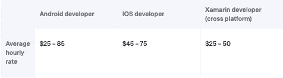

# #健身应用开发团队

为了开发你的健身应用，你要么组建一个内部专业团队，要么将开发外包给一个[专业团队](https://itrexgroup.com/services/dedicated-development-team/)。

*   **内部开发团队**允许你与成员保持可靠的沟通，但这是一个更昂贵的选择，因为你要负责招聘、租用办公室、购买设备等。雇佣一名应用程序开发人员可能需要花费 30，000 美元和 42 天的时间。你最终雇佣的人缺乏完成项目的基本技能，这种风险总是存在的。
*   外包开发过程是一种选择，你只需为完成的工作付费。不需要为租赁、面试、最后一分钟的替换和其他行政事务而烦恼。这种模式降低了构建健身应用程序所需的投资成本。

你也可以将两种方法结合起来，利用一个内部团队，将你内部无法胜任的专业技术外包出去。例如，您可以使用 [CTO 作为服务](https://itrexgroup.com/services/cto-as-a-service/)模型。

一个应用程序开发团队必须包括至少一名 UI/UX 设计师、QA 工程师、项目经理，当然，还包括能用本地或跨平台语言编码的程序员。你可以在我们的博客上了解更多关于[软件开发团队结构](https://itrexgroup.com/blog/software-development-team-structure/)和每个成员的角色。

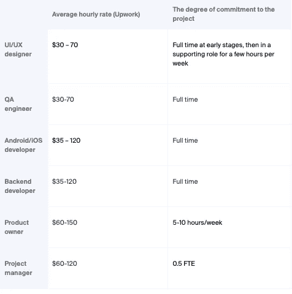

人才成本因地理位置不同而有很大差异。一些国家的薪资期望值比其他国家高。与印度的专业人员相比，雇佣美国的开发人员的成本几乎是印度的三倍。但是，如果你从不同的国家招聘员工，沟通问题可能会出现。当涉及到工作标准和道德时，你需要确保你在同一页上。下面是一个例子，说明开发人员的时薪在不同国家是如何变化的。

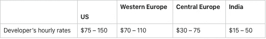

# 技术支持和更新

支出并不会在你启动健身应用的那一刻停止。考虑您将如何监控性能、实施更新和提供客户支持。随着应用受众的增长，你需要确保性能不会下降。你可能还想加入一些新的功能来让你的客户感到惊喜和吸引他们。

但是这些新功能可能会产生错误和安全漏洞，所以您必须不断地测试您的解决方案。

如果你依赖于内部开发团队，那么技术支持将不是问题。如果您雇佣了外部技术合作伙伴，那么理想情况下，他们应该接管支持和更新。如果这是不可能的，要求详细的技术文件，将支持另一方接管这一职责。建议将大约 15-20%的健身应用开发成本用于维护。

# 一个健身 app 要多少钱？来自真实项目的数字

# 活动追踪健身应用

一家成熟的健身移动应用供应商向 ITRex 寻求 Android 应用开发服务。该公司希望为其 iOS 活动跟踪解决方案建立一个 Android 替代方案。我们的团队只参与开发阶段。我们建立了一个应用程序，允许用户跟踪他们的活动，设定目标，监控进度，并与社区成员分享他们的成就。

以下是该应用程序最突出的特点:

*   GPS 跟踪监控用户位置
*   搜索功能，查找并加入相关社区
*   可以处理用户位置和活动数据的分析组件
*   用于获取用户活动的 Strava API

项目持续时间:2.5-3 个月

**开发成本:**20，000-25，000 美元

**团队组成:**一名开发人员

**App 开发阶段:**开发

Android 技术堆栈:

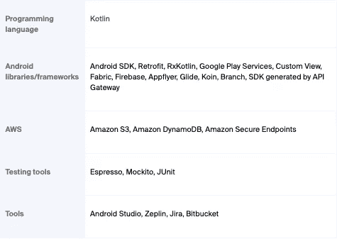

# #用于智能训练的口袋蔻驰健身应用程序

一家美国初创公司聘请 ITRex 开发一款适用于 Android 和 iOS 平台的综合健身应用，该应用将像现实生活中的教练一样工作。客户希望该解决方案能够制定个性化的训练计划、推荐健康的饮食方案、跟踪成绩、提供教育内容等。

*   根据用户参数(如年龄和健康水平)推荐训练计划
*   允许用户管理和修改健身和营养计划，更改日期，添加和删除锻炼计划
*   根据选定的培训计划提供培训提示和视频
*   跟踪进度并提供成就概述
*   建议用餐计划
*   盘问
*   与社交媒体整合，分享进展
*   构建一个网络研讨会和练习视频库

**项目持续时间:**10-12 个月

**开发成本:**:30 万至 45 万美元

**团队构成:** iOS 开发者、Android 开发者、前端开发者、后端开发者、QA 工程师、DevOps、业务分析师、项目经理。

**App 开发阶段:**开发

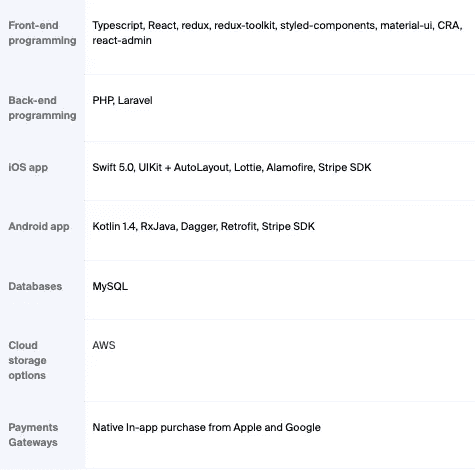

# 一款由人工智能驱动的健身镜配套应用，配有私人教练

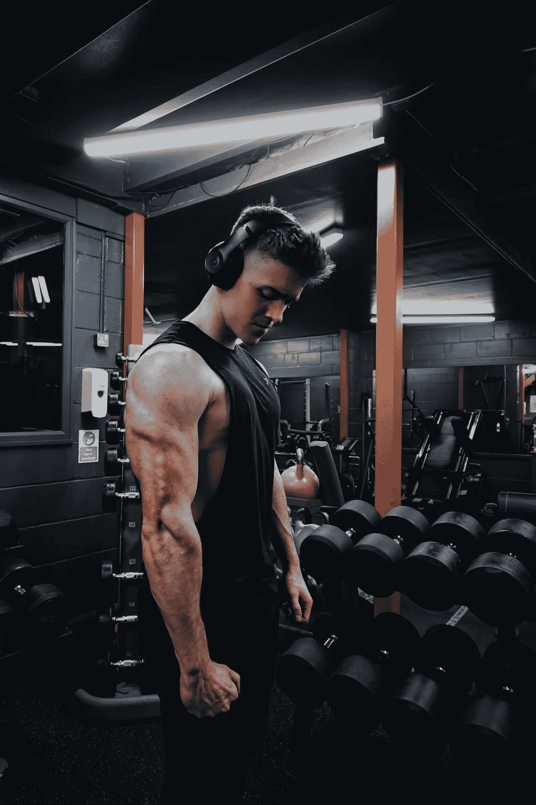

这是一个健身应用如何成为全面复杂项目的一部分的例子，该项目包括机器学习(ML)、语音控制、计算机视觉、传感器和物理镜子。在这里，一个健身应用程序使用户能够控制镜子，并与其他社区成员互动。

一家北美初创公司希望[建造一面镜子，人们可以在虚拟教练的监督下在家里使用它进行锻炼](https://itrexgroup.com/case-studies/ai-powered-fitness-mirror-with-a-personal-coach-inside/)，虚拟教练将监控他们的状态，提供定制的锻炼计划，并鼓励他们尽最大能力进行锻炼。以下是该项目的主要组成部分:

*   带有定制操作系统的全身物理镜，配备有传感器以监控用户的形态
*   用户可以将物联网传感器贴在他们的设备上，使其成为整个训练系统的一部分
*   用于运动跟踪和重复计数的摄像机和计算机视觉技术
*   ML 模型，可以了解每个用户的体能，提供鼓励和训练技巧，并推荐锻炼
*   理解一组语音命令的语音控制系统
*   自定义健身 Android/iOS 应用程序，用于与社区成员互动
*   管理面板，使健身教练上传他们的内容，并给出锻炼技巧

配套应用的主要功能包括:

*   带有定制操作系统的全身物理镜，配备有传感器以监控用户的形态
*   与镜子的互动。通过该应用程序，用户可以打开和关闭锻炼，播放音乐，检索他们训练进度的统计数据
*   该应用程序允许智能手机充当远程键盘
*   在社交媒体上分享培训结果
*   与人类教练交换信息

项目持续时间: 4.5 个月

**开发成本**:13 万至 16 万美元

**团队组成:**三名开发人员

**App 开发阶段**:开发

**使用的技术:**原生 iOS 开发，SWIFT，通信协议:蓝牙和 Wi-Fi

# 健身应用开发入门

这里有六个步骤，你可以遵循，以概念化和建立一个成功的健身解决方案。为每个阶段分配足够的时间将有助于降低健身应用程序的整体开发成本。

# 市场调查

这个阶段将帮助你了解你的受众的需求，以及他们期望这样的应用程序提供的功能。当考虑你的潜在客户时，要尽可能具体。尝试确定所有相关参数，如他们的年龄、目标、生活方式、激励和鼓舞他们的因素等。你可能会发现一些意想不到的需求。例如，市场研究可以揭示，人们白天会在手机上使用你的应用，但晚上会转到电视上。你还会看到你的竞争对手提供什么，他们缺乏什么。

市场调查应该可以帮助你回答以下问题:

*   谁是你的观众？
*   他们的痛点是什么？
*   你能帮什么忙？
*   你的竞争对手在这方面做了什么？

一个建议是研究 App Store 和 Google Play 上的用户评论，比较竞争对手的价格和功能集。另一个方法是和尽可能多的人谈论你的愿景。表现出最大兴趣的人是你潜在的早期用户。仔细倾听他们，记下他们的期望。

**阶段持续时间:**20-40 小时

# 发现

在[产品发现阶段](https://itrexgroup.com/blog/product-discovery-choosing-between-waterfall-agile-kickoff/)，与设计师和开发者在内部讨论你的健身应用。描述您对应用程序的总体想法以及您在前一阶段获得的信息。现在是时候正式化和结构化你的项目了。您可以和您的团队一起完成以下步骤:

*   写下并详细说明您想要包含的需求和功能。在我们的[综合需求规范指南](https://itrexgroup.com/blog/guide-to-software-requirements-specification-document-benefits-expert-tips/)中找到更多关于这个主题的信息
*   选择适合当前用途的技术组合
*   让质量保证工程师审查你的规格，以确保它们没有逻辑错误
*   估计构建应用程序等所需的时间和资金

尽管这一阶段可能看起来乏味且耗时，但随着你进入设计和开发阶段，它将降低你的健身应用程序构建成本。

**阶段持续时间:**40–80 小时

# 设计

您可以分三步完成此阶段:

1.  **用户界面设计**。这一步产生了应用程序的框架，看起来像草图，称为线框。
2.  **原型制作**。它通过实现应用程序的外观和感觉，并使框架可点击，以模拟与实际应用程序的交互，从而赋予线框以生命。在原型中，屏幕连接在一起，有按钮和菜单允许用户测试应用程序的功能和逻辑。
3.  **用户测试**。在这一步，一组真实的用户，代表你的目标受众，与原型互动，以验证它是否直观和用户友好。您可以利用反馈来进一步改进您的解决方案。

**阶段持续时间:**80-160 小时

# 发展

在此阶段，开发人员将构建实际的应用程序。他们将应用程序连接到后端，并将其与所有其他组件集成，如支付网关和社交媒体平台。在构建解决方案时，您的团队可以回答以下问题:

*   我们可以重用哪些组件来降低健身应用程序的开发成本？
*   我们需要集成哪些组件？谷歌 Fit，苹果健康等。
*   如何使这个应用程序安全？
*   有哪些关于数据隐私的规定？我们是否合规？

为了最大限度地降低健身应用程序的开发成本和上市时间，您可以从创建一个最小可行产品(MVP)开始，该产品仅限于核心功能。您可以启动 MVP 并监控用户如何与它交互，他们不喜欢什么，以及缺少什么，这样您就可以逐步改进产品。如果 MVP 在市场上表现良好，你可以利用它的成功与投资者谈判额外的资金。

**阶段持续时间:** 200 小时——需要多久就多久

# 质量保证和测试

在这个阶段，质量保证工程师[测试移动应用](https://itrexgroup.com/services/mobile-testing/)的缺陷，并确保它符合需求规范和国家法规。您还可以专注于审查和重构代码，以提高速度和稳定性。

**阶段持续时间:** 50 小时——尽可能长

# 铺开

当健身解决方案准备就绪时，你可能会将其发布在 App Store 和/或 Google Play 上，并让用户从那里下载。与此同时，不要无所事事。努力宣传你的申请。如果用户不知道它的存在，就无法下载。这里有一些策略可以帮助你推广你的产品:

*   在社交媒体上发布公告
*   在相关网站上为该应用做广告。你可以在新闻聚合网站上撰写一篇推广性的博客文章或一段文字。
*   受益于 YouTube、Google 等付费广告。
*   联系健身影响者，请他们在他们的平台上评论或提及你的应用

你的工作不止于此。你仍然可以监控用户反馈和应用程序使用统计，并做出改进，使你的应用程序保持相关和令人兴奋。

这个阶段是一个连续的过程。

# 如何加快健身应用程序的开发过程:来自 ITRex 的提示

1.  不要跳过发现阶段。在这个阶段，您可以发现一些可能阻碍未来开发的方面。例如，你可以意识到你需要额外的研究或者预算估计不足。这也有助于你为潜在的风险做好准备。
2.  **使用渐进的方法进行开发。**从 MVP 开始，逐步增加功能。
3.  **投入时间构建解决方案架构。**考虑非功能性需求。一个坚实的架构会让你的应用更可靠，更有弹性。例如，一个经过深思熟虑的架构将允许您的解决方案随着用户群的增长而扩展。
4.  **缩短上市时间。通过这种方式，你将尽快收到有意义的反馈，并能更快地改进你的产品。**
5.  **自动化。**这对于小规模的解决方案可能不可行，但是对于超过 500 小时的开发和 QA 的项目来说，[尽可能地自动化测试](https://itrexgroup.com/services/automated-testing/)。

# 外卖食品

那么，做一个健身 app 需要多少钱呢？从 10，000 美元的基本功能和适中的设计，到 150，000 美元的全面功能集。而这只是一个普通 app 的价格。如果你想加入定制动画和创新技术，如人工智能，成本将呈指数增长。

在回顾了本文中介绍的所有因素并根据您的情况对它们进行了调整后，您可以获得更精确的估计。不要忘了包括一笔缓冲费用，用于你在这个过程中会发生的费用。例如，要在 app store 上发布你的健身应用，你需要付费。Google Play 一次性收取 25 美元的费用，而苹果商店每年收取 99 美元。这些平台还会从每笔 app 购买中抽取佣金。

请记住，应用程序开发是一项持续的支出。发布产品后，您仍然需要修复错误，整合更新和新功能，并提供客户支持。

> *要不要打造一款大众化、盈利的健身 app？* [*取得联系*](https://itrexgroup.com/contact-us/) *！ITRex 团队将在发现、设计和开发阶段为您提供帮助。我们还可以进行技术审核，以改进您现有的应用程序。*

*原载于 2022 年 9 月 28 日 https://itrexgroup.com**的* [*。*](https://itrexgroup.com/blog/how-much-does-it-cost-to-make-a-fitness-app/)