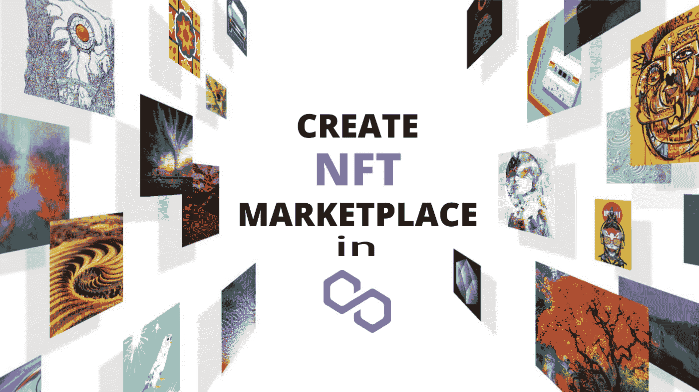

# 在多边形上铸造一个 NFT 要花多少钱——更好地了解多边形！

> 原文：<https://medium.com/geekculture/how-much-does-it-cost-to-mint-an-nft-on-polygon-getting-to-know-about-the-polygon-better-32bf9e291665?source=collection_archive---------1----------------------->

非物质文化遗产有很高的价值，就像艺术、视频、音频、票务、游戏，以及你在日常生活中看到的几乎所有东西。但是只有当你在 NFT 市场上铸造它们时，这些才有可能。NFT 市场使得在他们的平台上创建一个 NFT 变得很容易。然而，许多市场对创建 NFT 收取一定的费用，但只有少数是免费的。一个这样的例子是多边形网络 上的 [***NFT 市场。***](https://bit.ly/3O81owq)

***让我们看看什么是铸造 NFT 市场，以及多边形网络上相应的费用。***

## **铸造 NFT 是什么意思？**

人们经常把购买非功能性食品和制造非功能性食品混为一谈，这是对非功能性食品的普遍误解。但是，它们之间是有区别的。创造一个 NFT 意味着在区块链创造一些相对新的东西。我来进一步解释一下！

 [## 在 Matic | Matic NFT 市场开发| NFT 市场中推出您自己的 NFT 市场…

### 以太坊是一个开源的、基于区块链的、去中心化的软件平台，拥有自己的加密货币以太…

bit.ly](https://bit.ly/3O81owq) 

无论资产是数字艺术、音乐，还是像体育和交易卡这样的收藏品，它都会将一切从数字文件转换为区块链上的数字资产。但这并不像区块链托管着 NFT 自己的文件；如果是的话，它会迅速变得难以置信的庞大和笨拙。

请记住，NFT 只是一个表示特定数字资产所有权的令牌。代币比无聊猿游艇俱乐部的截图更值钱。

铸造 NFT 的行为需要将你的特殊令牌贴在区块链上，这样其他人就可以购买了。

在区块链上，创建了 NFT。以太坊的区块链广泛用于生产 NFT，如 Solana、Cardano、Tezos 等。

像 OpenSea 这样的市场允许你购买 NFT，偶尔这些平台也允许创建者铸造他们自己的 NFT。

此外，你预计要支付的费用只针对那些网络，这些费用本身就是一笔巨款。起初，许多项目会在致力于项目铸造的第三方网站上启动。

然而，铸造 NFT 可以很容易和成本效益，但只发生在某些区块链。让我们来看看多边形网络的铸造，这被认为是铸造 NFT 的低成本(无成本)网络。

## 如果多边形上的 NFT 造币是免费的，你会说什么？

是啊！这是真的；如果选择面网络，则可以免费制作和列出 NFT。你不需要预先支付任何费用来挖掘多边形上的 NFTs。在多边形上铸造 NFT 时，平台默认使用的惰性铸造选项是必不可少的。

然而，NFT 售出后，平台会收取 2.5%的服务费，从售价中扣除。尽管您使用的是多边形网络，但您需要记住销售价格是以 ETH 为单位的。

由于多边形的铸造过程是免费的，你可能会想到如果没有铸造费会发生什么？要做到这一点，你可以了解无气体铸造的好处。

 [## 在 Matic | Matic NFT 市场开发| NFT 市场中推出您自己的 NFT 市场…

### 以太坊是一个开源的、基于区块链的、去中心化的软件平台，拥有自己的加密货币以太…

bit.ly](https://bit.ly/3O81owq) 

## **无气铸币的好处昭然若揭！**

在多边形网络上，您现在可以随意铸造任意数量的 NFT。使用“设定价格”或“拍卖”选项来出售您的 NFT，因为没有铸造费和天然气。不再有任何费用与空投或门控链接。你可以继续铸造 NFT，即使你手头没有任何 MATIC，因为铸造现在是无气的。

## **结论**

当你开始使用多边形网络时，可以很容易地制作 NFT。这个网络让事情以一种简单的方式发生。然而，你现在可以 [***在多边形***](https://bit.ly/3O81owq) 上建造一个 NFT 市场，来驱使人们在你的平台上进行无气体的铸造过程。