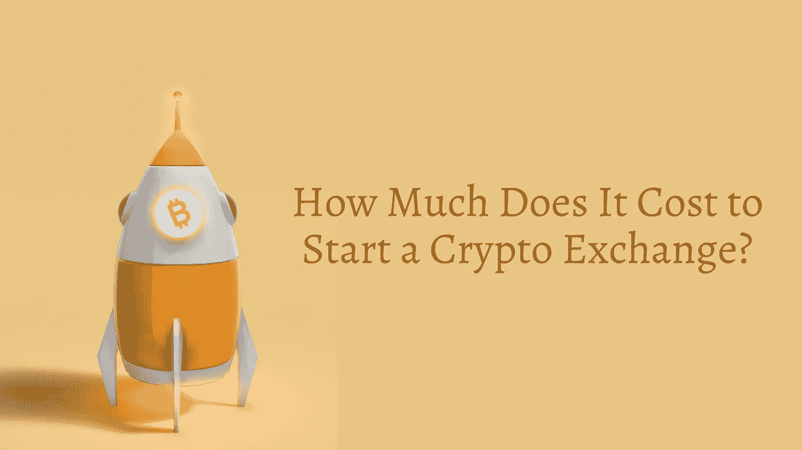

# 启动一个加密交换需要多少钱？

> 原文：<https://medium.com/geekculture/how-much-does-it-cost-to-start-a-crypto-exchange-dab62541419f?source=collection_archive---------12----------------------->

加密技术现在似乎很流行，不是吗？每个人都在谈论以这样或那样的方式投资加密，有些人已经决定利用这一突然的繁荣，开始他们自己的加密交换平台和服务，赚了几百万，并在这样做的同时改变了行业格局。随着这些先驱的成功，

每天都有数百家新的密码交易所涌现出来，其中大多数似乎都是有利可图的企业。

这篇文章旨在帮助人们建立一个自己的密码交易所，它将涵盖金融方面并分解它们，解释为什么每一个都是必要的，哪些可以跳过，制定策略并找出他们的密码交易所想法的金融可行性。

# 目录

## 1.成本分析

## 2.软件费用

## 3.办公空间费用

## 4.广告和营销成本

## 5.培训和教育费用

# 成本分析

影响加密交换成本的第一件事是，你是想从头开始构建，还是想使用白标代码库。从头构建它的好处包括粒度控制，允许在开发的每个阶段都有非常高的可定制性。然而，这是一种昂贵的方式，平均约六位数。绕过这一点的一个方法是使用白标软件，这是一个社区或组织开发的开源软件包，以很小的成本复制了顶级加密交易所的许多功能，有时不到从头开发的 10%。白标软件也是高度可定制的，但还没有到使先前描述的选项过时的程度。

基础技术也会影响开发的成本。使用现有公司的服务器可能比购买和维护自己的服务器更便宜，等等。

# 软件开发和维护费用

作为你业务的核心部分，软件开发和维护将是开始你的加密交换最昂贵的部分。这包括购买不同工具的成本，例如 CRM 软件、项目管理软件、文件托管服务等等。此外，您还可以使用社交媒体管理工具，我们将在讨论营销成本时再回来讨论。无论您选择哪种方式进行加密交换开发，软件费用都是不可避免的。相反，在好的软件上大量投资将会极大地提升你的交换平台的质量。

网站和应用程序的创建值得一提，因为它们是用户与你的平台互动的不可或缺的一部分。除了将用户与 exchange 服务连接起来，网站和应用程序还可以通过推送通知来充当营销工具。一个好的用户界面是用户经常注意到的，并且可能是你选择你而不是你的竞争对手的决定性因素。

既然您已经知道要包括哪些特性，我们现在可以检查开发过程的每个步骤，并大致告诉您成本。并非所有平台的成本都是一样的，所以不要轻信这些估计。

**1。前端开发**

当用户第一次使用你的平台时，一个吸引人的和直观的前端是第一件注意到的事情。如果太复杂或没有反应，用户可能会失去兴趣，不会进一步使用这个平台。因此，雇佣优秀的前端开发人员是非常重要的，这样他们就可以完整地保留所有的视觉元素，并创建一个赏心悦目、视觉上有吸引力的平台。

**费用:约。5000 美元**

**2。后端开发**

后端开发是针对服务器端的，将数据库链接到软件的其余部分，以及保持一切正常运行的所有幕后活动。作为系统最重要的方面之一，您必须特别注意后端。大部分开发时间用于决定工具和技术，然后开发后端的功能。

**成本:4 万至 5 万美元**

**3。集成 API**

API 集成是软件开发的一个重要方面。API 代表**应用程序编程接口**，它就像一个中介，允许两个不同的软件实体相互通信，并定义您的应用程序或加密货币交换网站的逻辑和内部功能。大型加密交易所开发他们的内部 API，这是非常昂贵的，但大多数将简单地集成各种价格较低的第三方 API。

**成本:4 万至 7 万美元**

**4。区块链整合**

加密货币是区块链发展的一个分支。区块链不具有任何固有的货币价值，并且具有加密货币之外的用途。但是需要整合这种技术才能得到一个功能齐全的交易平台，保证流畅的处理和数据存储。

**成本:5000-10000 美元**

**5。测试和安全**

测试是不言自明的，它确保产品质量符合标准。质量保证专家将在每个级别测试你的软件是否有任何缺陷和错误。使用手动和自动测试方法是开发公司用来确保平台安全和无错误的常见实践。安全检查也定期进行，有时由白帽和灰帽黑客发现和修补漏洞。

成本:20000-25000 美元。

# **一种更便宜、更快捷的方式是使用加密货币交易克隆脚本。**

白标加密交换脚本是开源软件，通常在准备部署的状态下可用，已经过测试并按照模块化和定制的思想进行了设计。

选择 [**加密货币交易脚本**](https://www.clarisco.com/cryptocurrency-exchange-development) ，它克隆了顶级加密交易所的功能，如币安、wazirx、coinbase、remitano、paxful 等，而成本只是很小的一部分，允许你跳过上面提到的所有步骤，只需为**基础脚本+你希望集成到脚本中的功能**付费。

**费用:7000 美元(基本功能)。**

现在你终于有了成品，你需要员工和办公室，以及营销活动，下面简要说明了各自的成本。

# 办公空间费用

如果您选择以更大的规模经营您的密码交易所，强烈建议您投资一个办公室，提供员工工作所需的一切，包括租金、电子设备、互联网、食物、茶点等。通过提供一个和平的工作环境，可以提高员工的生产力，同时促进团队合作和创造力。拥有一个私人办公空间还可以让组织安全地存放他们的服务器并密切关注它们，从而避开潜在的破坏者。除了显而易见的生产力和安全原因，拥有一个专用的办公空间有助于员工将工作生活与家庭生活分开。

**成本:每位员工 1000-3000 美元**，取决于办公室的大小。

# 广告和营销成本

如果你想扩大用户群，或者想出名，这是另一个重要的投资领域。然而，当计划一开始投资什么时，总是首先投资于软件开发，确保你有一个可靠的产品或服务，然后努力营销该产品，因为为低质量的产品进行高预算营销活动最终会适得其反，给你留下一个受损的声誉。

广告费用应该涵盖多种媒体，如各种社交媒体平台、谷歌广告、新闻稿、影响者营销、联盟营销等等。尽管许多这些事情看起来可能是不必要的，但它们会累积起来，它们可能产生的累积影响将是巨大的。其他杂项费用包括品牌、标志设计等，这些都是一次性投资，只要公司存在，它们就会不断产生价值。

**成本:10-1000 美元+** ，由于当今形势下广告的性质，差异非常大。

# 培训和教育费用

尽管在最初阶段这不是问题，但随着组织的扩大，你必须投资培训新员工。对新员工进行适当的培训，并定期对老员工进行教育，将确保每个人在相关的技术和方法上始终保持一致，并保持与竞争对手相比的工作质量。通过帮助员工提高技能，更多的人会被你的公司吸引，愿意为你工作，减少员工流动。

**成本:每位员工 1200-2000 美元**。

# 结论

阅读完所有这些内容后，您现在应该对开发和维护一个加密交换的成本有了一个很好的了解。如果你是那种认为赚钱很容易的人，也许这篇文章让你从不同的角度看待它，你现在可以欣赏完成这样一个任务所付出的努力。其目的不是阻止人们开始他们自己的密码交换，而是成为一个起点，在那里他们可以自我教育，以便当他们继续从事他们的密码交换项目时，他们会有一个类似路线图的东西来指导他们整个过程。感谢您的阅读，请在评论区留下您的反馈，我们喜欢阅读它们！

点击此处了解更多关于 [**加密货币交易所发展**](https://www.clarisco.com/cryptocurrency-exchange-development)