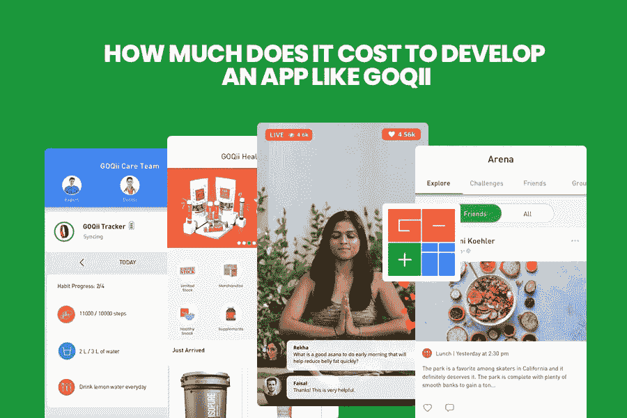

# 开发一个 GOQII 这样的 APP 需要多少钱？

> 原文：<https://medium.com/geekculture/how-much-does-it-take-to-develop-an-app-like-goqii-98f0e66485df?source=collection_archive---------29----------------------->

想通过您的移动医疗保健应用赚大钱吗？你希望你的手机 app 像 GOQii 一样吗？想了解 GOQii 这样的 app 的功能和定价？那你就来对地方了。这篇博客澄清了你对移动医疗应用开发的所有疑虑。后面我们还会提到一些寻找迪拜值得信赖的 app 开发公司的小技巧。所以，让我们开始吧。

# 在线健康服务:简要描述

根据最近的研究，健身和医疗保健移动应用在过去三年中增长了近 330%。除此之外，该报告还称，约 75%的用户每周至少浏览两次健身和医疗保健移动应用，其余 25%的用户每周浏览此类移动应用十次！

# 不同类型的健身和医疗保健移动应用

让我们从应用类型开始，因为这是影响移动健身应用价格的首要因素。

现在让我们来看看最佳健身应用的市场份额:

# 那么 GOQII 到底是什么呢？

GOQii 是一个基于智能技术的预防性健康平台，总部位于加利福尼亚州。

它为用户提供全面的健康体验。此外，该应用程序提供了一个可穿戴的健身带，带有定制的移动应用程序和个性化的远程教练。

印度游戏公司(Indiagames)前首席执行官兼创始人 Vishal Gondal 的创始人 GOQii 于 2014 年 8 月在印度上市。这家公司在印度孟买和中国深圳也有办事处，他们也有增加援助的计划。

# 类似于 GOQII 的医疗保健移动应用程序的理想功能是什么？

以下是你想拥有 GOQii 时应该具备的标准功能，比如手机应用程序:

# 注册/登录

它允许用户使用 Twitter、脸书、Linked In 等社交媒体账户登录或注册该应用程序。

# 用户资料

在这里，用户可以定制公众可见的轮廓信息。

# |用户仪表板

在该功能中，用户可以查看图表和其他个人知识。

# |搜索

在这里，用户可以浏览医生和任何他想看的东西。甚至这个搜索字段也有自动完成和建议。

# 推送通知

这一特殊功能会通知用户他们的每日药物剂量或锻炼次数。

# 视频辅导

使用这一功能，移动应用程序用户可以实时观看健康、锻炼、营养、尊巴、冥想、瑜伽等领域专家的所有直播和信息视频。

# 医生

通过这一功能，您可以为您的用户提供聊天服务，移动应用程序上有专业的专家和治疗师提供建议。

# 因果报应

因果积分是各种奖励积分，您的应用程序用户可以将其用作关键货币，向平台上列出的基本事业捐款。

# 活动食品

在这篇文章中，医疗保健应用程序用户可以很容易地看到不同的活动流，这些活动流通常按时间顺序排列。

# 支付处理

这是一个内置的支付处理系统，允许患者直接从移动应用程序支付服务费用。

# 追踪器

利用这一特性，用户可以通过无线设备上的 GOQii HR、GOQii Run-GPS、GOQii element 来跟踪自己的健身情况。

# 竞技场

使用这些独特的功能，移动应用程序允许您受到朋友的影响和激励，以获得更好的健康和生活方式。

# 分析和报告

使用此功能，您将获得关于移动应用程序行为、网络瓶颈、应用程序问题和应用程序崩溃的定期报告。

# 个人辅导

在这项功能中，您可以为您的每位用户提供私人教练，帮助他们取得成功，积极实现健身和健康目标。每个用户的主要目的是变得更健康，感觉更好，或停止一个坏习惯。

# |奖励

使用 mHealthcare 应用程序中的这一功能，用户将获得关于各种奖金、优惠和快闪销售的通知。此外，他们还将获得可以在产品上快速兑换的现金信用。

# |连接到可穿戴设备

在这项功能中，您可以将移动应用程序与各种可穿戴设备相连接，以便您的用户可以轻松地监控或跟踪他们的活动。

# 健康电子商务商店

利用该特征，用户可以获得广泛选择的健康产品，在那里他或她可以购买与饮食相关的小吃和食物、锻炼设备以及补充剂或营养补充剂。

# 创建像 GOQII 这样的健康 APP 有哪些不同的挑战？

GOQii 等移动健康应用程序在功能和特性方面与传统健康应用程序有很大不同。移动健康应用的专业开发者面临着众多挑战。这些是:

# 数据安全

移动健康 app 开发者最关心的是患者数据的安全和保障。迪拜一家好的 app 开发公司必须确保患者的财务数据、个人信息、医疗数据等数据完全安全可靠。

# 与旧医疗系统的兼容性

大多数最新的应用程序在使用过时的技术时，都会遇到与陈旧的医疗中心和医院相适应的问题。因此，迪拜的应用程序开发人员必须花足够的时间来学习旧系统的细节和复杂性。因此，使用最时尚、最先进的应用程序开发技术开发高级移动医疗保健应用程序是一项颇具挑战性的任务。

# 患者隐私

类似于 GoQii 的移动医疗保健应用程序处理患者的个人信息，这些信息很敏感。因此，迪拜的移动应用程序开发人员需要以最高优先级保护重要的健康相关数据。此外，在开发移动医疗保健应用程序时，应用程序开发公司必须遵守医疗保健责任法案，倡导患者隐私。这些移动应用程序也应该与 HEPA 和 SEPA 兼容。

# GOQII 等医疗保健应用开发的评估

精确估计开发某些功能的成本并不容易。所以在评估一个项目的价值时，我们从乐观和悲观两个角度来评估每个方面。当我们谈论有希望的发布时，我们的意思是我们都应该在第一次尝试中做得非常出色。之后就不会偏离典型的实现了(没有更多的动画或者啤酒开瓶器之类不合逻辑的功能)。会的。

当我们考虑到可能干扰其他任务的不寻常的复杂功能、坏情绪、天气以及可能阻止所有客户完成快速任务的全黑猫时，悲观的怀疑就会产生。向需求妥协。乐观场景和悲观场景之间只有几个小时的差别，因此客户收到的是基于纯粹平均值的粗略估计。

我们已经做了项目成本的大致估算，假设这将是一个有 MVP 的小型创业公司。看看需要开发和实现的一些基本特性:

仪表板— 12 -14 小时

授权—8-10 小时

客户概况—10-14 小时

日历同步—4-8 小时

访问报告—6-10 小时

预约医疗服务—12-16 小时

视频通话—14-20 小时

推送通知—6–8 小时

支付系统集成—16-20 小时

各种其他相关功能，如医生列表、动画、专科列表—16-20 小时

团队内部以及与客户之间必须有交流的时间。除了应用程序结构之外，在某些情况下还需要澄清，这是必须的。创造一个产品并忘记它并不是它的意图；应用程序必须不断维护、改进并适应最终用户的需求和要求，并且必须事先考虑扩展设施的可能性。重要的是，如果我们不花时间，将来当一个小任务或开发比我们需要的时间长得多时，我们可能会有问题。所以，让我们投资未来，从零开始开发应用程序。开发移动应用程序架构也将增加 8-10 个小时，对于沟通，将增加 5-10%的预计项目时间。

# 技术售后支持和维护。

查看更多技术支持和开发应用程序的帮助。因为假设你习惯了一个事件 app，转到房子，用 Google Play 写成 app。但既然用户反馈是这样的，可以为 app 版本的更新创造条件，那么技术维护就在 app 开发支持之后发挥作用。

# |摘要

这篇博客讨论了开发像 GOQii 这样的移动应用程序时需要知道的所有细节。然而，如果你还记得开发移动应用的总成本取决于你在移动应用中选择的功能、应用开发公司和应用开发公司的位置，这将会有所改善。如果你正在寻找一个应用程序开发者，印度有许多[应用程序开发公司](https://www.standardfirms.com/top-app-development-companies/)可以帮助你开发定制的应用程序。