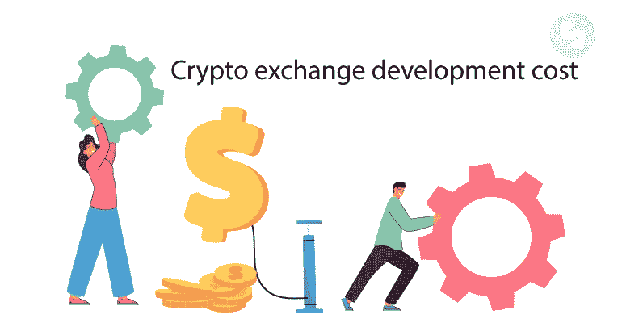
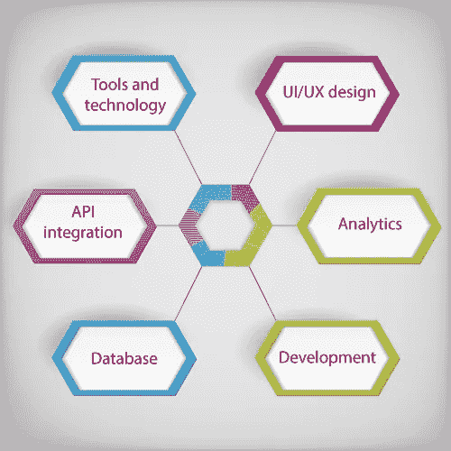
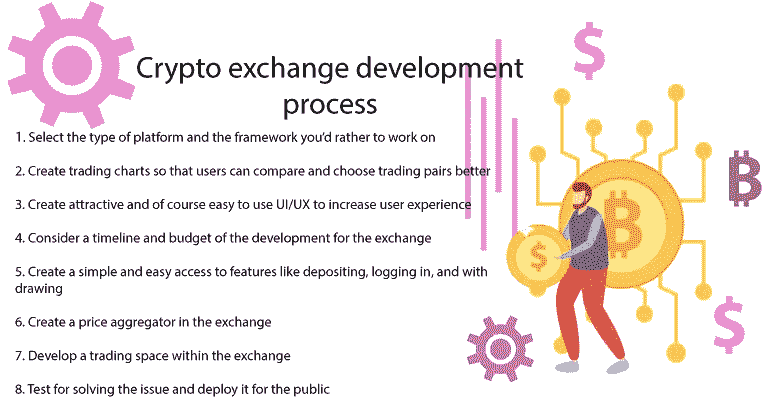
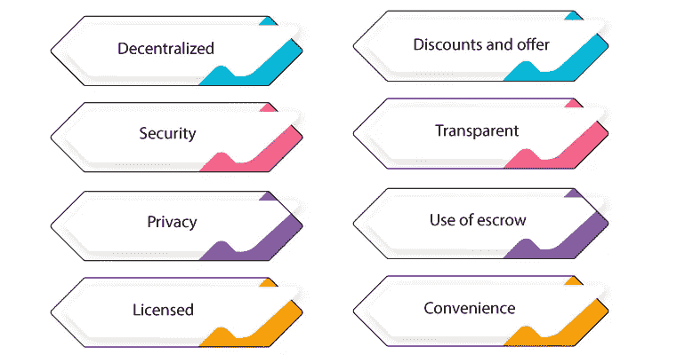
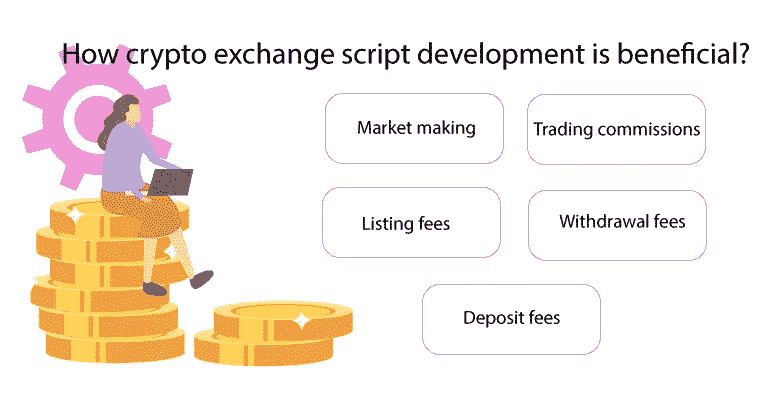

# 开发密码交易所要花多少钱？

> 原文：<https://medium.com/geekculture/how-much-does-the-crypto-exchange-development-cost-d548bad2ddf8?source=collection_archive---------16----------------------->

数字货币的使用正在迅速增加，著名的加密交换软件的用户流量巨大。投资者错误地认为加密交易所的开发成本很高。许多初创公司和企业家声称他们负担不起成本，但这是可行的。加密交易所开发的最终付款是几个因素的结果，我们将在本文中讨论这些因素如何影响加密货币交易所软件的价格。

在**加密货币交易所开发成本**中有一系列决定因素，包括 API 集成、UI/UX 设计、花费的时间、框架、核心功能、安全机制，以及最重要的定制。

# **什么是加密货币交易所发展？**

要讨论加密交易所的开发成本，你需要知道在加密货币开发过程中推出的决定因素。Crypto exchange 开发是使用尖端技术堆栈将您的梦幻解决方案带入加密时代。创建加密交换脚本的开发过程是使用优秀的功能和特性启动迷人的业务模型的过程。您可以使用无缝操作系统启动您的加密货币交易空间。

我们强大的加密兑换脚本开发帮助您在可靠的区块链上创建您的加密货币兑换软件，运行令人难以置信的功能特性。一个功能良好的加密货币交换脚本是安全、快速、易于使用和值得信赖的。我们提供的加密交换脚本包含所有这些功能，除了它的定制选项。我们的 [**密码交换开发成本**](https://radindev.com/cryptocurrency-exchange-development-cost/) 取决于它根据您的要求定制的程度。

# **决定影响加密交易所开发价格的因素**

## 分析学

分析是每个加密货币交易所的重要功能，包括日志和图表。登录分析，帮助您分析加密货币交易平台的活动。加密交换软件中的图表用于正确显示它们的创建。

## 数据库ˌ资料库

通常，在加密货币交易所中有两种类型的数据库，AQL 和 REDIS。一个是快速的，但不意味着秘密数据存储，而另一个是缓慢和持久的，但有点慢。数据库是影响密码交易所开发成本的一个重要因素。

## API 集成

API 是一个平台必不可少的一部分，毫无疑问是必不可少的。API 集成意味着设置功能和特性，以便能够访问平台上的外部应用程序。

私有和公共 API:公共 API 由第三方开发人员使用，而公共 API 在系统内部使用，以实现更好的交易。

Websockets:这项技术用于发送与市场和交易变化相关的信息。

修复协议:无论交易什么资产，修复协议都是必备功能。它可以访问外部克隆应用程序，因此可以快速连接几个交易平台。

## 用户界面/UX 设计

影响加密交换开发成本的另一个重要因素是接口的设计。exchange 的界面是用户的第一印象。你设计的界面越简单，你就能更好地吸引用户。加密交换脚本必须易于使用和理解，即使是没有经验的用户。

## 工具和技术

当谈到开发像加密交易所这样的平台时，使用高科技和升级工具的重要性得到了更好的认识。工具和技术可以保证高质量的加密货币交换脚本开发，当然也可以保证较高的加密交换开发成本。

## 开发截止日期

开发截止日期是加密交换开发从计划到为公众部署的持续时间。如果你要求一个更复杂的交换脚本，你的开发过程需要更长的时间。该平台的附加特征和特殊设计使得开发期限更长，并且加密交换开发成本更高。

# **密码交易所开发流程**

一个密码交易软件的开发过程是建立一个安全、灵活、吸引人的交易空间，这导致了最终的密码交易开发成本。在加密交换中，交易以很快的速度完成，这是一种基于托管机制的智能合约。另外，跟上加密空间的快速更新。加密交换脚本已经成为扩展您的业务的最佳解决方案之一。下面是一个加密交换脚本的开发过程。

1.选择你想使用的平台和框架的类型。

2.创建交易图表，以便用户可以更好地比较和选择交易对。

3.创建有吸引力的，当然，易于使用的用户界面/UX 来增加用户体验。

4.考虑交易所发展的时间表和预算。

5.创建对存款、登录和取款等功能的简单易用的访问。

6.在交易所中创建一个价格集合器。

7.在交易所内发展交易空间。

8.为解决问题进行测试，并向公众进行部署。

# **白标加密交易所开发成本**

白标产品是指预制的平台，可以根据您的业务需求进行定制。white label crypto exchange development 是一个尖端的平台，而且价格合理。白标加密交易所的发展是一个现成的市场选择，进行各种混合功能。

使用白标版本创建加密交换的开发成本比使用刮刮卡要便宜得多。此外，白标解决方案可以根据您的业务需求进行 100%定制。白标加密交易脚本建立在标准基础上，旨在提供一个高端安全且功能完善的交易空间。

客户有不同的要求，所以不容易计算加密交换开发价格的最终金额。开发成本有一个基本范围，如果需要任何额外的功能，开发成本将会上升。

# 为什么要进行加密交换开发？

在加密市场爆炸的基础上扩展您的业务似乎是一项明智的长期投资。加密交易平台被认为是被动收入来源的可靠来源。它在几个方面给企业带来了好处。以下是创建加密交换脚本的一些好处，这些好处使得加密交换开发成本合理。

## 便利

在加密脚本中创建一个账户是如此简单，以至于任何新的交易者都被鼓励加入你的加密交易平台。

## 得到许可的

大多数集中交易都是由政府规定许可的。如果出现任何问题，这可以让用户安心。

## 托管的使用

托管作为中间人来增加交易过程中的安全性。托管系统持有货币，直到贸易双方履行他们的合同协议。所以，没有必要关心交易确认。

## 折扣和优惠

加密交换，提供大量折扣。用户可以将加密货币换成法定货币，也可以将法定货币换成加密货币。

## 透明的

用户的地址和位置是由这个特性提供的，因此任何需要信息的客户都可以访问它们。所有基本的操作特性都会影响加密交换的开发成本，但是你不能将它们排除在开发之外。

## 隐私

在分散交换中，没有数据与第三方共享。在 dex 脚本中进行交易不需要任何个人信息。所有的交易过程都是匿名的，而用户可以完全控制他们的资产。

安全性

第一次创建分散式交易所的第一个目标是它们提供高水平安全性的能力。在 dex 脚本中，用户可以完全控制他们的资产。加密交换所提供的安全性值得加密交换的开发成本。

## 分散的

与集中式服务器不同，分散式 exchange 中的数据存储在世界各地的几台服务器上。所以，它是安全的，不可检查的。因为所有的用户，不管他们是业余的还是专业的，都在寻找安全的交易空间，这可以吸引很多用户到你的平台。

# **开发一个加密交换克隆应用要多少钱？**

移动应用在各个方面的使用正在增加，因为它推动了加密时代的到来。它简化了随时随地的交易。**加密货币兑换软件价格**是推出您的加密兑换应用程序的另一个关注点。目前，在加密交换开发过程中使用移动应用程序的需求受到很大影响。因此，创建一个加密交换克隆应用程序是一个可靠的想法，以完成您的扩展加密业务的旅程。

应用程序的加密交换开发成本由影响脚本开发成本的相同因素决定。这取决于你想要开发的特性和操作系统。

# **密码交易所的发展如何有益？**

加密交换开发成本是加密领域的一个重要方面。考虑每种类型的交易所，你决定选择和发展你的交易所类似于币安、**、pancakeswap 等。每个加密交换软件都有其功能和特点，可以真正影响您的业务的未来和利润。然而，加密时代的速度可以在未来给市场带来许多惊喜。加密交换脚本能够以各种方式提供收入模型。这里有一些从加密交换脚本开发中获利的创收模式。**

## **费用**

**对于加密交换脚本中的每一个交易和活动，相比之下都收取不同的费用。例如，货币转账要收取存款费。要使用可靠的平台，你需要在你的加密钱包中存入一定金额，以证明你有足够的资金。**

**确定用户必须付费的功能系统也对加密交换开发成本有影响。当用户从钱包中提取货币时，他们需要支付取款费。然而，取款费用是不同的，你可以选择支付固定费用或转账金额的百分比。**

**在每个加密交易脚本的成长期，仅仅依靠一个收入来源，如交易佣金，不是一个合理的想法。用户可以在交换平台上列出硬币和代币，以便早期获利。**

## **交易佣金**

**一种值得信赖的促进买卖双方交易的收费服务，被认为是加密交易最常见的货币化方法。**

## **证券市场为调整供求或价格而进行的买卖**

**加密交易平台中的另一种创收模式是为特定的金融工具提供流动性。因此，做市意味着以更低的价格在你的交易所购买数字资产。**

# ****结论****

**定制是一个主要的有效因素，可以提高或降低加密交换的开发成本。在交换机上开发的功能和选项符合您的业务需求。越是便于操作的系统，需要付出的开发代价就越高。所以，基本上，开发的价格并不高，但是开发过程的专业化很高。您可以改变计划运行加密交换的方式，以降低最终成本。**

**如果您倾向于创建一个加密交换脚本，您可以请我们的专家顾问为您的业务和预算制定最佳匹配计划。**