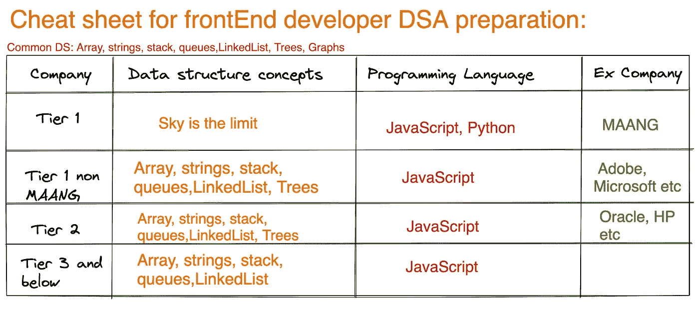

# 为前端开发人员面试准备多少 DSA

> 原文：<https://medium.com/geekculture/how-much-dsa-to-prepare-for-frontend-developer-interview-f465bc0fc940?source=collection_archive---------0----------------------->

在我的 Youtube 频道和 LinkedIn 上，我经常收到这些问题。

“Vasanth 我正在准备微软前端的角色，我是否需要准备图形？”

“我正在准备 SAP，JavaScript 够用吗，或者我需要学习任何其他语言吗？以便我可以快速找到 DSA 解决方案。”

我决定写这篇文章，涵盖所有你需要知道的关于准备 DSA 的前端开发人员的事情。

如果你懒得阅读，你可以看我下面的 14 分钟 Youtube 视频，它详细解释了一切，或者你也可以读我的文章。

我已经把整个 DSA 采访总结成一个小图片，附在下面。

Fig: Uncommon geeks DSA interview preparation guide

让我们根据公司提供的薪水将名单分成三部分。

> **一级——玛昂**

如果你正在准备 **MAANG** (Meta，苹果，亚马逊，网飞，谷歌)没有固定的模式可以在面试准备期间练习。他们可以问几乎所有 DSA 主题的问题。所以，在这种情况下不要只坚持 JavaScript。**您可能无法在 JavaScript 中找到所有解决方案。学习 Java 或 Python 之类的语言，这样你就会找到所有问题的解决方案。**

> **第 1 级—非 MAANG**

有许多优质公司将属于一级类别，但它们不是 MAANG。例如:Adobe，微软等。这些采访你可以跳过**图 DS** 。但是你需要准备**数组、字符串、堆栈、队列、链表和树。**学习这些 DSA 及相关问题，JavaScript 应该足够了。但是如果你有足够的时间准备，那么你也可以学习 Python 或者 Java。但这不是强制性的。

> **第二层**

对于二级公司，如果你有时间，你可以限制自己使用**数组、字符串、堆栈、队列、链表、**树。相比一级 MAANG 和非 MAANG 在这些公司的面试会非常容易。你可以在 Leetcode 中练习所有常见的中等难度和公司标记的问题。这应该足以破解这些公司的面试。

> **三级**

所有没有得到资助的服务公司和新兴创业公司都将属于这一类。显然，他们的门槛将低于每日生活津贴。原因很简单。首先，他们提供的薪水会很低。其次，公司内部需要的 DSA 也会非常有限。所以， **JavaScript** 作为编程语言，**数组、字符串、堆栈、队列作为 DS** 应该足以搞定这些面试。你可以限制自己练习 **geeksforgeeks、**里的所有问题，只有有时间，你才能用 **Leetcode** 。

上图可能并不适用于所有情况，因为有些公司可能会在不同层级之间移动。**因此，我的建议是，经常留意 Glassdoor 和 Leetcode 面试反馈部分**中最近被问到的面试问题的面试反馈。有时公司的标准会降低，有时会提高，你可以相应地调整你的准备。

感谢您在下一篇文章中阅读 catch you。如果你还没有在媒体上关注我，那么请关注我，你可以在链接的[这里](https://www.linkedin.com/in/vasanth-bhat-4180909b/)关注我。不要忘记订阅我的 Youtube 频道[取消评论](https://www.youtube.com/channel/UCSCNvSCk_Z9mBvUM-FJexRg/videos)。

欢迎在评论区添加您的反馈。

如果你想亲自和我讨论模拟面试，面试或简历审核的技巧和诀窍，你可以在这里预约:

[https://topmate.io/vasanth_bhat](https://topmate.io/vasanth_bhat)

如果你正在准备前端开发者面试，请观看我的以下系列:

如果你是 reactJS 开发人员，正在寻找面试准备，请点击这里观看我的完整面试准备指南: