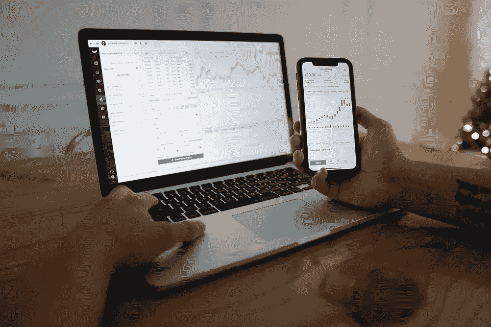
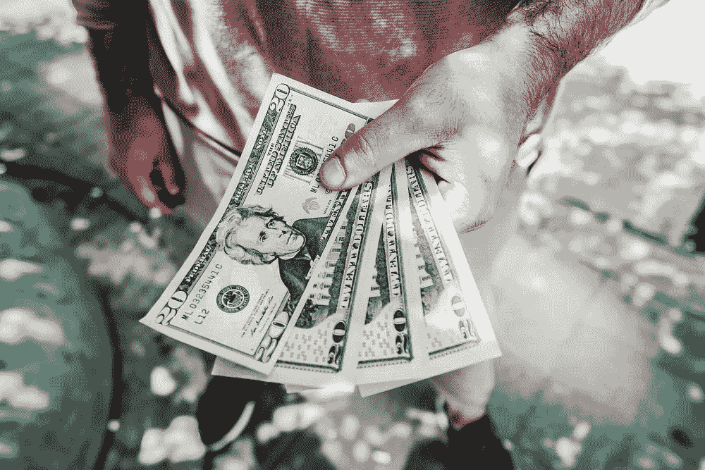

# 你需要投资多少钱才能靠分红过活？

> 原文：<https://medium.com/geekculture/how-much-money-do-you-need-to-have-invested-to-live-off-dividends-43536dc6cdaa?source=collection_archive---------0----------------------->

Photo by MayoFi from Pexels and Photo by [Burst](https://www.pexels.com/@burst?utm_content=attributionCopyText&utm_medium=referral&utm_source=pexels) from [Pexels](https://www.pexels.com/photo/blur-cash-close-up-dollars-545065/?utm_content=attributionCopyText&utm_medium=referral&utm_source=pexels)

所以你可能听说过一些富人能够依靠股息收入生活，这基本上涵盖了他们的生活方式。现在你可能想知道他们是如何做到的，我如何也能为自己做到这一点？

他们可能必须持有大量股票，才能从股息收入中获得数千美元的收入，因为…