# 我在 Amdocs 的 22 个月开发经验如何塑造了我的职业生涯？

> 原文：<https://medium.com/geekculture/how-my-22-month-developer-experience-at-amdocs-shaped-my-career-77697802a1a2?source=collection_archive---------6----------------------->

## 从研究生工程师到创新代理人！🙌

一份 mdocs，对我来说，就是**第一份**工作邀约、**第一份**工资支票、**第一份**奖金、**第一份**晋升的代名词。这份清单并没有到此为止。我有机会与最好的团队、有爱心的经理、乐于助人的队友和知识渊博的专家一起工作。

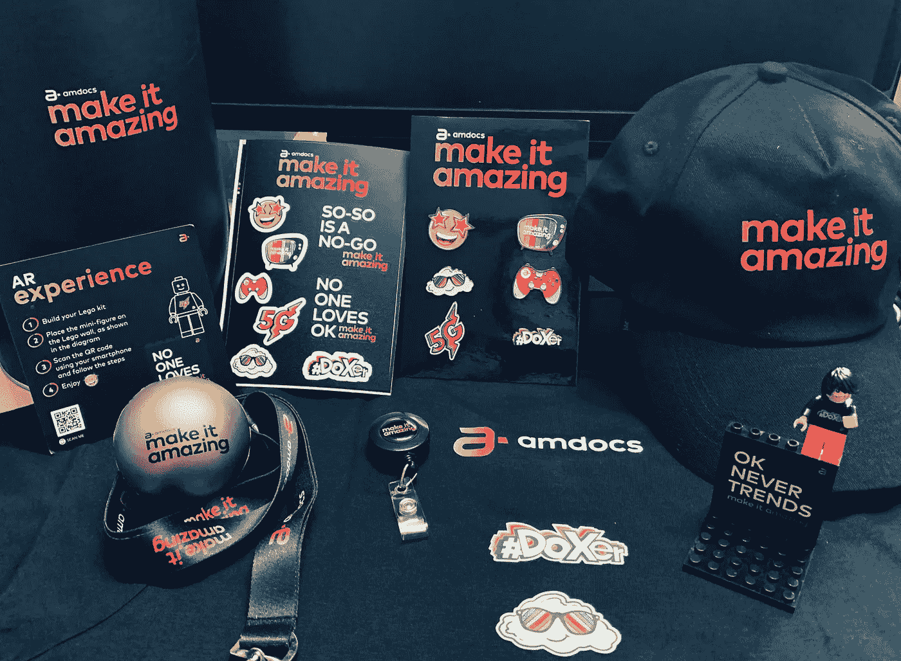

但在令人惊叹的两年后，是时候说再见了。因此，在这里，我用自己的话写下了我在 Amdocs 的个人经历，以及它如何帮助我塑造了我的商学院之旅。🕴

> Amdocs 将永远是我快乐的地方，因为它将我对朝九晚五的工作的看法塑造成每天都有无数获得成功的机会！

请阅读我的文章，了解我从一名胆怯的研究生助理到一名经验丰富的开发人员和创新代理的旅程。

# 入职和培训👩‍💻

我仍然记得我的第一天，那是 2020 年 7 月 30 日。我们与事先分配给我们的直接经理进行了第一次通话。他们很友好，同时也很专业。他们有 12 年以上的工作经验，但我们被建议对公司里的每个人都直呼其名，不管他们的级别如何。而那一分钟，我敢打赌每个人都有点放松，更开放！

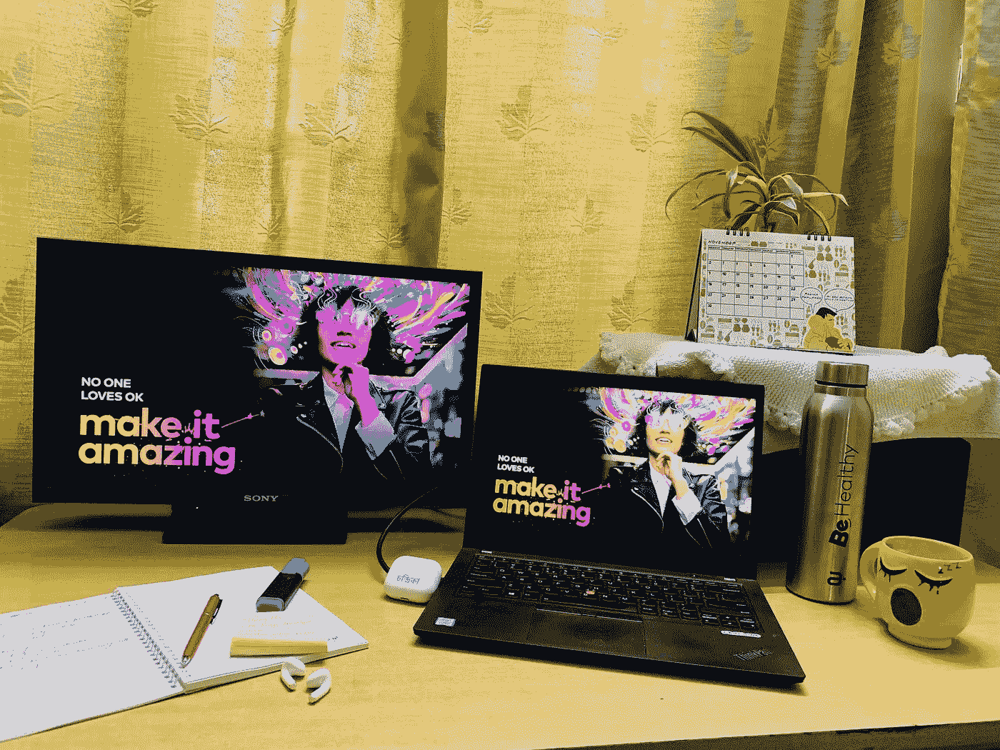

成功入职后，我们被分配了一个伙伴导师，以便在有任何问题时联系。几天后，我们的培训项目开始与学习专家。

我们被分成一个小组，大约 20 人，就 Amdocs 在其核心项目中使用的各种工具和技术进行学习。除此之外，我们还根据我们将要从事的项目在一些特定的领域进行了培训。

谁去哪个项目的决定是由我们的经理做出的。最初的 2-3 个月感觉像是回到了大学，因为整天都有训练课，但是现在有了工资！

# 第一个项目！🚀

于是，2020 年 11 月左右，我的第一个项目被分配给了我。这是一个名为**实时计费**的核心 R&D 项目。当时，该项目处于早期开发阶段。

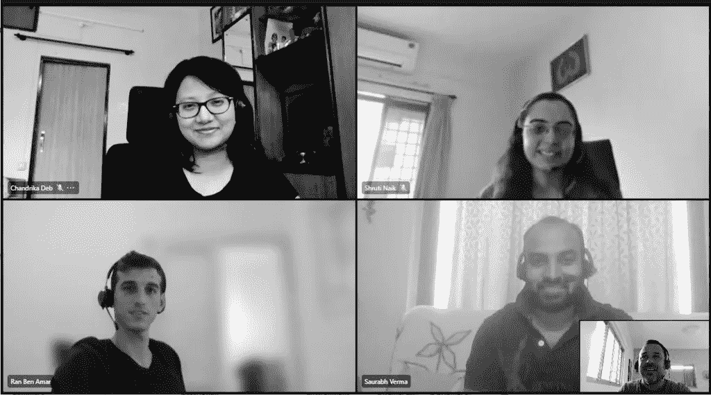

尽管那时我们只是一名计算机系毕业的软件助理，但我们在日常工作中的每一步都受到了高度的欢迎和帮助。从功能开发到用户故事演示，我仍然非常感谢我的乐于助人的队友和前辈，他们有耐心解释并消除了我的疑虑，不管这有多傻！

很快，整整一年过去了，在这一路上，我开发并贡献了许多重要的特性和 NFT 开发。我学到了一些在我的大学学位里没有的东西。

# 创新之旅💡

这一切都是从我参加为刚毕业加入 Amdocs 的人举办的创新博览会开始的。该计划有来自当年加入 Amdocs 的近 400 多名软件合作伙伴的参赛作品。

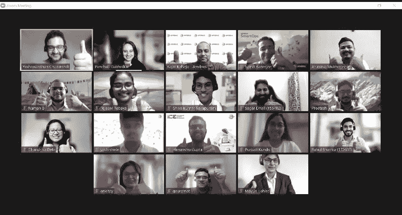

我还提交了我的大学期末项目[面具检测](https://github.com/chandrikadeb7/Face-Mask-Detection)的参赛作品。该计划结构合理，安排了一对一的指导和推介练习。我有了与 Amdocs 印度分部总裁**Rajat rahe ja**互动的黄金机会——这一刻我将珍惜一生！

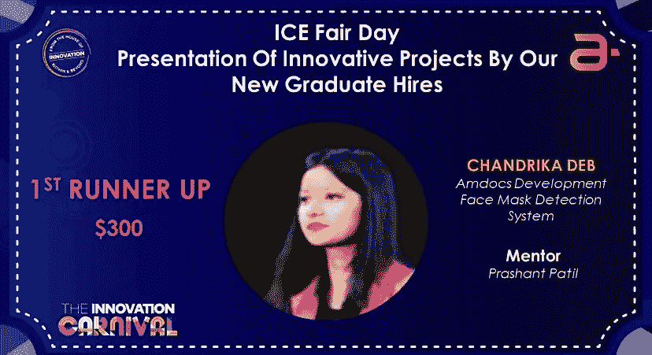

随着时间的推移，我参与了一些创新项目，并最终登上了排行榜。

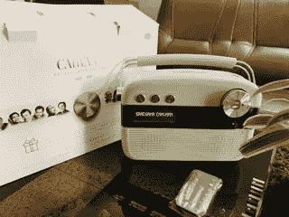

随着每一个事件的过去，我能感觉到我的热情和同情心在增长。它帮助我在工作内外与志同道合的人建立关系网。

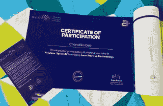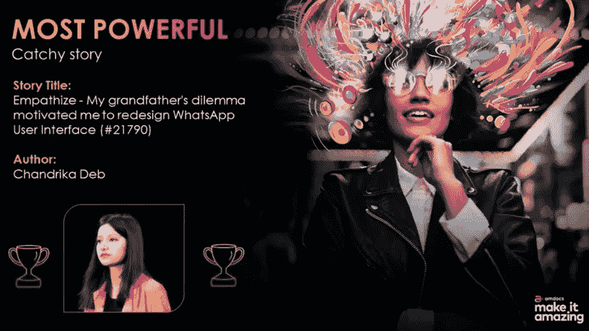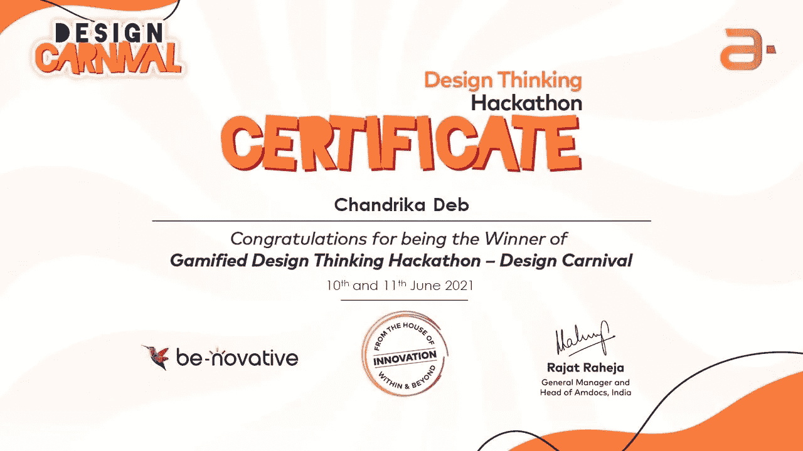

许多人在 LinkedIn 上认可并祝贺我。甚至我还从我的经理那里得到了一笔特别的奖金，奖励我在活动和常规项目中堪称典范的创新技能！是不是很酷？

# 交付团队——加拿大贝尔🇨🇦公司

久而久之，你的团队和工作也是如此！相反，我欣然接受了这种变化，并准备好迎接新的挑战。2021 年 10 月，我跳槽到加拿大贝尔公司的数字交付团队。

我的工作时间被拉长了，有更多的东西要学，还有一些要教别人！这份工作与 R&D 不同，但更令人兴奋。在这里，我有机会和最好的 Scrum 大师和导师 Ankit 一起工作和学习。

他的指导和职业道德是值得期待的。我们带着微笑度过了许多低落的日子，这都是因为我们的领导，Ankit。他微观管理团队的方式是任何人都应该渴望成为的！

在这个项目中，除了日常工作之外，我没有太多时间沉浸在活动中。尽管如此，我的经理鼓励我参加创新活动和焦点小组。

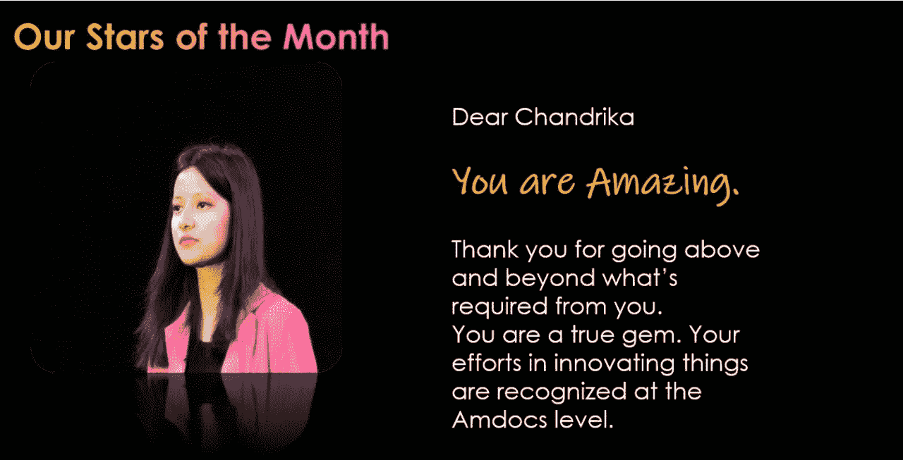

大约在这个时候，我得到了我的第二份奖金，月度之星，以及惊人的工作进展——是的！升职了！😍

# 行业经验最少的创新代理！😱

在参加了几个创新活动后，我参加了 **Amdocs India 创新代理 3.0 计划**。该项目在 Amdocs 印度公司挑选了 15 名创新代理人，他们将负责向他们的同事传授设计思维的知识。他们还将作为关键人物，帮助创新团队构建和组织全球各种 Amdocs 创新活动。

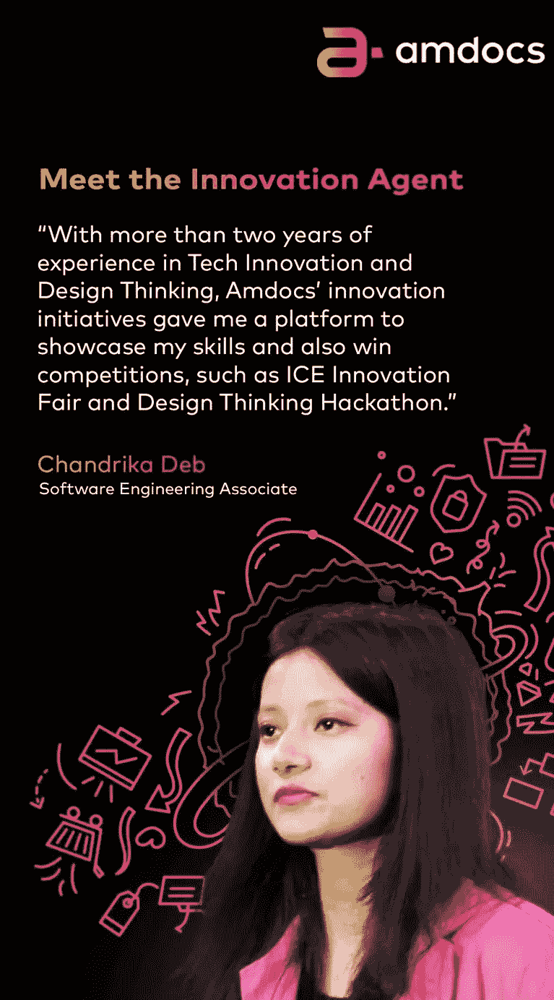

我经历了两轮面试。我唯一的目标是对我当时正在做的事情和未来的期望充满信心。我想改变 GenZ 员工对全公司创新活动的看法。

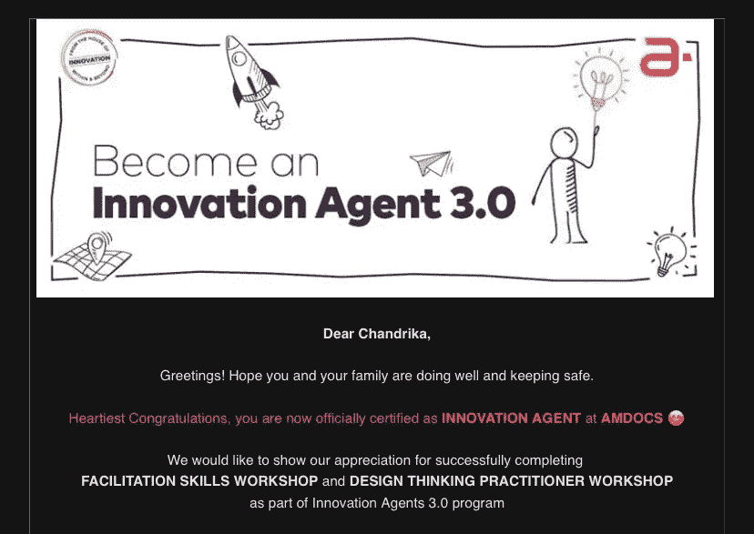

令我惊讶的是，我被选为创新代理人之一。当我发现我在名单上的工作经验最少的时候，我欣喜若狂！

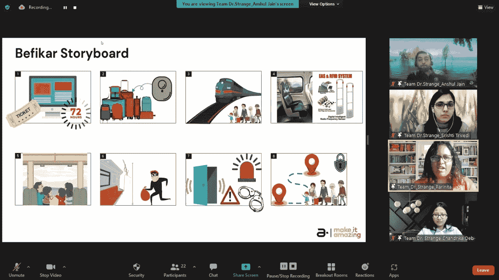

我们参加了为期六周的有效引导和设计思维的内部认证项目。我有机会与最有创意的人和行业专家一起学习，还有效地利用了 Canva 的幻灯片！😁

# 博客、舞蹈、艺术、书籍、测验…🎯

Amdocs 教我工作之余也要工作！每天我们都有这样或那样的事情让自己忙碌。从冥想和瑜伽课程到声乐演唱，只要说出它的名字！

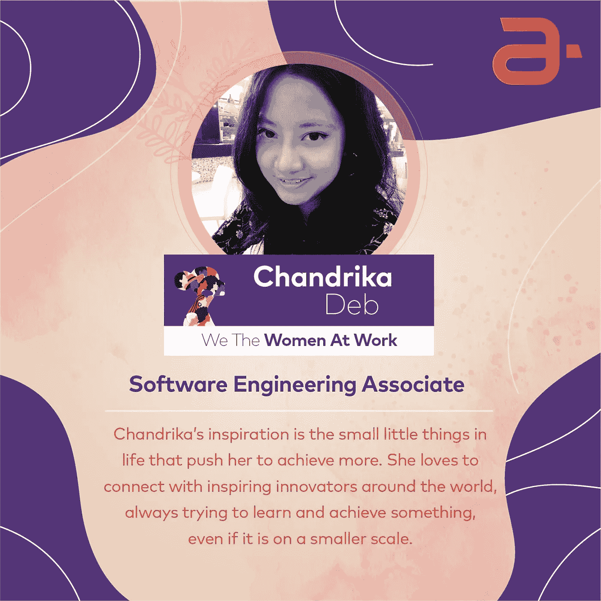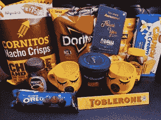

由于我对博客、艺术和舞蹈充满热情，我参加了各种活动，如 Amdocs 达人、朗读对话、筹款学员测验等。和我的家人一起。

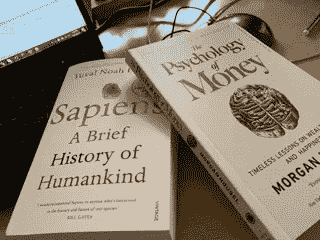

Amdocs 是一个如此体贴的雇主，每次都给我送来一大堆好吃的。我还在等待更多的好东西！💜

# 再见，安多克斯！👋

尽管如此，我不得不告别我梦寐以求的工作，继续深造。在我短暂的工作生涯中，能在这里工作、欢笑、学习和欣赏这些令人惊叹的人是一种极大的荣幸。

我会想念你们每一个人。希望有一天我们能再次相遇！

在那之前，再见安多克斯！

你们都将永远让❤️着迷