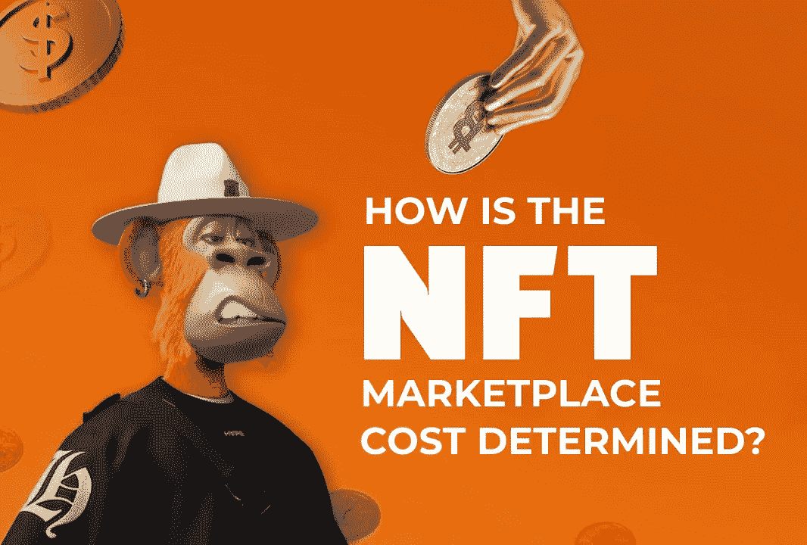

# 2023 年 NFT 市场开发成本如何确定？

> 原文：<https://medium.com/geekculture/how-nft-marketplace-development-cost-determined-in-2023-74a59f3cea1e?source=collection_archive---------7----------------------->

How NFT Marketplace Development Cost Determined in 2023?

早先批评 NFTs 诱惑人们使用字节大小的图像的人，在知道这些虚拟代币在世界上造成的影响后，现在已经开始敬畏了。虽然社区讨论深入版税成为一种选择或链上存储，但没有人会忘记 2021 年 NFT 繁荣期间的事情是如何展开的。从商业角度来看，NFT 市场发展战略的增长可以为非功能性服务业成为主流奠定基础。但是，我们永远不能忽视 NFT 市场的发展成本，这是贯穿每一个有抱负的企业家心中的一个重要因素。

## NFT 把 HODL 作为商业选择的前景是什么？

在深入讨论主导 NFT 市场成本的要点之前，我们应该思考这些平台作为商业选项的价值，以获得更好的清晰度。首先，NFT 市场是允许用户在各种利基市场创造和交易 NFT 商品的平台。

**点击这里**👉👉 [**创造 NFT 市场最优惠的价格**](https://www.blockchainappfactory.com/nft-marketplace-development?utm_source=Medium+GC&utm_medium=9%2F12%2F22&utm_campaign=senpagapandian) 🔥🔥

虽然最初仅限于数字资产和用例，但现实世界的用例在去年有所增加，推动他们打造一个强大的 Web3 业务模型。市场模型提供的灵活性使任何规模的企业都能够利用适合其能力和容量的业务来钻研 Web3 空间。

# 为什么 NFT 市场开发成本是一个重要因素？

为什么不放在第一位？事实上，一些企业在损失了 NFT 市场开发的成本后不得不改变他们的计划。作为一名处于开发 NFT 市场中间阶段的企业家，你可能不希望因集成过多或过少的元素而陷入困境。

即使潜在企业的规模非常庞大，真正的企业家也不会为他们的 Web3 创业投入大量资金(准确地说，“超出所需”)。

> ***“伟大的梦想伴随着巨大的代价，而这些代价在实现之后是完全值得的！”***

## 主导费用的 NFT 市场平台要素

*   **店面**显示单个 NFT 商品的信息，包括价格、描述、图片和所有权历史。
*   **NFT 市场的搜索引擎**帮助用户搜索他们想要的 NFT 收藏，而不需要使用搜索栏、过滤器和排序工具来浏览平台。
*   **创建列表的选项**允许卖家创建他们的 NFT，并通过添加相关细节在市场上公开销售。
*   **该平台中的拍卖门户**使感兴趣的买家能够参与 NFT 物品的投标，在那里他们可以出价，查看 NFT 的信息，并观看现场拍卖，以做出明智的决定。
*   内置加密钱包是 NFT 市场的一个必要元素，它允许用户持有和交易加密和非功能性交易。用户可以创建自己的钱包，也可以让用户链接现有的钱包。
*   向用户发送**即时通知**的选项可以通过有机方式帮助触发平台流量，同时让用户了解他们最喜爱的 NFT 系列的最新动态。
*   拥有**评论和评级**功能可以提升企业在 Web3 社区中的地位。这些允许客户提供反馈，可以帮助 NFT 风险投资和新用户。

## 分配预算以建立 NFT 市场时要考虑的外部因素

*   在开发 NFT 市场的过程中，从许多角度来看，用于该过程的**技术栈**对企业非常重要。尽管成本差异是一个需要考虑的重要因素，但在创建这种平台的同时，进入不同的市场是积极的。
*   平台的利基也将决定 NFT 市场的开发成本。与当代的应用领域相比，更独特的风格通常会更昂贵。
*   **开发团队和流程**对于确定启动 NFT 市场的总成本至关重要。一个典型的单元将由设计人员、开发人员、测试人员和分析人员组成，处理平台中的各种 Web2 和 Web3 元素。开发过程有两种方式——从头开始和定制白标解决方案。

## 散发最后的光芒

因此，以上几点定义了任何规模企业的 [**NFT 市场开发成本**](https://www.blockchainappfactory.com/nft-marketplace-development?utm_source=Medium+GC&utm_medium=9%2F12%2F22&utm_campaign=senpagapandian) 。这取决于企业家着手塑造他们的资源分配，以创建一个满足他们要求的平台。如果你正处于这样一个位置，考虑找一家有经验的 NFT 市场发展公司。它的专家可以通过倾听您的业务需求来帮助您确定启动新企业的成本。

> ***“从经验丰富的公司专家那里以最优成本利用 NFT 市场模式的力量”***