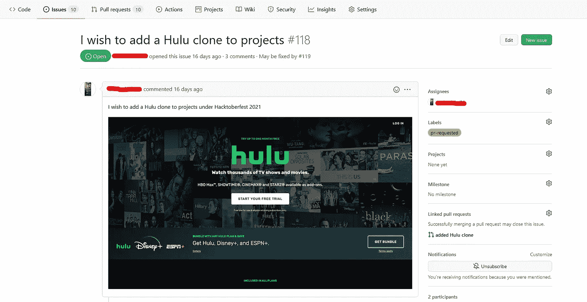
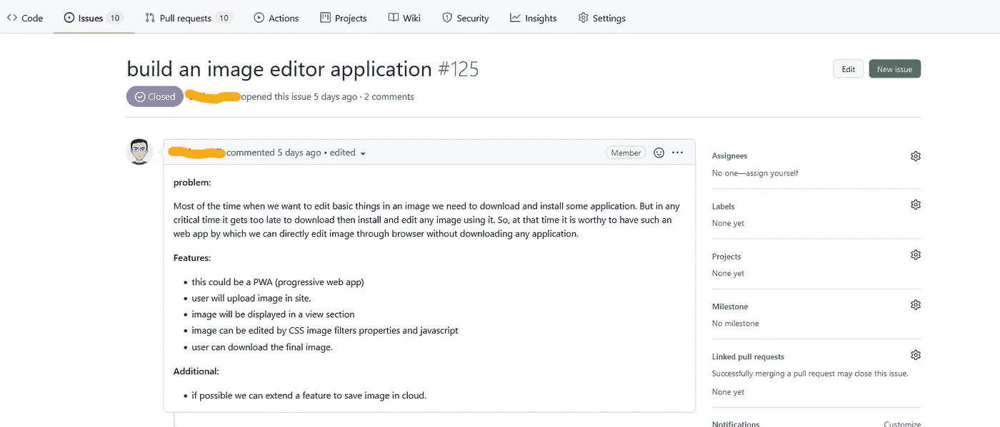
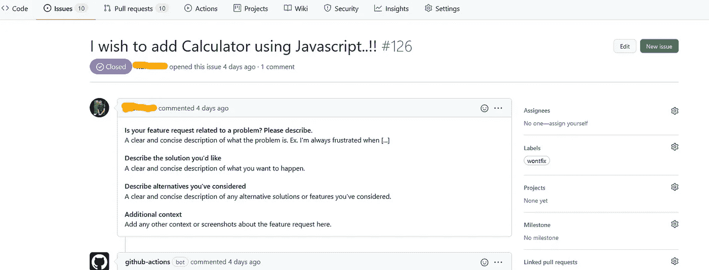
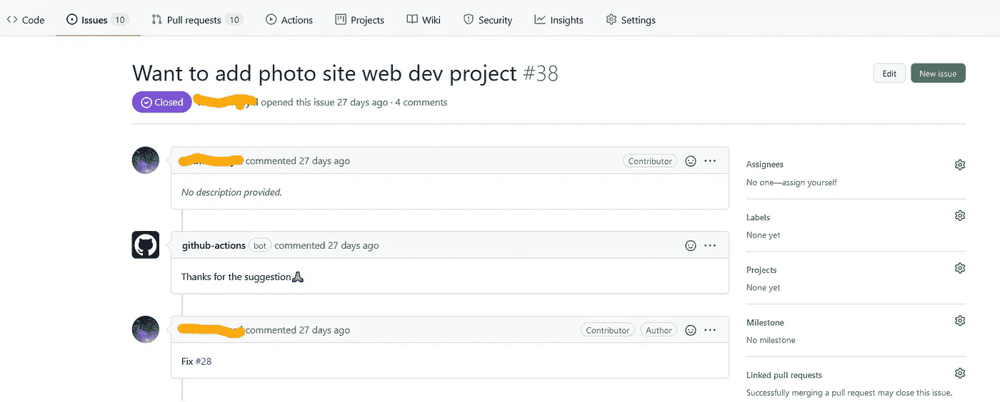
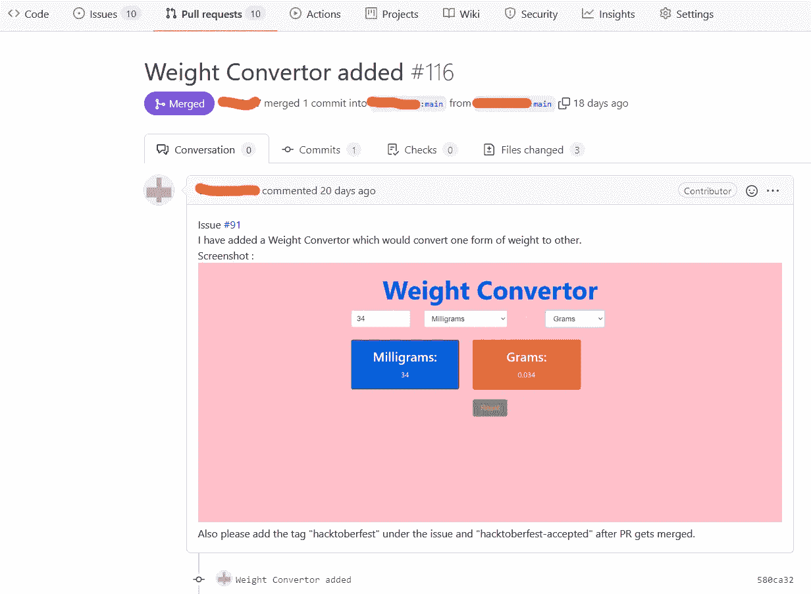
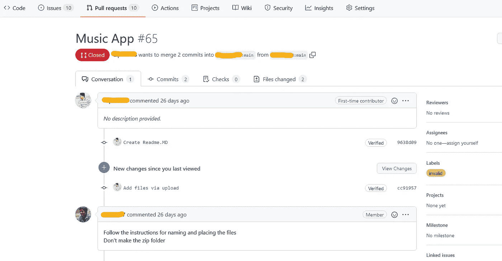
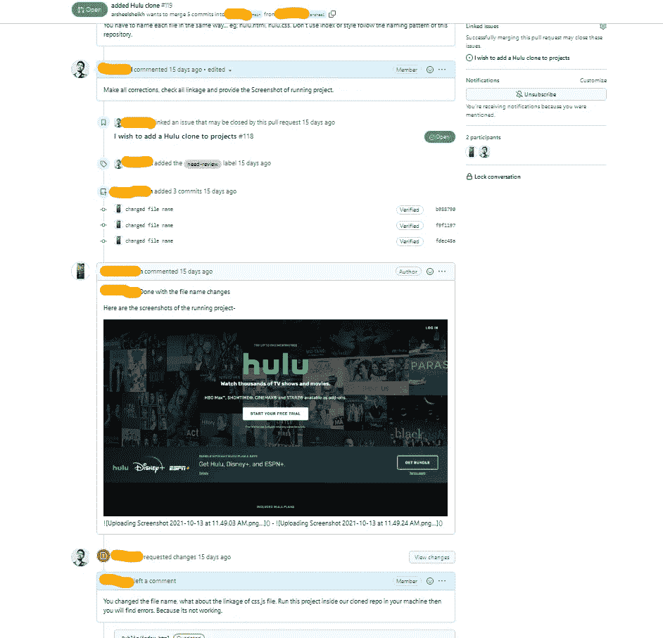
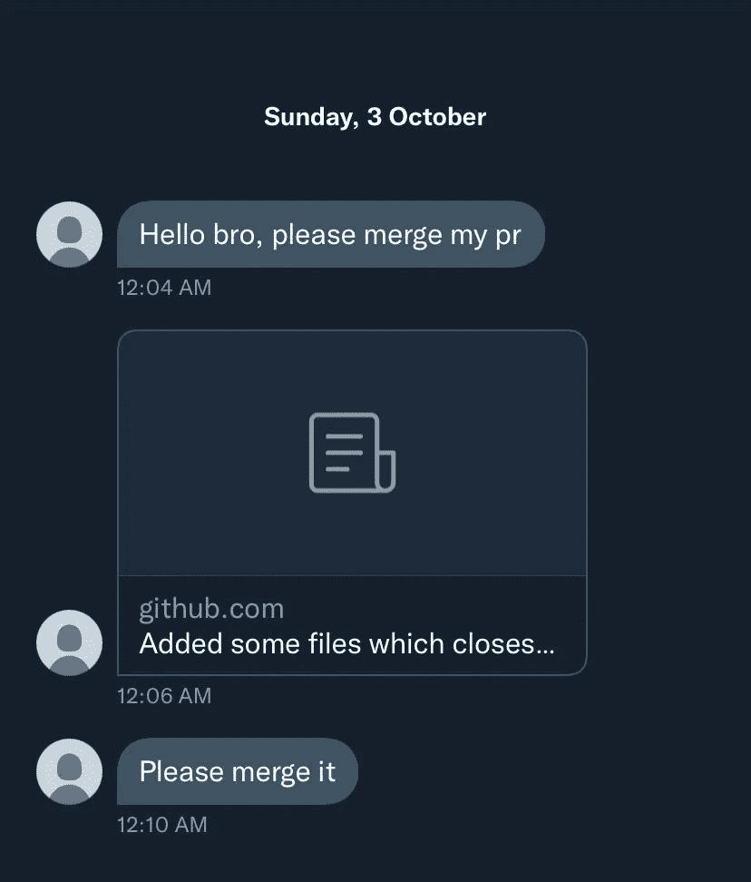

# 如何不对 GitHub 上的开源做出贡献:给初学者的提示

> 原文：<https://medium.com/geekculture/how-not-to-contribute-to-open-source-on-github-tips-for-beginners-9a614ab38e85?source=collection_archive---------8----------------------->

在 Hacktoberfest 2021 期间维护 GitHub 上的一些项目时，我遇到了许多新的开源贡献者。他们才刚刚开始他们的开源之旅，犯错误。一开始，犯错误并不是一件坏事。但是，正确地为开源项目做贡献也非常重要。

在这篇文章中，我将讨论一些关于- **如何不在 GitHub** 上贡献开源的技巧。

# 了解项目

对项目的理解，比如文件夹是如何排列的？文件是如何链接的？使用的是哪种技术？在 GitHub 上的任何项目中，在提出问题或提出拉取请求之前，是最重要的事情。

D **在没有阅读任何项目的贡献指南的情况下，不要提出拉动式请求或提出问题。总是阅读项目的 README.md 文件，其中大部分时间都在编写与项目相关的所有内容。此外，在你的机器上克隆这个项目，并浏览每个文件一次，以了解它的工作情况。**

# 提出问题

如果你想解决任何 bug 或者为一个项目贡献一些代码，那么你必须提出一个问题。但是一定要检查其他人之前提出的问题，以确认是否有其他人正在解决或描述你要解决的相同问题。

DT10 不要提出一两个字的问题，那对其他任何人都没有意义。永远记住在问题中添加适当的细节/背景，因为问题就像一个与你或其他任何人想要在项目中做出的改变相关的对话链。为问题写一个恰当的描述和恰当的标题，同时添加截图、链接、信息或解决问题的方法，以便正确理解。提出问题，让项目维护者或贡献者快速理解你的观点和建议。

## ✅做这件事

## ❌ **别这样**

# 提出拉取请求

你的公关应该做一件事。总是为一个部分或部分做一个拉请求，这样评审人员和维护人员就可以更容易地合并你的拉请求。如果您要解决一个项目中的多个问题，请打开多个 PRs。

D **不能**在一个中制作多个 PRs，这有时会造成混乱，还会延迟合并过程。让我们假设您正在为项目中的一个新特性制作一个 PR，并且您还发现了一个与同一个项目的不同部分相关的 bug。不要在同一个 PR 中修复那个 bug。因为有时会增加项目价值的其他变更会因为一个项目中的多个 PRs 而被延迟。使 PRs 小而有针对性，这将有助于您的拉式请求更容易合并。

D**on**这样开一个 PR:

> -修复了 bug **#343**
> -增加了新的林挺规则
> -包括特性 **#466**

在 PR 描述中附上截图或者一些与你的改动相关的信息也是非常好的做法。这将有助于维护者或评审者区分变更。

## ✅Do 这个

## ❌Don't 做的

# 批准和失效的 PRs

在维护人员给你许可或把问题分配给你之前，不要开始任何项目。不要立即打开提取请求。等待维护人员的批准。

> -如果问题已经公开并且没有分配给任何人，请询问维护人员您是否可以解决这个问题。
> -开始你的公关工作。
> ——不要让维护者给你分配一个已经分配给别人的问题。

有时你在公关工作中感到困惑，也许你失去了兴趣或其他原因，请不要让打开的公关保持原样，确保关闭那个**死亡的公关**。维护者可能不想关闭它，因为他们不想让你心烦。这对项目和你都没有好处。如果您想在将来处理该请求，您可以随时重新打开该请求。

# 有意义

每一份贡献都是有价值的。如果项目中的某个环节出了问题，比如文档中的某个重要环节出了问题，那么这个问题就需要解决。但是如果你把一个⚡表情符号改成🚀，这个没多少价值。

DT22【上】不能打破一致性。

> -每次提交更改时，请确保遵循正确的文件顺序和目录。
> -删除分号，添加空格，或者在不喜欢的项目中将文本加粗。

# 困扰维护者合并

当您创建任何拉动式请求或问题时，我知道您会很兴奋。维护者会得到一个通知，你提出或冠。你不需要添加额外的评论和标签。如果这需要时间，给他们打个友好的电话，在评论中留言就可以了。

DT2 不要在 Twitter、Discord、LinkedIn 或任何其他社交网站上通过给他们发送你的问题或公关的链接来与他们争论。他们从他们维护的项目中获得通知，而您正在添加更多通知。这会给维护人员造成更多的困惑。记住，大多数维护项目的人来自不同的时区。他们中的许多人除了工作之外还维护开源项目。耐心点！你可以在一周左右后给他们一个友好的提醒。

## ✅Do 这个

## ❌Don't 做的

**如果你❤️我的内容！帮我接通** [**Twitter**](https://twitter.com/Astrodevil_)