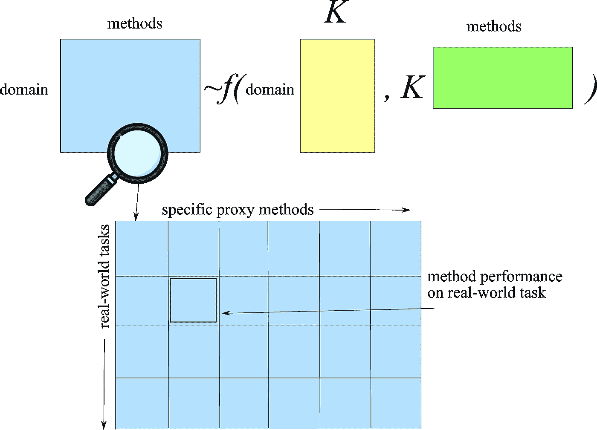

# 如何在评估可解释性时不出错？

> 原文：<https://medium.com/geekculture/how-not-to-stumble-while-evaluating-interpretability-3af6c122621?source=collection_archive---------15----------------------->

影响 XAI 可解释性评价的隐性因素

Photo by [**Mark Neal**](https://www.pexels.com/@mark-neal-201020?utm_content=attributionCopyText&utm_medium=referral&utm_source=pexels) from [**Pexels**](https://www.pexels.com/photo/brown-road-sign-on-pavement-near-mountain-2009968/?utm_content=attributionCopyText&utm_medium=referral&utm_source=pexels)

一朵花不想和它旁边的花竞争。它只是开花。—禅心

在[之前的一个故事](/geekculture/evaluating-interpretability-in-machine-learning-models-a9fd4ebb1b10)中，我谈到了机器学习(ML)模型的可解释性无法通过任何特定的指标来衡量。但是有办法设计实验来帮助评估它。评估方法可以是寻求专家的意见(基于应用的评估)，或设计更简单的任务，保持真实任务的本质(基于人的评估)，或使用现有的解释模型作为代理(基于功能的评估)。

现在你已经知道了这三种评估，如果你决定使用它们，是时候知道可能的陷阱了。

这三种方法可能有共同的缺陷。也许我们可以提出一些问题把他们联系起来:

> 如果您已经决定使用一个代理来解决现实世界的问题，哪一个应该是最合适的？这个问题与基于功能和应用的方法相关
> 
> 如果你想设计简单的任务来模拟真实的最终任务的一部分，在设计时你应该记住什么因素？这一点对于基于人和基于应用的评估非常重要
> 
> 你如何描述所要求的解释质量的代表？这个问题与所有三种方法都相关

以下是答案。

**利用数据发现可解释性因素**

分类和聚类问题已经通过矩阵分解进行了评估。在这种方法中，构建了一个矩阵，其中行映射到现实世界的任务，列映射到特定的低级方法。矩阵中的每个单元将显示低级别方法相对于现实世界任务的表现如何。它可能看起来像这样

An example of the data-driven approach to discover factors underlying interpretability. Image re-drawn by the author. Magnifying glass icons by [freepik](https://www.flaticon.com/free-icons/magnifying-glass)

矩阵构造对于发现有助于可解释性的因素，以及如何设计简单的任务来最好地解决实际问题是有用的。那为什么它不是绝对受欢迎的解决方案呢？嗯，挑战在于矩阵构造。以诊断 SARS-Cov-19 感染阶段的 ML 系统为例。现在，用于评估这两个任务的数据将从患者记录中借用，这可能是一个问题，因为存储库可能不具有用于准确评估的所有数据属性。或者以贷款审批系统为例。理想情况下，数据质量和完整性需要一个领域专家。此外，它需要创建包含与需要人工输入的现实任务相对应的问题的知识库。因此，矩阵分解所涉及的工作将必须考虑到创建这种库的挑战，因为它们必须包括人类评估系统。

实际上，构建这样的矩阵将是昂贵的，因为必须在实际应用的环境中评估每个单元，并且解释每个单元将是迭代的工作。

任务相关的可解释性因素

两个看似天壤之别的应用程序可能在幕后使用相似的 ML 模型。以一个电影推荐应用程序和一个为药剂师提供化合物选择的应用程序为例，药剂师可以用这些化合物配制特定的药物。在这两种情况下，推荐模型都提供了核心功能。那么，当我们需要评估它们的可解释性时，是什么将它们区分开来呢？让我们聚焦于使应用程序相似(或不同)的各种可解释性方面:

*   **全球或本地的可解释性？**具有可解释性的应用程序需要关注模式的存在，需要全局可解释性。然而，需要分析决策原因的应用程序需要本地可解释性。这种应用程序可以是一个贷款审批系统，其中的解释将深入研究是什么因素导致个人请求被拒绝。一个分析驱动星系形成的关键特征的 ML 系统需要全球的可解释性
*   **不完整的严重程度？**所需要的解释类型可能会有所不同，这取决于问题的来源是否是由于不完全指定的输入、内部模型结构、成本，甚至是理解训练算法的需要。不完整的严重程度也可能影响解释需求。例如，自动驾驶汽车的安全性可以通过一系列问题来评估。一方面，人们可能会对自动驾驶汽车如何决策产生普遍的好奇。另一方面，人们可能希望检查特定的场景列表，例如，导致汽车偏离道路 10cm 的传感器输入集合。在这两者之间，人们可能希望检查一个一般属性，如安全的城市驾驶，而没有详尽的场景和安全标准列表。
*   **时间限制？**用户能花多长时间来理解解释？需要在床边或工厂运行期间做出的决定必须能被迅速理解，而在科学或反歧视应用中，最终用户可能愿意花费数小时试图完全理解一个解释。
*   **用户专长的本质？**用户在任务中的体验如何？用户的体验将影响他们拥有什么样的认知组块，即他们如何将信息的单个元素组织成集合。例如，临床医生可能认为自闭症和 ADHD 都是发育性疾病。用户专业知识的性质也将影响他们期望的解释的复杂程度。例如，领域专家可能期望或喜欢更大更复杂的模型——确认他们知道的事实——而不是更小更不透明的模型。

**可解释性的方法相关因素**

与应用程序类似，评估方法也可以共享与它们作为解释的效用相关的共同品质。那么可能对应不同解释需求的因素有哪些呢？

*   **认知语块的形式。**比较能区分方法的问题可以是关于解释的基本单位是什么？它们是原始特征吗？是否存在对专家具有某种语义意义的衍生特征，例如，疾病集合的“神经障碍”或像素集合的“椅子”?
*   **认知组块数量。**如果我们将认知语块定义为解释的基本单位，那么这个解释包含多少认知语块？数量如何与类型相互作用:例如，一个原型可以包含比一个特征更多的信息；我们能以相似的数量处理它们吗？
*   **合成水平。**认知语块是以结构化的方式组织起来的吗？规则、层级和其他抽象概念会限制一个人一次需要处理的内容。例如，解释的一部分可能涉及定义一个新单元(块),该新单元是原始单元的函数，然后根据该新单元提供解释
*   **单调性和其他认知语块之间的相互作用。**认知语块以线性或非线性方式组合有关系吗？有些功能对人类来说比其他功能更自然吗？
*   **不确定性和随机性。**人们对不确定性测量的理解程度如何？人类对随机性理解到什么程度？

总结一下，在创建应用程序、人类理解科学和更传统的机器学习模型之间的正式联系方面，有许多开放的问题。我们应该按照我们上面讨论的因素，用一个共同的基础对我们的应用程序和评估方法进行分类。因为围绕这些因素创造一种共同的语言不仅对评价而且对相关工作的比较都是至关重要的。

**来源**:

[迈向可解释机器学习的严谨科学](https://arxiv.org/abs/1702.08608)