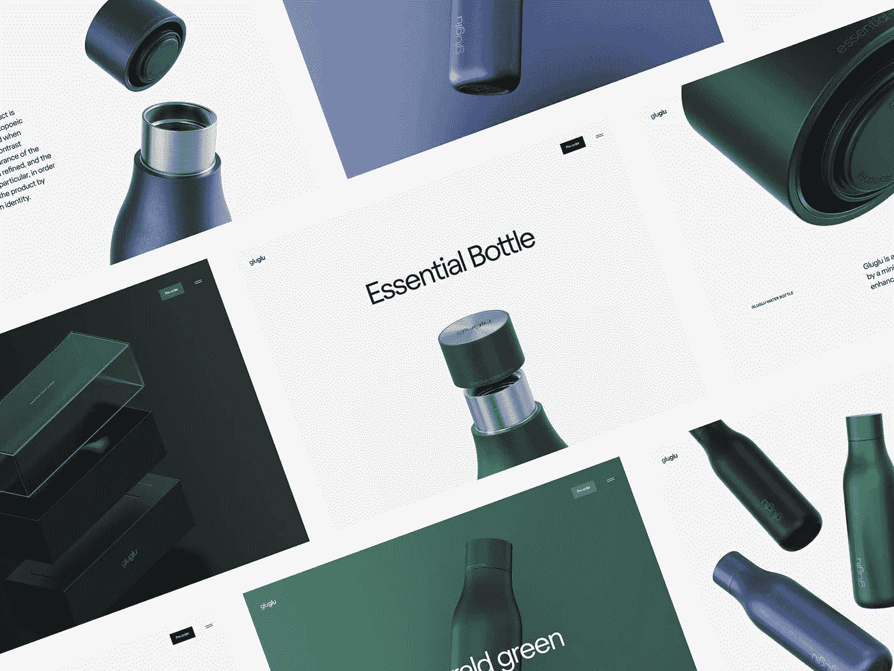
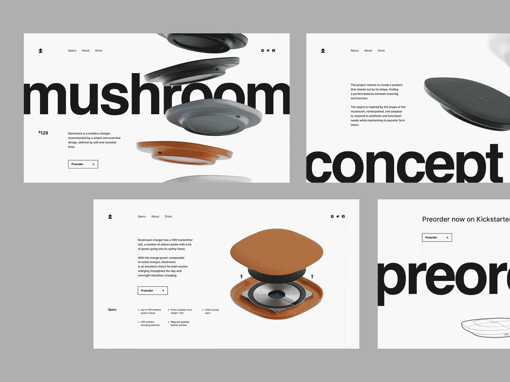
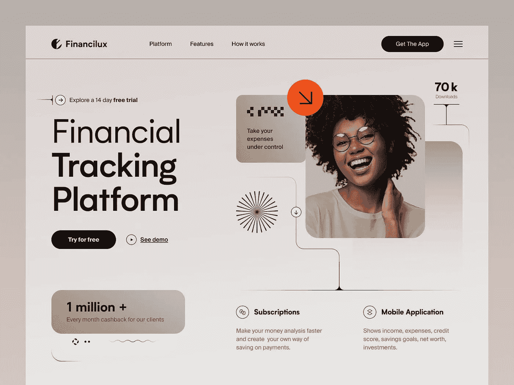
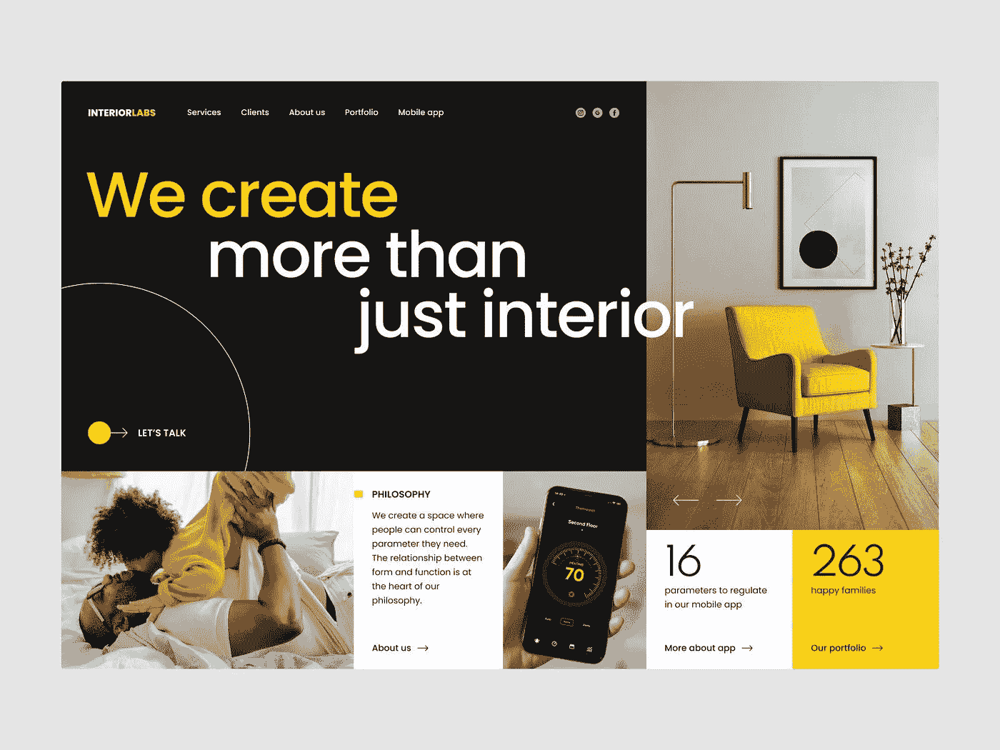

# 你多久需要重新设计你的网站？

> 原文：<https://medium.com/geekculture/how-often-do-you-need-to-redesign-your-website-e3a06da6fc3b?source=collection_archive---------12----------------------->

*作者:Judely Delva，**文案*

**

*Concept by Shakuro*

*没有什么比重新设计你的网站更令人兴奋或害怕的了。这是一个更新品牌形象的机会，可以为你的用户或潜在客户提供一些视觉上吸引人的东西。一些公司一年要对他们的网站进行几次改造，确信他们还没有找到合适的外观。(不要成为那个家伙。)其他公司太久不更新网站了。你应该多久重新设计一次你的网站，为什么要这样做？*

# *为什么需要重新设计你的网站？*

*保持网站的更新和内容的新鲜至关重要。人们会认为你不是失业了，就是不重视你的网络形象。是时候重新设计了吗？这里有几个指标。*

***你的流量很大，但是转化率很低***

*你网站的访问者没有采取任何行动就离开了吗？你的跳出率高吗？你的访问者在你的网页上花的时间很少吗？这意味着你让人们很容易找到你，但你最终没有给他们提供他们想要的东西。这可能表明你的网站需要一些(或很多)改造。你的网站应该实现一个目标，不管这个目标是让访问者购物、阅读你的博客还是给你打电话。如果这种情况没有发生，有些东西需要改变，因为你的网站没有转换。*

***你根本得不到流量***

*如果你的网站流量是不存在的，那就有严重的问题了。内容没有优化，你正在做一些激怒谷歌的事情，比如未能解决破损的功能和重复的内容，或者设计已经过时。无论你做什么，如果你的网站访问者只有你一个人，那就必须有所改变。*

***你仍然缺乏一个手机友好的网页设计***

*这个很大。为什么？很简单:现在企业的大部分流量来自移动设备。根据研究，2022 年移动设备占互联网使用量的比例高达 [50.48%](https://research.com/software/mobile-vs-desktop-usage#:~:text=When%20it%20comes%20to%20mobile,amount%20of%20traffic%20at%203%25.) 。这个数字可能会增加。你为移动应用优化过你的网站吗？如果没有，你需要迎头赶上。*

***您客户的信任***

*根据 Klipfolio MetricHQ 的数据，用户在网站上平均花费 [52](https://www.klipfolio.com/metrics/marketing/average-time-on-page/) 秒，客户在访问你的网站的 15 秒内就对你的公司做出信任判断，信不信由你。如果它被证明是旧的和过时的，一些人会犹豫是否与你做生意。*

***贵公司已变更***

*一年之内，你的公司经历了重大的转变。这些变化通常不会反映在你的网站上。我说的是人事变动，你提供的产品或服务的变化，或者你现在提供更多的服务，或者你可能试图精简你的系统，提供更少的服务。你的网站应该给你的客户提供一个准确的公司图片，而不仅仅是一个概述。*

*考虑是否需要改造的另一个原因是检查显示人们如何反应的指标，看看它能告诉你什么。*

**

*Wireless charger website design concept by Conceptzilla*

# *你应该多久重新设计一次你的网站？*

*需要明确的是，没有一个放之四海而皆准的解决方案。然而，作为一个通用的经验法则，你的网站应该每两到三年进行一次改造。这是因为如果你的网站已经存在了一段时间——在数字世界中存在了一辈子——它很可能已经过时了。*

*还记得手机版网站有自己的网址吗？这继续困扰着我们的梦想。*

# *有哪些关键的网站重新设计服务？*

*有很多选择可以影响网站重新设计的成本，所以**在估算预算之前，你必须首先确定工作量。***

*在重新装修、重新布线、改造或重建你的网站之前，你应该考虑缺少什么和你想改变什么。只有这样，你才能确定潜在的改造成本，以及为什么你应该考虑更新或完全把你的网站到一个新的水平。*

1.  *重新装饰*

*这种方法的成本通常是其他 web 重新设计方法中最低的，但它取决于工作方法和您选择来完成任务的工作人员。重新装修是最简单的网站重新设计，因为它只影响网站的外观和布局。*

*当改变颜色，添加新的图像或视频，或者插入拉手或传送带时，这将是有用的。但是因为只是参考设计，所以重新装修并不会影响页面加载的速度或者网站的响应速度。因此，虽然这种方法对你的企业来说不是一根魔杖，但如果你的网站运行良好，它会有所不同。*

*2.重新布线*

*重新布线是重新设计现有网站的一种更深入的方法，它可以通过利用尖端技术来帮助使网站更快、更现代、更高效和更有用。这需要使您的代码和/或后端基础设施现代化，改变内容管理系统，迁移到云以提高网站的加载速度，并为您的客户提供更高的安全性和可用性。*

*可以理解，重新布线会比重新装修更贵。额外的订阅、插件、 [UX 设计服务](https://shakuro.com/ui-ux)、迁移计划以及熟练技术专家的工作都将包含在价格中。*

*3.改造*

*重塑整合了前两种网站重新设计方法的选项。除了更快、设计更好的网站之外，您还可以获得更新，使您的页面更加实用。*

*重塑花费更多的金钱和时间，但产生更好的结果。你需要一个包括后端开发人员、网页设计师和技术专家的团队。他们将协助你处理所有的任务问题，并一起专业地工作。*

*4.重建*

*其他网站改造选项中最全面的方法，改变你网站上的几乎所有东西。准备好为你的设计付出最大的代价。主要思想将保持不变，但代码将完全不同。*

*如果你想改变你的风格，你可能需要这样做。事实上，您将使用上一个网页中的信息从头开始创建一个新网页。要重建，您必须更改内容管理系统、设计、服务器、代码和数据库。*

*你会问，那一定很贵吧？是的，它很贵，但你会得到一个满足所有要求的现代化网站。我是说，这是值得的。*

*5.大小*

*你希望你的网站有多少页面，它们的大概大小，以及一个内容大纲。所有这些规格都与所需的尺寸有关。**你应该考虑这些问题，决定你是否需要一个内容创作者，或者你是否可以自己做。***

*只有这样，你才能对价格做出有根据的猜测。但是请记住，更多的页面需要更多的时间、内容、小细节、修改，最终需要更多的钱。*

*6.设计*

*设计的类型和复杂程度也对价格有影响。你会满足于现有的图片吗，或者你想雇一个插图画家来给你的网站增加更多的个人色彩？您设想它托管信息图表、视频或动画吗？*

*丰富的视觉内容会吸引更多的访问者，但是，请记住，随着页面内容的增加和成本的上升，网站的加载速度会下降。您可以在代码和服务器环境中使用缓解技术，但是这可能需要额外的时间、金钱和精力。*

**

*Financilux website design by Halo UI/UX*

# *独立网站重新设计的平均成本*

*正如你所看到的，你有三个选择来重新设计你的网站:自己动手，雇佣一个内部团队，或者雇佣外包专家。显然，第一种选择是最实惠的。但是，对于这个选项，你必须有足够的时间和知识。如果对你来说没什么大不了的，你的花费平均在 1000 美元到 5000 美元之间。*

# *自由网页设计的费用是多少？*

*雇用自由设计师或开发人员有其关键优势，例如让你专注于其他需要关注的领域，而不是学习如何编码和使用各种程序。*

*自由网页设计的价格会根据你的目标和你的员工的资质水平而变化。一个简单的网页将花费 2000 到 10000 美元，一个更复杂的网页将花费大约 10000 美元甚至更多。*

*如果你选择这个选项，你应该准备好接收一个专业设计的互联网网站。但是要记住，这些工人只会执行你的命令；不要期望从他们那里得到建议或额外的输入，因为他们通常同时有几个任务，所以设计会花费更长的时间。*

*如果你不需要一个复杂的网站，自由职业是一个很好的选择，因为它的成本是合理的。因为价格是一样的，你应该考虑为一个更复杂的项目雇用一个代理机构。*

**

*Interior website design by Ramotion*

# *请一个网页设计代理公司要多少钱？*

*如果你需要很多空闲时间，这个选项是理想的，因为你将拥有它。一个代理机构向你保证优秀的结果和完全实现你的愿望。您的网页设计将由一个由高素质专家组成的大型团队来完成，它将是现代化的、反应灵敏的和可用的。*

*他们可以帮助你发展你的想法，推荐改进产品的方法，并确保每件事都做得正确。一个代理团队拥有多年开发数字项目的经验，因此他们知道人们想要什么，以及如何满足他们。如果你雇佣了一个团队，你应该期待长期的合作。*

*雇佣一个机构来重新设计你的网站是最昂贵的选择，但是值得的。代理公司平均改造费用在 10，000 美元到 100，000 美元以上。*

*代理机构将为您提供网站地图架构以及详细的设计和实施建议。团队不仅会考虑你商业计划的每一步，还会考虑你的未来。*

***不管怎样，网站维护是永无止境的。***

# *最后*

*无论你什么时候决定改进你的网页，请记住，你总是在执行维护和进行微小的改进。*

*让我们回顾一下，好吗？在整篇文章中，我们展示了改变网站外观对于潜在客户和现有客户以及公司的重要性。网页本质上是你公司的门面，它不仅要反映你提供的服务，还要反映背后的团队，还要反映你的价值观。*

*这是我们停下来告诉你的地方，现在球在你脚下。花时间选择你认为需要的正确的改变，当有疑问时，总是咨询专业人士并相信这个过程。*

**最初发表于*【https://shakuro.com】*