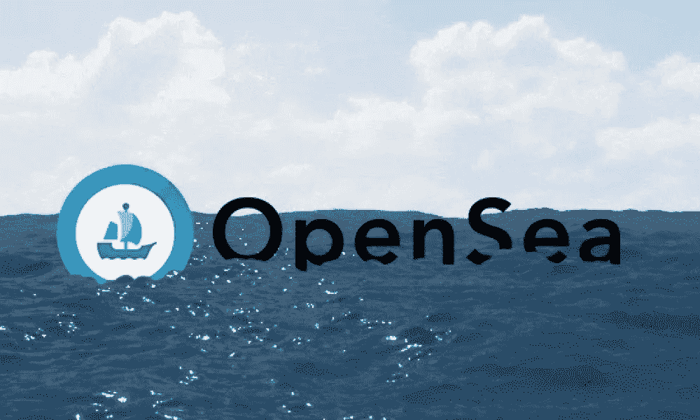
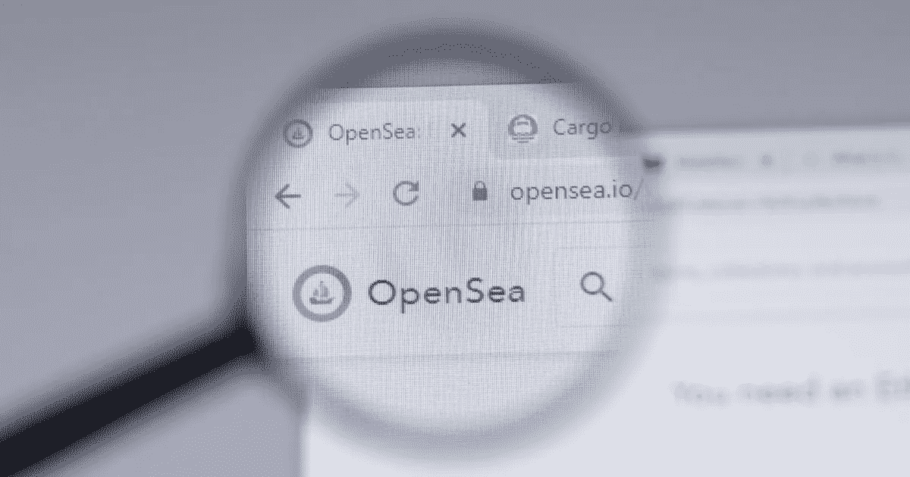
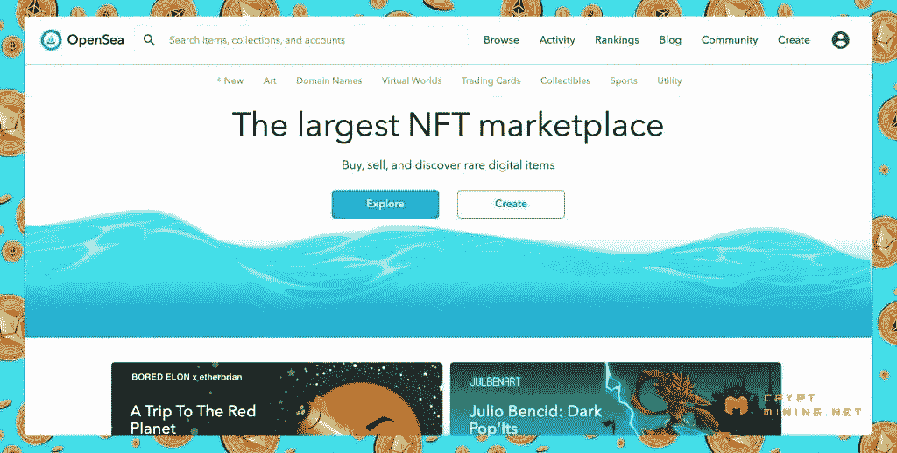

# Opensea 克隆脚本如何为您的企业带来利润(7 种收入模式)

> 原文：<https://medium.com/geekculture/how-opensea-clone-script-is-lucrative-for-your-business-7-revenue-models-1918dea541b4?source=collection_archive---------17----------------------->

在数字市场，由于几个原因，Opensea 已经成为一个新的里程碑。它为投资者、企业家和初创公司提供了一个从中获利的绝佳机会。为此， [**创建 Opensea 克隆脚本**](https://radindev.com/opensea-clone-script/) ，复制原始市场，给创业者和创业公司提供了在密码行业取得成功的大好机会。随着 NFT 市场的不断增长及其价值的上升，这些平台每天都在吸引更多的用户。另一方面，市场受欢迎程度的提高吸引了更多的投资者，这意味着它在未来将有巨大的潜力。

# 为什么企业家想要这样一个市场？

现在，Opensea 是最受欢迎的 NFT 市场，由于其大量的用户，许多企业家愿意建立类似的市场来盈利。更准确地说，根据统计，2019 年之前，它赚了 2 百万美元，而在 2020 年末，它达到了 94.8 美元。此外，在 2021 年，原始市场获得了 275 亿美元的销售额，平均每天的费用收入为 420 万美元。这些统计数据清楚地表明，为什么建立这样一个平台对许多企业来说是有利可图的，并会吸引企业家和初创公司。

这个 NFT 网站允许企业家以负担得起的方式快速启动他们的 NFT 市场。此外，克隆体中多样的收入模式及其汽油费使其成为想要低风险高收入投资的人的绝佳选择。

# 创建这样一个 NFT 市场的商业利益

这个 NFT 市场优于其他 NFT 市场，因为 NFT 贸易业务的投资额约为 1 亿美元。使它独一无二的主要因素是它的简单性、大量的投资和它的收入。此外，为了降低计算能耗，该平台希望优先考虑可扩展性。这个基于以太坊区块链网络的 NFT 市场鼓励开发人员利用他们的点对点 NFT 市场平台进行不同的活动，如交换、购买、出售和拍卖特定的数字资产和加密项目。因此，作为创作者，您可以利用创建您的 NFT 市场克隆脚本。其中一些好处如下:

- **高投资回报率(ROI)或投资回报率**指的是投资的增长或损失的百分比，并使用这一指标来衡量投资资产能赚多少钱。

- **品牌身份**:使用这个克隆，你可以创建你的品牌身份，并针对你的利基和特定受众。

- **即时市场午餐**:由于 Opensea 的克隆脚本是其原始 marketplace 的复制版本，因此可以快速部署，开发人员团队只需要几天时间就可以根据您的业务需求实现您的定制功能。

- **欺诈交易的可能性为零**:当你使用克隆脚本创建这样一个市场时，欺诈交易的可能性几乎为零。欺诈交易是指未经授权使用个人账户或支付信息。

- **高效的监控和跟踪**:这种从克隆脚本代码发展而来的市场可以支持对市场的精确监控和参与。

- **Beta 模块**:有了这个特性，网站所有者可以为他们的 NFT 市场运行多次测试。

- **低成本**:使用克隆脚本的平台开发成本明显低于其他方式。

- **高可伸缩性**:该脚本允许对功能和视觉效果进行高度定制，这使得该软件成为根据您的业务需求构建 NFT 市场的绝佳候选软件。扩展的修改范围使开发人员或网站所有者能够根据业务需求集成所有需要的功能和更改，从而实现 NFT 平台的高可扩展性。

- **高级定制**:由专家开发团队开发的 Opensea 克隆脚本可以根据客户的特定需求进行定制。克隆脚本中可以包含的附加特征和功能有助于网站所有者创建功能丰富的 NFT 市场。

- **创收**:在 NFT 市场开展业务能让你以完全安全的方式创造大量收入。多重收入流(在下一节中详细描述)是通过这个市场产生的，它们是最好的 NFT 收藏品的中心。

*   **最低交易费用**:这是用户使用这个平台最好的部分之一。

# Opensea 克隆版的收入模式

您可以使用以下提到的功能从这个市场中赚钱:

# 上市费用

买卖 NFT 是数百万用户的中心。他们可以根据用户的兴趣，根据不同的类别列出 NFT。如果你向内容创作者收费，让他们把非功能性交易放在在线平台的列表上，这将会有所帮助。

# 交易费用

作为 NFT 市场的所有者，你可以为 NFT 市场的每笔交易收取少量费用。收取一定比例的费用作为维持平台功能的汽油费。

# 铸造费

这种税是从 NFT 开发商那里征收的，因为他们将自己的艺术品转化为不可替代的代币。

# 初始安装费用

创作者第一次在你的 NFT 市场克隆脚本市场中列出他们的 NFT，并被要求收取较低的初始设置费。

# 私人销售

最终确定投资者可以从 NFT 创造者那里获得时间；为了让它永不过时，你可以使用这个选项向使用你的 NFT 市场的卖家收取费用。

# 成套销售

一些用户想把他们的大量 NFT 卖给几个投资者。在这种情况下，你可以收取执行链上交易的费用，并收取最终 NFT 价格的费用。

# 投标费用

这是专为买家谁进入投标。在这方面，他们应该为他们的每一次出价支付费用。

# 对 Opensea ventures 的投资

Opensea script clone ventures 专注于四大投资主题:

-不可替代和可替代令牌继续向多链世界转变。

-创建并支持基于 NFT 的协议和其他加密原则。

-使用社交和游戏流作为加密元素的分布式机制。

-优先考虑该平台和其他类似 NFT 市场上不可替代的代币和分析支持活动。

# 平台天然气费

想参与交易的用户要交很高的燃气费。“无汽油”功能被添加到市场中，以降低基于多边形区块链的增强价格。通过让 Opensea 克隆脚本上的 NFTs 在多边形侧链上运行，可以消除汽油费。因此，不会有昂贵的竞价 NFTs，也不会有昂贵的钱包整合费。

# 如何创建这样一个 NFT 市场？

如果你从 UI 设计开始，拥有一个适当功能化的 NFT 市场会有所帮助。这个克隆的一个有趣的地方是，它的设计方式可以在几个区块链网络上工作。根据客户的需求，设计的类似 Opensea 的平台可以支持多种区块链网络和钱包。尽管如此，开发 Opensea 脚本的过程由以下几个简单的步骤组成。请注意，这些是主要的:

# 1.用户界面设计和开发

第一步是设计一个吸引用户的有吸引力的用户界面。如果 UI 设计得当，可以给人更好的用户体验。

# 2.选择区块链网络

第二步是选择一个合适的区块链网络。开发团队在这一步应该很聪明，选择最适合客户业务需求的区块链。选择一个合适的区块链平台对客户的 NFT 市场的未来发展至关重要。

# 3.钱包整合

在您将要开发的这个克隆脚本中，提供对多个加密钱包的访问是非常重要的。这一步简化了用户在市场中与钱包的交互。钱包集成在交换平台中也很重要，如币安克隆脚本或 Pancakeswap 克隆脚本。

# 4.制定智能合同

智能合约是为分散的 NFT 市场设计的。由于 Opensea 克隆脚本、Rarible 克隆脚本、币安克隆脚本等。，是分散的市场，这一步将是脚本开发的重要组成部分。

# 5.添加必要的特性和功能。

开发这个 NFT 平台的最后一步是添加必要的特性和功能。应根据业务需求选择这些功能，并且这些功能可能因业务不同而有所差异。作为开发人员，您应该完全了解客户的业务模型，并选择最适合 NFT 平台的功能。有用的附加功能决定了市场的易用性，也决定了是什么让你有所改进并与竞争对手区分开来。

# 其商业模式独特的原因？

与其他典型的交易平台相比，许多人倾向于通过 NFT 平台交易数字收藏品有不同的原因。然而，在这里我们列举了一些使**像 NFT 市场这样的商业模式独一无二的原因:**

**-它是加密交易世界中最大的 NFT 市场**

**-它帮助交易在 2021 年达到约 10 亿美元，在 2022 年已经超过 10 亿美元。**

**-原平台目前估值 133 亿美元。**

**-它由竞争性市场佣金组成。**

**-它包括各种各样的 NFT 和加密收藏品。**

**-它拥有业界领先的安全协议。**

**不可变的智能合约降低了交易的安全性，使交易的欺诈性接近于零。**

**-它对买卖非功能性交易收取最低佣金。**

# **如何找到一家合格的开发公司，用它的克隆脚本来满足你的像 Opensea 一样的 NFT 市场？**

**为了找到符合你期望的合适的公司，你应该花很多时间寻找潜在的候选人，或者你可以继续阅读以了解更多关于发展公司的决定性因素:**

# **投资组合**

**你应该看看候选公司的案例，看看他们是否有在 NFT 发展的经验，是否在需要的领域工作过。例如，看看他们以前的投资组合案例，看看他们是否在一个平台上做了一个制造和销售 NFT 的项目。**

# **客户审查**

**第二步，你应该看看他们以前的客户是怎么评价这个团队的。这些评论应该由客户写，他们完整地介绍自己，并留下他们的全名、公司名称和在公司的职位。匿名评论是不可接受的。**

# **服务成本**

# **这个因素取决于开发团队的位置、经验、技能和投资组合。虽然你可以找到免费的 Opensea 克隆脚本 GitHub，但最好不要相信这样的免费开源代码，因为它们可能容易受到恶意和网络攻击。整个 NFT 市场的克隆 GitHub 都是如此。**

# **他们对发展的态度**

**敏捷宣言需求是当今的全球标准，它是一种很好的开发方法，可以在产品满足客户期望的同时节省金钱和时间。**

# **技能和技术堆栈**

**开发公司使用的技术对于选择合适的公司至关重要。它意味着像区块链、神经网络、虚拟现实和增强现实这样的技术。例如，在 RadinDev，一家领先的 NFT 市场开发公司，以太坊、Solana 和 polygon 等区块链网络可用于开发类似的市场。**

# **兴趣**

**你选择的开发公司应该分析你的利基和目标受众，并着手项目和你的背景。注意开发团队问你的问题。他们的问题是和你的项目有关，还是只对你的钱感兴趣？**