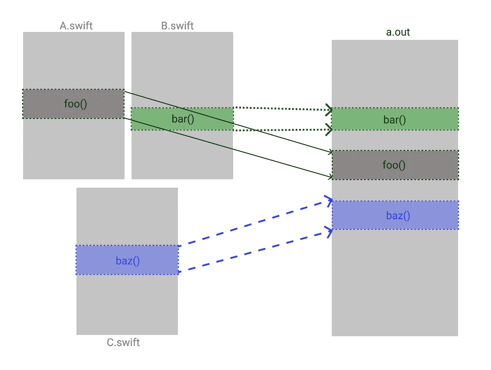
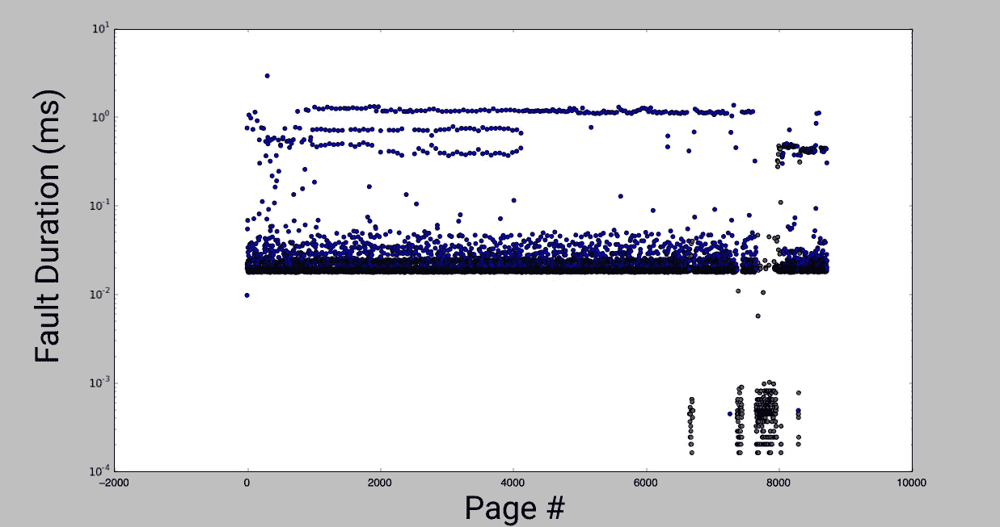
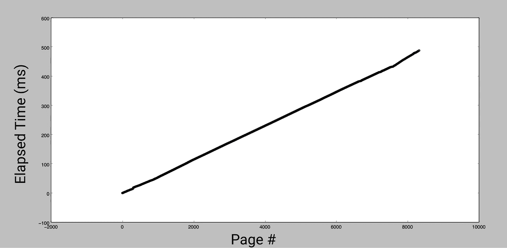
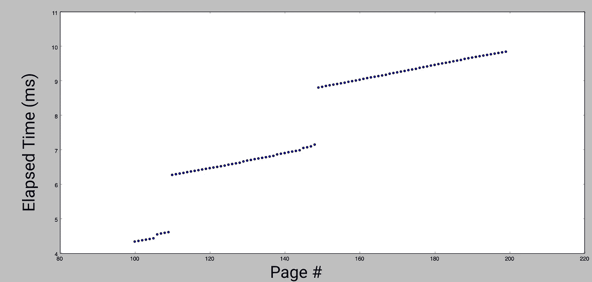
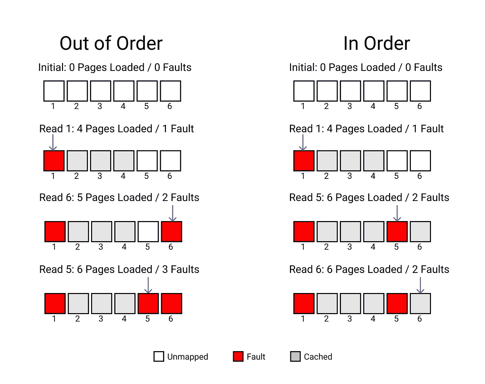
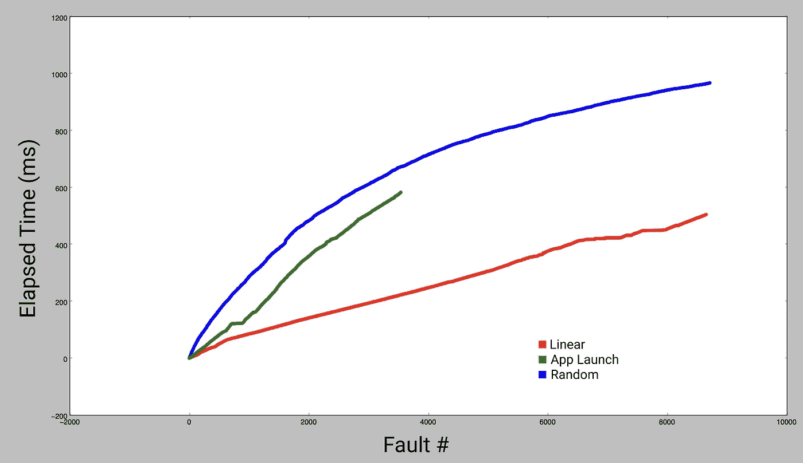
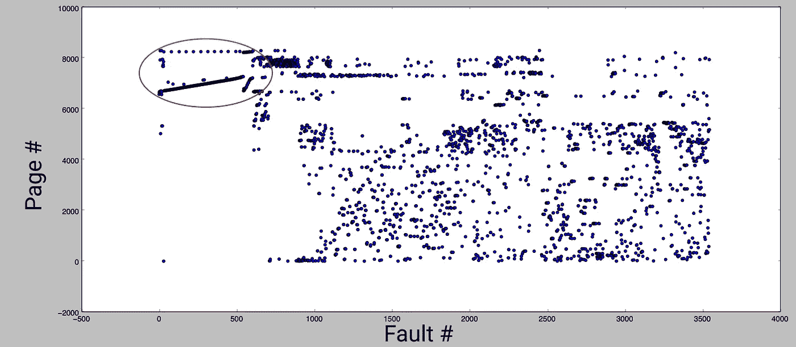

# 订单文件如何减少应用程序启动时间

> 原文：<https://medium.com/geekculture/how-order-files-reduce-app-startup-time-c01f7765d29?source=collection_archive---------10----------------------->

一个 150MB 以上的应用程序二进制文件，就像优步应用程序中的文件，仅载入内存就需要 500 毫秒到 1 秒钟(在 iPhone 6s 上测量)。像这样加载大文件只是应用程序启动时间的一小部分。客观地说，苹果推荐的启动时间只有 400 毫秒。这已经是推荐的完全启动时间的 1–2 倍，甚至不需要执行任何代码！

默认情况下，应用程序在启动时可能需要读取 75%以上的二进制文件。然而，在**命令文件**的帮助下，我们可以在启动时只读取我们需要的功能。

# 页

为什么启动时使用这么多二进制文件？答案在于 iOS 如何处理内存。当从应用程序的二进制文件中获取新指令时，它们必须从磁盘加载到内存中。内核不是一次加载一条指令或一个字节，而是加载一大块内存，称为**页**。在 iOS 上，一个页面是 16kb[1]。因此，第一次需要来自 app 二进制文件的指令时，该页面周围的整个 16kb 区域被映射到内存中。这个过程被称为**页面错误**。

比方说，二进制文件的前 16kb 包含 captcha 验证等模糊功能使用的代码，但碰巧包含一个在应用程序启动期间执行的 100 字节函数。现在需要加载整个验证码功能来启动应用程序。实际上，大多数或所有的二进制文件在启动时都会像这样加载到内存中，因为启动函数分散在二进制文件中。

# 使用订单文件

幸运的是，应用程序不需要启动整个二进制文件，它们只需要应用程序启动时执行的代码。这就是订单文件发挥作用的地方。他们重新排列二进制文件，只读取你需要的代码。

源代码中的每个函数都被表示为二进制中不可分割的单元(符号)。链接器决定这些符号的排序方式，默认情况下会将同一源文件中定义的代码在二进制文件中紧密地组合在一起。但是，当您向链接器提供订单文件时，此默认行为将被覆盖。顺序文件指示链接器按照它给出的顺序放置函数。通过对二进制文件进行排序，使得所有的启动函数都在一起，我们只需要加载这一堆页面，而不需要加载其他页面的其余函数。

Code from multiple source files needs to be ordered to end up in a single binary file.

# 理论上的错误

这是值得做的，因为一个页面错误是昂贵的。像大多数电脑一样，iPhone 有一个内存层次，在不同级别之间增加了一个数量级的延迟。页面错误从最慢的级别读取数据——手机的闪存(NAND)。访问已经放入 RAM 的内存要快得多，驻留在处理器缓存中的内存是最快的。每一级变得越来越小，这就是为什么使用尽可能少的内存是很重要的。使用的内存越多，低延迟缓存填充得越快。实际上，延迟的来源甚至更多，例如验证代码签名。二进制文件是逐页签名的，第一次访问页面时，必须对数据进行哈希处理，并与签名进行比较。你可以在内核函数 [vm_fault_validate_cs](https://opensource.apple.com/source/xnu/xnu-7195.81.3/osfmk/vm/vm_fault.c) 中看到这个过程。

# 实践中的失误

要在实践中测量页面错误，只需在应用程序的二进制文件中取消指向每个页面的指针。

我在商店的几个应用程序上测试了这一点，并在线性扫描中测量了访问每个页面的时间。通过绘制每次访问的时间，您可以看到代表缓存层次结构每一级的不同区域。以下实验是在 iPhone 6S 上进行的。

The y-axis is on a log scale, so each layer is separated by a 10x difference in performance.

图右下方的异常值是访问速度极快的页面。这些位于二进制文件的 Objective-C 元数据和常量字符串[2]部分。因为测量故障时间的代码是在 Obj-C 运行时初始化之后运行的，所以这些页面都已经被访问过了。它们甚至在第一行代码运行之前就已经从闪存中加载了，并且在我访问它们之前已经**在一个快速缓存**中了。

这种分布表明，最坏情况下的页面错误大约需要 1 毫秒，但并没有告诉我们更多关于错误的预期持续时间。为此，我查看了读取二进制文件所有页面的累计时间。

这是一个明显的趋势！故障的平均时间是 0.06 毫秒。然而，这并不能解释为什么我们看到的慢速故障比快速故障少得多。让我们放大图表的一小部分:

大多数故障是快速的，但是每 40-50 个故障有一个非常慢的访问。它看起来像一个阶跃函数，可以用系统**预取**来解释。每一个新的错误都会触发一次昂贵的查找，这实际上是将多个页面放入内存，以期待更多的页面被使用。这是有性能成本的，加载更少的页面会导致更快的最坏情况[3]，但是这种行为做出了有利于摊销时间的权衡。有序访问最好地利用了这种权衡。无序访问甚至比根本不预取更糟糕。

要了解原因，想象一个简单的情况，预取 3 个页面。

无序情况需要 3 个慢速错误来读取 3 个页面，加上缓存 3 个额外页面的时间。有序情况只需要 2 个慢故障。如果我们改变使用的页面而不仅仅是它们的顺序，这可能只是一个缓慢的错误。

## 比较订单

为了测量这种影响，我构建了一个 dylib，它可以插入到任何应用程序中，以检测内存访问的顺序。我用来自 App Store 的大型应用程序运行了它，并在我的测量功能中重现了它们的访问顺序。将这种现实世界的页面访问模式与理想的有序和随机访问模式结合起来，向我们展示了有多大的改进空间。

正如所料，随机顺序开始时比线性顺序慢得多，总时间也长得多。斜率越到最后越小，因为大部分应用程序已经被预取。在应用程序启动期间重现错误页面的顺序介于最佳情况和随机访问之间。**订单文件把你的 app 从绿线变成红线，同时减少总页数。**

最后，为了确认没有顺序文件的二进制文件中的页面访问是相对随机的，此图显示了错误号(应用程序启动期间观察到的错误顺序)与页面号(页面在二进制文件中的位置)的关系。

大多数故障以随机顺序出现，除了在应用程序启动的最开始有一个清晰的线性模式(用红色圈出)。这一行的所有页面都包含协议一致性元数据。这种行为的发生是因为在之前的博客文章中讨论的[协议一致性线性扫描。](https://www.emergetools.com/blog/posts/SwiftProtocolConformance)

# 🚀️发射助推器

总之，访问内存页面的时间可能从几毫秒到 1/100 毫秒不等，具体取决于哪个缓存拥有该页面。对应用程序二进制文件中的符号进行排序，可以让系统优化内存访问，从而降低慢速页面错误的可能性，并通过将您需要的内存放在尽可能少的页面上来减少页面错误的总数。

**这项研究催生了 Emerge 的新**[**Launch Booster**](https://docs.emergetools.com/docs/launch-booster)**，这是一种二进制订购服务，它可以在 CI 中对应用进行分析，以确定最佳订购。使用 Launch Booster，我们看到应用程序的启动时间减少了 5-10 %!**

如果您对 Launch Booster 感兴趣或对订单文件有任何疑问，请[告诉我们！](mailto:team@emergetools.com)

[1]有多个系统对页面进行操作，并使用不同的大小。例如，代码签名是用 4kb 的页面完成的。页面错误总是涉及 16kb 页面，因此我们在本文中重点讨论页面的定义。

[2]包括 Objective-C 类名，在静态初始化器运行之前由运行时注册。

[3]这可以通过在较小的 app 二进制文件上执行相同的实验来看出。预取的页面更少，每个最坏的情况都稍微快一些。