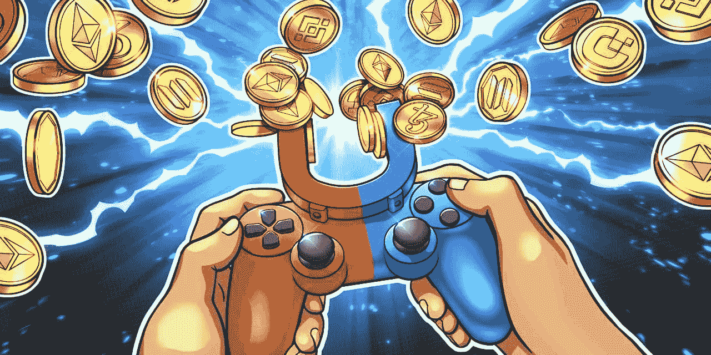

# P2E 博彩业如何创造新的财富机会— 2023 年

> 原文：<https://medium.com/geekculture/how-p2e-gaming-is-building-new-wealth-opportunities-2023-2822130ce242?source=collection_archive---------23----------------------->

[**P2E 博彩平台**](https://www.turnkeytown.com/nft-gaming-platform-development) 最近越来越火了。P2E 博彩在 2021 年经历了最大的增长，推出了数百项新举措。

P2E 游戏公司的目标是在赚钱的同时为游戏玩家提供愉快的体验。如果你想在玩游戏的时候赚钱，你也可以使用游戏设置之外的服务。

P2E 的社区参与是该平台最吸引人的特点之一。因此，玩家有更多的机会赚钱。

随着对等(P2P)游戏平台数量的增加，可用游戏和功能的范围也在增加。

本指南研究了点对点(P2P)游戏如何帮助玩家积累财富。

**P2E 用新的财富选项重塑游戏**

越来越多的 Play to Earn 平台开发公司正在寻找方法，通过向玩家提供激励来帮助他们赚钱，从而保持玩家的参与。

玩家可以通过各种活动赚钱，包括交易、采矿和借贷。游戏，由德菲和 NFT 融合而成的网络，是一台创造财富的机器。

这些网络提供了各种有助于创造财富的功能，就像其他 P2E 网络一样..考虑以下赚钱的方法:

**非盈利组织**

NFT 是 P2E 博彩业赚钱的最佳方式之一。所有区块链游戏中使用的代币是不可替换的。

**NFT 在 P2E 博彩业中扮演着不同的角色。其中包括**；

可以在游戏中使用的资产。NFT 代表游戏网络中的许多游戏内资产。要开始玩游戏，你需要一套 NFT 或非玩家代币。

也可以使用 NFTs 来表示网络中的各种收藏品。例如，玩家可以在每场游戏中积累各种资产，增加他们获胜的机会。

NFTs 也可以代表你的生命数量或者你在游戏中的当前等级。

在 P2E，最令人兴奋的赚钱方式之一就是通过 NFTs。但是你在哪里可以找到这些 NFT，你如何利用它们？有几种选择。

一旦你开始玩游戏，你就可以在市场上买到 NFT。根据等级和稀有程度，非功能性食物的价格或多或少。

在 P2E 网络中制造 NFT 是另一种获得它们的方式。使用支持铸造的定制区块链解决方案来创建个性化的 NFT 是增加财富的一个好方法。

通过出售资产，你可以赚钱。此外，即使卖掉 NFT，你也能继续赚钱。

此外，赢得某些游戏将净你 NFTs。当你赢了游戏，你就累积了 NFT。

如果 NFT 有用且难以获得，它的价值就会增加。一件稀有的 NFT 会更值钱。它们可能会马上出售。你可以用 NFT 交易加密货币或任何你喜欢的稳定硬币。

**游戏内加密货币收益**

玩 NFT 游戏赚钱的另一个选择是创建游戏内密码。在各种平台上，可以获得代币等游戏内物品。P2E 还有其他游戏网络，你可以通过玩游戏获得加密货币。参与每日的任务战斗和比赛将为你赢得金钱。

**赌注和贷款**

在 Play to Earn 系统中赚钱的最佳方式之一是下注。投资者可以把钱押在你找到的平台上。

你也可以把你的钱投入到 P2E 游戏生态系统的基本 Defi 资产中。投资者也可以通过下注来利用被动收入机会。

您可以使用智能合约锁定其他 NFT 游戏网络上的 NFT。通过投资一种资产类别，人们可以从两种不同的资产类别中受益。例如，你可以下注 Defi 代币来获得 NFT。因此，下注是在 P2E 市场获利的最佳策略之一。

**项目开发**

P2E 博彩网络也可以成为那些参与其发展的人的收入和财富来源。虽然这种收入是那些能够成长的人可以获得的，但并不是每个人都可以获得。对于软件工程师来说，参与项目开发是一项利润丰厚的工作。

**玩家对玩家比赛下注**

玩家对玩家比赛可以在其他一些 [**P2E 游戏平台上进行。**](https://www.turnkeytown.com/nft-gaming-platform-development) 平台在某些情况下可能会要求双方下注一些 NFTs 或 crypto 来玩。在 PVP 比赛中，获胜者将获得赌注池中的所有硬币。

P2E 能让你变得富有吗？

本指南研究了 P2E 博彩及其创造财富的可能性。P2E 博彩当然是赚大钱和变得富有的好方法。举例来说，你可以通过玩像 Axie infinity 或 Decentraland 这样的 P2P 游戏来赚钱。NFT、赌注和赌博只是 P2E 网络上许多可用选项中的几个。