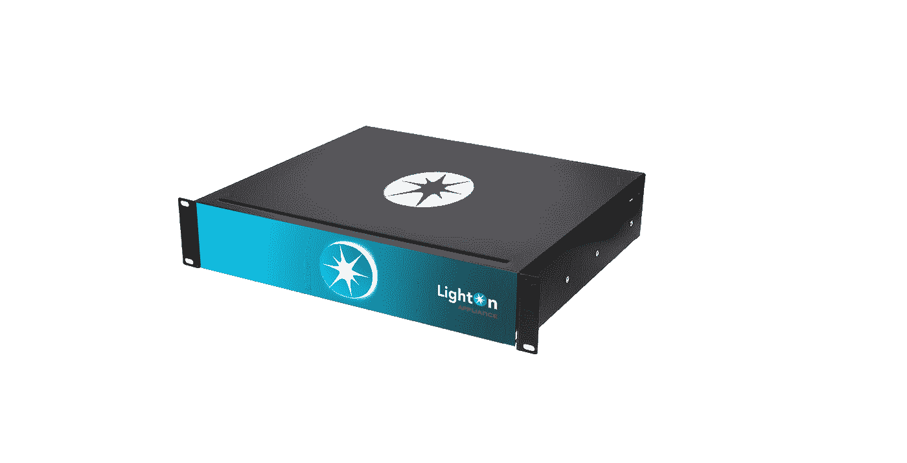
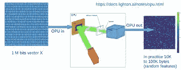
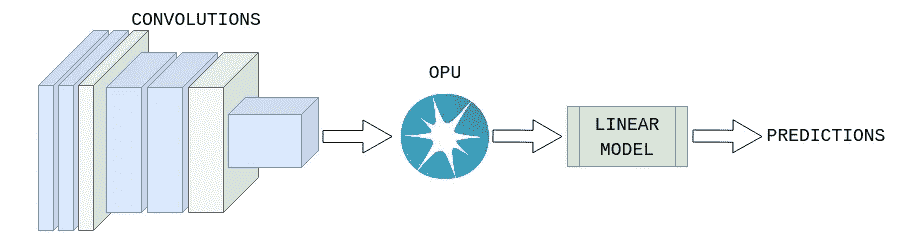

# 光子处理器将如何拯救机器学习

> 原文：<https://medium.com/geekculture/how-photonic-processors-will-save-machine-learning-9dac20224b6b?source=collection_archive---------24----------------------->

## 莱顿的《OPU》简介

机器学习是昂贵的——它需要很高的计算能力。例如，训练 OpenAI 著名的 GPT-3 模型[将花费超过 450 万美元](https://lambdalabs.com/blog/demystifying-gpt-3/)，需要的能量相当于[126 个丹麦家庭一年的消耗量](https://www.anthropocenemagazine.org/2020/11/time-to-talk-about-carbon-footprint-artificial-intelligence/)，并且一次训练产生的碳足迹相当于开车行驶 70 万公里。

光子处理器是解决巨大计算能力需求和极端碳足迹的最有前途的解决方案之一，因为它们速度快(正如我们所知，光是宇宙中最快的东西)并且真正节能。

市场上的一些公司拥有生产就绪的光子处理器。我最喜欢的一个是[莱顿](https://medium.com/u/1a8df9096570?source=post_page-----9dac20224b6b--------------------------------)，因为他们的解决方案相对简单，其工作方式有点像魔术(你会明白为什么)。

[莱顿的 OPU(光学处理单元)](https://lighton.ai/photonic-computing-for-ai/)只能做一件事，但它能快速高效地做好这一件事。它可以将一个向量乘以一个巨大的随机矩阵。硬件将输入转换成光模式。一种特殊的波导以模拟方式进行随机矩阵乘法。最后，相机将结果转换回矢量。随机矩阵是固定的，所以这里的乘法硬件(波导)是一个无源元件。但是怎样才能帮助一个随机矩阵乘数去机器学习呢？

source: [https://indico.cern.ch/event/852553/contributions/4057150/attachments/2127912/3582939/tr201022_David_Rousseau_OPU_IML.pdf](https://indico.cern.ch/event/852553/contributions/4057150/attachments/2127912/3582939/tr201022_David_Rousseau_OPU_IML.pdf)

与固定的巨型随机矩阵相乘，听起来毫无意义，但不要听从自己的直觉，这是一件很有意义的事情。这是一种简便的降维方法，称为随机投影。随机投影具有良好的性质；由于约翰逊-林登施特劳斯引理，它几乎保持了距离。所以如果你在高维空间中有两个向量，投影向量的距离将会和它们原来的距离几乎一样。

这种距离保持特性[可以很好地用在强化学习](/@LightOnIO/tackling-reinforcement-learning-with-the-aurora-opu-88f3ffff137a)中。在 LightOn 的例子中，他们使用 OPU 将实际游戏状态转换为 32 维向量。这里，游戏状态是一个屏幕快照，由一个 33600 (210x160 像素)的向量表示——OPU 从这个 33600 维空间投影到一个 32 维空间。学习方法是简单的 Q 学习。该算法计算 Q 值并为(投影)状态存储它。如果 Q 值未知，它将使用 9 个最近邻的 Q 值，并计算它们的平均值。因为 Johnson-linden Strauss 引理，投影向量的距离或多或少与原始状态向量相同，所以投影向量的 K 个最近邻居是从附近的原始向量投影的。在这种情况下，OPU 用于降低维数以产生更简单的问题(32 维向量比 33600 维更好)，该问题需要更少的存储、更少的计算能力或更小的神经网络。同样的方法可以用于推荐系统或任何其他可以使用降维的情况，OPU 在真正高维的向量上做得很快。你可以在这里找到代码。

如您所见，该方法运行良好:

另一个用例，当 [OPU 用于从低维空间投影到高维空间](/@LightOnIO/au-revoir-backprop-bonjour-optical-transfer-learning-5f5ae18e4719)时。在莱顿的迁移学习示例中，使用 OPU 代替神经网络的线性层。在这种情况下，一个预先训练的 CNN (VGG，雷斯内特等。)用于特征提取，但是分类不是由神经网络完成的。代替密集层，OPU 将特征向量投影到样本可以线性分离的高维空间。因此，多亏了 OPU，一个简单的线性分类器可以用来代替神经网络。

source: [https://medium.com/@LightOnIO/au-revoir-backprop-bonjour-optical-transfer-learning-5f5ae18e4719](/@LightOnIO/au-revoir-backprop-bonjour-optical-transfer-learning-5f5ae18e4719)

上述两个示例使用 OPU 将原始问题映射到需要更少计算能力和存储的更简单的问题，但是它是否可以用于使神经网络训练过程更容易？答案是肯定的。有一种方法叫做[直接反馈校准](https://arxiv.org/pdf/2006.12878.pdf)，在这种情况下[误差通过固定的随机反馈连接直接从输出层传播到每个隐藏层](https://arxiv.org/abs/1609.01596)。这种方法有两个优点。我们可以并行训练隐藏层，并且误差通过固定的随机矩阵传播，这可以通过 OPU 有效地完成。使用随机矩阵代替反向传播听起来像魔术，但它确实有效。

这里有一个关于 DFA 的不错的 YouTube 视频:

正如你所看到的，一个相对简单的光子硬件可以帮助多种方式减少机器学习的巨大计算能力需求，而 OPU 只是市场上的光子硬件之一。还有其他可编程矩阵或量子光子解决方案。值得关注这一领域，因为机器学习需要越来越多的计算能力，光子处理器是最有希望提供这种能力的方式之一。