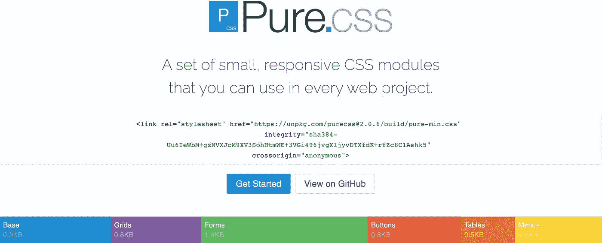

# PureCSS 库如何用极简主义击败 Bootstrap 和 TailwindCSS

> 原文：<https://medium.com/geekculture/how-purecss-beats-bootstrap-library-and-tailwindcss-with-minimalism-ba23d5467ebf?source=collection_archive---------9----------------------->

## PureCSS 可以成为 web 项目中最强大的 CSS 库

The screenshot is taken from [PureCSS Webpage](https://purecss.io/)

每个项目从头开始意义不大。这就是 CSS 库如此受欢迎的原因。据[2020.stateofcss.com](http://2020.stateofcss.com)、 *PureCSS* 的人气和满意度都在上升。