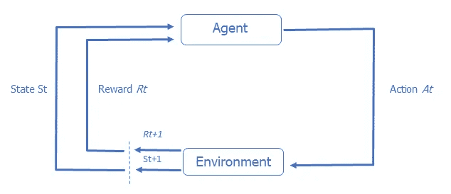

# PyTorch 如何帮助数据科学家进行强化学习

> 原文：<https://medium.com/geekculture/how-pytorch-helps-data-scientists-in-reinforcement-learning-a8843e441c1?source=collection_archive---------6----------------------->

## **让我们深入研究强化学习，PyTorch 对**有什么好处

机器学习是一个复杂的领域。很难知道从哪里开始，做什么。掌握它最有效的方法是通过实践训练和永无止境的练习。现在，我们应该使用哪种类型的学习和工具？哪一个是我们最好的选择？

在本文中，我们将重点关注**强化**类型的机器学习。我们将探讨如何使用强化学习来解决业务问题，以及为什么数据科学家应该考虑在他们的工作中使用它。

我们还将深入探讨 PyTorch 在强化学习中的应用，因为它是最受欢迎的可用选项之一。本文将向您展示这个特定的库如何帮助数据科学家更有效地进行强化学习。

Photo by [charlesdeluvio](https://unsplash.com/@charlesdeluvio?utm_source=medium&utm_medium=referral) on [Unsplash](https://unsplash.com?utm_source=medium&utm_medium=referral)

## **有没有一种方法能让人工智能自主学习并预测未来？**

嗯，有，而且由于优秀的机器学习工程师和数据科学家，它已经可用了。众所周知，机器学习是许多现代技术背后的驱动力，它可以分为三大类:监督学习、非监督学习和强化学习。

这三种分类可以通过多种方式帮助您的业务。例如，如果您想要进行准确的预测，或者数据之间存在相关性。现在，让我们更深入地看看强化学习以及数据科学家如何使用它。

## **数据科学家为什么要使用强化学习？**

强化学习是机器学习的一个组成部分，旨在通过使用奖励或惩罚作为积极和消极行为的信号来训练算法，从而最大化其结果。它被用于许多领域，如博弈论、控制理论、运筹学、信息论、基于模拟的优化、多智能体系统、群体智能、统计学和遗传算法。

强化学习的目的是帮助一个代理学习一个最优或接近最优的解决方案，该方案只需要少量的数据(它将在将来创建它的数据)。这是通过遵循导致奖励函数优化的奖励函数来完成的。

强化学习和别人有什么不同？与监督学习和非监督学习相比，当我们的数据集很少，并且我们希望预测未来时，强化学习非常有用。在一个环境集合中，我们将训练算法遵循一些基本规则。比如乒乓球的比赛过程中，目标是最大化得分，这样算法每得分一次，我们就加一次奖金。相反，算法每丢一分，就会有一个扣分。在这个过程的开始，人工智能将在第一场比赛中遵循一个试错的步骤。人工智能将偶然获得第一分，并将发现为了最大化其利益，它需要通过触球得分。在几次尝试之后，算法将会自我优化，变得更有性能(它会在玩游戏时变得更好)，直到我们实现最初的目标(例如，连续赢 10 场游戏)。

下图显示了一个典型的 RL 模型行动-奖励反馈回路:

因此，RF 可以应用于许多问题，例如自动化车辆、金融和贸易、自然语言处理、医疗保健、游戏等。在数据科学中，RF 可以应用于业务部门内的各种使用和研究案例。您可以创建最佳推荐系统来防止客户流失、优化客户旅程、实现自动化、预测和销售推荐等。

然而，即使射频看起来像一个神奇的工具，它也有其局限性。因为 RF 是耗电的并且需要高处理能力。因此，它将需要大量的资源来创建和运行，而且可能会很慢。因此，使用它可能很昂贵。

## **如何在数据科学中使用强化学习**

要在机器学习中使用强化，您可以使用库或软件，这取决于语言(例如 Python)。通过使用一个库，你将能够直接在你的计算机上运行它，并且它更容易被访问。而通过使用软件，您将获得更多的指导，并且与使用库相比，您将能够对更大的数据集使用更多的处理能力。然而，最后一种方法可能要付出代价。

关于库，我们可以用 Python 脚本用它们来处理机器学习。例如，我们有 TensorFlow，或 PyTorch，这是深度学习领域使用最多的框架之一。所有这些库之间的主要区别将是它们的效率(因为强化学习的复杂性)和它们的特殊性。此外，重要的是要记住，库使经验较少的开发人员更容易在 ML 领域编程，并提高经验丰富的开发人员的生产率。这就是为什么 PyTorch 或 TensorFlow 等 ML 框架最常用于商业和学术研发的原因。

另一方面，出于多种原因，平台也可能是一个不错的选择。例如，如果您的计算机不够强大，或者您希望有一个更好的环境来训练您的算法，那么平台可能是一个不错的选择。例如，Tensor Trade 或 PyTorch 是很好的在线环境，可以帮助你根据结果处理和实施强化学习。

在本文的下一部分，我们将深入 PyTorch，我们将向您展示这个库如何帮助强化学习，以便您可以简要介绍如何使用这种类型的机器学习来开发您的项目。

## 【PyTorch 如何帮助数据科学家进行强化学习

如前所述，在 ML 项目中有许多库和软件可以使用。然而，在本节中，我们将关注 PyTorch，以了解它在 ML 中的好处，更准确地说，是在强化学习中的好处。

PyTorch 是脸书人工智能研究实验室(FAIR)开发和使用的基于 Lua 的 Torch 框架的表亲。它是使用 Python 和 C++编程语言以及 CUDA API 开发的。它允许你做深度学习所需的 tensorial 的计算。它的优化计算可以在您的 CPU 上完成，或者在可能的情况下，在 GPU 上完成，这样可以更好地优化内存。

这个库主要用于自然语言处理和计算机视觉应用。尽管可视化精度不如 TensorFlow，但 Pytorch 可以部署比其主要竞争对手训练更好的模型。根据你要寻找的特异性，PyTorch 或 TensorFlow 可以帮助你对未来有一个好的预测。

但是每个人都在问的问题是，**为什么选择 PyTorch 而不是其他？它是如何与强化学习一起工作的？**

PyTorch 有多个**优势**值得牢记:

*   由于其开箱即用的代码模块和工具，它易于学习，编码也更简单。
*   丰富的强大 API 来扩展 Pytorch 库。
*   它在运行时支持计算图形。
*   它灵活、快速，并提供优化。
*   它支持 GPU 和 CPU。
*   易于使用 Python 的 IDE 和调试工具进行调试。
*   它支持云平台。
*   业务和研究用例的快速普及增长。

然而，像许多其他工具一样，PyTorch 也有一些缺点:

*   它于 2016 年发布，因此与其他产品相比是新的，用户较少，因为不太为人所知。
*   缺少监控和可视化工具，如张量板。
*   与其他框架相比，开发人员社区很小。

即便如此，在采访数据科学专家后，我们了解到 PyTorch 可能是机器学习和强化学习发展的一个好机会。事实上，PyTorch 目前正在快速发展，因为人们对 ML 应用程序的兴趣越来越大。

PyTorch 会成为强化学习项目的主要图书馆吗？事实上，PyTorch 在研究界非常知名，备受尊重，这表明未来可能会有更多公司采用它。但只有时间能证明一切。

与此同时，我们需要与新技术和工具保持同步，这样我们才能为我们的业务和项目做出最佳决策。不可否认的是，PyTorch 强大的编程环境是一个强有力的执行者，将是应对挑战的一个很好的解决方案。

文章作者 [shapelets.io](https://shapelets.io/)