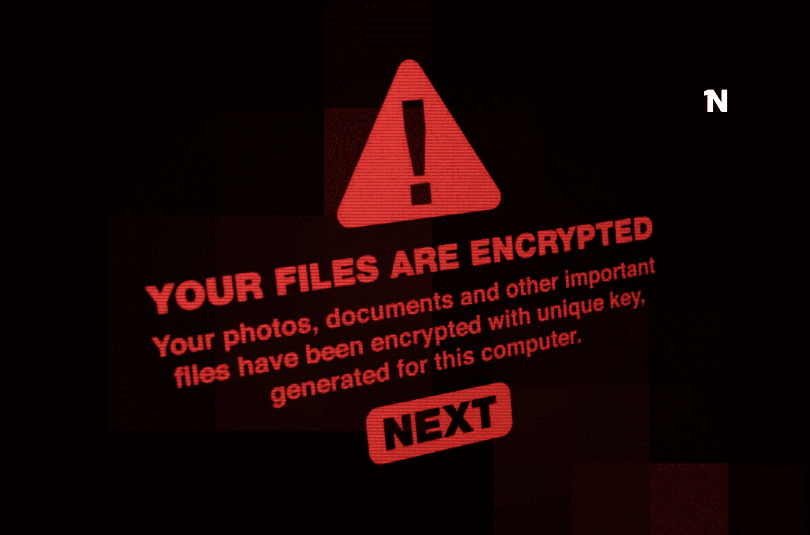

# 勒索软件的工作原理

> 原文：<https://medium.com/geekculture/how-ransomware-works-12b06462db8?source=collection_archive---------20----------------------->

## 用 Golang 创建一个简单的勒索软件

# 摘要

*   介绍
*   一点历史
*   基本结构
*   在 Golang 实施
*   最终考虑

# 介绍

“What I cannot create I do not understand.” — Richard Feynman

我认为，上个世纪一位重要的物理学家理查德·费曼的这段话，非常一致地总结了每个程序员对该领域研究的感受。

在这条道路上，最终每个人都将面对信息安全领域(或者用一个更夸张的术语来说，黑客)。这就像杨颖:程序员应该涉足黑客阵营，反之亦然。

几周前，我问了自己一个问题:勒索软件是如何工作的？我研究了一些公共实现，在这里我将展示一个小例子，这是目前最常用的网络攻击类型之一。

# 一点历史

成功的勒索软件攻击的第一个可靠记录可以追溯到 2005 年，但在过去十年中，攻击的发生次数激增。

由于其性质，勒索软件通常以大公司为目标。一些例子是 CryptoLocker 和 WannaCry，这两个勒索软件感染了数千台机器并造成了大量损失。

攻击者有两种方法可以使勒索软件成为巨大的威胁。首先，在网络和操作系统中发现了漏洞和后门，使黑客能够注入恶意软件，感染所有连接的机器，无论是通过网络还是物理连接(如 pendrives 和其他即插即用设备)。

这些系统背后的公司(微软、antiviruses 等)做出了巨大的努力来检测这些故障并纠正它们。因此，攻击者使用传统的网络钓鱼方法，将恶意软件伪装在 pdf、可执行文件或其他可下载内容中。

# 基本结构

勒索软件本质上是一种扫描文件系统并加密文件的程序。这些文件有点像是被绑架的，因为攻击者需要支付赎金(通常是比特币或另一种加密货币，因为交易是匿名的)来提供解密文件的密钥。

如果受害者没有文件的备份，除了付钱给攻击者之外，可能没有其他行动可做。但这是非常危险的，因为许多攻击者即使付款也不发送解密密钥。最有效的解决方案是建立安全协议并设置频繁的备份。

除了驻留在受害者机器中的软件之外，还经常使用命令服务器。每当新的受害者被感染时，该服务器接收数据并对其数据进行加密。然后，服务器检查支付流程，以确保当受害者支付所需金额时，解密密钥被发送到机器。

# 在 Golang 实施

第一部分是文件浏览器。有了它，我们将能够遍历从根文件夹或指定一个起始文件夹开始的机器上的所有文件。

在第一部分中，我们检测操作系统是 Windows 还是 Linux，以获得正确的用户根文件夹(在这里添加 Mac 是相同的过程)。我们可以指定一个文件夹来启动，或者程序将在/Downloads/Test 中启动。这是一种防止测试运行加密机器中所有数据的机制。然后我们用 filepath 映射和存储文件。WalkDir，返回数组。

现在，我们需要一个辅助程序来生成加密/解密密钥。我选择了 AES-256-GCM 算法，所以我们需要一个 32 字节的密钥(以匹配算法的 256 位)。我们将使用相同的密钥进行加密和解密，但在更现实的情况下，建议使用非对称加密(一个公钥和一个私钥)。

接下来，让我们根据生成的密钥制作加密器。除了密钥之外，加密器还可以接收主目录和电子邮件联系人。我们使用 MapFiles()函数获取所有文件，然后读取它，加密数据并重写。最后，生成一个自述文件，通知受害者其数据被绑架，并联系获取解密程序。

解密器与加密器非常相似，只是颠倒了操作的顺序。

# 最终考虑

要运行程序的各个部分，您可以使用“go build”为所有需要的平台和架构创建可执行文件。例如，要为 Windows 构建，只需运行:

`$env GOOS=windows go build`

不要忘记事先获得一个密钥，并在程序中正确插入变量(密钥、目录和联系人)。

在这个项目中有一些东西可以添加和改进。创建一个控制服务器，与加密货币支付集成，使用 Go 并发性来提高大块文件的读取、加密和写入，等等。

 [## luansilweirasouza/rangoware

### Rangoware 是一个简单的勒索软件，使用 AES-256-GCM 加密，用 Go 语言编写。⚠️警告:这…

github.com](https://github.com/LuanSilveiraSouza/rangoware) 

我希望这篇文章能给你带来一些知识！感谢阅读！