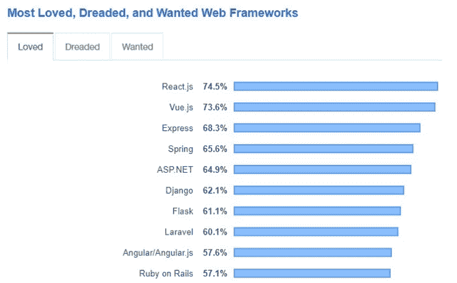

# React 开发如何帮助创业？

> 原文：<https://medium.com/geekculture/how-react-development-helps-startup-businesses-6ff953923ad0?source=collection_archive---------18----------------------->

前端开发一直在以惊人的速度增长。事实上，你可以自己去谷歌一下，找出全球到底需要多少前端开发人员。设计和编程的罕见结合正在获得动力，作为一个新兴的行业，人们不应该错过这些机会。

*下面这篇文章关注 React development 为什么能成为你的企业的闪亮盔甲。换句话说，* [*如何通过遵循 React.js 最佳实践*](https://www.tatvasoft.com/blog/reactjs-best-practices/) 来帮助创业公司创建动态网站和强大的在线存在。

# 为什么要开发 Web 应用程序？

在新冠肺炎大规模打击后，来自世界各地的企业，无论他们从事什么行业，都发现居住在网络世界。今天，没有一个强大的在线存在可能是一个愚蠢的决定，可能会让你付出沉重的代价，只是为了在永无止境的竞争中生存下来。

网络应用和移动应用的使用已经上升到一个新的水平。应用程序已经成为终端用户的首选，无论他们是想买衣服、点餐、预订机票还是其他任何东西。换句话说，即使在你考虑开始业务之前或已经开始业务之后，你必须考虑的首要事情是创建一个具有跨平台兼容性、易于使用、流畅、健壮、可伸缩、全天候服务、高响应性等特征的定制 web 应用。现在，所有这些都只能通过选择正确的 web 开发框架来实现，即选择 React 开发。

# 什么是 React 开发？

对于那些不知道 React js 是什么的人来说，它是一个开源框架，为开发人员提供了一个令人生畏的、可伸缩的、外观健壮的 web 应用程序。现在，到底是什么让 React js framework 略胜一筹？React 的优势值得考虑。

*   易于使用——如果你正在考虑一个直观的、交互性很强的框架，React 是一个值得考虑的名字。更不用说，除了易于使用之外，创建的应用程序在质量方面完全有保证。
*   可重用性——除了业务，甚至 React js 开发人员也喜欢使用框架，因为他们可以一次又一次地重用组件。即使在这一切之后，开发的 web 应用程序的性能也没有丝毫下降。
*   SEO 友好——前端开发框架提供的另一个惊人特性是它与搜索引擎高度兼容。因此，企业不需要付出额外的努力通过搜索引擎优化来排名他们的网络应用在谷歌和其他搜索引擎。

在了解了使用 React 的一般好处之后，是时候考虑为什么企业，尤其是初创公司，必须为他们的 web 开发项目选择 React 了。

# 来源— [堆栈溢出](https://images.prismic.io//intuzwebsite/b9dfffbe-7029-49ad-88a8-3056162b26da_Web+Frameworks+in+Demand.jpeg?w=750&q=75&auto=format,compress&fm=png8)

# 为什么 React js 开发是全球企业更好的选择？

# 1.广泛而活跃的社区

因为它的受欢迎程度很高，所以理解 React js 拥有广泛而活跃的社区支持也就不足为奇了。万一，如果开发人员陷入困境或遇到一些关键问题，他所要做的就是与社区取得联系，他会很快找到一个可靠的解决方案。这个社区由几个 React js 开发人员组成，他们在提供相关解决方案方面知识渊博，经验丰富。

更不用说这项技术似乎一直得到脸书的支持，这里的专家非常欢迎帮助新手理解这项技术，并找到解决他们当前和潜在问题的方法。

或者干脆谷歌一下！我相信，当谈到 React 开发时，您会发现大量的信息和 youtube 视频。

# 2.高性能和速度

如果你正在寻找一个在性能和速度方面都有把握的 web 开发框架。只需做出反应，不要看得太远。无论你是在开发一个 web 应用还是一个网站，与 Angular 和 Vue 等其他前端框架相比，React js 肯定可以提供无缝的性能。它包括虚拟 DOM，这无疑有助于摆脱使用自举库。因此，整个开发过程变得顺利而诱人。

React 开发的另一个有趣方面是速度。您的 web 开发项目可以在尽可能短的时间内完成——这都要归功于可重用组件。而这一切，在不妨碍 app 质量的情况下，都是可能的。

# 3.易于维护

作为一名商务人士，你当然有很多事情要处理，所以你不会想把这个网络应用添加到你现有的工作中。React 就是这样一个提供高端支持和维护的框架。

# 4.长期玩家

[React](https://reactjs.org/) 就是这样一个框架，它不会很快变慢或者被判死刑。框架可以自动升级并增强功能。因此，在开发 web 应用程序时，您一定会收到最新的特性和功能。是的，换句话说，React js 开发可以被认为是长期的玩家。

# 5.Web 应用和移动应用

有了 React js，在开发一个 web 应用程序后，企业更有可能创建一个移动应用程序，并确保从 web 到移动的平稳无缝过渡，我们拥有 React 原生兼容性。即使您使用的是 React Native，React js 的所有好处都可以被利用。

# 我们完了。

我猜，上述信息似乎足以说服您是否必须考虑在您的 web 开发项目中使用 React development。如果你还有任何疑问或疑问，请在下面的评论区提出。