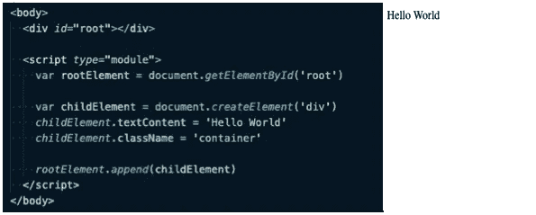
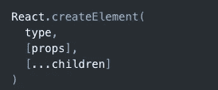
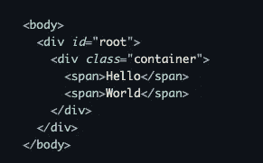
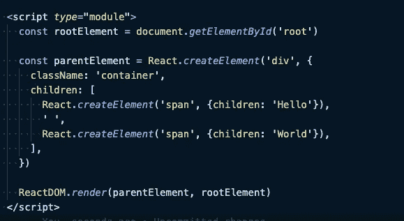
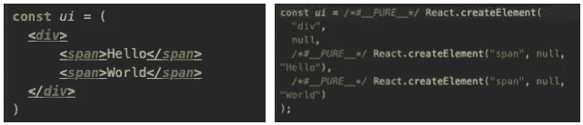
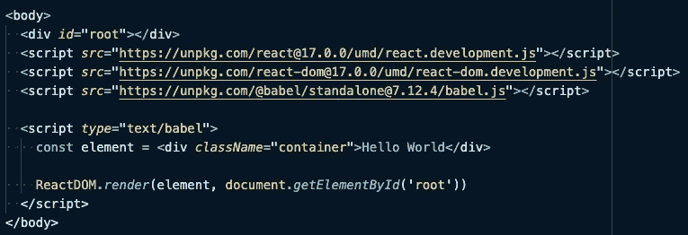
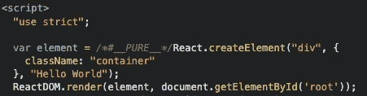
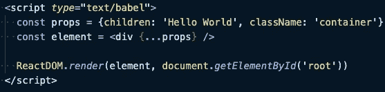

# React 到底是如何工作的？

> 原文：<https://medium.com/geekculture/how-react-really-works-8b8dff7ff19a?source=collection_archive---------29----------------------->

谈到学习 React，你至少会在 YouTube 上看到一篇由 ***肯特·C·多兹*** 撰写的文章或演讲。我是这家伙的超级粉丝。他的博客和视频简直太棒了。我强烈推荐你去看看他的博客，听听他在 YouTube 上的演讲。我从他在 YouTube 上的一次演讲中获得了写这篇文章的灵感。

# **背景**

为了理解 React 在幕后是如何工作的，对如何使用 JavaScript 处理 DOM 元素有一个基本的了解是非常重要的。下面的程序显示了如何在网页中显示“Hello World”文本。

Program to display ‘Hello World’ text

React 提供了基于组件的方法，这意味着你可以将你的页面分成组件。为了编写 react 组件，我们需要两个 JS 文件。
1。 **React** :提供创建 React 元素的函数(类似 createElement())
2。 **ReactDOM** :它提供了将 react 元素呈现给 DOM 的函数(类似于 append())

一旦包含，这些 JS 文件将让您访问两个全局对象，即 **React** 和 **ReactDOM** 。为了创建 React 元素，React 对象提供了一个名为 **createElement** 的函数。此函数采用以下参数。

Structure of React.createElement function

在上面的函数定义中，参数 children 可以是一个数组，该数组可以包含使用相同的 **createElement** 命令创建的子元素。现在，我们有了 React 元素，但必须有一种方法将这些元素呈现给 DOM，ReactDOM 会为您做到这一点。它提供了一个名为 **render** 的方法，帮助您将元素呈现到 DOM 中。

现在，假设我们想要创建一个这样的 DOM 结构。

Example of DOM structure

对此的反应代码如下所示。

React representation of the above DOM structure

在实际项目中，不可能使用上述语法编写代码。这就是 JSX 出现的原因。

# 什么是 JSX？

JSX 是原始 React APIs 之上的一个语法糖。它看起来很像 HTML，但它不是。你的浏览器不理解 JSX，所以它需要将 JSX 编译成浏览器可读的格式。大多数现代应用程序使用**巴别塔**来实现这一点。在下图中，左边你可以看到显示 Hello World 的 JSX 语法，右边你可以看到 babel 如何使用 React 库函数编译代码。

Babel representation

如果你想看看 JSX 是如何被编译成 JavaScript 的，点击这里查看在线巴别塔 REPL [。](https://babeljs.io/)

要使用 JSX 显示“Hello World ”,您必须在代码中包含巴别塔脚本。现在，您的代码将如下所示。

所以，基本上我们告诉 babel 在运行中编译我们的 JSX 代码。您可以在浏览器中看到编译后的版本，如下所示。

如果你有道具对象，你可以把它传递给元素标签，如下所示。

# **最终想法**

所以就基本而言，这就是你所需要的。坦率地说，这根本不是让你开始的必要条件。你可以在没有这个的情况下开始反应，但是学习基础知识总是好的。它给你一种信心去学习更多的语言，否则你会一直感觉错过了第一步。我坚信无论何时你学习新的东西，都应该从你的第一步开始。祝你好运:)

感谢您阅读这篇文章。请在评论区告诉我你的想法。

# **参考文献:**

我真的建议你按照这个参考材料来获取更多信息。

1.肯特·C·多兹
[https://www.youtube.com/watch?v=SAIdyBFHfVU](https://www.youtube.com/watch?v=SAIdyBFHfVU)
2。**介绍 JSX**[https://react js . org/docs/Introducing-jsx . html # embedding-expressions-in-jsx](https://reactjs.org/docs/introducing-jsx.html#embedding-expressions-in-jsx)