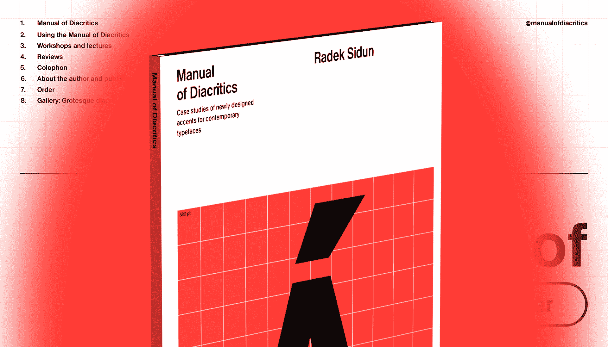
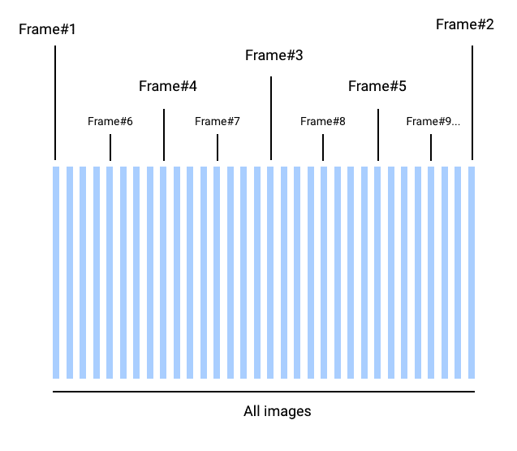
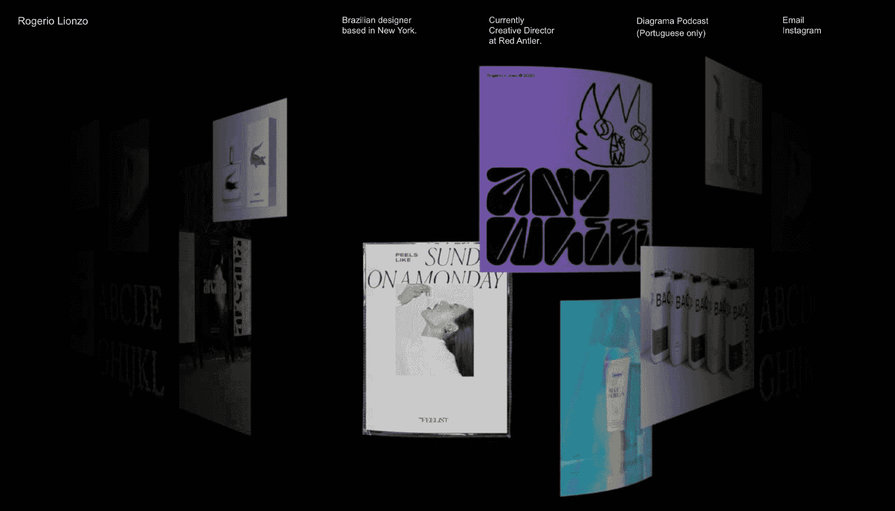
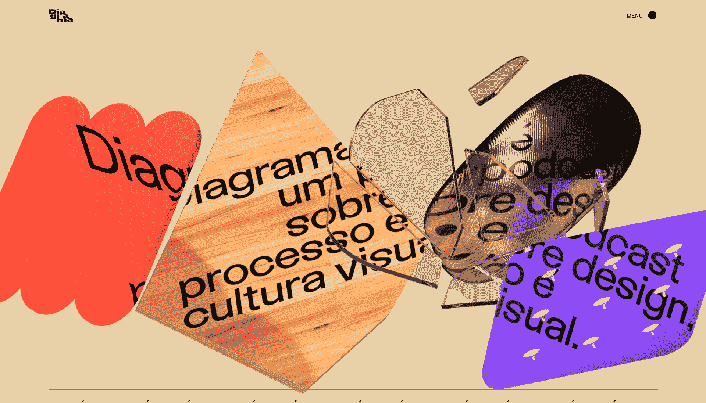

# Readymag 如何发明镜头将视频转换成可控的图像序列

> 原文：<https://medium.com/geekculture/how-readymag-invented-shots-to-convert-video-into-controllable-image-sequences-92b17f7d795b?source=collection_archive---------10----------------------->

Readymag developer 描述了从想法到实现的过程

# **从被动到可操作**

网络是一个有机的、不断变化的环境，多年来用户对网站的期望越来越高。在 Readymag，我们尽最大努力帮助设计师创造新鲜和沉浸式的内容，推动网络的边界。作为这项工作的一部分，我们引入了镜头——一种独特的工具，可以将视频转化为一系列由观众控制的体验。这是将互动动画提升到一个新水平的完美方式。开发者 Ilya Shuvalov 描述了从想法到实现，Shots 是如何在 Readymag 开发的。

# **寻找更多互动**

动态的元素比静态的更有表现力。它们很容易理解，并以简单快捷的方式传达作者的意图。然而，被动地观看视频和动画并不能让用户对网站产生深深的兴趣。下一个参与级别是对视频和动画的用户动作的反应，例如指针移动、滚动、点击和轻敲。

为视频小工具添加交互性是 Readymag 的长期目标。我们会尝试让视频在悬停时播放/停止，或者通过光标移动快速改变当前帧。然而，我们很快发现，在大多数视频平台上托管的视频无法做到这一点。通常，它们的条款禁止隐藏控件。此外，视频本身可能有许多限制——比如网络不支持的格式、过低或过高的比特率、巨大的尺寸和缓慢的加载时间，等等。

> 所以我们想出了一个新主意:制作一个能够响应用户动作的交互式视频/动画的小部件。

苹果经常在他们的登陆页面上使用类似的内容。通常，这些是定制的手工解决方案；不像我们的例子那样，是一个通用的小部件。

[Manual of Diacritics](https://manualofdiacritics.eu)

> 在这个项目中，3D 镜头很好地融入了项目的整体极简风格。它变成了一种鲜明的口音，能够吸引人们的注意力，帮助浏览者更深层次地沉浸在网站中。

# 设置未来小部件的要求

我们开始寻找新部件的潜在适用技术，并列出一系列要求:

*   这个小工具应该可以在所有浏览器和不同类型的设备上快速流畅地运行——包括低功耗智能手机。
*   上传视频/动画到小工具的过程应该很简单。从用户的角度来看，必须像上传一张图片一样简单。
*   当加载带有小部件的页面时，第一个有意义的绘图应该尽早出现。也就是说，用户几乎可以立即看到页面上发生的事情。
*   小部件应该根据用户的动作来来回回播放视频/动画:向上/向下滚动，在桌面上悬停，在移动设备上触摸移动。

# 探索技术限制领域

我们想到的第一件也是最明显的事情是使用标签和 JavaScript API 来回导航视频文件。这种方法似乎是可行的，但是有许多明显的缺点:

*   用户可能上传了不兼容格式的视频。可以对其进行重新编码(re-encode)，但是这需要一些时间，并且需要大量的资源(CPU 能力)。
*   编码选项各不相同:比特率、分辨率、关键帧数量等等。这些都会影响播放的质量、速度和流畅度。
*   视频在旧设备上播放可能不流畅，尤其是当访问者从网站的一个部分快速移动到另一个部分时。

进一步的实验让我们想到了使用

<canvas>元素的想法，这种技术已经存在了几十年，并且被所有浏览器(包括旧的浏览器)所支持。Canvas 也尽可能快地工作，即使在非常慢的设备上。</canvas>

# 将视频分成图像序列

最终，我们开发了新部件的操作原理:用户上传他或她的视频，并在我们的服务器上记录到一组图像帧中。当显示带有小部件的页面时，这些图像开始加载，并响应用户的滚动或悬停而快速显示(绘制)。

单个帧/图像的重量(下载大小)比原始视频的体积大得多，因此它们需要更多的时间来加载。然而，我们使用的加载算法允许我们几乎立即在屏幕上看到动画。在最初的几秒钟，动画可能看起来有点笨重，播放不流畅，但随着它的加载，流畅度会很快提高。

我们使用二分法，首先从序列中加载第一个和最后一个图像，然后将整个序列分成两半，从中间加载图像。二分法根据需要重复多次，直到加载完所有图像。

*Image frame download order*

上传的视频通过 AWS Lambda 变成一组图像。我们使用 *ffmpeg* 转换器，它作为一个层连接到 Lambda。用户上传的视频作为输入视频流直接传输到 *ffmpeg* 。有了它，我们无需中间储蓄就能过日子，并避免了对我们服务器的进一步压力。ffmpeg 将视频转换成图片，然后上传到 AWS S3 存储器。

之后，关于这组图像的元数据(基本路径、尺寸、格式和帧数)被返回给小部件。高分辨率视频通常会产生非常沉重的图像——每幅图像可能重达数兆字节，因此我们使用渐进式 JPEG 质量等级。图像的分辨率越低，质量越高。

[lionzo.com](https://lionzo.com)

> 有一种感觉，项目画廊获得了物质性，并屈服于自己意想不到的物理定律。如果你仔细观察，你会发现放置图像的构图非常简单，并且在设计中广泛使用——但是体积和用户与它互动的能力有助于将这个项目与其他项目区分开来。

对于转换后的图像质量不满意的用户，我们增加了将您自己的一组 JPEG 和 PNG 格式的现成帧(图像序列)上传到小部件的功能。在这种情况下，我们不转换或调整文件大小。对于 PNG，我们支持 alpha 通道设置:这使您能够使用透明的图像。完成的项目中的图片序列按原样显示。

现成的用户可以调整照片的外观和回放。例如，他们可以根据滚动速度或光标移动来改变帧速率，还可以根据页面上小部件的当前位置来调整播放的开始。

[diagrama.co](https://diagrama.co)

> “镜头”小部件有助于创建一个焦点来设定项目的情绪。这是一个很酷的解决方案，你只能在某一点上阅读文本——这样，观众会更加投入。

# **比想象的要好**

不同技术的实验对我们的 Shots 小部件的最终版本有很大的影响。在开发工作的过程中，这个想法经历了剧烈的变化，最终形成了一个我们开始时没有考虑到的解决方案。

事实证明，它从根本上比原来的更好:Shots widget 可以在各种设备上快速流畅地工作，为您的项目添加了一种全新类型的交互性，并在外观和回放方面提供了一个新的定制层。

Photo: Ilya Shuvalov, Readymag developer

[Readymag](https://readymag.com/) 是一款浏览器内设计工具，可以帮助创建交互式网站和在线出版物，而无需代码的麻烦。它的工作方式就像一个图形编辑器，具有增强的 web 功能:绘制项目设计，添加多媒体和动画，查看它在各种设备上的外观，并通过单击将其发布到网上。