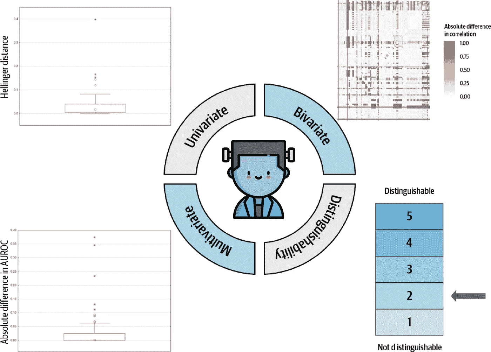
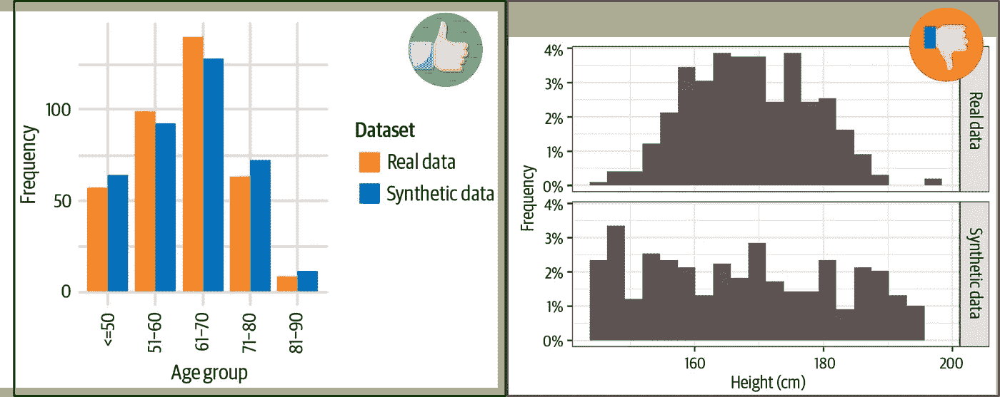
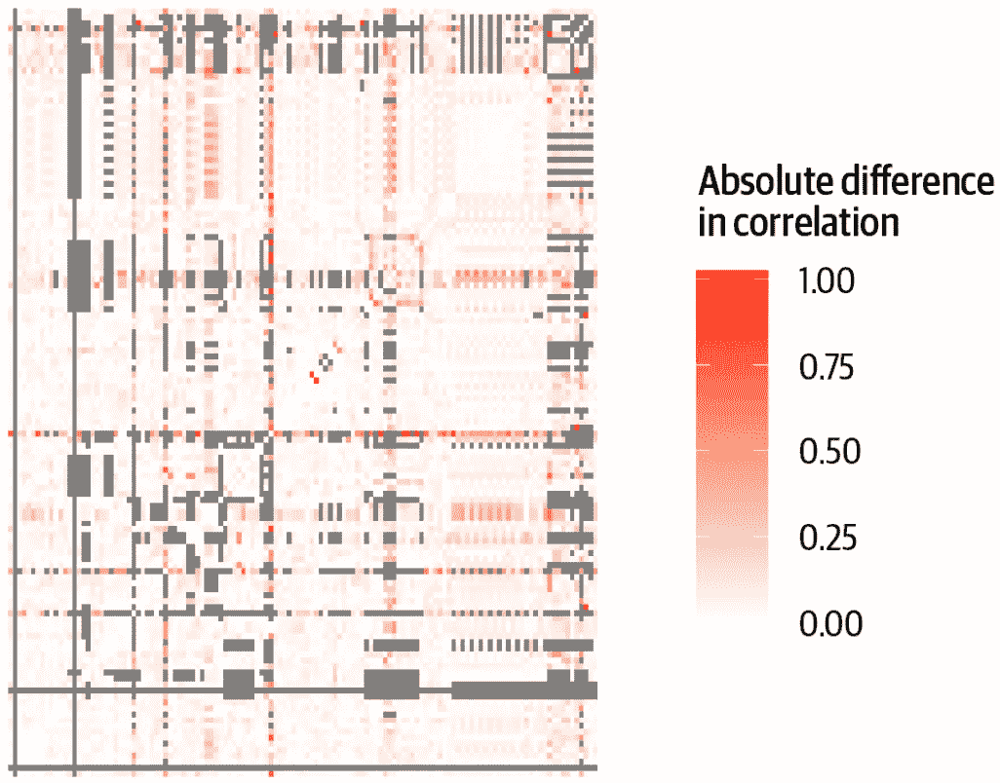

# 你的科学怪人数据集有多真实？

> 原文：<https://medium.com/geekculture/how-real-is-your-frankenstein-dataset-8534a1d296ae?source=collection_archive---------12----------------------->

比较真实数据集和从真实数据集合成的数据集的通用指标

[Photo by Mikhail Nilov](https://www.pexels.com/photo/person-shaping-the-clay-using-hands-9304558/)

当心，因为我无所畏惧，因此强大—玛丽·w·雪莱

T 他的博客包含了我在 [PyConDE 2022](https://www.youtube.com/watch?v=vqRxxuDu4kE&list=PLGVZCDnMOq0p0Fal8_YKg6fPXnf3iPtwD&index=25) 演讲的部分内容。

根据您的要求，您已经合成了一个真实世界的数据集。它似乎有一个类似的结构，并免除您处理敏感信息的法律责任。

请注意！[合成数据集也容易被披露](https://blog.openmined.org/how-synthetic-data-can-leak-your-information/)所以不要松一口气。

现在，让我们专注于如何衡量您从真实世界数据集创建的这个弗兰肯斯坦的真实性。这个数据集需要足够真实，以融入世界，而不是导致村民拿着干草叉和火把游行！

主要有四种方法来比较这两个数据集。

The four metrics that are used to compare real datasets and those synthesized from them. Source: Image modified by the author.

# 比较单变量统计

单变量统计的比较集中在两个数据集之间的单个特征上。绘制特征的分布图可以提供直观的清晰度。

左边的图像显示合成非常成功，因为两个分布是可比较的。而右边的图像是一片混乱。你可能想问模型，“你在做什么？”

Comparison of univariate statistics. Source: Provided at the end of the story

图片胜过千言万语，但数据科学研究的是与图片相关的指标和数字。因此，海灵格距离被用作介于 0 和 1 之间的概率度量，其中 0 表示分布之间没有差异。

# 比较二元统计数据

对于这种比较，真实数据和合成数据中所有变量对之间相关性的绝对差异用于测量数据效用。当然，变量的类型决定了需要计算哪个系数。一些例子是:

*   对于连续变量对:皮尔逊系数
*   连续变量和名义变量之间:多重相关系数
*   对于连续变量和二分变量:点-双列相关
*   对于二分变量对:phi 系数

然后可以绘制计算相关性的热图，以便于比较。

A plot of correlation computed for different pairs of features belonging to a real dataset and the one synthesized from it. Source: Provided at the end of the story

在上面的图中，我们可以看到真实世界数据集的典型差异。而较浅的阴影显示差异接近于 0，合成是成功的。灰色区域用于由于缺失值或低可变性而无法计算相关性的情况。

# 比较多元统计数据

多元统计的比较是一个标签游戏！你就是它，当一个特性变成“它”时，它不是在追逐其他特性，而是被当作一个目标变量。因此，对于每次运行，将使用数据集中的一个变量作为结果来构建分类模型。

这种比较的目的是检查所有可能的模型，并测试真实数据集和合成数据集的性能。使用 ROC 下的面积来测量这种模型的性能。

虽然这些操作看起来计算量很大，但是可以使用广义增强模型(GBM)来构建分类树并加快工作速度。

# 可区别性

区分方法为每个记录分配一个二进制指示符。如果一个特定的观察是一个真实的记录，那么它将有一个新的特性设置为值 1。相反，如果特定观测是合成记录，那么它将具有设置为值 0 的新特征。

使用这些数据集构建二元分类模型，以区分真实数据和合成数据。输出是每个预测的概率，称为*倾向得分。*

如果倾向分数趋向于 0，那么记录是合成的。如果倾向分数趋向于 1，那么记录是真实的。当然，值的分配也可以反过来。也就是说，真实记录可以用值 0 来标记，而合成记录可以用 1 来标记。

来源:

*   [实用合成数据生成](https://www.amazon.in/Practical-Synthetic-Data-Generation-Khaled/dp/1492072745)