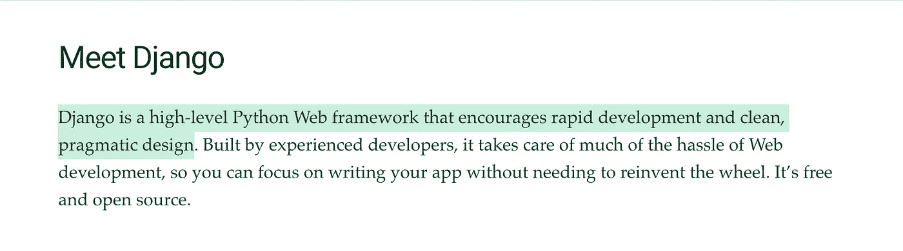
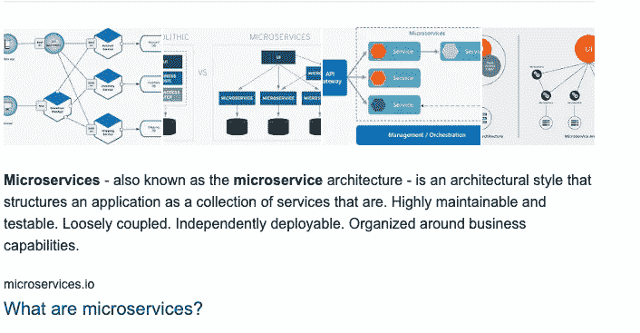

# 姜戈有多重要？

> 原文：<https://medium.com/geekculture/how-relevant-is-django-in-a-world-of-front-end-frameworks-b13e77da405?source=collection_archive---------3----------------------->


Django is frequently described as a batteries-included framework

我先说我每天和 Django 一起工作大约有一年半的经验。我也有使用 Express 的经验，这使我有资格写这篇文章，这篇文章提供了 Django 和轻量级框架之间的许多比较。在本文中，我将讨论使用前端框架启动一个新项目的场景(我将引用 React，但如果您愿意，也可以假装它是 Angular ),并讨论使用 Django 的利弊。我还讨论了将 Django 用于微服务和 WebSockets。

我会尽可能地避免在这篇文章中出现任何偏见，而且我绝对不会在你应该使用什么样的后端框架上扮演救世主的角色。如果你读到一些你不同意的东西，请在这部分留言，我会试着把它带进辩论。或者，你也可以在评论里赶走我可能的知识匮乏。

# 姜戈是什么

这个已经写了一千遍了，我就长话短说吧。



Credit: [https://www.djangoproject.com/](https://www.djangoproject.com/)

扩展一下你在那里读到的，Django 是为你设计的，你不必做很多决定；它固执己见——通常有推荐的方法来做某事。这通常被描述为“包括电池”。你可以专门用 Django 建立一个网站。通过从头到尾遵循文档，它将回答你所有的功能需求，Django 的方式。

# 废电池

当人们谈论使用 Django 作为解耦后端时，我读到的一个批评是，与使用 Flask 相比，您的项目中浪费了大量功能。

让我们进入其中的一些。

**Django 模板**

我不会骗你。如果我能回到过去，避免学习任何一种编程技能，那就是 Django 的模板系统和 Jinja2 格式。Django 就是这样向浏览器呈现动态 HTML 的。在我看来，与用 Django 扩展模板相比，在 React 中使用组件更干净，它允许你制作具有更多功能的应用程序。但是我跑题了。我的目的不是比较 React 和 Django 模板。

那么，这实际上给你带来了什么负面影响呢？简而言之，你的项目规模略大。当您运行“pip install django”时，您会损失宝贵的几秒钟。我知道，太过分了。

实际上，这个功能不会干扰您的 API。这不像当一个请求进来时，它必须通过模板语言才能到达您的 REST 框架端点。这不会导致任何性能问题。

如果 Django 的大小差异(7.8MB 安装 v3.1.5)到 Flask (549km 集体安装 Werkzeug，MarkupSafe，Jinja2，itsdangerous，Flask；安装 v1.1.2)将会对你的虚拟私人机器、Heroku 服务器或者你喜欢部署 Django 的方式产生影响。

**认证&相关安全**

通常，当使用 React 时，我们希望将它部署到一个独立于我们的 API 的域中，可能与 Nginx 一起提供服务。也许不总是这样，但我相信大多数人都是这样做的。

当你用 Django 创建一个网站时，它使用会话认证。当我们使用 Django Rest 框架时，它附带了令牌认证。DRF 令牌身份验证可能是您进行身份验证反应的方式。

Django 以其内置的安全性而自豪。从 CSRF 到 JSX 再到点击劫持。它已采取措施防止这些袭击。然而，这些并不是为了保护另一个域上的 React 应用而设计的。Django 确实有一些与前面提到的安全性相关的中间件，它显然在每个请求上运行一些代码。我非常怀疑这会显著影响请求的速度。

另外，我最近想在 React 中使用 Django 会话认证，因为关于在 web 应用程序中使用 JWT 的安全性的争论还没有结束。您将会遇到我在本文中提到的一些令人头疼的问题——如果您感兴趣的话，请查看一下。

[](/swlh/django-rest-framework-and-spa-session-authentication-with-docker-and-nginx-aa64871f29cd) [## Django Rest 框架和 SPA-会话认证(使用 Docker 和 Nginx)

### 在本文中，我解决了在开发过程中使用 DRF、Django 会话认证和 React 的问题，并给出了一个实例

medium.com](/swlh/django-rest-framework-and-spa-session-authentication-with-docker-and-nginx-aa64871f29cd) 

## **关于可能不必要的**功能**的结论**

Django 包含了很多 Flask 没有的功能，我还没有介绍过。我认为 Django 的额外功能对您、开发人员或您的用户都没有真正的负面影响。

如果你需要制作一些 SEO 优化的页面，你可以使用 Django 模板系统，这样会带来一些好处。如果您不知道，服务器端呈现(如 Django 模板)比 JavaScript 中的客户端呈现(如 React)更容易被搜索引擎解析。这没什么大不了的，也没那么简单，但是如果你想在 SEO 方面有一点优势，你可以在 Django 模板中写出一些内容。

# `What "Batteries" You'll Make Use of`

我想介绍 Django 内置的一些您可以使用的东西，包括 Django Rest 框架——当使用 Flask 或 Express 之类的东西时，您必须自己或通过第三方实现其中的大部分。

**用户模型和认证**

Django 负责为您在数据库中创建模型。刚刚用 Express 和 TypeOrm 创建了一个用户模型，Django 阻止您考虑一些事情。例如，散列密码。我相信大多数人都知道你不会把密码以纯文本的形式存储在数据库中。当你注册用户并让他们登录时，Django 会处理所有这些事情。

这种用户模型有一个很大的缺点。像大多数应用程序一样，你可能会希望用电子邮件和密码来登录你的用户。Django 的方法是用用户名登录，而不是电子邮件。覆盖用户模型是可能的，但是第一次这么做有点让人头疼。我听到的唯一理由是维护遗留项目。还记得我之前说过 Django 做任何事情都有一个推荐的方法吗？这是一个让我希望有两种内置方式的例子。

一旦您完成了配置(如果您决定这么做)，Django Rest 框架的令牌认证就使用 Django 用户模型。这肯定比使用非独立框架建立自己的身份验证要快。使用第三方包来设置 JWT 令牌也很容易，它也使用 Django 用户模型。

**其他相关话题**

Django 提供了 ORM 这样的功能。然而，似乎当你使用 SqlAlchemy 的 Flask 或 FastAPI 时，也是一样简单。

我要说的是，姜戈的一个不必要的困难是 CORS。我花了一整天的时间用 django-cors-headers 和 rest 框架撞墙。出于某种原因，它不适合我，而使用 npm cors 包和 express 再简单不过了。

我想说的另一个让 Django 的生活变得更加简单的特性是静态和媒体文件。具体来说，当你使用亚马逊 S3 桶，你可能应该为生产，在我看来。django-storages 让这变得轻而易举。

在我最近的 Express 项目中，我在 Django 中寻找类似 ImageField 的东西。如果你不熟悉，在 Django 中，你使用 Pillow 包，它允许你在 DB 模型上有一个图像字段。使用 django-storages，您可以将文件上传到该字段，它会处理 AWS auth，创建唯一的文件名，检查文件类型，上传到 s3 bucket，并跟踪云中的位置。删除和更新也一样。我不确定 Flask(我相当有信心 *django-* storages 是不兼容的)，但是我在 npm 生态系统中四处看了看，没有发现任何类似的东西。我会假设这是因为有许多 ORM 包，当有这么多竞争时，没有人想为一个特定的实现它。自己落实一下也没什么大不了的。不过，有了 Django 就方便了。

Django 还有许多我没有在这里介绍的其他内置特性。例如，如果你需要发送一封电子邮件，Django 可以满足你的需求(包括发送 HTML 模板)。我发现这比在包中保存额外的字节更有用。也许我错了，但是据我所知，向 EC2 实例添加 8MB 可能不会引起问题。

# **Django Rest 框架**

在此之前，我一直没有过多地谈论 DRF，因为我想单独讨论 Django。但实际上，没有它你是不会创建一个 API 的(除非你用的是 GraphQL 和 graphene，不过那是以后的事了)。你可以，但我个人想不出你为什么要这么做。我发现最有用的两个东西是连续出版物和视图。

# 连续出版物

在我看来，Django Rest 框架最好的地方是序列化器，特别是模型序列化器。serialiser 是一个您向其传递数据的类，它将处理数据并为您执行一些功能。一旦你精通了这些，你就能以惊人的速度编写 CRUD 功能。只需将数据传递给模型序列化程序，它就会在指定的模型上施展魔法。它为您执行数据验证和 DB 操作——您只需要指定操作。从那里，它将返回您需要的数据或错误，两者都是 JSON 格式。

# 视图

视图只是为路线提供一些预设功能的一种方式。一般的观点是伟大的。如果您需要返回一个模型的所有数据的列表，您可以在一行代码中完成(假设您已经设置了您的序列化器和模型)。为 CRUD 设置端点也是如此，尽管一旦您开始需要权限或其他功能，您就有可能远离通用视图。以我的经验，发展很快。

Django Rest 框架还有更多的内容，但这是我使用最多的，所以这就是我要说的。

# 含电池 vs 第三方

我看到人们经常在网上讨论这个问题。人们对他们喜欢哪一种风格非常固执己见。两者各有利弊。

对 Django 的一个很大的批评是建立一个项目需要大量的样板代码。运转

```
django-admin startproject
django-admin startapp
```

给从未使用过 Django 的人创建了大量的文件。Flask 的论点是，你可以用一个文件启动并运行一个 API。太好了。然而，一旦你的 Flask 应用程序设置好了，很可能你就不会继续在 main.py 中写你所有的逻辑了(请不要)。

让我概述一下关于在一个包中包含许多功能的争论。一个简单的例子是 ORM。在 pip 生态系统中，可能有数十或数百个 ORM 包可供您使用。我没有使用 SQLAlchemy 的经验，但是有道理的是，一个单独专注于 ORM 的包可能比 Django ORM 稍微好一点，Django ORM 是 Django 做的几百件事情中的一件。除此之外，你还有一个选择。你可以做你的研究，看看不同套餐的利弊；也许有一款最符合你的需求。我在这里使用 ORM 作为例子，但是这适用于你需要构建的所有功能。让我也声明一下，我喜欢 Django ORM，它的开发速度令人欣喜；我只是想提出一个论点。

然而，在这个争论的另一面，当谈到 Django 和使用 ORM 时，只有 Django ORM。没有必要去读一些我确信名为“2021 年最佳 Python ORM”的文章——只要埋头阅读文档就行了。

进一步添加到 Django ORM 参数中，让我们假设 SQLAlchemy 的性能稍微高一点，可以让您在 60 毫秒而不是 65 毫秒内完成一些查询(再次强调，我是为了方便讨论而编造的)。这对最终用户几乎没有影响。如果你的 Django 应用程序扩展到 10 亿用户，并且查询速度正在消耗大量资源，那么你很可能不会遇到重构或创建微服务来提高速度的问题。

我在这里提出的论点的两个方面都适用于构建应用程序的任何部分。也许有一个稍微好一点的(更专业的)包来处理 Flask 的模板。如果这是一个巨大的交易，你知道它会让你的生活更容易，使用烧瓶和包装。

总结这一节，真的，它归结为你的应用程序需要什么。如果你需要完全的控制和为你的应用程序需要的每一个功能选择一个包的能力，可能用 Flask。但是如果你想加快开发速度，并且希望大部分决策已经为你做好了(包括著名的文档)，那么就选择 Django。两种选择都是可行的。

# **微服务**

我将保持这一部分简短，因为我没有太多的微服务经验。然而，这个论点并不太难布局。



Credit to microservices.io

除此之外，每个服务通常处理项目/应用/系统/技术的一部分——例如，身份验证或图像处理。回想一下我之前说过的关于 Django 的额外功能和启动时生成的大量文件。我说这真的不会对事情产生太大影响。当你试图建立一个只做一件事的小服务时，这就不成立了。拥有额外的电池很可能会碍事。

我认为用 Django 或者轻量级的东西来构建微服务是一个非常明确的选择。我相信你一定可以用每个运行的 Django 构建微服务。不过，用 Flask 更有意义，也更坚持微服务的精神。

# **异步代码和 WebSockets**

早在 2005 年制作 Django 时，WebSockets HTTP 协议(创建于 2011 年)还不存在。这意味着完全同步地编写所有 Django 是完全合乎逻辑的。切到今天，和 Django 一起使用 WebSockets 最流行的方式是 Django 通道。

我对 Django 有相当多的经验，但我并不觉得实现通道很直观。让我说清楚；那纯粹是我的意见。也许我需要付出更多的努力，我会掌握它的窍门。我认为不完全直接的是在异步和同步代码之间切换以使用 ORM。我最近一直在节点生态系统中使用 socket.io 和 Apollo Server(不在同一个项目中)(在我看来，这些使用 WebSockets 的选项更简单)。

在我看来，使用通道感觉有点像用胶带将 WebSocket 功能捆绑到 Django，但这并不是说它不起作用。那么，为什么 Django 的核心不能重写得更加异步友好呢？首先，工作量很大。第二，因为它是 2005 年创建的，无数的项目使用 Django，如果他们发布一个有突破性变化的更新，将会引起强烈抗议。对于依赖 Django 的项目来说，这是一件好事！但是如果你要开始一个需要 WebSockets 的项目，你可能需要做更多的研究。

我也不确定 Django Channels 适合服务于前端框架还是用 Jinja2 编写的 Django 模板。

总结一下 WebSockets。如果你开始一个需要 WebSockets 的新项目，请自己研究一下什么是最适合你的框架或包。这部分是我根据自己的经验得出的意见，所以请记住。

# 那么 Django 在前端框架的世界中处于什么位置呢

总结一下我在这篇文章中所涉及的内容。

Django 确实有很多功能，当您使用前端框架时，这些功能可能在您的项目中没有用到，但是实际上，不使用这些功能不会导致任何性能问题或开发问题。我认为 Django 项目的样板文件大小也是如此。这真的只会是初学者的问题，而且很可能不会太久。

对 Django 的一个有效的批评是，做事情有固定的方式，大多数时候会给你留下更少的选择来构建功能。但这可能不是一件坏事。Django 用 16 年的思考过程背后的经验为你做出这些关于构建功能的决定。

我喜欢 Django REST 框架，在无头架构中使用前端框架时，它是一个非常有用的工具。Django 还有一些其他的功能可以让生活变得更简单，比如用户模型和它的好处，以及我个人最喜欢的 django-storages。

说到 WebSockets 和微服务，我觉得这是 Django 的不足之处，但即使如此，可能也不会太多。由于遗留问题，Django 在异步代码方面(再次，在我看来)比最近的包要差一些。但这并不是说 Django 让您没有工具来完成 WebSockets。说到微服务，您仍然可以使用 Django，但是轻量级框架更适合小型服务。

我想我已经为 Django 和它与前端框架的结合提供了一篇平衡的文章。但我认为总体来说，Django 是后端框架开发速度的一个很好的选择。然而，当您想做一些“不是 Django 的方式”的事情时，您会遇到麻烦，例如，在 SPA 中使用 session auth。

就我个人而言，我正在用 Apollo Server、Express、Apollo Client 和 React 构建我的新项目。开发体验很棒。如果你想知道我为什么喜欢它，看看这篇文章。

[](/geekculture/how-im-developing-my-full-stack-web-app-with-the-guards-up-62ae1a25cf3a) [## 我如何在警惕的情况下开发我的全栈 Web 应用程序

### 在这篇文章中，我将分享 Apollo、Typescript、Prisma 2.0 和 GraphQL-codegen 是如何改变游戏的，当它…

medium.com](/geekculture/how-im-developing-my-full-stack-web-app-with-the-guards-up-62ae1a25cf3a) 

感谢阅读这篇文章。同样，如果你认为我说的任何事情都是严重失实的，请告诉我。