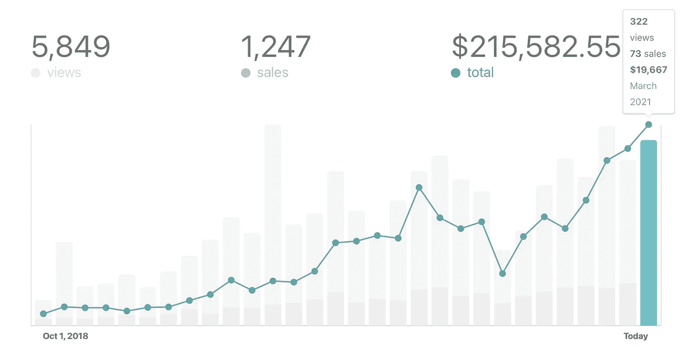

# 里克·申宁克如何将一个 JavaScript 图像编辑器引导到 2 万美元的 MRR

> 原文：<https://medium.com/geekculture/how-rik-schennink-bootstrapped-a-javascript-image-editor-to-20k-mrr-b09e75157285?source=collection_archive---------6----------------------->

Pintura sales. Source: Rik Schennin

Pintura 的作者 Rik Schennink，[分享了他的公司每月收入达到 2 万美元的历程(MRR)。我认为它接近了许多独立黑客的旅程，并有一些有价值的东西可以学习。](https://www.indiehackers.com/post/i-bootstrapped-a-javascript-image-editor-to-20k-mrr-ama-549b24b9f2)

[Pintura](https://pqina.nl/pintura/) —一个 JavaScript 图像编辑库，**拥有超过 1000 个客户，包括像 Dropbox、Square 和 ConvertKit** 这样的大公司。实际上有数百个图像裁剪库，但是**帮助 Pintura 脱颖而出的一点是在任何设备上的原生体验**。

独自一人，这个旅程花了 Rik 5 年的时间来理清事情，并到达$20k MRR。以下是 Rik 如何创建 Pintura 的简短版本，以及帮助他实现这一目标的一些事情

# 找到一个受欢迎的产品，并使它好 10 倍

Rik 于 2011 年开始在 CodeCanyon 市场上销售插件。他意识到构建酷插件没有回报，于是**决定瞄准市场上的流行类别**。

经过研究，他发现**图像裁剪和上传类别很受欢迎，但他觉得他可以构建一些更好的东西**。这导致了最初的版本——Slim Image Cropper，它创造了成千上万的销量。

由于 Envato 平台无关的复杂性，Rik 决定创建一个新版本——多卡，并自己发布。后来，他将产品重新命名为平图拉，因为“多卡”是注册商标

# 如何获取客户

最初的客户来源是他的副业项目。在 Pintura 之前，他从事于[File pond](https://pqina.nl/filepond/)——一个流行的 JavaScript 文件上传程序，在 Github 上有超过 11k 颗星。它有多个用于不同 JS 框架的 Github 存储库。在每个存储库上，Rik 都嵌入了一小部分来宣传 Pintura 。

此外，相关空间和内容营销的联盟伙伴关系也带来了大量的流量。他还通过分享挑战性的情况、工作进展的照片和销售数字，在公共场合进行建设。

Rik 对内容营销的建议是**在 StackOverflow 上找到流行的问题并写下来**。“如果我最终在 Stack Overflow 上而不是在一个有明确答案的网站上，我通常会决定写一个”，他说。

# 关注用户体验以实现差异化

让平图拉与众不同的是它的 UX。他意识到**类似的库并没有为移动设备优化太多**。公司愿意为每台设备上的原生外观每年支付 649 美元。

每个版本都经过 BrowserStack 测试，以确保重要功能在多种设备和浏览器版本上正常运行。

此外，他可以很快发布补丁和更新

# Rik 关于推出新产品的建议

推出一款新产品通常是一次令人汗流浃背的经历。

为了最大化你的发布日的结果(例如寻找产品)，里克建议**在营销材料**上投入额外的努力。大部分产品的营销资料都很一般，拥有顶级的照片和文案会给你带来竞争优势。考虑雇佣一个设计师，以防你自己不能设计它们。

此外，直接联系你的联系人，问问他们是否愿意帮忙宣传。

此外，享受发射。如果发射不顺利，不代表什么。

# 外卖食品

Rik 建立了一个 javascript 图像编辑库，因为它是一个受欢迎的类别，然而这种体验还可以改进，特别是在移动设备上。他通过副业项目、合作伙伴关系和内容营销获得客户。

如果你在一个拥挤的市场，找到可以改进的细节并提供一流的用户体验可能是一个很大的竞争优势。