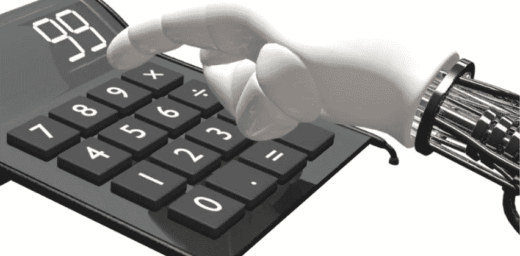

# 会计服务中的 RPA 如何改变行业

> 原文：<https://medium.com/geekculture/how-rpa-in-accounting-services-is-transforming-the-industry-e830d472e0c6?source=collection_archive---------39----------------------->

金融行业依赖于会计的准确性。一个错误，公司就会损失数千美元。也没有效率低下的余地。错过报税的最后日期会带来严重的麻烦。匹配财务报表需要大量的时间——会计团队会在各个地方进行强有力的调整。

会计行业的机器人流程自动化旨在解决这些挑战。会计流程自动化侧重于快速完成数据输入任务和平衡财务报表。

大多数不准确的结果来自复杂的会计系统。然而，审计自动化工具并不关心这个——如果它们得到一个操作触发器的话。无论记录一个条目需要 15 个步骤还是 1 个步骤，RPA 机器人都会毫不含糊地完成。对于一个完全依赖会计人员处理每一笔小额金融业务的行业来说，这是一大优势。

> ***阅读更多:*** [***不同行业你应该知道的 11 个 RPA 用例***](https://www.botreetechnologies.com/blog/rpa-use-cases-for-different-industries/)

本文重点回答三个主要问题-

以下是一个[详细指南，用于理解 RPA 在会计和财务](https://www.botreetechnologies.com/blog/how-rpa-in-financial-services-is-transforming-the-industry/)中的功能。我们将解决企业最想知道的问题——管理会计中的机器人流程自动化如何帮助他们的企业？继续阅读以了解更多信息。

# 会计与财务中的 RPA 是什么？

即使在 2021 年，财务部门也有数百项琐碎的任务。从数据录入到集中式系统，再到实现交易准确性，RPA 解决方案在会计、审计和财务管理中发挥着广泛的作用。

RPA 在会计中的应用是多种多样的。RPA 自动执行消耗员工宝贵时间的日常重复性任务。通过部署 [RPA 自动化](https://www.botreetechnologies.com/blog/5-financial-services-companies-successfully-using-robotic-process-automation/)，企业可以轻松消除手工记账和财务的瓶颈。

当你问“那么，会计中的 RPA 是什么？”更重要的是理解它是如何工作的。虽然该技术不像机器学习那样根据自己的意愿直接操纵数据，但 RPA 支持数据传输、响应触发和事务执行。

大多数情况下， [RPA 实施](https://www.botreetechnologies.com/blog/rpa-implementation-in-salesforce-a-comprehensive-guide/)是关于自动化可预测的常规活动。它有助于预算、预测计划、报告和收入管理。需要来自多个来源的数据的活动需要 RPA 来自动化流程并快速交付结果。

# RPA 在会计上有什么好处？

RPA 在会计方面的优势超过了他们的名声。它为员工带来了巨大的灵活性、生产力和效率。

RPA 解决方案也有助于营造自主创新的环境。将数据输入和记录传递等日常任务委托给 RPA 机器人的企业拥有极具创造力的员工。不做累人的重复性工作的人更专注，更能掌控自己的工作。

让我们看一下 RPA 在会计和金融服务领域的 3 个最重要的优势

*   **更高的生产率:**当会计师事务所有很多客户时，RPA 非常有用。从各种发票中提取信息，传递到多个系统，手工处理，很累。RPA 解决方案通过在更短的时间内交付更多成果来提高生产效率。机器人与不同的系统互动，收集信息并记录在最需要的地方。可以提高 50%的生产率。
*   **更高的准确性:**在财务管理上犯错是不可接受的。[会计中的机器人流程自动化(RPA)](https://www.tntra.io/robotic-process-automation-services) 根据触发器执行特定功能。虽然人类会疲劳并犯错误，但 RPA 机器人会全天候工作，不会犯任何错误。他们被给予预先确定的触发器，这些触发器响应系统需要的结果。RPA 通过仅提供特定结果来提高结果的准确性。
*   **效率提升:**RPA 在会计方面最显著的好处之一就是效率。一项财务任务，比如税务数据提取，可能需要员工花费数小时来完成。RPA 机器人可以在几分钟内完成该任务。它将遍历系统，搜索所需的参数，并在几秒钟内提取数千个数据值。公司可以节省大量时间，将人力资源用于更重要的任务。

除此之外，RPA 还能更好地留住员工。当平凡的任务被委派时，员工会从事创造性的任务，包括创造性的思考。这有助于他们成长并提高你的员工保留率。

> ***结帐***[***RPA 技术对数字化企业的利弊***](https://www.botreetechnologies.com/blog/pros-and-cons-of-rpa-technology-for-digital-enterprises/)

让我们继续讨论会计中的 [RPA 示例](https://www.botreetechnologies.com/blog/rpa-use-cases-for-different-industries/)及其在不同财务流程中的实际应用。

# 会计领域有哪些 RPA 使用案例？

随着行业越来越向技术发展，金融和会计领域的 RPA 使用案例正在成倍增加。如今，RPA 将实现金融运营的数字化，并为各种应用程序带来新的效率。

**以下是 RPA 在会计领域的一些使用案例和示例-**

**应收账款&应付账款**

*   RPA 在为客户生成常规发票时非常有用，因此应收账款始终处于受控状态。它可以自动提醒他们付款，并在设定的时间间隔内采取后续行动。
*   同样，财务部门可以设置 RPA 机器人将供应商发票直接传送到批准者的收件箱。公共会计中的机器人流程自动化通过集成到财务系统和银行账户，自动向供应商付款。他们还可以将购买历史与发票进行匹配，以确保准确性。

**发票处理**

*   如上文所述， [RPA 服务](https://www.botreetechnologies.com/robotic-process-automation)在发票处理中发挥着至关重要的作用。每月为供应商和客户创建发票是一个耗时的过程。RPA 解决方案简化了这一过程，并带来了更好的支付管理。
*   管理会计中的机器人流程自动化使机器人能够从各种来源收集数据——电子邮件、CRM 等。RPA 自动化有助于收集所有发票数据、准备发票并将其发送给所需的利益相关方。

**账目对账**

*   结清财务账户是一项费力的工作。它需要大量的关注、细节、数据提取等等。在您将数据与帐户进行匹配后，会计部的 RPA 会负责处理该流程。
*   RPA 机器人会根据您设置的特定参数来查找系统中的差异。这将有助于对账和管理交易，而不会损害与客户的关系。

**报告生成**

*   生成财务报告是一项挑战。报表完成后，您如何在尽可能短的时间内为客户制作报表？通过在金融服务和报告生成中部署 [RPA。](https://www.botreetechnologies.com/fintech-app-development)
*   RPA 可以记录每天的交易、费用、损益和收入，并在您需要时提供报告。因为有预定义的触发器，所以报告中不会有错误。

**财务管理**

*   RPA 与人工智能相结合，为财务管理提供智能成果。它通过 Robo Advisors 提供个性化投资建议。通过 RPA 机器人，算法交易也成为可能。
*   RPA 可以跟踪市场数据的实时变化，并准备一份报告来帮助您做出更好的财务决策。它可以跟踪你投资组合中的投资，并推荐你应该投资的股票。

# 结论

RPA 在会计和金融方面的优势肯定会超越我们今天所知道的。随着现代技术在金融行业中的使用越来越多，RPA 正在成为数字化转型的重要驱动力。

[BoTree Technologies](https://www.botreetechnologies.com/) 提供完整的会计和财务 RPA 解决方案。我们构建先进的机器人，使您的金融交易自动化，并提供准确性。请立即联系我们了解更多信息。

*原载于 2021 年 6 月 18 日 https://www.botreetechnologies.com**[*。*](https://www.botreetechnologies.com/blog/how-rpa-in-financial-services-is-transforming-the-industry/)*