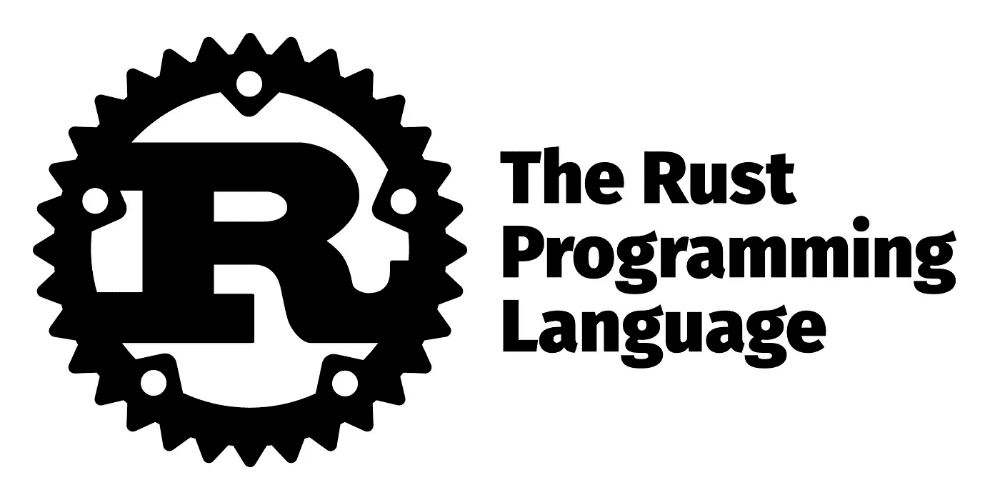

# Rust 如何影响开源安全？

> 原文：<https://medium.com/geekculture/how-rust-could-impact-open-source-security-637af1d2e857?source=collection_archive---------10----------------------->

Rust 是一种框架编程语言，运行速度快得惊人，防止了 segfaults，并确保了字符串的健康。

**Rust 由 Mozilla 于 2010 年创建，**在过去的几年里，Rust 作为开发高性能软件的 C 和 C++的替代品，已经获得了广泛的关注。

像其他语言一样，Rust 也有自己的怪癖和潜在的安全漏洞。但是因为 Rust 是为安全而设计的，它的使用可能会带来更安全的开源软件。

Rust 是一个 O [笔源项目](https://codersera.com/blog/open-source-projects-for-beginners/) ，已经收到超过 1400 名程序员的投稿。

这种语言越来越受欢迎，GitHub 上有超过 5000 个知识库。在这篇博文中，我们将探讨 Rust 如何影响开源安全，以及它的独特特性如何使其非常适合数据安全应用。

# 什么是铁锈？

Rust 是一种系统编程语言，运行速度极快，可以防止 segfaults，并保证线程安全。

[**Rust**](https://codersera.com/blog/learn-rust-programming-language-in-5-mins/) 是一种正在市场上蓄势待发的新型编程语言。它有许多有趣的特性，对于想用现代语言编写程序而又不想牺牲性能的程序员来说，这是一个极好的选择。

Rust 确保了强大的安全性和更多的客户前景，这使得 rust 成为程序员的理想选择。

Rust 是一种相对于不同方言有各种优势的语言。它旨在更好地抵御错误和安全漏洞，并且它的性能也优于许多其他语言。

# Rust 如何影响开源安全？

Rust 是 Mozilla 公司开发的一种编程语言。它旨在成为一种“受保护的、同步的、功能性的语言”。过去，铁锈曾被用于许多不同的用途，随着时间的推移，它越来越受到人们的关注。例如，它已经被用于创建游戏和网络浏览器。

它提供了高性能和内存安全。它还支持并发编程，对于许多开发人员来说，这是一个很有吸引力的选择。crates.io 仓库的锈捆数量正在增加，当地充满活力。此外，向后兼容性和稳定性是选择编程语言的重要因素，Rust 在这两方面都很出色。

Rust 是一种编程语言，旨在使编程更容易、更安全、更可靠。这是一个开源项目，由 Mozilla 于 2006 年启动。Rust 编程语言的创造者想要创造一个“快速、内存安全和可并行化”的系统。

# 生锈有什么好处？

生锈有几个好处。请允许我们列出 Rust 语言的主要优势:

1.  Rust 是一种框架编程语言，运行速度快得惊人，防止了 segfaults，并确保了字符串的健康。
2.  Rust 在语言学上类似于 C++，但它可以在不使用垃圾处理器的情况下确保内存健康。
3.  Rust 还支持并发编程，所以多线程可以同时执行代码。这使得编写既能执行又安全的程序成为可能。
4.  在 Rust package 库 crates.io 上也有越来越多的 Rust 包。这使得在您的项目中查找现有的库和模块变得很容易。
5.  最后，Rust 社区非常活跃，新项目和创新一直在发生。你应该放心，你对铁锈的兴趣会长期保持下去。

生锈是为了保护，同时，和常识。它被大量利用，从互联网浏览器到植入的框架。

Rust 的一些主要好处是它的安全特性，这有助于防止崩溃和内存泄漏。它还非常快速高效，是性能敏感型应用的理想选择。

除了作为一种优秀的系统编程语言，Rust 在游戏开发中也越来越受欢迎。它以前曾被用来制作一些卓有成效的游戏，包括《魔兽世界》和《光环 5:守护者》。

如果你正在为你的下一个项目寻找一种安全、快速、实用的语言，Rust 是值得考虑的。

# 结论

虽然 Rust 是一种相对较新的编程语言，但它已经在开发人员中获得了很高的人气。其受欢迎的原因之一是其工业应用的潜力。 ***Rust 以其展示性和安全性著称，使其成为现代应用的最佳可能性。*** 考虑到，在现代应用中涉及锈蚀仍有一些困难。

例如，可能很难找到有经验的**Rust 开发人员**，一些工具和库问题需要解决。

然而，一般来说，铁锈似乎有很大的现代用途潜力。由于它的安全性和执行性突出，它很可能是大多数各种用途的非凡选择