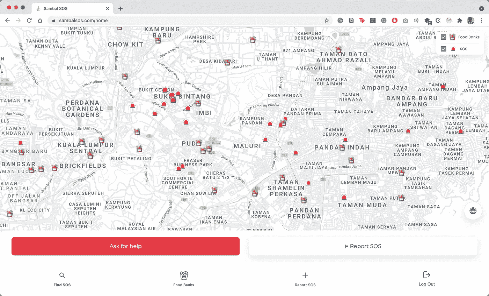
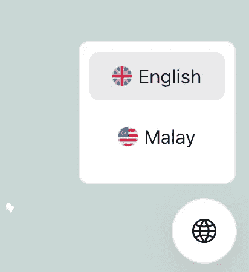
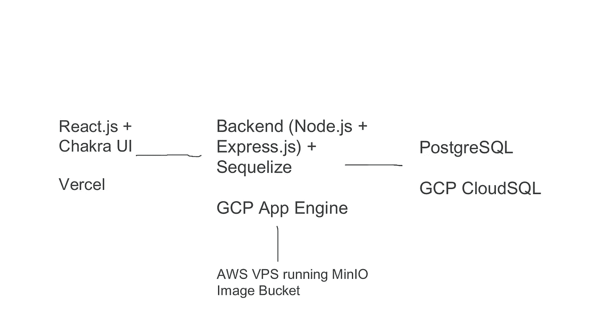

# Sambal SOS 如何扩展(完整的开发工作流程)

> 原文：<https://medium.com/geekculture/how-sambal-sos-scaled-the-complete-development-workflow-8b5401bd952c?source=collection_archive---------16----------------------->



The Homepage of Sambal SOS

> 众包帮助全国的数据。以前的 Bendera Putih 应用程序

距离 Sambal SOS(前身是 Bendera Putih App)的问世已经过去了 2 周左右。在经历了情绪的过山车、冗长的代码冲刺、bug 搜索、超过 250 次提交、45 次拉取请求、422 份报告和 25k 用户之后，我坐下来写这篇文章。

Sambal SOS，在其早期阶段，并不是按规模建造的。我们把它作为一个爱好/黑客马拉松项目开始；我们没想到会有这么多流量，更不用说国家层面的关注了。当它开始飙升时，我们开始意识到我们建造了什么，这是超现实的。与此同时，问题出现了，我们必须找到快速的修复方法来保持构建的稳定性。我们意识到快速工作流程的结果，绕过测试和试运行，直接从开发进入生产。

然而，当它最终出现时，看到真实的人使用它是令人感动的，我们知道我们必须扩大规模。

我来这里是为了讲述一路走来的每一步，我们面临的所有问题，以及我们在 Sambal SOS 发展过程中吸取的教训。

# 测试版发布(7 月 2 日星期五)

在此之前，我们已经在开发者 Kaki 上宣布 Bendera Putih 应用程序正在开发中，我们将很快发布测试版。这一天已经到来。我们有一个稳定的构建(或者说我们是这样认为的)。

我们还没有后端服务器，所以我们犯了第一个大错误:选择 Firebase。React 前端连接到 Firebase 并被实时部署…我们使用的是 Firebase 的免费版本。因此，当那天晚上流量开始攀升时，我无法将目光从控制台上移开，只是等待生产崩溃，因为我们超过了所有设定的配额。

## 问题 1: Firebase

使用 Firebase 托管业余爱好项目，它不是为了任何规模的东西。幸运的是，我们没有花太多时间来设置它。在 Sambal SOS 托管了两天之后，从 firebase 和 firestore 迁移出来是无缝的。

## 问题 2:不正确地配置 cookies

如果您查看我们的 Redux 设置，您会看到这个登录、注销流来处理应用程序中的身份验证状态。

然而，我们忘记了在登录时设置 cookies，而是选择读取它来判断用户是否登录。因此，每次刷新页面时，您都会被重定向回登录页面。在没有意识到错误出在 Redux 设置中的情况下，我们开始责怪 Firebase(Firebase 在很多方面都有问题，但肯定不会导致认证流程的问题)。

然后，人们开始抱怨在脸书的内部浏览器上加载页面时出现黑屏。正确设置 cookies 修复了“空白页”问题。

## 第 3 期:必应地图

我们没有资金，所以对于实时地图，我们使用必应地图。它有一个慷慨的免费配额，这足以维持我们认为我们会持续的一点点时间。当与 React 集成时，它是滞后的，大部分时间停滞不前，配置工具提示成了一场噩梦。地图几乎无法导航，我们需要找到一个快速的解决方案。

我们在 Developer Kaki 上的帖子吸引了一些赞助商，其中一个提出在他的云上托管我们的基础设施。他还提出在初始阶段为我们的谷歌地图 API 付费。第二天，我们剥离了整个页面，迁移到 react-google-maps，有了新的支持。变化是深刻的；我们立即开始注意到性能的提升和令人难以置信的文档使得配置更加灵活。

# Vercel 和 Google 云迁移

这款应用迅速发展，人们开始使用它。我们看到了地图上的旗帜，是时候缩放比例了。

我们的架构现在包括 React.js 前端(用 Chakra UI 构建)、Node.js (Express) API 后端和 PostgreSQL 数据库。这是堆栈的每个部分所在的位置:

1.  前端-> Vercel
2.  后端-> GCP 应用引擎
3.  数据库->云 SQL

这是一个按月球比例建造的堆栈。我们的赞助商给了我们一个 10GB 的 SSD 数据库实例，应用程序引擎运行速度非常快。虽然部署和设置数据库很麻烦(我们最终跳过了顺序迁移)，但它最终在周日早上启动了。

是进入生产的时候了。

# 生产(7 月 4 日星期日)

测试版只面向开发者社区，所以这一次，我们向所有人宣布。我们的社交媒体平台建立起来了，设计资产建立起来了，我们通过《脸书邮报》发布了这些信息，这些信息最终像病毒一样传播开来。一名马来西亚记者发了一条关于我们的微博，转发量超过了 6000 次，一夜之间，Bendera Putih 应用爆了。与此同时，大量的问题出现了:

## 服务人员

渐进式网络应用(PWA)。每个人都喜欢它们，所以我们认为 Bendera Putih 应用程序应该是 PWA。然后，用户可以将应用程序下载到他们的主屏幕上，并将其用作应用程序。然而，要正确地做到这一点，您必须正确地编写您的服务工作者。这些基本上是告诉浏览器如何把你的页面当作一个应用程序的小功能。

问题是:我们写错了。有错误的服务人员，没有正确缓存页面，所以在第二次访问时，你会遇到一个空白的页面。

```
service-workers.js -> serviceWorkers.js
```

和一个没有缓存的有缺陷的服务人员。我们没有时间编写新的或试验它们，所以最简单的解决方法是注销所有服务人员并删除 PWA 功能。于是，一批新的服务人员被推到了现场，唯一的目的就是杀死他们的前任。

## 打印不正确的地址

虽然有一个搜索栏可以获得准确的地理位置，但在用户界面中，它被地理编码为一个完整的地址。问题是地理编码通常非常不准确。如果您报告了一个离贫瘠地区的一所房子 100 米远的事件，它将返回最近的注册财产。

不到一个小时，我们删除了这个选项，选择添加一个重定向到谷歌地图的按钮。这将把他们带到准确的地理位置，而不是一个通用地址。

## 谷歌地图 Javascript API

谷歌地图 Javascript API 的价格像比特币一样上涨，我们的赞助商敦促我们寻找合适的企业赞助，以保持地图功能的活力。后来，我们通过危机应对者地图平台获得了积分。

## 错误加载谷歌地图

在 React 上设置 google maps 时，您必须动态加载 Google Maps 脚本，并且只在地图完全加载后才加载它。这是最初没有设置的，所以在第一次加载时，您会看到一个内部服务器错误。我们通过使用返回加载状态的`useJsApiLoader`函数纠正了这个问题。

地图组件仅在所有内容都完全加载后才加载。

## 云雾缭绕

我们选择 Cloudinary 时，它还被视为一个爱好项目。我们让用户从前端上传全分辨率照片到 Cloudinary 上(Cloudinary 真的没有理由适当地缩减它，因为我们越快达到配额，我们就越早必须为他们的付费计划付费)。

即使在最低设置下，也有 8MB 的图像滞留在 Cloudinary 上，堵塞了空间和带宽。

最终，我们开始使用赞助的 AWS VPS 运行 MinIO。所有新的图像都开始出现在那里。在节点服务器上使用 Sharp 进行图像压缩也非常有效，可以将 8MB 的图像压缩到 10KB。

后端上传控制器的摘录

## 翻转纬度和经度(大约一个小时)

这太尴尬了。在一个获取当前位置的函数中，纬度和经度被交换了。这导致食物银行出现在大西洋。我们很快解决了这个问题，但是不得不手动交换现有的记录来纠正它们。

## 日益混乱的代码库

当团队变得越来越大，越来越多的人积极地推动时，是时候执行林挺和拉请求过程了，这样我们就可以保持代码质量。

## 多语言应用程序

它最初是一个单一语言的应用程序。志愿者帮忙翻译。它目前有英语和马来语版本；我们将很快添加中文和泰米尔语。

我们用了 [react-i18n-next](https://www.npmjs.com/package/i18n) 。场景是这样的:

有一个切换按钮，允许用户在语言之间切换。



## 食物银行适度

向平台添加食物银行的请求开始增加，这需要根据他们的库存实时修改他们的状态。我们开始与马来西亚研究中心合作，他们为此成立了一个特别工作组，让我们能够获得关于这些食物银行的丰富信息。我们目前正致力于从他们的实时 API 中获取它，而不是通过 Google Sheets 工作流更新的静态 JSON。

## 主要和生产应该是不同的分支

GitHub 上的主要分支应该是主要的开发分支，生产应该是 Vercel/前端主机监听的分支。很长一段时间以来，每当 PR 合并到 main 中，就会触发重新部署。

工程团队现在更大了。我们有马来西亚的开发者，有些甚至在世界的其他地方，致力于问题和新功能。现在这是一个稳定的构建，所以是时候处理所有的特性请求并开始集成它们了。

Sambal SOS 是一个完全开源的项目，其存储库链接如下:

[](https://github.com/sidharrth2002/sambal-sos-app) [## sidharrth2002/sambal-sos-app

### 众包帮助全国的数据。通过创建帐户，为 sidharrth2002/sambal-sos-app 开发做出贡献…

github.com](https://github.com/sidharrth2002/sambal-sos-app) 

这里的服务器:

[](https://github.com/sidharrth2002/sambal-sos-backend) [## sidharrth 2002/sambal-SOS-back end

### 众包帮助全国的数据。为 Sambal SOS-sidharrth 2002/Sambal-SOS-back end 构建的服务器

github.com](https://github.com/sidharrth2002/sambal-sos-backend) 

# 看板板上即将推出的功能

1.  管理面板
2.  ̶F̶a̶c̶e̶b̶o̶o̶k̶ ̶O̶A̶u̶t̶h̶
3.  向上投票
4.  实时食物银行地图
5.  M̶a̶p̶ ̶c̶l̶u̶s̶t̶e̶r̶i̶n̶g̶
6.  m̶o̶r̶e̶̶l̶a̶n̶g̶u̶a̶g̶e̶s̶̶s̶u̶p̶p̶o̶r̶t̶e̶d̶

# 体系结构



The Architecture of Sambal SOS built on a modern 2021 stack

我们学到了很多，但这只是我们一路上犯的一些错误，以及我们最终如何改正它们。该团队对这款应用所取得的成就感到无比自豪，尤其是我们从开发者社区和赞助商那里获得了难以置信的支持。这仅仅是开始。

如果你还没有检查这个应用程序，看看这里:

 [## Sambal SOS

### 之前的 bendera putih 应用程序的更名和升级版本

www.sambalsos.com](https://www.sambalsos.com)