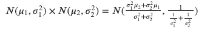
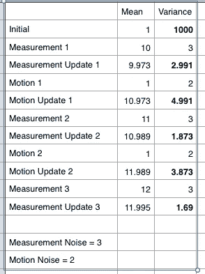

# 自动驾驶汽车如何避免碰撞

> 原文：<https://medium.com/geekculture/how-self-driving-cars-avoid-collisions-92bfdd1be40c?source=collection_archive---------21----------------------->

## 自动驾驶系列

## 使用卡尔曼滤波器跟踪其他车辆

Photo by [Ralfs Blumbergs](https://unsplash.com/@rblumbergs?utm_source=medium&utm_medium=referral) on [Unsplash](https://unsplash.com?utm_source=medium&utm_medium=referral)

自动驾驶汽车必须预测其他汽车的位置和速度，这样才能避免碰撞。他们使用称为雷达和激光的传感器来跟踪其他车辆。一种用于跟踪的技术叫做卡尔曼滤波器。

*卡尔曼滤波器表示高斯分布，并迭代两个主要周期(测量更新和运动更新)*

G 奥斯是位置空间上的连续函数，下面的面积总和为 1。它由两个参数表征，即高斯分布的均值和方差。

Gaussian Equation

> 卡尔曼滤波器必须保持μ和σ平方作为位置的最佳估计。

假设我们正在定位另一辆具有先验分布 P(x)的车辆。

让我们假设先验的均值(mean1)为 1。由于我们不确定位置，我们分配一个非常大的协方差(var1 = 1000)。

然后我们得到一个传感器测量值，它提供了车辆的位置。这种分布可以用另一个高斯 P(z|x)来表征。

测量后，假设平均值(mean2)为 10。尽管我们现在对位置更加确定，但考虑到传感器测量噪声，我们指定一个小协方差(var2 = 3)。

*现在我们有了度量，后验 P(x|z)的均值和协方差是什么？*

## 测量值更新

这两个高斯函数合在一起比单独的高斯函数具有更高的信息量。假设将两个高斯函数相乘作为贝叶斯规则，后验的新均值和协方差将如下。

Gaussian Multiplication

由于我们对测量值(mean2 = 10)比对先验值(mean1 = 1)更有把握，因此卡尔曼滤波器给予测量值比先验值更大的权重。

因此，新平均值= [ 1000*10+ 3*1 ]/[ 1000+3 ] = 9.973

新的方差与以前的均值无关。它只是使用了之前的两个方差。

新方差= 1/ ( [1/1000] + / [1/3]) = 2.991，比 1000 和 3 都要大。

因此，后验均值= 9.973，方差= 2.991

现在让我们假设汽车移动了一段距离。这一举动将如何影响我们对新地点的看法？

# 动作更新

由于汽车移动了一定距离(均值 3 = 1)，我们需要在原始均值(均值= 9.973)上添加运动。

然而，由于运动本身具有一些不确定性(var3 =2)，我们往往会丢失关于位置的信息。

因此，原始不确定性(var = 2.991)将不得不增加运动不确定性的量。

new_mean = 9.973 + 1 = 10.973

new_var = 2.991 + 2= 4.991

由于运动导致的信息损失增加了不确定性(4.991)

*那么卡尔曼滤波器如何降低这种不确定性呢？*

# 迭代次数

一系列的测量和运动被输入卡尔曼滤波器。

从上面的例子可以看出，在测量更新之后，不确定性降低(1000 到 2.991)，而在运动更新之后，不确定性增加(2.991 到 4.991)。

然而，通过测量和运动更新循环的迭代，卡尔曼滤波器能够减少总体不确定性并提供位置的最佳估计。

Kalman Filter estimates after a few cycles

*1-D 卡尔曼滤波器对于自动驾驶汽车是否足够？*

## 高维卡尔曼滤波器

K 阿尔曼滤波器几乎可以应用于物理系统中的任何跟踪问题。在定位的情况下，卡尔曼滤波器的变量反映了物理世界的状态，如其他汽车的位置和速度等

这些状态分为可观察变量(如位置)和隐藏变量(如速度)。由于这两者相互作用，对可观察变量的后续观察提供了关于隐藏变量的信息。因此，隐藏变量也可以估计。

为了模拟这种行为，我们需要一个使用多元高斯分布的高维卡尔曼滤波器。

此外，卡尔曼滤波器将不能处理不同的运动模型和多个测量源。

我们将在下一篇关于扩展卡尔曼滤波器的文章中讨论上述问题。

参考资料:
https:uda city . com
[https://ccrma . Stanford . edu/~ jos/sasp/Product _ Two _ Gaussian _ pdf . html](https://ccrma.stanford.edu/~jos/sasp/Product_Two_Gaussian_PDFs.html)
[https://math . stack exchange . com/questions/1112866/Product-of-Two-Gaussian-pdf-is-a-Gaussian-but-Product-of-Two-Gaussian-vari](https://math.stackexchange.com/questions/1112866/product-of-two-gaussian-pdfs-is-a-gaussian-pdf-but-product-of-two-gaussian-vari)