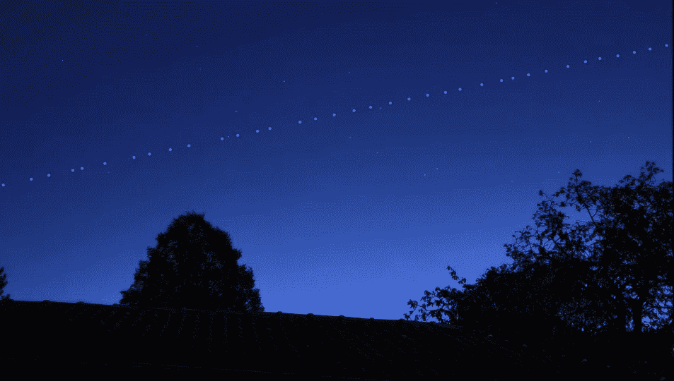

# SpaceX 如何平息天文学家的愤怒？

> 原文：<https://medium.com/geekculture/how-spacex-is-pacifying-astronomers-anger-78fc15320e36?source=collection_archive---------3----------------------->

## 宇航员对 SpaceX 非常愤怒，因为他们的 Starlink 卫星正在破坏夜空

Starlink satellites train as seen from the Earth ([Image source](https://youtu.be/nOaj9OQHMMM))

2021 年 3 月 4 日，星期四，SpaceX 猎鹰 9 号从肯尼迪航天中心发射升空，携带了另外 60 颗 Starlink 卫星。这次发射使整个星座的大小达到 1100 左右。