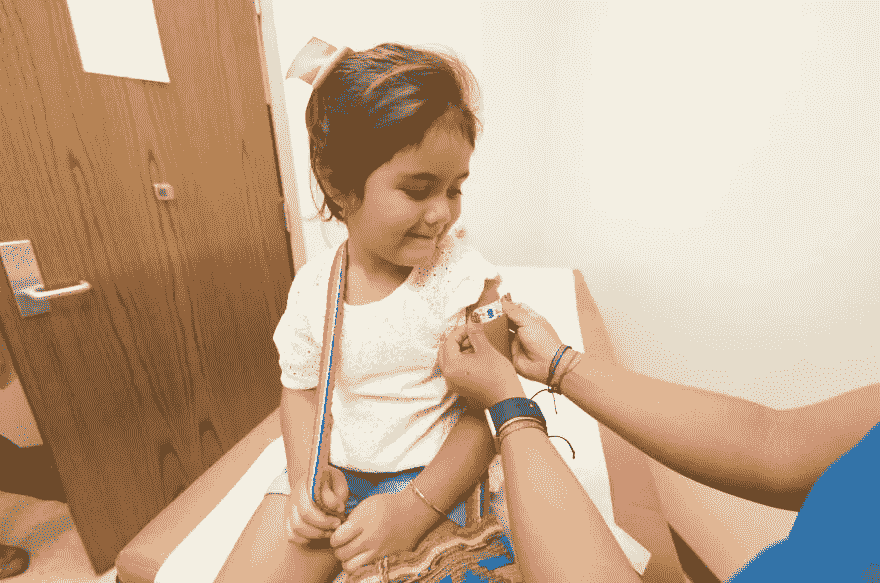

# 激励如何通过技术改善医疗保健

> 原文：<https://medium.com/geekculture/how-spurwing-improves-healthcare-through-technology-13969a45b7c9?source=collection_archive---------46----------------------->

## 虽然在过去几年中，技术已经改变了这个星球上的几乎每个行业，但这种改变在医疗保健领域没有那么明显、那么明显或那么有用。

如今的技术创新使得医疗专业人员和医疗机构更容易以一种在过去更具挑战性的方式为患者提供**最高质量的护理和服务**。

这些新的解决方案使得医疗保健**诊断更加准确**，治疗处方流程更加有效，后续程序也更加有效。与此同时，最大限度地利用这些技术进步的最大障碍是时间安排。

如果患者(和医疗专业人员)不能有效地安排他们的**医疗预约**——或这些预约的后续——世界上最伟大的医疗创新也不会有丝毫改变。

这就是鞭策发挥作用的地方。Spurwing 从一开始就被设计成一个高效、易用、可扩展的预约和 [**日程安排 API**](https://www.spurwing.io/) 用于医疗保健社区，它使医疗保健组织更容易安排和管理未来的预约。

但那只是冰山一角！以下是 Spurwing 利用其创新的新技术改善医疗保健社区的一些其他方式。

# 轻松在线咨询

**远程医疗和虚拟咨询**已经从现代医疗社区相对“边缘”的方面以超出任何人预期的速度成为主流。

部分原因是我们现代世界的现实(特别是 2020 年后全球社会面临的所有公共卫生问题)，但部分原因也与患者目前对技术的舒适程度有关。

Spurwing Scheduling API 使得在任何医疗实践中实现这种在线咨询变得很容易，即使在线咨询平台必须“从头开始”构建。

# 轻松预约

试图让病人和医疗服务提供者在日程安排上达成一致有时会感觉有点像在养猫。

不过，在 Spurwing Scheduling API 等工具的帮助下，约会设置和日程安排过程被大大简化了。

现在，不仅医疗保健专业人员将能够分享他们可以提供给他们的患者的所有可用时间和日期(同时仍然保护他们护理的单个患者的隐私)，而且患者自己也将能够根据他们的需要挑选合适的时间表和预约。

最棒的是，所有这些都可以在网上完成——甚至可以通过手机或平板电脑完成！这比过去有更多的自由和更多的可及性。

这种在线日程安排解决方案(通过 Spurwing API 成为可能)消除了占用关键员工时间的电话呼叫需求，消除了每次需要进行新预约时交叉参考的需求，并通过让患者自主选择最适合他们的时间和日期，显著降低了错过预约的可能性。

没有比这更好的了！

# 及时和自动提醒

**错过医疗预约**导致整个医疗保健行业数亿美元的损失，全面提高了医疗保健的价格，但也导致了调度的“僵局”问题，以克服这些错过的预约。

Spurwing 通过提供及时和**自动提醒**和后续消息的平台，帮助消除那些错过的约会(至少尽可能多)。

提醒可以被设置和安排成每周、每天、甚至在预定约会前一两个小时发送(以及这些不同时间表的任意组合)。

这有助于保证更高水平的预约跟进，使医疗机构更好地组织，同时也有助于专业人员提供更好的护理。

# 立即了解更多关于 Spurwing 的信息

归根结底，医疗保健提供者充分利用所有可用的技术来提供尽可能最好的护理是至关重要的。

刺激(至少在表面上)可能看起来不像是医疗保健领域的典型技术进步，至少在你看到**这个行业的预约、预约设置和日程安排方面真的有多重要**之前是如此。

有关 Spurwing 如何提供帮助的更多信息，以及如何在您的医疗保健机构中使用和部署我们的调度 API 的具体信息，请访问[我们的网站](https://www.spurwing.io/)或与我们的工程师安排演示电话。